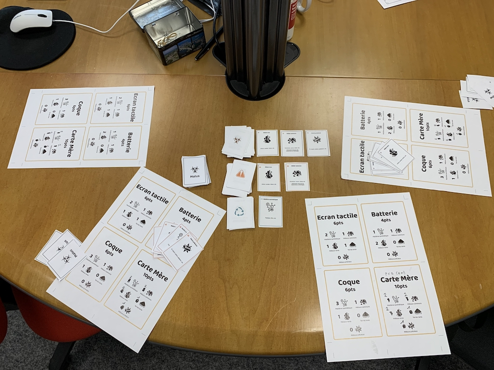

# Règle du jeu

## Introduction

Vous êtes des fabricants de smartphones vous allez devoir surpasser votre concurrence en construisant votre smartphone
tout en polluant le moins possible.

## But du jeu

Rassembler assez de ressources pour construire tous les composants de son smartphone.

## Composition du jeu

### Téléphone à construire (7 Wonders Architect)

4 composants : Coque, Carte Mère, Batterie, Ecran Tactile
Chaque composant est constitué de ressources :
- x Matières synthétiques
- y Métaux précieux (rares)
- z Autres métaux rares
- w Métaux mineurs
- v Terres rares

### 3 pioches de ressources/types de ressources:

Pour chaque pioche, de 1 à 3 cartes visibles et un tas de cartes non visibles

- Minage classique polluant non responsable
    - 3 cartes ressources visibles parmi tous les types
    - 2 malus carbone

- Minage moins polluant
    - 2 cartes ressources visibles parmi tous les types
    - 1 malus carbone

- Recyclage
    - 1 carte ressource visible parmi les métaux recyclables
    - Pas de malus
    - Ne contient pas de terres rares, ni de métaux rares

#### Cartes malus

- 64 cartes malus
- 1 carte "Attention, vous commencez à trop polluer" à placer en position (nombre de joueurs x 3)
- 1 carte "Alerte pollution, vos malus sont déduis de votre total de points" à placer en position (nombre de joueur x 5)

Exemple : à 5 joueurs la carte "attention" se place en 15e position de la pioche malus et la carte "alert" se place en 25e position de la pioche malus.

#### Cartes événements

15 cartes évenements dont l'ordre est défini par un numéro sur celle-ci. Ces cartes évenements déclencheront des actions particulières à chaque tour de jeu.

## Disposition

## Déroulement du jeu

La personne ayant l'indice de réparabilité le plus haut sur son smartphone:
[Indice de reparabilité](https://www.indicereparabilite.fr/)

Si égalité le plus anciens l'emporte.

### Déroulement d’un tour de jeu

A chaque tour de jeu (sauf au 1er tour) :  
- On tire une carte événement valable pour tous les joueurs
- Phase de négociation collective : échange de ressources et malus (ex: "je donne 1 ressource "Terre rare" avec 2 malus" ou "j'échange x ressources type1 contre Y ressources type2")
- Chaque joueur joue à son tour, en commençant par celui qui a été tiré au sort puis dans le sens des aiguilles d'une montre.

### Déroulement d’un tour d'un joueur

Une seule action possible parmi :  
- Pioche dans une seule des 3 pioches au choix parmi les cartes visibles ou non-visibles (les cartes visibles ne sont repositionnées qu'à la fin de la phase de pioche)
- Construction d’un composant ou du téléphone (Malus pollution ?)
- Dépoluer : on se débarasse de 2 cartes Malus

## Fin de partie
2 conditions de fin de partie possible :  
- un joueur a construit son smartphone (tous les composants)
- la carte évenement "Fin de partie" est tirée la partie s'arrête

On termine le tour quand une des 2 conditions précédentes est atteinte.

## Le gagnant
On compte ensuite les points en fonction :  
- des composants du téléphone construit. Chaque composant rapporte un certain nombre de points.
- si son smartphone est terminé --> 10 points
- éventuellement soustraire des points pour les malus si c'est spécifié durant la partie
