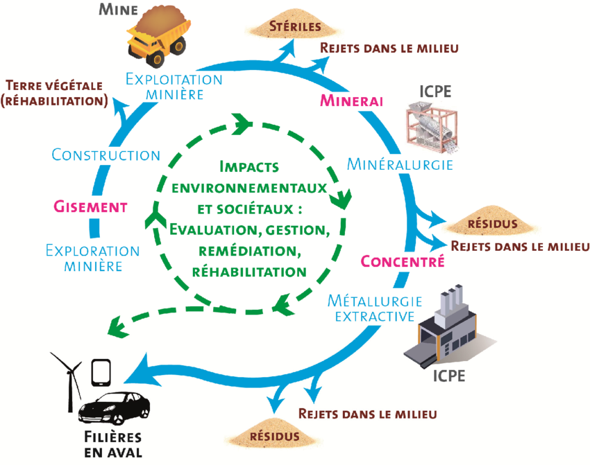

# Brief : introduire l’activité (≈ 20 minutes)

Le brief a pour objectif d'aligner les attentes des participants et de poser les bases du jeu. Il sert à présenter le contexte, les règles et les objectifs du jeu, ainsi qu’à détailler les métaux et ressources nécessaires à la fabrication d’un smartphone.

!!! exemple "Ceci est une proposition de brief !"
    Nous l'avons testé à de nombreuses reprises avec des lycéens (plusieurs tables de jeu de 3 à 5 joueurs), avec ou sans expert·e pour présenter les aspects théoriques.
    Sans expert·e, il est possible de s'appuyer sur des ressources pédagogiques mises à votre disposition.
    
     Libre à vous d'adapter le Brief en fonction de votre public.

## I - Activité de découverte : de quoi est constitué un smartphone ?
Objectif : sensibiliser les participants aux composants d’un smartphone et aux matériaux nécessaires pour sa fabrication.

Matériel recommandé : anciens smartphones démontables (si disponibles) ou les illustrations fournies.
<a href="./MaterielPedagogique/Illustrations/smartphone_demonte.png"> "</a>

### Déroulé de l'activité

 1. Observation ou manipulation d'un smartphone démonté

Si vous disposez de vieux smartphones, invitez les joueurs à les manipuler (un smartphone par table).
Sinon, utilisez les schémas imprimés ou projetés pour observer les composants.

 2. Questions-réponses

*Quels sont les composants principaux d'un smartphone ?*
!!! note "Réponse"
    Coque (boîtier), Carte Mère, Batterie, Écran tactile (dalle tactile+vitre)

*Où est la batterie ? La carte mère ? La caméra ? ...*

*Quelles sont les matières premières qui constituent un smartphone ?*
!!! note "Réponse"
    Céramique, plastique, verre, métaux...

*À votre avis, combien de métaux y a-t-il dans un smartphone ?*
!!! note "Réponse"
    En 1950, on dénombrait une douzaine de métaux dans nos bons vieux téléphones fixes. Le smartphone d'aujourd'hui, beaucoup plus petit et fin, contient plus de 50 métaux : une condition pour avoir toutes les fonctionnalités de nos équipements !

*Lesquels ?*
!!! note "Réponse"
    Vous trouverez pleins d'exemples dans le matériel fourni.

!!! abstract "Ressources utiles pour vous former"
    - [Fiche de description des métaux utilisés dans un smartphone](../Ressources/Fiche_metaux.md)
    - [Fiche concept "Quels métaux dans les smartphones ?" du Mooc ImpactNum](https://learninglab.gitlabpages.inria.fr/mooc-impacts-num/mooc-impacts-num-ressources/Partie2/FichesConcept/FC2.3.1-QuelsMinerauxPourUnSmartphone-MoocImpactNum.html)
    - [Activité pédagogique "Autopsie d'un smartphone" du Mooc ImpactNum](https://learninglab.gitlabpages.inria.fr/mooc-impacts-num/mooc-impacts-num-ressources/Partie2/Activites/Capsule_Partie2_3_Mesurer2/story.html)

## II - Les différents types de ressources pour fabriquer un smartphone

Un smartphone est composé de plus de 50 métaux ainsi que d'autres matières comme le plastique ou le verre.

Pour les besoins du jeu, les métaux ont été classés selon 4 catégories :  

- Des **métaux communs** : aussi appelés "métaux de base", ils sont utilisés communément dans l'industrie. Les métaux communs représentent la majeure partie des métaux d'un smartphone (ex. aluminium, cuivre, fer).
- Des **métaux précieux** : rares (très peu abondants dans la croûte terrestre) mais surtout de grande valeur économique, ils sont utilisés majoritairement dans les circuits imprimés (ex. argent, or, palladium, platine).
- Des **terres rares** : malgré leur nom, les terres rares sont assez abondantes dans la croûte terrestre mais difficiles à extraire (ex. néodyme, yttrium).
- D'**autres métaux**: un smartphone contient également de nombreux autres métaux qui ne sont ni communs, ni précieux ni des terres rares. Leurs propriétés physico-chimiques permettent l'implémentation de fonctionnalités spécifiques (ex. cobalt, lithium, tantale).

Il y aussi en plus de ces métaux les **autres matières** qui représentent de 40 à 70% du poids du smartphone (ex. céramique, plastique, matières synthétiques, verre).

!!! warning "Précision importante"
    Dans le jeu PhoneImpact, le pourcentage de cartes nécessaires pour les composants n'est pas représentatif du poids réel des ressources d'un smartphone ni de la quantité de matière mais permet de symboliser la variété des ressources nécessaires.

!!! abstract "Ressources utiles pour vous former"
    [Fiche de description des métaux utilisés dans un smartphone](../Ressources/Fiche_metaux.md).

## III - Exposé : les différentes étapes de l'extraction minière

Projeter la vidéo sur l’exploitation minière à ciel ouvert produit au Québec accessible sur YouTube ([lien vers la vidéo](https://www.youtube.com/watch?v=GxLTtltXWtA), vous pouvez couper à 3'30''), qui est très éclairante.
Alternative : Montrer et commenter le schéma des étapes de l’extraction minière et du recyclage.

<a href="./MaterielPedagogique/Illustrations/etapes_extraction_mine.png"> "</a>

*Source : Galin, Rémi & URIEN, Pol & CHARLES, Nicolas & Bailly, Laurent. (2017). Tome 3 - Projet minier et parties-prenantes.*

Les méthodes d'extraction et de séparation des métaux en général font appel à des procédés complexes, énergivores et très polluants : rejets d'acides, de bases, de solvants, de métaux lourds ou de déchets radioactifs. En plus, ces processus requièrent de grandes quantités d'eau. C'est ce que nous verrons dans la phase de jeu.

### Montrer un exemple de mine à ciel ouvert

Vous pouvez montrer la photo de la **mine de cuivre de Palabora en Afrique du Sud** : la plus grande mine à ciel ouvert et le plus grand trou artificiel au monde avec 2 000 mètres de diamètre et 762 mètres de profondeur. On devine des installations industrielles à gauche et à l'arrière de l'entonnoir. On devine aussi un éboulement sur la gauche de la cavité.

<a href="./MaterielPedagogique/Illustrations/MineCuivrePalabora.jpg"> "</a>

*Mine de cuivre de Palabora, Afrique du Sud ; à gauche : représentation imagée de la quantité de cuivre métal produite par la mine jusqu’à environ 2007 (© Dillon Marsh · Mise à disposition par le photographe · dillonmarsh.com) : à droite : Vue satellitaire de la mine et mise en évidence de l’emprise en surface des déchets miniers (© Google 2021) | Création : SystExt · Septembre 2021*

!!! abstract "Ressources utiles pour vous former"
    - biblio, ressources

## IV - Mise en place du jeu

Objectif : Immerger les joueur·euses dans le scénario et expliquer les règles du jeu PhoneImpact.

### Mise en contexte 

Histoire "[Dans la ville de TechCity...](../Jeu/Histoire.md)"

### Expliquer les règles du jeu

!!! exemple "Ceci est une proposition de pitch !"
    Dans cette partie, nous vous proposons un texte pour **expliquer simplement les règles du jeu aux joueur·euses**. Nous l'avons testé sur différents publics.

     Libre à vous de l'adapter en fonction de votre public. Par exemple, il faudra peut-être décrire différemment les règles avec des personnes qui n'ont pas l'habitude de jouer à des jeux de société.

Dans ce jeu, vous habitez la ville TechCity et vous incarnez un·e fabricant·e de smartphones et votre objectif est de fabriquer un smartphone tout en minimisant votre impact environnemental. Vous aurez des choix à faire tout au long du jeu mais attention, ces choix auront des conséquences.

Vous avez chacun un plateau smartphone devant vous composé de : l’écran tactile (dalle et vitre), la batterie, la coque, la carte mère.

Chaque composant est constitué de ressources, elles-mêmes désignées par des types de ressources qui sont les suivants dans le jeu :

- **Métaux communs** : beaucoup utilisés dans l'industrie, ils représentent la majeure partie des métaux d'un smartphone -> représenté par un métal gris
- **Métaux précieux** : rares mais surtout de grande valeur économique -> représenté par un lingot d’Or
- **Terres rares** : pas si rare mais difficile à extraire -> représenté par un tas de terre marron
- **Autres métaux** : un smartphone contient également de nombreux autres métaux qui ne sont ni communs, ni précieux ni des terres rares -> représenté par un minerai bleu
- **Autres matières** : 40 à 70% du poids du smartphone comme le plastique -> représenté par une fibre violette

Le but du jeu est de rassembler assez de ressources pour fabriquer le plus de composants de votre smartphone.
Cependant, l’acquisition des ressources peut s’accompagner de malus qui auront des conséquences dans la suite du jeu. Les textes des cartes malus sont lues à voix haute (titre puis texte) quand elles sont tirées.

### Déroulement du jeu
Le jeu se déroule en plusieurs étapes, vous jouez à tour de rôle dans le sens des aiguilles d’une montre.

À chaque **tour de jeu**, vous pouvez faire une seule de ces 3 actions suivantes :

- Vous approvisionner : choisir un fournisseur et prendre le nombre de cartes ressources (visibles ou en haut du tas) et malus correspondant :
    - **PolluPlus** qui fait du minage classique polluant non responsable > ce qui vous permet d’obtenir 3 cartes ressources. > mais par contre 2 cartes malus.
    - **PolluMoins** qui fait du minage avec des efforts > ce qui vous permet d’obtenir 2 cartes ressources. > mais par contre 1 carte malus.
    - **Recycl'** spécialisé dans le recyclage (comme son nom l’indique), > ce qui vous permet d’obtenir 1 carte ressource. > Pas de malus mais à savoir que dans cette pioche il n’y a ni terres rares, ni métaux rares. > vous ne pourrez pas perdre cette carte durant la partie.

         Une fois que vous avez choisi votre fournisseur, vous pouvez prendre n’importe quelle carte visible parmi celles posées sur la table ou tirer une carte dans la pioche, de ce même fournisseur.

         Les cartes ressources sont à garder en main et à cacher des autres joueur·euses. Si le ou la joueur·euse, a pris des cartes visibles, elles seront remplacées à la fin de son tour. 

- **Fabriquer un composant** : poser toutes les cartes ressources nécessaires et construire un seul des composants du smartphone. Les cartes ressources sont posées sur le composant fabriqué. Le nombre de ressources nécessaires est indiqué sur le plateau pour chaque composant.
- **Dépolluer** : se défausser de 1 à 2 cartes malus -> ces cartes défaussées ne sont pas remises dans la pioche, elles sont mises de côté.

En cas d’oubli, vous pouvez vous référer à l’aide de jeu :

### Qui commence ?
Pour déterminer qui commence :

1. Si une personne **n'a pas de smartphone**, c'est elle qui commence
2. Sinon, c'est la personne avec **le smartphone le plus vieux** qui commence
3. Si vous ne connaissez pas l'âge de vos smartphones, favorisez la personne qui a **un smartphone reconditionné**, ou qui a **récupéré un vieux smartphone**.
4. Si aucun de ces critères ne vous a permis de vous départager, c'est la personne la **plus jeune** qui commence.

### Après chaque tour de table, on tire une carte événement

- Elle est valable pour tous les joueur·euses.
- On lit le contenu de la carte et on effectue l’action qui est décrite, en commençant par
  la personne ayant le titre Joueur·euse 1 puis dans le sens horaire, sauf contre-indication.
- Si des cartes ressources visibles sont piochées, elles sont remplacées à la fin de
  l’événement, une fois que tous les joueur·euses ont effectué leur action.
- Les cartes ressources ou malus défaussées sont placées dans un tas à part et non remis
  dans les pioches.

### Conditions de fin de partie
La partie s’arrête quand :

- Un·e des joueur·euses a construit son smartphone en entier. On termine le tour de table.
- La carte événement “Fin de partie” est tirée. La partie s'arrête.
- Il n’y a plus de cartes Malus. On termine le tour de table. Si les joueur·ses choisissent l’action S’approvisionner, il est possible de le faire seulement chez Recycl’ (la pioche Malus étant vide).

### Décompte des points
La personne ayant le plus de points remporte la partie. On compte les points en :

- additionnant les points des composants construits de son téléphone. Chaque composant rapporte un certain nombre de points, inscrit sur le plateau de jeu.
- bonus de 2 points pour celui ou celle qui a construit le smartphone le plus vertueux (le plus de cartes recyclées parmi les cartes posées). En cas d'égalité, +2 points pour les personnes concernées.

## V - Annoncer le debrief
Pour qu'ils soient plus attentifs lors de la lecture des malus, proposez aux joueurs :  

- Expliquez qu’à la fin de la partie, les malus seront débriefés et/ou on leur posera des questions sur les textes lus à haute voix.
- De noter les numéros des malus les plus marquants (surprise, choc, question).
- De mettre de côté les cartes qu’ils souhaitent discuter lors du débrief.