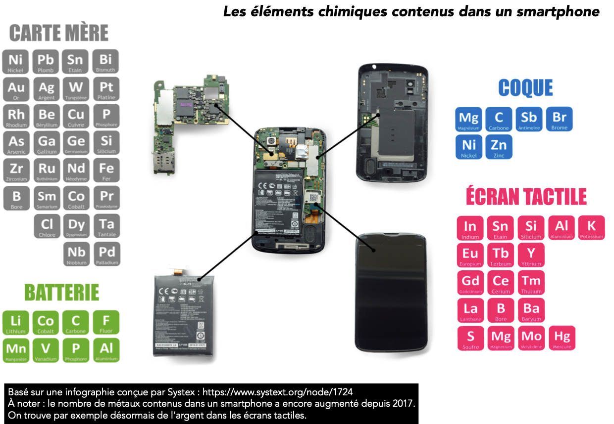
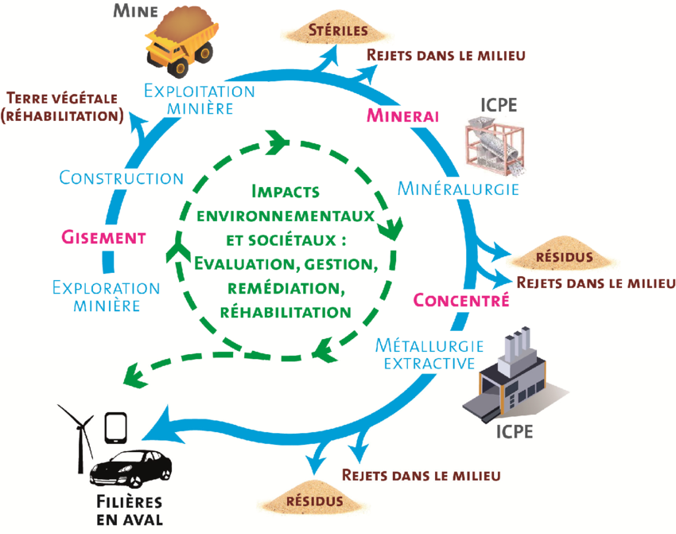
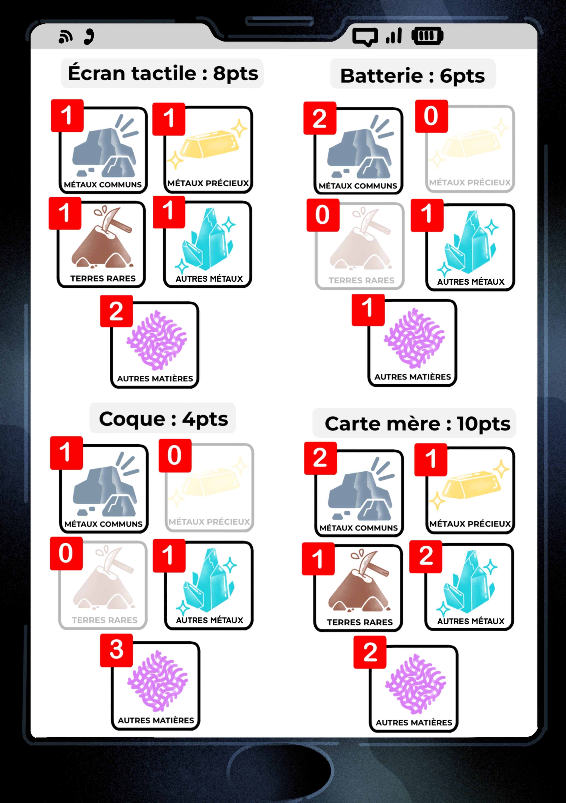
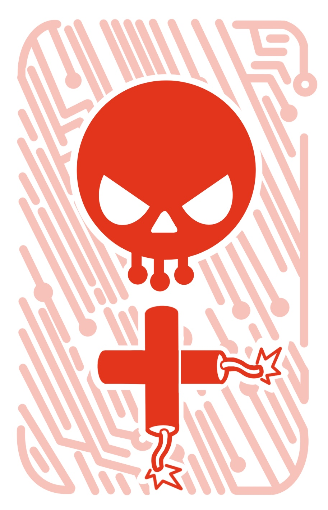
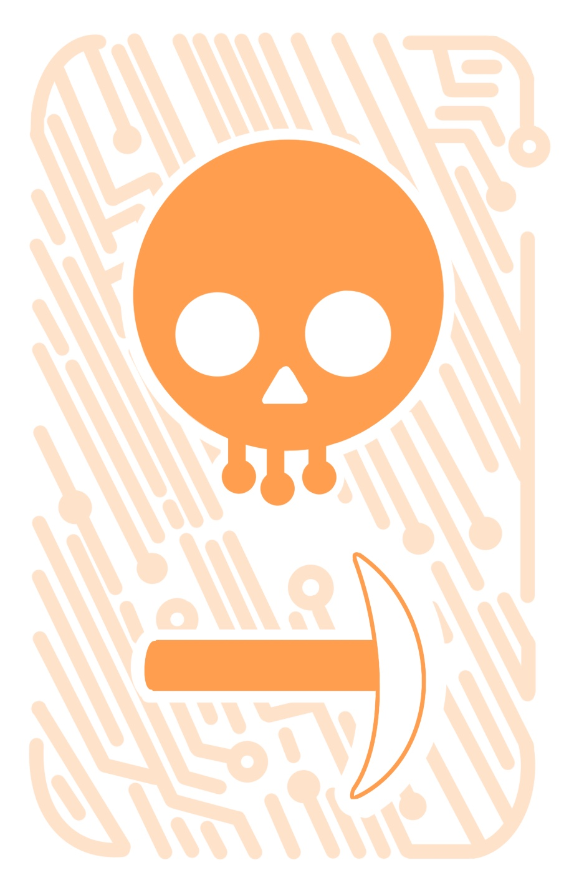
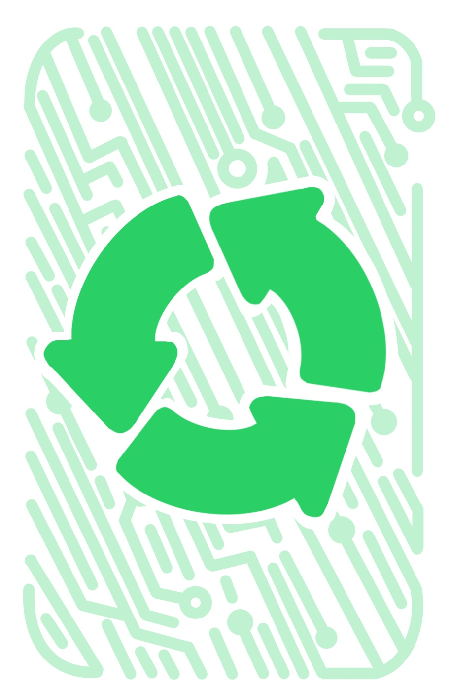
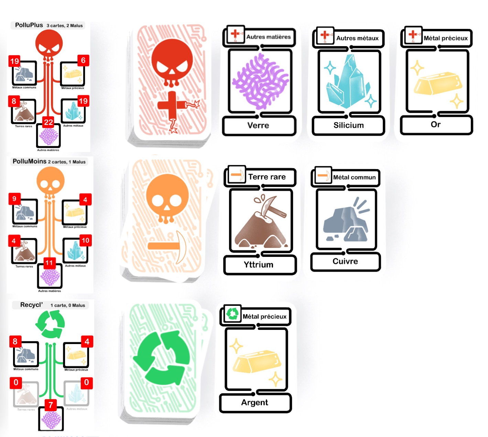
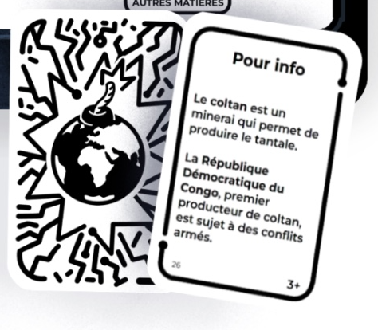
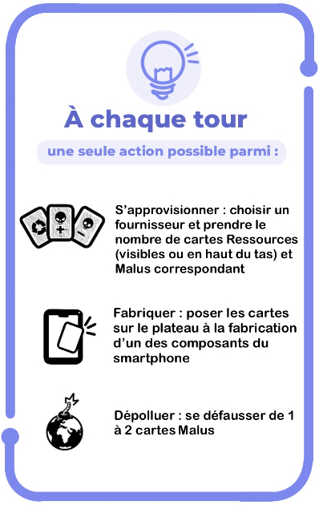
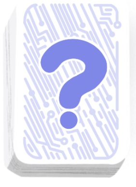

# Brief 20' : introduire l’activité

Le brief a pour objectif d'aligner les attentes des participants et de poser les bases du jeu. Il sert à présenter le contexte, les règles et les objectifs du jeu.

!!! tip "Ceci est une proposition de brief !"
    Nous l'avons testé à de nombreuses reprises avec des lycéens (plusieurs tables de jeu de 3 à 5 joueur·euses), avec ou sans expert·e pour présenter les aspects théoriques.
    Sans expert·e, il est possible de s'appuyer sur des ressources pédagogiques mises à votre disposition.
    
     Libre à vous d'adapter le Brief en fonction de votre public.

!!! info "Matériel utile pour le brief"
    Tout d'abord, il existe un kakemono de brief sur lequel vous pourrez vous appuyer pendant cette phase. Si vous n'avez pas pu imprimer le kakemono, vous pouvez imprimer les illustrations séparément.

    - les kakemonos sont disponibles sur la page [🧑‍🏫 Animer / Matériel pédagogique / Kakemonos](./MaterielPedagogique/Kakemonos.md)
    - les illustrations sont disponibles sur la page [🧑‍🏫 Animer / Matériel pédagogique / Illustrations pour l'animation du jeu](./MaterielPedagogique/Illustrations.md)

## I - Questions de partage de connaissances
Le kakemono de brief est caché dans un premier temps.

Pour commencer l'atelier, vous pouvez poser quelques questions qui permettent d'introduire les métaux et ressources nécessaires à la fabrication d’un smartphone.

*De quoi est constitué un smartphone ?*
!!! note "Réponse"
    Un smartphone est principalement constitué de métaux (45%), de verre (32%) et de matières plastiques (17%).

*Savez-vous combien de métaux il y a dans un smartphone ?*
!!! note "Réponse"
    Plus de 50 métaux (contre une dizaine dans les téléphones fixes des années 1950).
    
    Une condition pour avoir toutes les fonctionnalités (camera, vibreur, téléphone, applications, GPS...) et tout ça miniaturisé.

*A votre avis, quels sont les métaux présents dans le smartphone ?*
!!! note "Réponse"
    Vous pouvez maintenant retourner le kakemono ou montrer les illustrations (format papier ou projetée)  

    - Montrer l'illustration "[les éléments chimiques contenus dans un smartphone](./MaterielPedagogique/Illustrations/smartphone_demonte.png)" : « *Voici un schéma avec pour chaque composant du smartphone les éléments chimiques qu’on y trouve.* ».
    - Lister et montrer les 4 composants du smartphone : l'écran=vitre et dalle, la batterie, la carte mère, la coque.
    

## II - Activité de découverte : de quoi est constitué un smartphone ?

Objectif : sensibiliser les participants aux composants d’un smartphone et aux matériaux nécessaires pour sa fabrication.

Si vous disposez de vieux smartphones, invitez les joueur·euses à les manipuler (un smartphone par table).
Sinon, utilisez les schémas imprimés ou projetés pour observer les composants "[les éléments chimiques contenus dans un smartphone](./MaterielPedagogique/Illustrations/smartphone_demonte.png)".

<a href="./MaterielPedagogique/Illustrations/smartphone_demonte.png"> "</a>

Après une phase d'observation ou manipulation d'un smartphone démonté, vous pouvez poser quesques questions.

*Où se trouve la batterie ? La caméra ? La carte mère ? ...*
!!! note "Réponse"
    Montrer où sont situés ces éléments

*Où sont les métaux?*
!!! note "Réponse"
    - Montrer où sont les métaux
    - En gros, ce qui est doré ou argenté

!!! note "Quelques explications"
    Voilà à quoi ressemble l'intérieur d'un smartphone.  
    Vous voyez apparaître la batterie, et de nombreux composants électroniques qui sont rassemblés sur ce qu'on appelle la carte mère.  
    Si on enlève la carte mère et la batterie, on voit qu'il reste encore quelques éléments attachés à l'écran tactile, le haut-parleur etc.  
    Pour simplifier, on a quatre composants : la coque, la batterie, la carte mère et l'écran tactile. Dans le jeu PhoneImpact, on a regroupé les composants à peu près de cette manière.

    En ce qui concerne les matériaux qui constituent le smartphone, on voit : du verre pour l'écran, du plastique pour la coque, un certain nombre d'autres matières synthétiques, et puis des métaux, qu'on voit en particulier au niveau des composants électroniques.   
    Ce qu'on ne voit pas à l'oeil nu, c'est qu'il y a une très grande diversité de métaux dans un smartphone.

    Vous reconnaissez peut-être ici le tableau périodique des éléments. Cette illustration montre la présence d'un grand nombre d'éléments chimiques dans les smartphones, et en particulier de métaux : fer, cuivre, cobalt, etc.

    On a du mal à connaître la composition précise des smartphones, et  il y a des variations en fonction des modèles, mais ce qu'on peut retenir c'est qu'il y en a plus d'une cinquantaine, et souvent en très petite quantité à part pour les métaux communs comme le fer ou l'aluminium.  
    La raison de cette diversité est que les métaux ont de nombreux usages très spécifiques, par exemple en lien avec des propriétés de conductivité électrique, de résistance à la corrosion etc.

!!! abstract "Ressources utiles pour vous former"
    - [Fiche concept "Quels métaux dans les smartphones ?" du Mooc ImpactNum](https://learninglab.gitlabpages.inria.fr/mooc-impacts-num/mooc-impacts-num-ressources/Partie2/FichesConcept/FC2.3.1-QuelsMinerauxPourUnSmartphone-MoocImpactNum.html)
    - [Activité pédagogique "Autopsie d'un smartphone" du Mooc ImpactNum](https://learninglab.gitlabpages.inria.fr/mooc-impacts-num/mooc-impacts-num-ressources/Partie2/Activites/Capsule_Partie2_3_Mesurer2/story.html)

## III - Classement des métaux en 4 catégories
Montrer les catégories sur le kakemono de brief. Sinon, vous pouvez montrer les logos des matières avec les cartes Ressources du jeu.

Pour les besoins du jeu, les métaux ont été classés selon 4 catégories :  

-	{ width="50" } Les **Métaux communs** (fer, nickel, aluminium,...) qui sont aussi appelés métaux de base dans l'industrie et qui sont les plus fréquemment utilisés.
-	{ width="50" } Les **Métaux précieux** (or, argent, platine,...) : ce sont des métaux qui sont rares, c'est à dire très peu abondants dans la croûte terrestre, mais surtout de grande valeur économique. Ils sont utilisés pour leur conductivité et leur résistance à la corrosion.
-	{ width="50" } Les **Terres rares** (neodyme, yttrium,...) qui ne sont pas rares mais difficiles à extraire car présentes en très faible quantité. Elles sont utilisées pour fabriquer les aimants dans les vibreurs et colorer les LED des écrans.
-	{ width="50" } les **Autres métaux** (cobalt, lithium, tantale) : qui sont
très nombreux et sont utilisés pour des usages très diversifiés.

{ width="50" } Il y aussi en plus de ces métaux les **Autres matières** qui représentent de 40 à 70% du poids du smartphone (ex. céramique, plastique, matières synthétiques, verre).

!!! warning "Précision importante"
    Dans le jeu PhoneImpact, le pourcentage de cartes nécessaires pour les composants n'est pas représentatif du poids réel des ressources d'un smartphone ni de la quantité de matière mais permet de symboliser la variété des ressources nécessaires.

!!! abstract "Ressources utiles pour vous former"
    [Définition simplifiée des catégories de métaux](./MaterielPedagogique/Definition_simple_categories_metaux.md).

## IV - Un exemple de mine à ciel ouvert

Vous pouvez montrer la photo de la **[mine de cuivre de Palabora en Afrique du Sud](./MaterielPedagogique/Illustrations/MineCuivrePalabora.jpg)** : la plus grande mine à ciel ouvert et le plus grand trou artificiel au monde avec 2 000 mètres de diamètre et 762 mètres de profondeur. 

<a href="./MaterielPedagogique/Illustrations/MineCuivrePalabora.jpg"> "</a>

La partie gauche montre un montage photo qui visualise la quantité de métal produite au final avec le minerai extrait de la mine.  On devine des installations industrielles à gauche et à l'arrière de l'entonnoir. On peut voir également un éboulement sur la gauche de la cavité.

Sur la partie droite, on voit une photo aérienne de la même mine, qui permet de se rendre compte de la surface au sol qu'elle occupe, qui pose aussi parfois des problèmes.

## V - Exposé : les différentes étapes de l'extraction minière

Si vous avez le temps et du matériel, vous pouvez projeter la vidéo sur l’exploitation minière à ciel ouvert produit au Québec accessible sur YouTube ([lien vers la vidéo](https://www.youtube.com/watch?v=GxLTtltXWtA), vous pouvez couper à 3'30''), qui est très éclairante.

Montrer et commenter le [schéma des étapes de l’extraction minière et du recyclage](./MaterielPedagogique/Illustrations/etapes_extraction_mine.png).

<a href="./MaterielPedagogique/Illustrations/etapes_extraction_mine.png"> "</a>

*Source : Galin, Rémi & URIEN, Pol & CHARLES, Nicolas & Bailly, Laurent. (2017). Tome 3 - Projet minier et parties-prenantes.*

Les méthodes d'extraction et de séparation des métaux en général font appel à des procédés complexes, énergivores et très polluants : rejets d'acides, de bases, de solvants, de métaux lourds ou de déchets radioactifs. En plus, ces processus requièrent de grandes quantités d'eau. C'est ce que nous verrons dans la phase de jeu.

Montrer et commenter le schéma des étapes de l’extraction minière et du recyclage 

- Les grandes étapes : mines (à ciel ouvert ou souterraines) > extraction > prétraitement > affinage > résidus et métaux
- Recyclage dans le schéma
- Ces étapes nécessitent beaucoup d'eau et d'énergie.

!!! abstract "Ressources utiles pour vous former"
    Vous trouverez des ressources et des bibliographies pour vous former dans la Partie ["Ressources"](./docs/Ressources/Introduction.md).

## VI - Expliquer les règles du jeu

!!! exemple "Ceci est une proposition de pitch !"
    Dans cette partie, nous vous proposons un texte pour **expliquer simplement les règles du jeu aux joueur·euses**. Nous l'avons testé sur différents publics. Nous supposons que vous avez le jeu devant vous et que vous montrez les éléments de jeu au fur et à mesure.

     Libre à vous de l'adapter en fonction de votre public. Par exemple, il faudra peut-être décrire différemment les règles avec des personnes qui n'ont pas l'habitude de jouer à des jeux de société.

### Introduction du jeu

Dans ce jeu, vous habitez la ville TechCity et vous incarnez un·e fabricant·e de smartphones et votre objectif est de fabriquer un smartphone tout en minimisant votre impact environnemental. Tout au long de la partie, vous devrez faire des choix stratégiques, mais attention car ces choix auront des conséquences.

Vous avez chacun un plateau smartphone devant vous composé de : l’écran tactile (dalle et vitre), la batterie, la coque, la carte mère.

Chaque composant est fabriqué à partir de **ressources** qui correspondent à différents **types de ressources** (Métaux communs, Métaux précieux, Terres rares, Autres métaux et Autres matières). Les chiffres dans les cadres rouges indiquent combien de ressources sont nécessaires pour fabriquer chaque composant.

!!! example "Par exemple"
    Pour fabriquer le composant « Carte mère », il faut 2 Métaux communs, 1 Métal précieux, 1 Terre rare, 2 Autres métaux, et 2 autres matières.

Le but du jeu est de gagner le maximum de points en fabriquant les composants de votre smartphone. 

A savoir que chaque composant rapporte un certain nombre de points, indiqué sur le plateau à côté du nom.

!!! example "Par exemple"
    La carte mère rapporte 10 points.

### Les 3 fournisseurs
Pour  fabriquer vos composants, il vous faudra acquérir des ressources. Pour cela, vous aurez le choix entre trois fournisseurs :

  

- PolluPlus en rouge qui fait du minage polluant non responsable,
- PolluMoins en orange qui fait du minage avec quelques efforts pour moins polluer,
- Recycl' en vert spécialisé dans le recyclage

A noter que chez le fournisseur Recycl’, vous ne trouverez ni terres rares, ni Autres métaux, qui sont peu ou pas recyclés.

Les conséquences environnementales associées à la production de ressources varient en fonction des fournisseurs. Vos choix d’approvisionnement auront donc des répercussions directes sur votre impact environnemental.

### Déroulement du jeu
Le jeu se déroule en plusieurs étapes, vous jouez à tour de rôle dans le sens des aiguilles d’une montre.

À chaque **tour de jeu**, vous pouvez faire une seule de ces 3 actions suivantes : 

- **Vous approvisionner** : pour cela, vous devez d’abord choisir un fournisseur parmi PolluPlus, Pollumoins ou Recycl’. Le nombre de ressources que vous pouvez acquérir dépend du fournisseur choisi :  
    - Si vous choisissez **PolluPlus**, vous pouvez prendre au total 3 cartes visibles ou dans la pioche. Par exemple 2 cartes visibles et 1 dans la pioche. Une fois que vous avez pris vos cartes, vous remplacez les emplacements vides par de nouvelles cartes.
    - Si vous choisissez **PolluMoins**, c’est le même principe, mais vous ne prenez que 2 cartes au total. 
    - Si vous choisissez **Recycl'**, vous ne prenez qu’une seule carte, visible ou dans la pioche. 

Les cartes Ressources sont secrètes donc vous devez les garder en main.

Selon le fournisseur choisi, vous piocherez également des cartes Malus que vous lirez à haute voix. Ces cartes représentent les conséquences environnementales de vos décisions.

Vous piocherez 2 Malus pour PolluPlus, 1 Malus pour PolluMoins et aucun Malus pour Recycl'.

- **Fabriquer un composant** : poser toutes les cartes ressources nécessaires et construire un seul des composants du smartphone. Les cartes ressources sont posées sur le composant fabriqué. Le nombre de ressources nécessaires est indiqué sur le plateau pour chaque composant.  
La fabrication de ce composant rapporte des points, indiqués sur le plateau à côté de son nom.
- **Dépolluer** : se défausser de 1 à 2 cartes malus -> ces cartes défaussées ne sont pas remises dans la pioche, elles sont mises de côté.

En cas d’oubli, vous pouvez vous référer à l’aide de jeu :

**Après chaque tour de table, on tire une carte événement**

- Elle est valable pour tous les joueur·euses.
- On lit le contenu de la carte et on effectue l’action qui est décrite, en commençant par
  la personne ayant le titre Joueur·euse 1 puis dans le sens horaire, sauf contre-indication.
- Si des cartes ressources visibles sont piochées, elles sont remplacées à la fin de
  l’événement, une fois que tous les joueur·euses ont effectué leur action.
- Les cartes ressources ou malus défaussées sont placées dans un tas à part et non remis
  dans les pioches.

### Conditions de fin de partie
La partie s’arrête quand :

- Un·e des joueur·euses a construit son smartphone en entier. On termine le tour de table.
- La carte Événement “Fin de partie” est tirée. La partie s'arrête.
- Il n’y a plus de cartes Malus. On termine le tour de table. Si les joueur·euses choisissent l’action S’approvisionner, il est possible de le faire seulement chez Recycl’ (la pioche Malus étant vide).

### Décompte des points
La personne ayant le plus de points remporte la partie. On compte les points en additionnant les points des composants (inscrits sur le plateau de jeu) construits de son smartphone.

### Qui commence ?
Pour déterminer qui commence :

1. Si une personne **n'a pas de smartphone**, c'est elle qui commence
2. Sinon, c'est la personne avec **le smartphone le plus vieux** qui commence
3. Si vous ne connaissez pas l'âge de vos smartphones, favorisez la personne qui a **un smartphone reconditionné**, ou qui a **récupéré un vieux smartphone**.
4. Si aucun de ces critères ne vous a permis de vous départager, c'est la personne la **plus jeune** qui commence.

## VII - Annoncer le debrief
Pour qu'ils soient plus attentifs lors de la lecture des carte Malus, vous pouvez proposer aux joueur·euses :  

- de noter le numéro des cartes Malus qu'ils n'ont pas compris ou pour lesquels ils ont des questions,
- d'écouter les cartes Malus lus à haute voix car à la fin de la partie, les contenus seront débriefés,
- de noter les numéros des cartes Malus les plus marquants (surprise, choc, question),
- ...