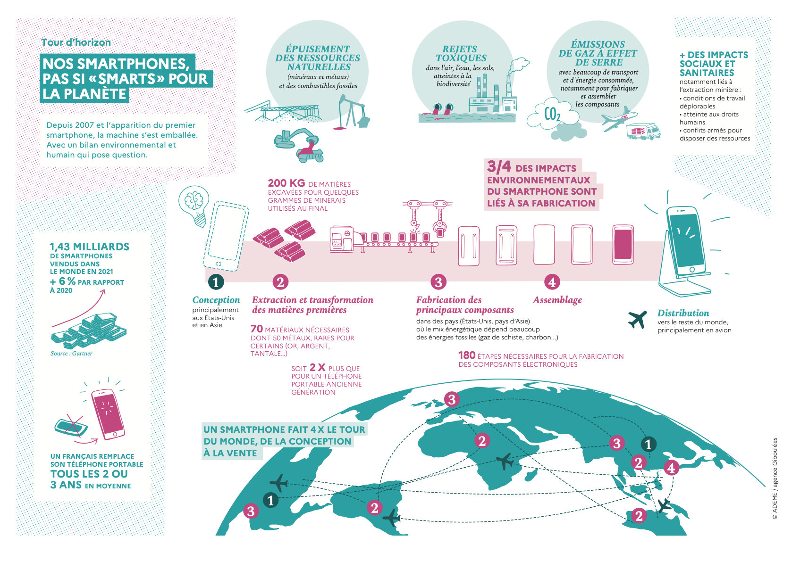

# Débrief : terminer l'activité
Une fois la phase de jeu terminée, il est essentiel de mener un débriefing pour recueillir les ressentis, les enseignements, et permettre une remise en perspective des informations abordées pendant la session. Ce temps d'échange est un moment clé pour ancrer les apprentissages, favoriser la discussion et répondre aux questions des participants.

!!! Warning
    Attention, cette fiche est en cours de rédaction

!!! exemple "Ceci est une proposition de debrief !"
      Dans cette partie, nous vous proposons un déroulé pour **terminer l'activité** avec le jeu PhoneImpact.
      Nous l'avons testé à de nombreuses reprises avec des lycéens (plusieurs tables de jeu de 3 à 5 joueurs), avec ou sans expert pour présenter les aspects théoriques. Sans expert, il est possible de s'appuyer sur des ressources pédagogiques mises à votre disposition.

     Libre à vous d'adapter le derief en fonction de votre public.
## Objectifs du débrief :
- Recueillir les émotions et ressentis des joueurs.
- Identifier les enseignements tirés du jeu.
- Approfondir certaines notions abordées pendant la partie.
- Remettre en perspective les enjeux environnementaux et sociaux liés au numérique.
- Encourager la réflexion et ouvrir sur des actions concrètes.

## Matériel pédagogique

Des ressources sont disponibles pour accompagner la phase de débrief :

- Un [kakemono](MaterielPedagogique/Kakemonos/kakemonoDebrief_PhoneImpact.pdf)
- Des illustrations et documents à imprimer avant la session ou à montrer sur écran si vous disposez d'un projecteur :  
    - Carte du monde des métaux et des impacts environnementaux
    - Remise en perspective sur l'industrie minière
    - Zoom sur la France
    - Quelques chiffres

## 1. Recueil des émotions
Commencez le débrief par un temps de parole libre pour permettre aux joueurs d'exprimer leurs ressentis à chaud. Posez des questions ouvertes pour stimuler la réflexion et recueillir leurs émotions :
- Qu’avez-vous ressenti pendant la partie ?
- Quelle stratégie avez-vous adoptée : pollueur ou écolo ? Pourquoi ?
- Avez-vous changé de stratégie en cours de jeu ? Si oui, à quel moment et pour quelle raison ?

!!! exemple "Ceci est une proposition de debrief !"
    Astuce : Utilisez un tableau ou des post-its pour noter les réactions et remarques marquantes des participants. Cela facilite le lien avec les phases suivantes du débrief.

## 2. Phase des enseignements
### Ce qu'ils ont retenus
Orientez les discussions vers les informations clés retenues pendant le jeu :

- Quelles sont les informations qui vous ont marqué ? Pourquoi ?
- Avez-vous des questions sur des textes lus dans les cartes Malus ou Événement ?
- Avez-vous été surpris par certains textes des cartes Malus ou Événements ? Lesquels ?
- Qu’avez-vous appris sur les impacts environnementaux et sociaux du smartphone ?

### Approfondissement des connaissances
Profitez de ce moment pour approfondir certaines notions, en lien avec les cartes jouées :
 
- Dans quels pays y a-t-il des mines dans le monde (carte Malus) ? Pour chaque pays cité, quels sont les métaux produits ?
!!! note "Réponse"
    Presque partout ! Vous pouvez vous appuyer sur la carte du monde des ressources proposées sur le kakemono ou sur le schéma correspondant

- Et en France, y a-t-il encore des mines ?
  !!! note "Réponse"
    - Parler des mines fermées, mentionnez les exploitations en Guyane et en Nouvelle-Calédonie.
    - Bientôt des mines seront ouvertes en France (ex: la France prévoit d'ouvrir l'une des plus grandes mines de Lithium d'Europe, dans le Massif central, en 2027)

- Quels sont les impacts environnementaux et sociaux liés à l'extraction des métaux ?
!!! note "Réponse"
    - Ressources fossiles difficiles à extraire dans des mines
    - Nécessite beaucoup d'eau et d'énergie pour l'extraction
    - Génère beaucoup de pollution des sols, de l'eau...
    - Impacts sociaux/conflits/travail des enfants
    - Ressources finies qui s'épuisent
    - Accaparement des territoires 

- Quelles sont les alternatives et les actions possibles pour réduire notre empreinte environnementale ?

!!! note "Réponse"
    Le recyclage (mais ce n’est pas une solution miracle), la règlementation, la sobriété

- Que pensez-vous du recyclage ? Est-ce la solution miracle ?

### 3. Remise en perspective
#### Conclusions clés

- Les ressources minières ne se limitent pas à l'industrie numérique (ex: fer, cuivre...).
- L'extraction des métaux n'est pas la seule pollution du numérique.
- Le numérique ne se résume pas aux smartphones.
- Le numérique, au-delà des smartphones, a un impact mondial en termes d’émissions de gaz à effet de serre.
- Les conflits liés à l'eau sont davantage ancrés dans des réalités locales. La gravité de ces problèmes dépend du contexte géographique et temporel.

#### Focus : Évolutions réglementaires en France
Présentez quelques lois récentes qui visent à réduire les impacts du numérique : :

- Loi AGEC 2020-115 pour "Anti-Gaspillage pour une Economie Circulaire" (ex: affichage d'un indice de réparabilité sur certains équipements numériques)
- Feuille de route « Numérique et Environnement », 2020
- Loi REEN : Réduction de l'Empreinte Environnementale du Numérique, 2021

!!! abstract "Ressources utiles pour vous former"
    - [Ressource "Evolutions réglementaires en France"](../Ressources/Evolutions_reglementaires.md).

## Activité complémentaire : calcul de l'indice de réparabilité de son smartphone
Si le temps le permet, proposez aux participants de calculer l'[Indice de reparabilité de leur smartphone (sur le site www.indicereparabilite.fr)](https://www.indicereparabilite.fr/) et d'en discuter.

Points à aborder :

    Le reconditionnement des smartphones (garantie légale de conformité de 6 mois qui couvre les pannes, dysfonctionnements mais aussi le caractère limité des performances).
    La durabilité des équipements numériques.
    Les limites du recyclage et l'importance de la sobriété.

## Retour d'expérience des participants

Terminez la session en recueillant les avis et impressions des joueurs :

    Distribuez des post-its ou une feuille blanche pour :
        Noter ce qu’ils ont appris.
        Partager ce qui les a le plus marqué.
        Donner leur avis sur l’activité et formuler des suggestions d’amélioration.

## Quelques chiffres clés à rappeler

## En résumé

Le débrief est l’occasion d’approfondir les connaissances des participants, de valoriser les échanges et de sensibiliser aux enjeux globaux liés au numérique.
Si besoin, n’hésitez pas à adapter les supports pédagogiques et les activités pour rendre cette phase encore plus interactive et engageante !