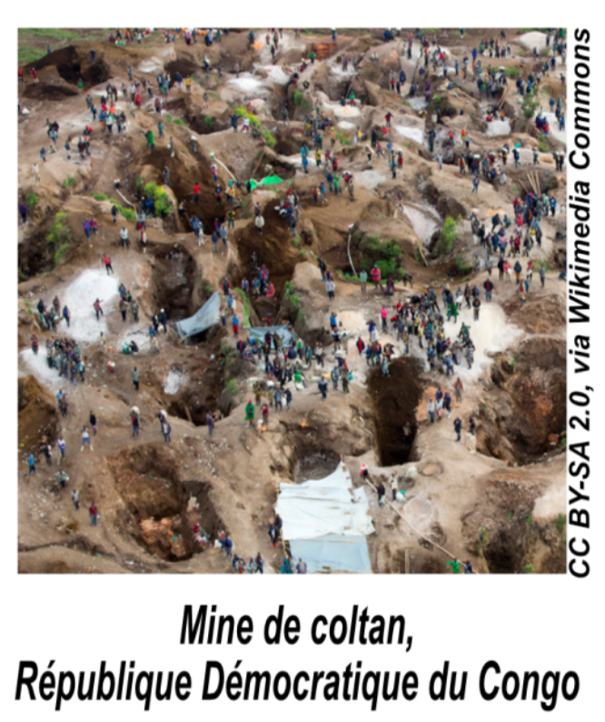
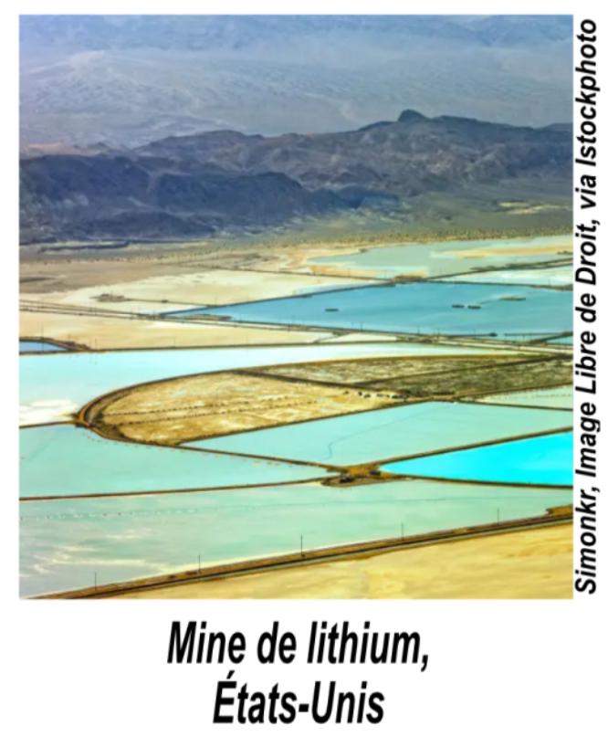

# Illustrations pour l'animation du jeu 
Vous trouverez ci-dessous, les illustrations qui vous seront utiles pour l'animation du jeu PhoneImpact :
## Les éléments chimiques contenus dans un smartphone

## Mine de cuivre de Palabora, Afrique du Sud

## Chaîne de production d'un métal

## Images Malus

  
  
  
  
  
  
  
  
  

