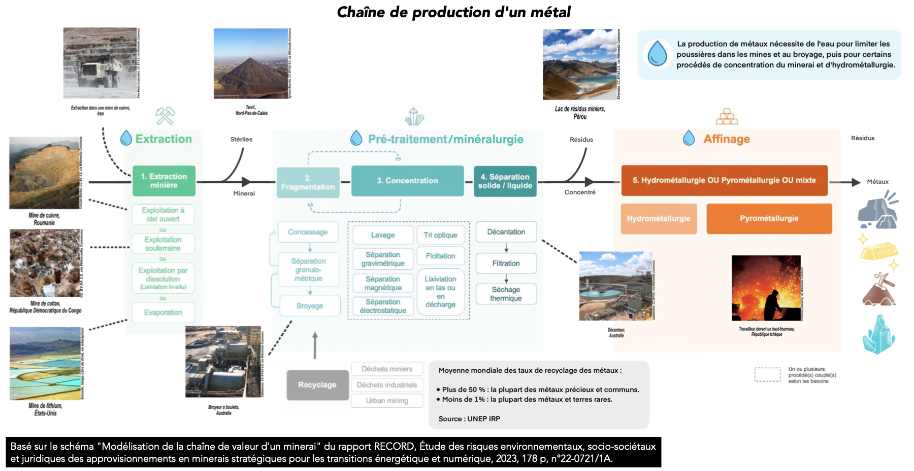

# Illustrations pour l'animation du jeu 
Vous trouverez ci-dessous, les illustrations qui vous seront utiles pour l'animation du jeu PhoneImpact :
## Les éléments chimiques contenus dans un smartphone

Basé sur une infographie conçue par Systex : https://www.systext.org/node/1724  
À noter : le nombre de métaux contenus dans un smartphone a encore augmenté depuis 2017.
On trouve par exemple désormais de l'argent dans les écrans tactiles.
## Mine de cuivre de Palabora, Afrique du Sud

## Chaîne de production d'un métal

Basé sur le schéma "Modélisation de la chaîne de valeur d'un minerai" du rapport RECORD, Étude des risques environnementaux, socio-sociétaux
et juridiques des approvisionnements en minerais stratégiques pour les transitions énergétique et numérique, 2023, 178 p, n°22-0721/1A.
## Nos smartphones, pas si smart pour la planète, Ademe
