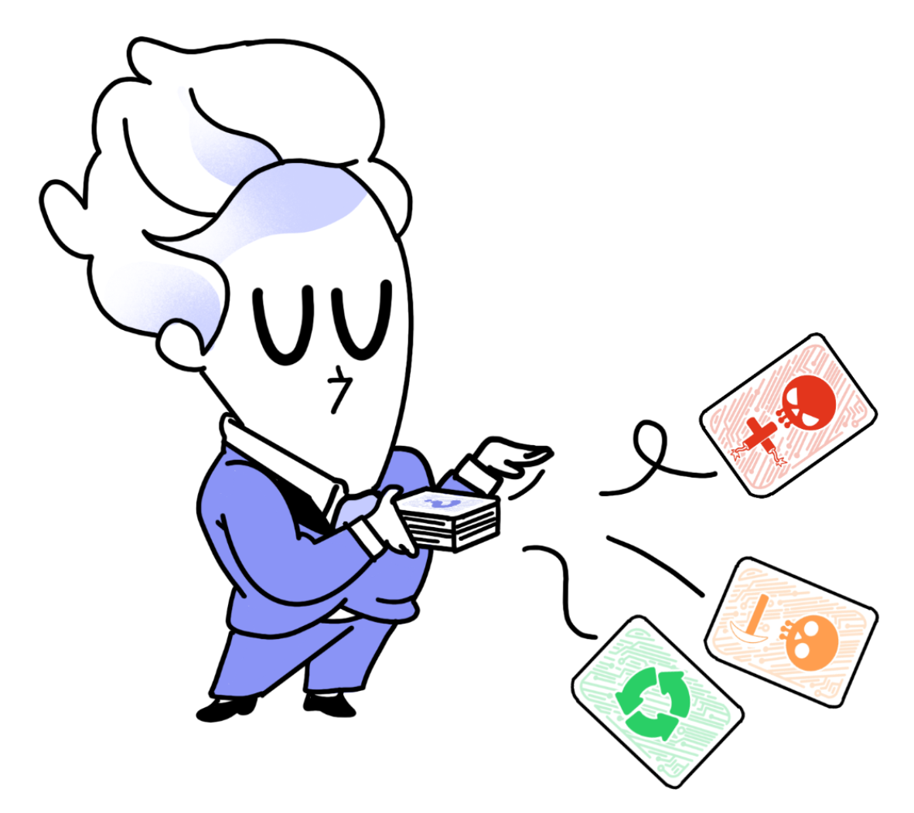

# Fin de partie

## Conditions de fin de partie

Une partie de PhoneImpact peut se terminer de **3 manières différentes** :

* Si un·e joueur·se parvient à fabriquer **les 4 composants** de son smartphone, la partie s’achève à la fin du tour de jeu.
* Si un·e joueur·se pioche **la dernière carte Malus**, la partie s’achève à la fin du tour de jeu. Durant ce dernier tour, si les joueur·ses choisissent l’action **S’approvisionner**, ils pourront le faire seulement chez **Recycl’** (la pioche Malus étant vide).
* Si la carte Évènements "**Fin de partie**" est tirée, la partie s’arrête instantanément.
  
**La personne ayant le plus de points remporte la partie.**

## Décompte des points

Calculer votre score en **additionnant** les valeurs (inscrites sur le plateau de jeu) de chaque **composant construit**.
  
**Un bonus de 2 points** est attribué à celui ou celle ayant construit le smartphone **le plus écoresponsable**, c'est-à-dire celui possédant **le plus de cartes Recycl’** parmi les cartes posées sur le plateau de jeu. En cas d'égalité, **+2 points pour tous**.  
