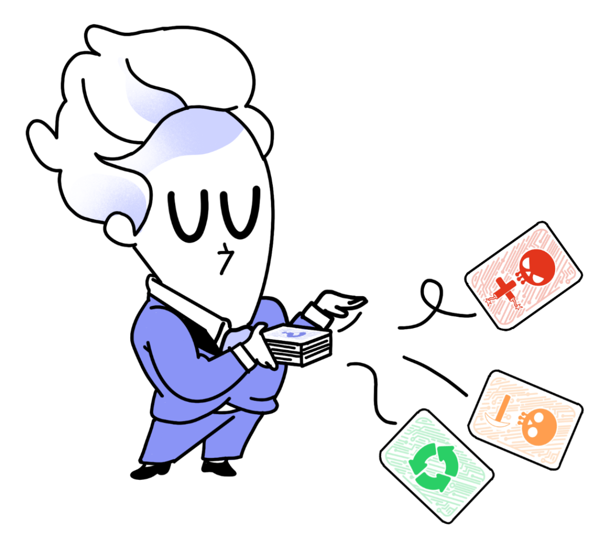

# Fin de partie

## I - Conditions de fin de partie

Une partie de PhoneImpact peut se terminer de **3 manières différentes** :

* Si un·e joueur·euse parvient à fabriquer **les 4 composants** de son smartphone, la partie s’achève à la fin du tour de jeu.
* Si un·e joueur·euse pioche **la dernière carte Malus**, la partie s’achève à la fin du tour de jeu. Durant ce dernier tour, si les joueur·euses choisissent l’action **S’approvisionner**, ils pourront le faire seulement chez **Recycl’** (la pioche Malus étant vide).
* Si la carte Évènements "**Fin de partie**" est tirée, la partie s’arrête instantanément.
  
**La personne ayant le plus de points remporte la partie.**

## II - Décompte des points

Calculer votre score en **additionnant** les points (inscrits sur le plateau de jeu) correspondant à chaque **composant construit**.
La personne qui a la plus de points remporte la partie !

