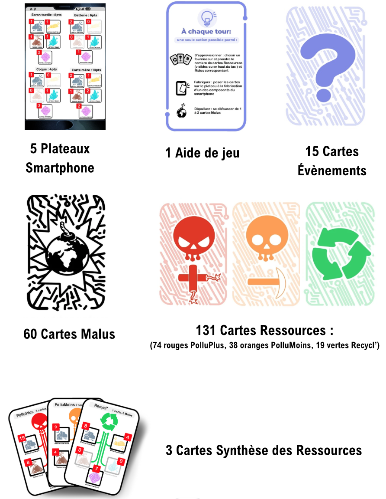
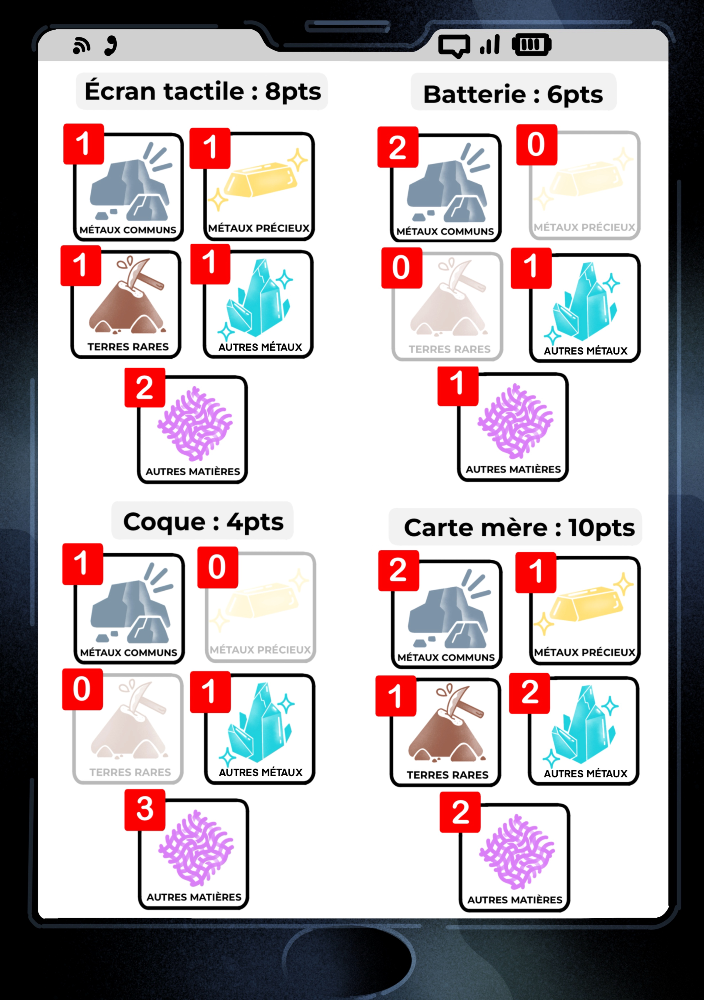
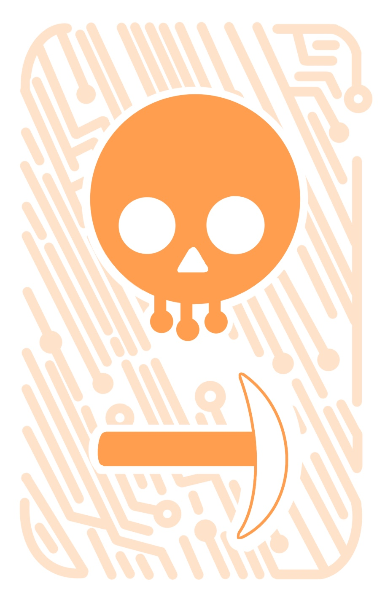
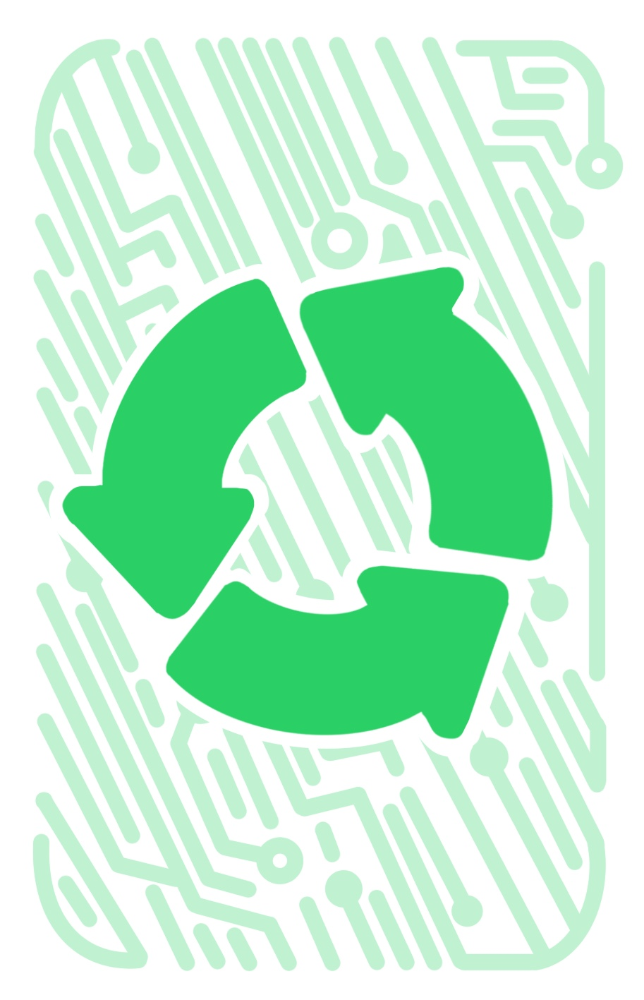
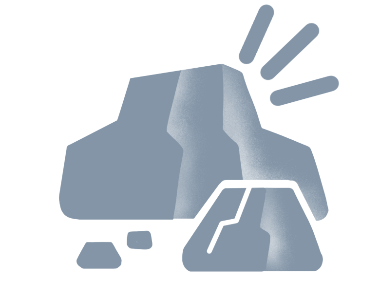
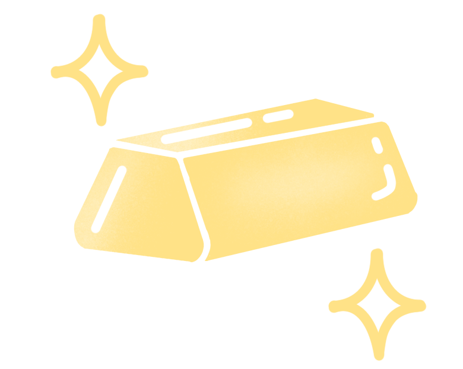
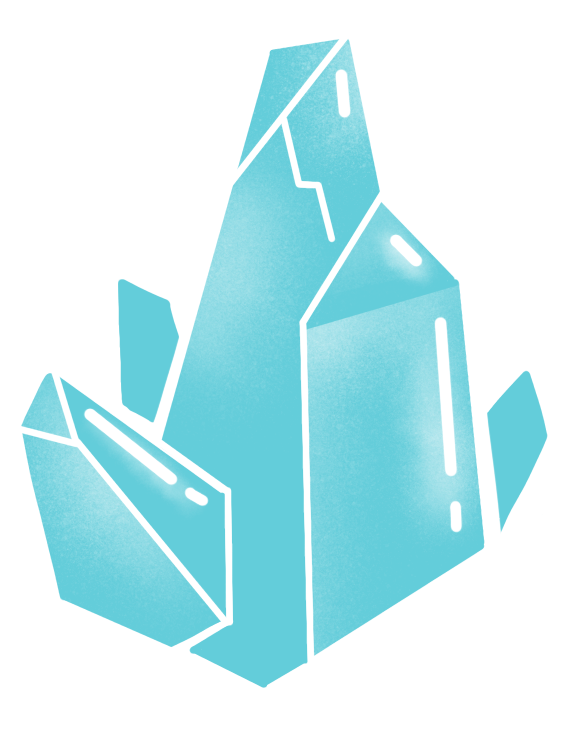
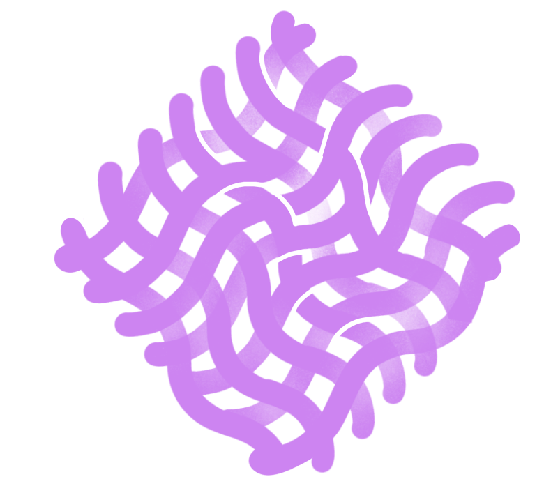
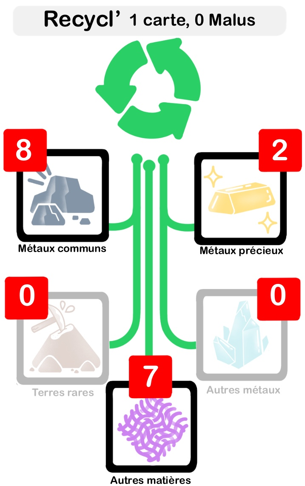
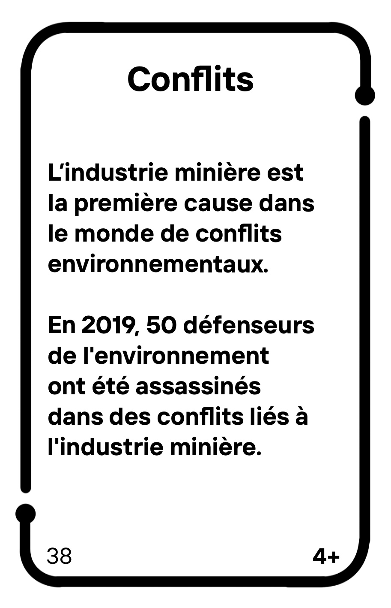

# Éléments de jeu

## Inventaire du matériel

    

## Description des éléments   

### Plateau Smartphone  

Votre smartphone à fabriquer est représenté par un Plateau Smartphone constitué de 4 composants : **Coque**, **Carte mère**, **Batterie** et **Écran tactile**. La fabrication d'un composant rapporte des points, indiqués sur le plateau à côté du nom du composant.

Chaque composant est fabriqué à partir de **ressources** qui correspondent à différents **types de ressources** (Métaux communs, Métaux précieux, Terres rares, Autres métaux et Autres matières). Les chiffres associés à chaque ressource indiquent le **nombre** de ressources nécessaires pour **fabriquer** chaque composant.

!!! note "Remarque"
    - Par souci de simplification, la **carte mère** désigne aussi l'ensemble des composants électroniques associés : processeur, mémoire vive, etc. mais aussi haut-parleurs, caméras, antenne...  
    - Le nombre de cartes nécessaires pour les composants n'est pas représentatif du poids réel des ressources d'un smartphone ni de la quantité de matière, mais symbolise la variété des ressources nécessaires.

### Cartes Ressources 
Pour fabriquer les composants de votre smartphone, vous aurez besoin de **ressources**. Vous pouvez vous approvisionner chez **3 fournisseurs** différenciés par leur couleur et leur logo :    
  

- **Rouge : PolluPlus**
qui pratique un minage classique, polluant et non responsable.
- **Orange : PolluMoins**
qui pratique un minage plus responsable et essaie de prendre en compte les aspects environnementaux et sociaux.      
- **Vert : Recycl’**
  spécialisé dans le recyclage, avec un niveau de pollution qui est beaucoup moins élevé.  

On distingue **5 types de ressources** nécessaires à la fabrication des composants d'un smartphone :  

**Métaux communs (ex. aluminium, cuivre, fer)** : aussi appelés "métaux de base", ils sont utilisés communément dans l'industrie. Les métaux communs représentent la majeure partie du poids des métaux dans un smartphone.

 

**Métaux précieux (ex. argent, or, palladium, platine)** : rares (très peu abondants dans la croûte terrestre) mais surtout de grande valeur économique, ils sont utilisés principalement pour leur conductivité et leur résistance à la corrosion.

 

**Terres rares (ex. néodyme, yttrium)** : malgré leur nom, les terres rares sont en fait assez abondantes dans la croûte terrestre, mais en faible teneur et difficiles à extraire. Elles servent entre autres à fabriquer les aimants pour les vibreurs des smartphones et à colorer les LED des écrans.

 

**Autres métaux (ex. cobalt, lithium, tantale)** : un smartphone contient également de nombreux autres métaux qui ne sont ni communs, ni précieux ni des terres rares. On compte plus d'une cinquantaine de métaux dans un smartphone, qui permettent l'implémentation de fonctionnalités spécifiques.

 

**Autres matières (ex. céramique, plastique, matières synthétiques, verre)** : en plus des métaux, les smartphones contiennent d'autres matières comme du verre et du plastique pour l'écran, la coque, les circuits imprimés contenus dans la carte mère...

 

### Cartes Synthèse des ressources  

Pour chaque fournisseur, ces cartes indiquent la répartition des différents types de ressources présents dans les pioches. Le **nombre de cartes Ressources** et de **cartes Malus** à piocher sont indiqués à côté du nom du fournisseur.

!!! note "Remarque"
    - Le fabricant Recycl’ (en vert) ne fournit pas de ressource de type **Autres métaux** ou **Terres rares** qui sont des ressources non recyclables.
    - Les chiffres sont choisis pour favoriser la dynamique de jeu mais ne sont pas représentatifs de la réalité de la production..

### Cartes Événement

Les cartes **Événements** sont numérotées de **1 à 14**, incluant une carte spéciale **1bis**. 

Chaque carte décrit **un fait** (en partie fictifs mais ancrés dans la réalité) qui se produit à TechCity et **une action** à lire au début de chaque tour, applicable à tous les joueur·euses. Ces événements introduisent des éléments imprévus et des défis supplémentaires, influençant le cours de la partie de manière significative.

### Carte Malus

Produire les ressources nécessaires à la fabrication des composants d'un smartphone engendre des impacts environnementaux et sociaux. Ces impacts sont matérialisés par les cartes Malus qui accompagnent l'acquisition de ressources PolluPlus et PolluMoins.

Chaque carte Malus apporte une information sur la production des métaux, en particulier sur son **fonctionnement** (par exemple le Traitement des minerais ou le Recyclage des métaux) et sur ses **impacts environnementaux** (malus de type Pollutions, Catastrophe) et sociaux (malus Tensions, Conflits).

 

!!! note "Remarque"
    Les cartes Malus se concentrent sur les impacts environnementaux et sociaux de la production des métaux contenus dans les smartphones. Il est important de ne pas oublier que ces métaux ont bien d'autres usages que la fabrication de smartphones, mais aussi que les impacts environnementaux et sociaux des smartphones ne se limitent pas à la production des métaux qui les composent.

Le chiffre en bas à droite indique dans quelles **configurations - nombres de joueur·euses -** le malus est utilisé.

!!! tip "Exemple"
    Dans une partie à 4 joueur·euses, les cartes 3+ et 4+ sont utilisées et les cartes 5+ sont remises dans la boîte.

!!! note "Pour info"
    Le numéro en bas à gauche sert à retrouver les sources associées sur le portail web du jeu.
