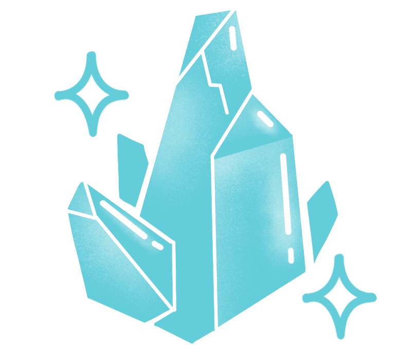
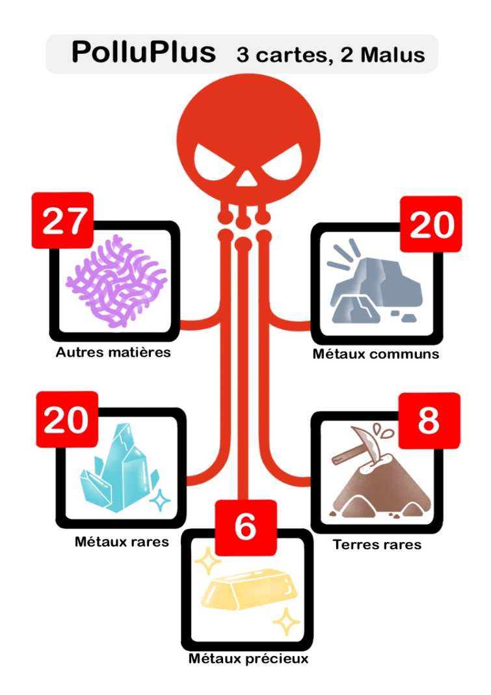
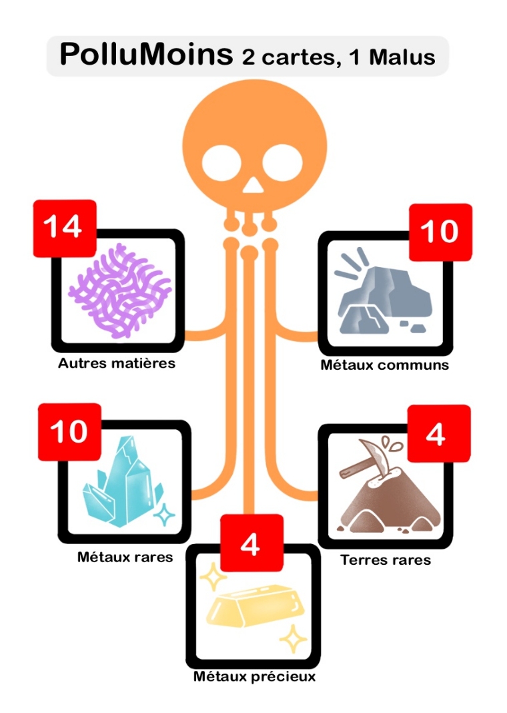
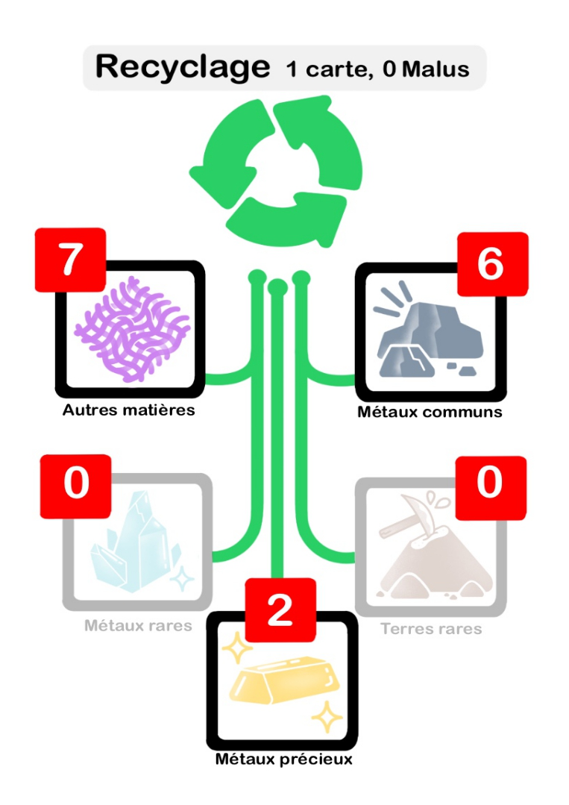

# Éléments de jeu

## Inventaire du matériel

    

## Description des éléments   

### Plateau Smartphone  

Chaque plateau smartphone est constitué de 4 composants : **Coque**, **Carte mère**, **Batterie** et **Écran tactile**.    
La fabrication d'un composant rapporte des points, indiqués sur le plateau à côté du nom du composant. 
Chaque composant est constitué de **ressources** représentées sous forme de **type de ressources** (Métaux communs, Métaux précieux, Terres rares, Autres métaux et Autres matières).  
Les carrés disposés sur chaque ressource indiquent le **nombre** de ressources nécessaires pour **fabriquer** chaque composant.

!!! note "Remarque"
    - Par souci de simplification, la **carte mère** désigne l'ensemble des composants électroniques associés : processeur, mémoire vive, disque dur, haut-parleur, microphone, caméras, antenne...  
    - Le pourcentage de cartes nécessaires pour les composants n'est pas représentatif du poids réel des ressources d'un smartphone ni de la quantité de matière, mais permet de symboliser la variété des ressources nécessaires.

### Cartes Ressources 
Les **ressources** permettent de fabriquer les composants du smartphone.
Vous pouvez vous approvisionner chez **3 fournisseurs** différenciés par leur couleur et leur logo :    
  

- **Rouge : PolluPlus**
qui pratique un minage classique, polluant et non responsable.
- **Orange : PolluMoins**
qui pratique un minage plus responsable et essaie de prendre en compte les aspects environnementaux et sociaux.      
- **Vert : Recycl’**
spécialisé dans le recyclage mais avec un niveau de pollution non négligeable.  
  
Il existe **5 types de ressources** :  

**Métaux communs :** Abondants dans la croûte terrestre, la plupart sont utilisés communément dans l'industrie. Certains peuvent demander une grande quantité d’énergie pour être extraits et raffinés. Les métaux communs composent la majorité des métaux d'un smartphone (ex. Aluminium, Cuivre, Fer).

 

**Métaux précieux :** Rares mais surtout de grande valeur économique, ils sont utilisés majoritairement dans les circuits imprimés (ex. Or, Argent, Platine, Palladium).

 

**Terres rares :** Les terres rares, à ne pas confondre avec les métaux rares, ne le sont pas tant du fait de leur rareté mais parce qu’elles sont difficiles à extraire (ex. Yttrium, Néodyme).

 

**Autres métaux :** Catégorie rassemblant principalement des "métaux de spécialité", il s'agit de tous les autres métaux, plus rares ou peu abondants, sans pour autant avoir à ce jour une valeur économique qui les rend précieux (ex. Cobalt, Lithium, Tantale).

 

**Autres matières :** 40 à 70% du poids du smartphone (ex. plastique, verre, céramique, matières synthétiques).

 

### Cartes Synthèse des ressources  

Pour chaque fournisseur, ces cartes donnent la répartition des différents types de ressources présents dans les pioches. Le **nombre de cartes Ressources** et de **cartes Malus** à piocher sont indiqués à côté du nom du fournisseur.

!!! note "Remarque"
    - le fabricant **Recycl**’ (en vert) ne fournit pas de ressource de type **Autres métaux** ou **Terres rares** qui sont des ressources non recyclables. 
    - les chiffres ne reflètent pas le poids réel des ressources d'un smartphone ni la quantité de matière, mais illustrent la diversité des ressources nécessaires.

### Cartes Événement

Les cartes **Événements** sont numérotées de **1 à 14**, incluant une carte spéciale **1bis**. 

Chaque carte contient un **fait** qui se déroule à TechCity et une **action** à lire au début de chaque tour, applicable à tous les joueur·euses. Ces événements introduisent des éléments imprévus et des défis supplémentaires, influençant le cours de la partie de manière significative.

### Carte Malus

L'acquisition de ressources peut s'accompagner de malus matérialisant votre niveau de pollution.

Chaque carte Malus apporte une information sur la production des métaux, en particulier sur son **fonctionnement** (par exemple le Traitement des minerais ou le Recyclage des métaux) et sur ses **impacts environnementaux** (malus de type Pollution, Catastrophe) et **sociaux** (malus Tensions, Conflits).

 

!!! note "Remarque"
    Le numéro en bas à gauche indique le numéro de la carte Malus, utile pour retrouver les sources associées sur la page "source Malus".
Le chiffre en bas à droite indique dans quelles **configurations -nombres de joueur·euses** - le malus est utilisé.
 
**Exemple :** dans une partie à 3 joueur·euses, les cartes 3+ sont utilisées et les cartes 4+ et 5+ sont remises dans la boîte.
