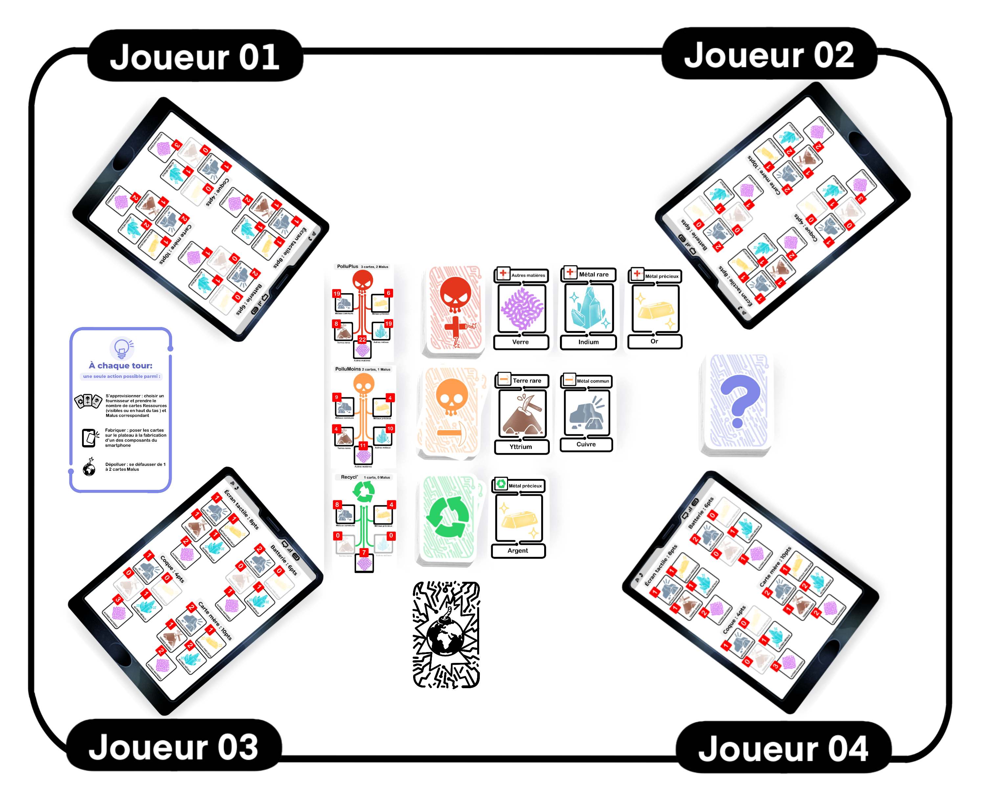

# Mise en place
## Plateau de jeu à construire

  
_Exemple d'une mise en place à 4 joueur.euses_

### Etape 1

Mélangez les cartes **Ressources** de chaque fournisseur (**PolluPlus**, **PolluMoins**, **Recycl’**) pour former 3 pioches, faces cachées 
  :material-numeric-2-circle-outline:

Les 3 pioches sont disposées en colonne au centre de la table : **PolluPlus** en haut, **PolluMoins** au centre, **Recycl’** en bas **(1)**

À droite de chaque pioche, retournez face visible : 3 cartes chez PolluPlus      , 2 cartes chez PolluMoins      , 1 carte chez Recycl’     .

À gauche de chaque pioche,       disposez les cartes Synthèse des Ressources pour chaque fournisseur.

### Etape 2

### Etape 3

