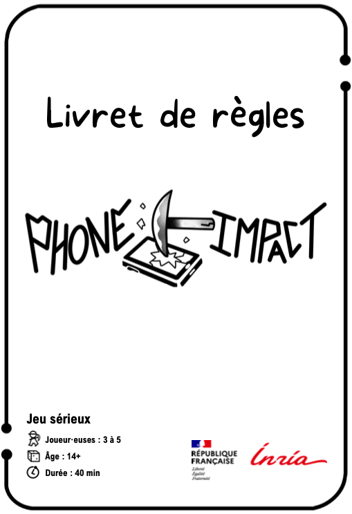

# Règles du jeu

Vous trouverez les règles détaillées de PhoneImpact dans le Livret ci-dessous.

!!! exemple "Ceci est une proposition de pitch !"
    Dans cette les paragraphes suivants, nous vous proposons un texte pour **expliquer simplement les règles du jeu aux joueur·euses**. Nous l'avons testé sur différents publics. Nous supposons que vous avez le jeu devant vous et que vous montrez les éléments de jeu au fur et à mesure.

     Libre à vous de l'adapter en fonction de votre public. Par exemple, il faudra peut-être décrire différemment les règles avec des personnes qui n'ont pas l'habitude de jouer à des jeux de société.

## But du jeu

Le but du jeu est de gagner le maximum de points en fabriquant des composants de votre smartphone avant la fin de la partie. Pour cela, vous devez **acquérir les ressources nécessaires** à leur fabrication chez les **3 fournisseurs** proposés.
Mais attention à ne pas trop polluer !

## Introduction du jeu

Dans ce jeu, vous habitez la ville TechCity et vous incarnez un·e fabricant·e de smartphones. Votre objectif est de fabriquer un smartphone tout en minimisant votre impact environnemental. Tout au long de la partie, vous devrez faire des choix stratégiques... mais attention : chaque choix a des conséquences.

Chaque joueur·euse dispose d’un plateau smartphone composé de : l’écran tactile (dalle et vitre), la batterie, la coque et de la carte mère.

Chaque composant est fabriqué à partir de **ressources** qui correspondent à différents **types de ressources** (Métaux communs, Métaux précieux, Terres rares, Autres métaux et Autres matières). Les chiffres indiqués dans les cadres rouges correspondent au nombre de cartes Ressources nécessaires pour fabriquer chaque composant.

!!! example "Exemple"
    Pour fabriquer la « carte mère », il faut : 2 Métaux communs, 1 Métal précieux, 1 Terre rare, 2 Autres métaux, et 2 autres matières.

## Les 3 fournisseurs
Pour fabriquer vos composants, vous devrez acquérir des cartes Ressources. Pour cela, vous aurez le choix entre trois fournisseurs :

  

- PolluPlus (rouge) : minage très polluant, non responsable
- PolluMoins (orange) : minage avec quelques efforts pour moins polluer
- Recycl' (vert) spécialisé dans le recyclage

À noter : chez Recycl’, vous ne trouverez ni Terres rares, ni Autres métaux, car ces métaux sont peu ou pas recyclés aujourd’hui.

Les conséquences environnementales associées à la production de ressources varient en fonction des fournisseurs. Vos choix d’approvisionnement auront donc des répercussions directes sur votre impact environnemental !

## Déroulement du jeu
Le jeu se déroule en plusieurs étapes, vous jouez à tour de rôle dans le sens des aiguilles d’une montre.

À chaque tour de jeu, vous pouvez faire **1 seule de ces 3 actions** : 1- s'approvisionner, 2- fabriquer un composant, 3- dépolluer.

- **1- S'approvisionner** : choisir un fournisseur parmi PolluPlus, Pollumoins ou Recycl’. Le nombre de ressources que vous pouvez acquérir dépend du fournisseur choisi :  
    - Chez **PolluPlus** → vous prenez au total 3 cartes (visibles ou dans la pioche). Par exemple 2 cartes visibles et 1 dans la pioche. Une fois que vous avez pris vos cartes, vous remplacez les emplacements vides par de nouvelles cartes.
    - Chez **PolluMoins** → vous prenez 2 cartes au total (visibles ou dans la pioche). 
    - Chez **Recycl'** → vous prenez 1 seule carte (visible ou dans la pioche).

Les cartes Ressources sont secrètes donc vous devez les garder en main.

Selon le fournisseur, vous devez piocher des cartes Malus, à lire à haute voix.

- PolluPlus → 2 Malus
- PolluMoins → 1 Malus
- Recycl’ → 0 Malus

Ces cartes représentent les conséquences environnementales de vos décisions.

- **2- Fabriquer un composant** : poser toutes les cartes ressources nécessaires et construire un seul des composants du smartphone. Les cartes ressources sont posées sur le composant fabriqué. Le nombre de ressources nécessaires est indiqué sur le plateau pour chaque composant. La fabrication de ce composant rapporte des points, indiqués sur le plateau à côté de son nom.

!!! example "Exemple"
    La carte mère rapporte 10 points.

- **3- Dépolluer** : se défausser de 1 à 2 cartes Malus. Ces cartes ne retournent pas dans la pioche, elles sont mises de côté.

Vous pouvez toujours vous référer à l’**aide de jeu** en cas d’oubli :

Après chaque tour de table, on tire une carte **Événement**

- Elle s'applique à tout le monde.
- On lit la carte et on effectue l’action, en commençant par la personne ayant le titre Joueur·euse 1 puis dans le sens horaire, sauf contre-indication.
- Les cartes visibles piochées sont remplacées à la fin de l’événement (une fois que tous les joueur·euses ont effectué leur action).
- Les cartes Ressources ou Malus défaussées vont dans un tas séparé, jamais dans les pioches.

## Conditions de fin de partie
La partie s’arrête lorsque l’une des situations suivantes se produit :

- Une personne a fini de fabriquer son smartphone → on termine le tour de table.
- La carte Événement “Fin de partie” est tirée → la partie s’arrête immédiatement.
- Il n’y a plus de cartes Malus → on termine le tour de table. Si l’action choisie est « S’approvisionner », il n’est alors possible de le faire que chez Recycl’ (la pioche Malus est vide).

## Décompte des points
La personne ayant le plus grand total de points remporte la partie. On additionne les points de chaque composant fabriqué.

## Qui commence ?
Pour déterminer qui commence :

1. Si une personne **n'a pas de smartphone**, c'est elle qui commence.
2. Sinon, celle qui a **le smartphone le plus ancien**.
3. En cas de doute, privilégiez la personne ayant : **un smartphone reconditionné**, ou qui a **récupéré un vieux smartphone**.
4. Si l’égalité persiste, la personne la **plus jeune** commence.