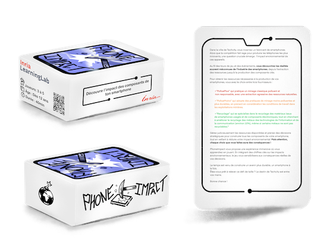

# Détail du matériel

## Matériel

### Plateau *Smartphones*
Il y a dans le jeux 5 **plateaux Smartphones** de 4 composants chacun : Coque, Carte Mère, Batterie, Ecran Tactile (chaque composant est une carte épaisse). Les 4 cartes "composants" assemblées représentent un smartphone au format A4.

Chaque **composant** est constitué de ressources qui apparaissent sur la carte.

Les **ressources** sont désignées par des types de ressources qui sont les suivants dans le jeu :

- Métal précieux : Or, argent, platine, palladium, etc... (Précieux mais aussi rare, stratégique donc cher)
- Métal rare : Lithium, tantale, indium, etc... (Non précieux mais peu fréquent dans le sol)
- Métal commun (et non rares): Aluminium, cuivre, nickel, etc... (L'extraction nécessite beaucoup de ressources et d'énergie)
- Terre rare : Yttrium, néodyme, gadolinium, etc... (Pas si rare mais difficile à extraire)
- Autre matière : Plastique, verre, céramique, matières synthétiques, etc... (40 à 70% du poids)

### 141 Cartes *Ressources*
Il existe 3 types de ressources qui correspondent à 3 tas de cartes :

| Type de resssources| PollusPlus | PolluMoins | Recyclage |
| -------- | -------- | -------- | -------- |
| Métaux communs | 26     | 15     | 6 |
| Métaux rares | 16     | 10     | 0 |
| Autres Matières | 22     |  17   | 9 |
| Métaux précieux | 3     |   2   | 2 |
| Terres rares | 8     |    5  | 0 |
| **Somme** | 75 |   49   | 17 |

**Précision importante** : le pourcentage de cartes nécessaires pour les composants n'est pas représentatif du poids réel des ressources d'un smartphone ni de la quantité de matière mais permet de symboliser la variété des ressources nécessaires.

### 16 Cartes *Événement*
Les cartes **Événement** sont numérotées et doivent être classées dans l'ordre croissant à chaque début de partie.

Elles peuvent être de type :

- Pour la V1 (carte de la boite)
    - Bonus
    - Pillage
    - Règlementation
    - Événement majeur
- Pour la V2
    - Bonus
    - Le saviez-vous ?
    - La loi change
    - Événement majeur

### 37 Cartes *Malus* (V1)
Les cartes **Malus** doivent être mélangées à chaque début de partie. À chaque malus correspond un texte qui doit être lu par les joueurs quand ils tirent une de ces cartes. Ces textes sont des chiffres, des informations, des faits en relations avec les impacts environnementaux du numérique. À la fin du texte, un numéro entre crochets permet de retrouver la source du texte.

2 cartes Malus de type "Alertes" doivent être introduites dans le jeu selon le nombre de joueurs.

### 60 Cartes *Malus* (V2)
- Les cartes **Malus** doivent être mélangées à chaque début de partie. 
- À chaque malus correspond une illustration ou un texte qui doit être lu par les joueurs quand ils tirent une de ces cartes.
- À la fin du texte, une référence permet de retrouver la source du texte.
