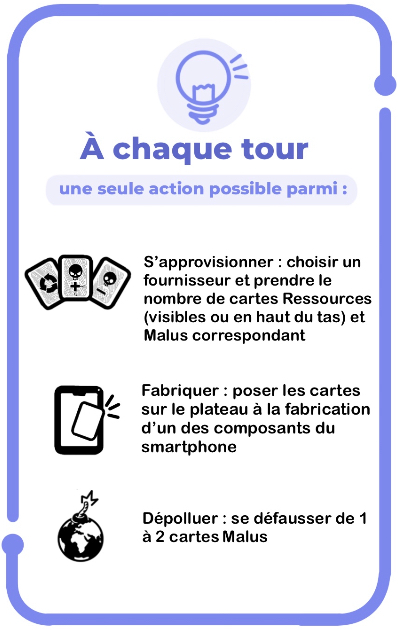

---
hide:
  - navigation
---

# Se procurer le jeu

Choisissez entre :

- Acheter une boîte de jeux prête à l’emploi avec tout le matériel nécessaire pour une expérience complète.
- Utiliser la version Print&Play : imprimez, plastifiez éventuellement, et découpez le matériel.

## I - Acheter une boîte de jeu

Les boîtes sont disponibles à la vente : [achetez une boîte de jeu](https://boutique.inria.ecoessentials.fr/)

## II - Print & Play

Vous trouverez dans cette page les liens de téléchargement pour imprimer votre propre version du jeu. Nous vous conseillons si possible d'imprimer en couleur et, si vous en avez la possibilité, de plastifier les éléments du jeu (plateaux et cartes).

!!! Warning
    Préparez-vous ! L’assemblage d’une boîte de jeu en version Print & Play prend au minimum 1 heure (sans plastification).

### Le plateau Smartphone
<a href="docCommuns/Plateau.pdf">"</a> **X 5**

[Lien vers le plateau Smartphone à imprimer en 5 exemplaires, recto](docCommuns/Plateau.pdf) 

### Les cartes Ressources

| Cartes PolluPlus                                                                         | Cartes PolluMoins                                                                                               | Cartes Recycl'                                                                                         |
|------------------------------------------------------------------------------------------|-----------------------------------------------------------------------------------------------------------------|--------------------------------------------------------------------------------------------------------|
|  |  |  |
| [Imprimer recto-verso](pnp/polluplus.pdf)                                                | [Imprimer recto-verso](pnp/pollumoins.pdf)                                                                      | [Imprimer recto-verso](pnp/recyclage.pdf)                                                              |

### Les cartes Cartes Synthèse des ressources

[Lien vers les cartes Synthèse des ressources, à imprimer recto-verso](pnp/recap.pdf)

### Les cartes Événements et Malus

| Cartes Événements | Cartes Malus |
|-------------------|---------|
|                   |         |
|          [Imprimer recto-verso](pnp/events.pdf)         |    [Imprimer recto-verso](pnp/malus.pdf)     |

### Autres documents à imprimer

| Livret de règles                                                                                                    | Cartes Aide de jeu                                                                                     |
|---------------------------------------------------------------------------------------------------------------------|--------------------------------------------------------------------------------------------------------|
|  |  |
| [Imprimer recto-verso](docCommuns/LivretDeRegles.pdf)                                                               | [Imprimer recto](docCommuns/AideDeJeu.pdf)                                                             |
