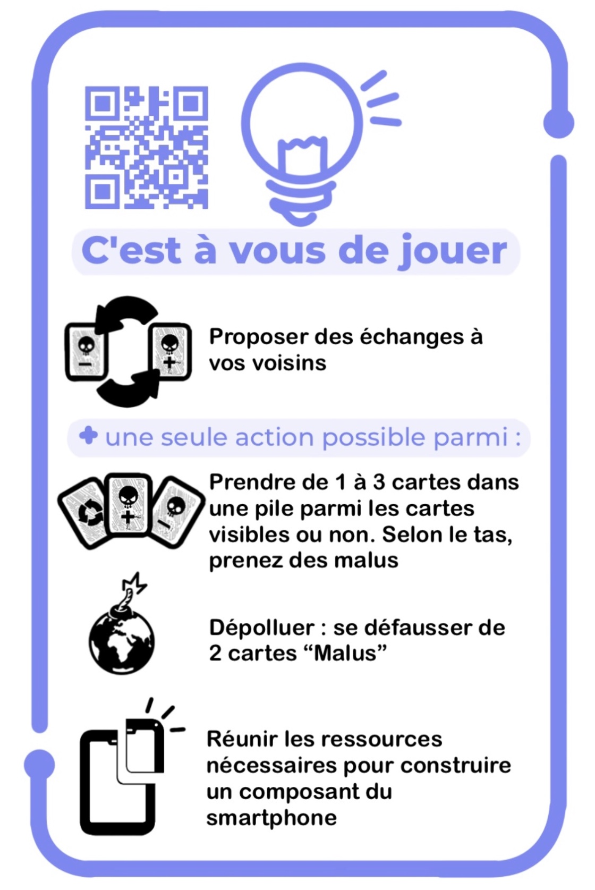

# Règles du jeu

## Règles du jeu pour une partie en 45'
### Présentation du jeu
Dans ce jeu, vous incarnez un fabricant de smartphones et votre objectif
est de construire un smartphone tout en minimisant votre impact
environnemental. Vous aurez des choix à faire tout au long du jeu mais
attention, ces choix auront des conséquences.

Vous avez chacun un plateau smartphone composé de : l'écran tactile
(dalle et vitre), la batterie, la coque, la carte mère.

Chaque composant est constitué de ressources qui apparaissent sur la
carte. Ces ressources sont désignées par des types de ressources qui sont les
suivants dans le jeu :

-   **Métal précieux** mais aussi rare, stratégique donc cher comme l'Or, l'argent, le platine, le palladium...
    -> *représenté par un lingot d'Or*

-   **Métal rare** Non précieux mais peu fréquent dans le sol comme le Lithium, le tantale, l'indium...
    -> *représenté par une pierre précieuse bleu*

-   **Métal commun** L'extraction nécessite beaucoup de ressources et d'énergie comme l'Aluminium, le cuivre, le nickel...
    -> *représenté par un métal gris*

-   **Terre rare** (Pas si rare mais difficile à extraire) comme l'Yttrium, le néodyme, la gadolinium...
    -> *représenté par un tas de terre marron*

-   **Autre matière** (40 à 70% du poids du smartphone) comme le plastique, le verre, la céramique, les matières synthétiques...
    -> *représenté par une fibre violette*

Le but du jeu est de rassembler assez de ressources pour construire tous les composants de votre smartphone.

Cependant, l'acquisition des ressources peut s'accompagner de malus qui auront des conséquences dans la suite du jeu.
Les textes des cartes malus sont lues quand elles sont tirées. À la fin de ces textes, un numéro indique la source à consulter pour en savoir plus ([Lien vers les sources](Sources.md)).

[Detail du matériel si besoin](./Materiel.md)

### Déroulement du jeu

Le jeu se déroule en plusieurs étapes, vous jouez à tour de rôle dans le sens des aiguilles d'une montre.

À chaque **tour de jeu**, vous pouvez faire une seule de ces 3 actions suivantes :

- Vous approvisionner : choisir un fournisseur et prendre le nombre de cartes ressources (visibles ou en haut du tas) et malus correspondant :

    - **PolluPlus** qui fait du minage classique polluant non responsable
    > ce qui vous permet d'obtenir 3 cartes ressources
    > mais par contre 2 malus

    - **PolluMoins** qui fait du minage avec des efforts
    > ce qui vous permet d'obtenir 2 cartes ressources
    > mais par contre 1 malus

    - **Recyclage** spécialisé dans le recyclage (comme son nom l'indique),
    > ce qui vous permet d'obtenir 1 carte ressource
    > Pas de malus mais à savoir que dans cette pioche il n'y a ni terres rares, ni métaux
    rares.
    > vous ne pourrez pas perdre cette carte durant la partie

    Une fois que vous avez choisi votre fournisseur, vous pouvez prendre n'importe quelle 
    carte visible parmi celles posées sur la table ou tirer une carte dans la pioche, de ce même fournisseur. Si le joueur a pris des cartes visibles, elles seront remplacées à la fin de son tour. 

- Fabriquer un composant : poser toutes les cartes ressources nécessaires et construire un seul des composants du smartphone. Les cartes ressources sont posées sur le composant fabriqué.

- Dépolluer : se défausser de 1 à 2 cartes malus -> ces cartes défaussées ne sont pas remises dans la pioche, elles sont mises de côté.

En cas d'oubli, vous pouvez vous référer à l'aide de jeu :

{ width="300" }

### Qui commence ?

Pour déterminer qui commence :

- Celui ou celle qui a le smartphone le plus vieux commence.
- Si un joueur a un smartphone reconditionné ou a récupéré un vieux smartphone, c'est mieux.
- Celui qui n'a pas de smartphone commence !

Le premier joueur désigné prend la carte "premier joueur"

### Après chaque tour de table, on tire une carte événement

- Elle est valable pour tous les joueurs.
- On lit le contenu de la carte et on fait l'action qui est décrite.
- Le joueur suivant devient le premier joueur du tour suivant (sens des aiguilles d'une montre). Il récupère la carte "Premier joueur"
- Quand il y a au moins 4 cartes ressources identiques parmi les cartes visibles, les joueurs ont la possibilité de toutes les remplacer contre 3 malus à défausser.

### Qui commence à faire l'action désignée par la carte événement
- Certains événements désignés par le signe '*' nécessitent de départager les joueurs pour savoir qui commence.
- Dans ce cas, on privilégie celui qui a le plus de cartes recyclage, puis le moins de cartes malus, puis celui qui répond juste au Quiz ([Lien vers les questions](Questions.md)).

### Conditions de fin de partie 
La partie s'arrête quand :

- un des joueurs a construit son smartphone en entier.
- la carte événement "Fin de partie" est tirée.
- il n'y a plus de cartes malus.

### Décompte des points
Le gagnant est celui qui a le plus de points. On compte les points en fonction :  

- des composants construits de votre téléphone. Chaque composant rapporte un certain nombre de points, inscrit sur le plateau de jeu.
- +2 points pour celui qui a construit le smartphone le plus vertueux (le plus de cartes recyclées parmi les cartes posées). En cas d'égalité, +2 points pour tous.
- Mais en ces temps incertains, les règles du jeu peuvent évoluer rapidement...

En cas d'égalité, le gagnant est celui qui a le plus de cartes recyclées, puis le moins de cartes PolluPlus, puis le moins de cartes PolluMoins.

## Adaptation des règles pour une partie en 20'                                      
- On ne garde que les événements : 1 ; 5 ; 6 ; 7 ; 13 ;
