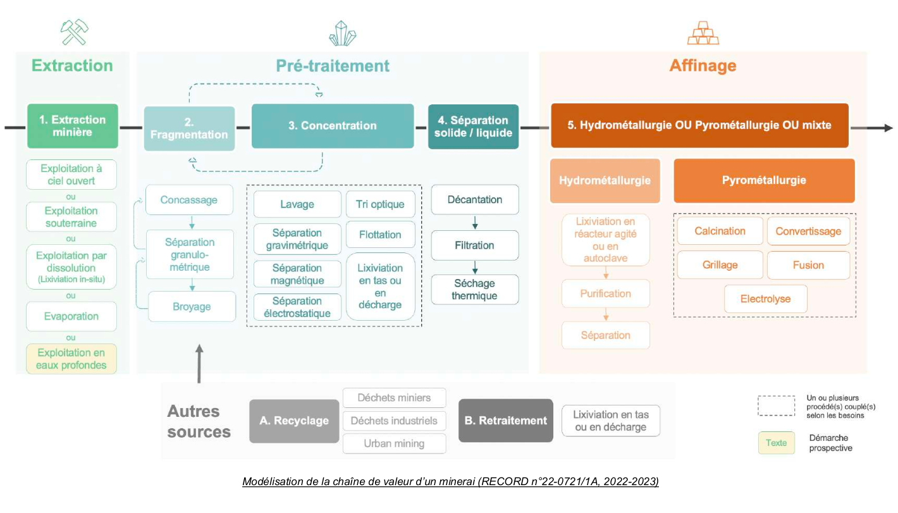
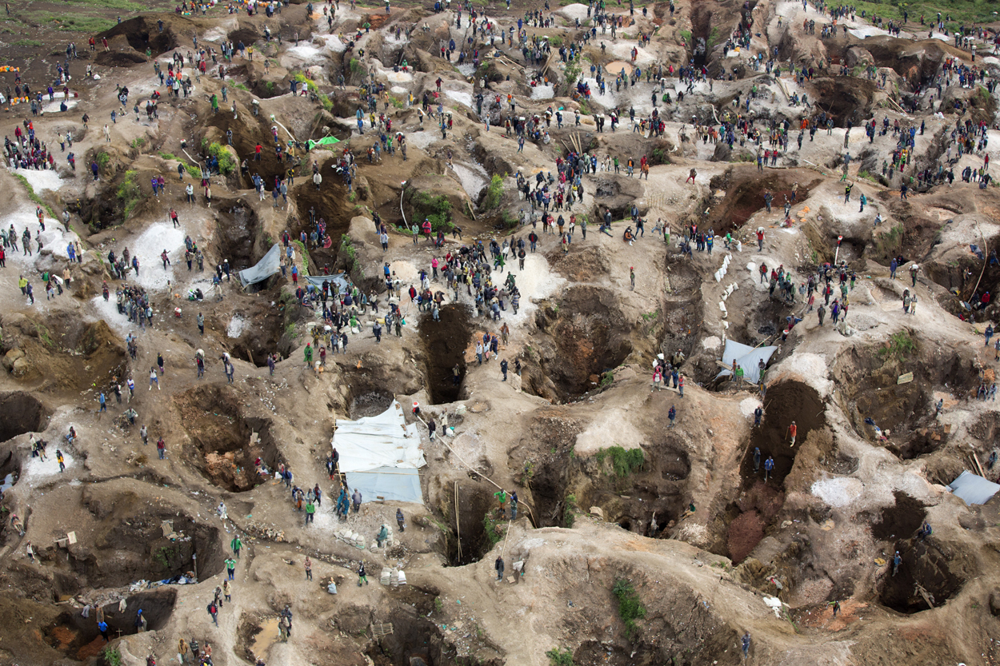
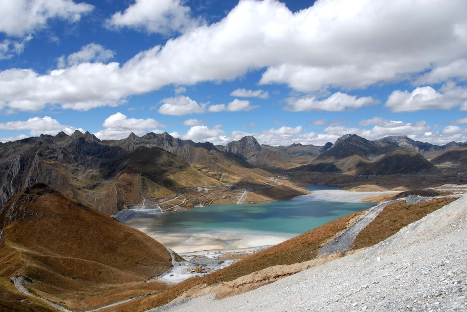
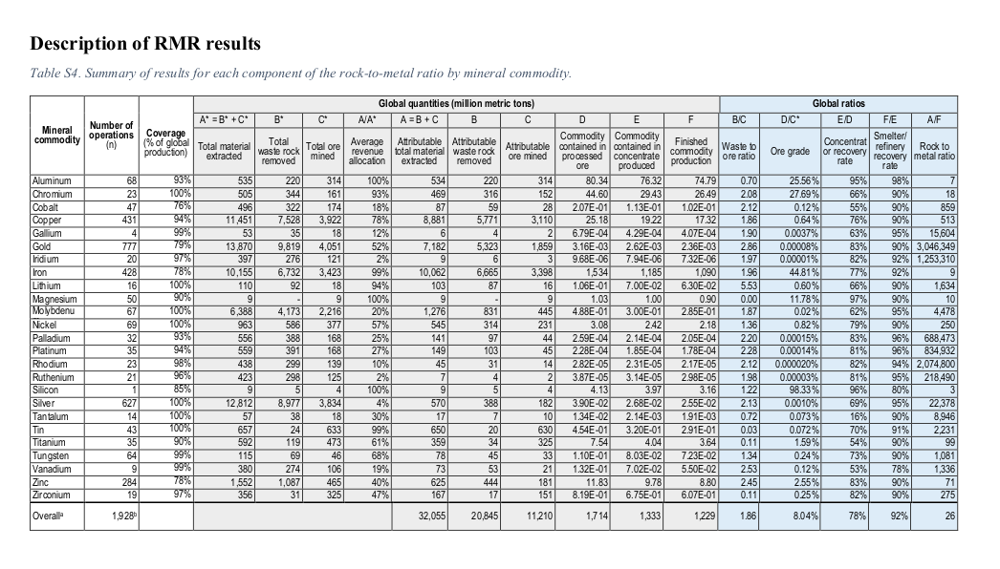

# 🚧 La production des métaux

!!! Warning
    Attention, cette fiche est en cours de rédaction

La production des métaux est un processus complexe et mondialisé, depuis les mines jusqu'aux usines de raffinage.

## Les grandes étapes de la production des métaux

On peut 

* extraction du minerai
* minéralurgie : concassage et broyage, concentration et enrichissement
* métallurgie

Une fois le minerai extrait, il est concassé, broyé et trié pour isoler les minéraux recherchés. C'est une étape qui consomme beaucoup d'énergie et d'eau, et qui génère des résidus.

Une fois réduit en poudre, le minerai subit différents traitements chimiques et physiques pour éliminer les impuretés jusqu'à obtenir le métal recherché.

<figure markdown="span">
    
</figure>

<figure markdown="span">
    
</figure>

## I - L'extraction minière

### Qu'est-ce qu'une mine ?

En France, le **code minier** définit la distinction entre mines et carrières. On parle de mine lorsque le matériau extrait est considéré comme stratégique, et sinon, de carrière.

!!! Source "Précisions et source"

    > _Les "mines" sont les exploitations, sous-terre ou à ciel ouvert, de gisements définis par une liste figurant dans le code minier (sel, minerais métalliques, gaz et énergies fossiles...). Tout autre activité terrestre d'extraction de minéraux est une "carrière". \[...\] D’une manière générale, les substances de mines se distinguent par une relative rareté à l’échelle nationale et une importance économique accrue, voire stratégique, qui justifie que leur gestion soit confiée à l’État et non laissée à la libre disposition du propriétaire du sol. Toutes les autres substances relèvent de la classe des carrières et sont laissées à la libre disposition du propriétaire du sol._

    Source : [Les mines en France. Mineral info](https://www.mineralinfo.fr/fr/ressources-minerales-france-gestion/mines-france)

Même s'il existe de nombreuses mines **souterraines**, la majorité des mines actuelles sont exploitées à **ciel ouvert** (57% des mines du monde et 88% de la production).

!!! Source "Source"
    > _L'exploitation minière à ciel ouvert est la méthode la plus couramment utilisée dans le monde pour l'extraction des minéraux : 57% des mines du monde sont exploitées à ciel ouvert en nombre, et 88% en production._

    Page 48 du rapport [Étude des risques environnementaux, socio-sociétaux et juridiques des approvisionnements en minerais stratégiques pour les transitions énergétique et numérique. Record. Septembre 2023](https://record-net.org/media/etudes/253/public/rapport/rapport-record22-0721-1a.pdf)

Les mines se présentent ainsi sous des apparences très variées 

!!! Source "Précisions et source"
    Cette photo montre la mine de cuivre de Roșia Poieni en Roumanie.  
    Source : [page wikipedia de "Mine de Roșia Poieni"](https://fr.wikipedia.org/wiki/Mine_de_Ro%C8%99ia_Poieni)

!!! Source "Précisions et source"
    Cette photo montre une mine de coltan près de Rubaya dans le Nord-Kivu en République Démocratique du Congo.  
    Source : [page wikipedia de "Coltan"](https://fr.wikipedia.org/wiki/Coltan)

!!! Tip ""
    [36] Mine de lithium, États-Unis

!!! Source "Précisions et source"
    Cette photo montre la mine de lithium de Silver Peak dans le Nevada aux États-Unis.  
    Source : [Mine de lithium de pic d’argent. Référence de la photo :1392927082 @simonkr. istockphoto](https://www.istockphoto.com/fr/photo/mine-de-lithium-de-pic-dargent-gm1392927082-449013842)

### Fonctionnement d'une mine

<figure markdown="span">

</figure>

Source :  https://www.grida.no/resources/11415

### Stériles, minerai, résidus

* minerai = notion économique

Un **minerai** est une roche qu’on extrait pour obtenir, après plusieurs étapes de traitement, des métaux ou d’autres minéraux utiles. Il peut parfois se présenter sous forme de solution, comme dans le cas des mines de lithium.

On appelle **stériles miniers** les roches qu’il faut extraire pour accéder au minerai. On appelle **résidus miniers** les déchets (solides ou liquides) produits lors du traitement du minerai.

<figure markdown="span">

</figure>

Un **terril** est une colline artificielle formée par l'accumulation de stériles ou de résidus issus de l’exploitation d'une mine.

Pour stocker les résidus miniers, on crée des lacs artificiels en construisant des barrages ou des digues.

!!! Source "Précisions et source"

    Cette photo montre le lac de résidus miniers de la mine de cuivre et zinc d'Antamina au Pérou.  
    Source : [page wikipedia de "Barrage d'Antamina"](https://fr.wikipedia.org/wiki/Barrage_d%27Antamina)

* consommation d'eau à cause du pompage pour maintenir les galeries à sec (et donc problème pour évacuer cette eau)

!!! Source "Précisions et sources"
    Pour plus de précisions, voir la figure 5 du rapport de l'UNEP [*Mine tailings storage: Safety is no accident*](    https://www.grida.no/publications/383)

> _Une mine à ciel ouvert générera de grandes quantités de poussière contenant des métaux lourds. Tout d’abord, lors du forage et du dynamitage, se forment des nuages de poussière contenant des gaz et particules en suspensions et pouvant affecter la santé des populations locales. Ensuite, l'exploitation à ciel ouvert nécessite de nombreux transports quotidiens des minerais, la plupart du temps par camions, pour acheminer le minerai vers des zones de transformation. Les trajets génèrent des poussières \[...\]._

Pages 71-72 du rapport [Étude des risques environnementaux, socio-sociétaux et juridiques des approvisionnements en minerais stratégiques pour les transitions énergétique et numérique](https://record-net.org/media/etudes/253/public/rapport/rapport-record22-0721-1a.pdf) publié en septembre 2023.

* NB : le cas du silicium
* Grande diversité des conditions d'extraction (et donc des impacts environnementaux associés)

L'exploitation minière à ciel ouvert
https://www.youtube.com/watch?v=GxLTtltXWtA

Étapes d'extraction de métaux précieux
https://www.youtube.com/watch?v=i3_9v2GOicE

Comment marche l'extraction du lithium dans le salar de l'Atacama
https://www.youtube.com/watch?v=zzcT9exF4Js

### Quelques ordres de grandeur pour une mine de cuivre

Une grande mine de cuivre produit en moyenne 1.750 tonnes de concentré de cuivre en une journée, d'une teneur de 20 à 30% en cuivre, pour environ 200.000 tonnes de résidus miniers comprenant 114.000 m³ d'eau. D'où la nécessité de créer des lacs artificiels pour stocker ces résidus. 

<figure markdown="span">

</figure>

Source : Figure 5 du rapport de l'UNEP [_Mine tailings storage: Safety is no accident_](https://www.grida.no/publications/383)

<figure markdown="span">

</figure>

 
### Toutes les mines ne se ressemblent pas
La **teneur** en métal d’un minerai est la proportion de métal contenue dans ce minerai. Par exemple, la teneur en cuivre d'un minerai est en moyenne autour de 0,6% (6g de cuivre pour 1kg de minerai).

La teneur moyenne varie beaucoup entre les différents métaux : environ 45% pour le fer (45g de fer pour 100g de minerai) mais seulement 0,00008% pour l'or (8g d'or pour 10 tonnes de minerai) !

On lit par exemple dans la table S1 des _Supplementary materials_ du même papier que 2% de la production de cuivre est obtenue dans des mines qui exploitent principalement du zinc, et 4% de la production de zinc dans des mines qui exploitent principalement du cuivre.

Source : [L'élémentarium (Société chimique de France, Education nationale)](https://lelementarium.fr/element-fiche/cuivre/)

Il faut extraire en moyenne 3 tonnes de roche pour produire 1 g d'or.

Source du ratio _"rock-to-metal"_ de l'or

La quantité moyenne de roche à extraire pour produire un gramme de métal s'appelle en anglais le _"rock to metal ratio"_. Ce ratio est indiqué à la table S4 (colonne "_Rock to metal_") du papier "Rock-to-Metal Ratio: A Foundational Metric for Understanding Mine Wastes" [1](http://localhost:8000/serious-game/smartphone/Ressources/Sources/Sources_events.html#fn:rock). Le ratio pour l'or (_gold_) est en moyenne de 1 gramme d'or produit pour 3.046.349 grammes, soit 3,6 tonnes, de roche extraite.

Source de la teneur moyenne en cuivre

La teneur en métal des différents minerais est indiquée à la table S4 (colonne "_Ore grade_") du papier "Rock-to-Metal Ratio: A Foundational Metric for Understanding Mine Wastes" [1](http://localhost:8000/serious-game/smartphone/Ressources/Sources/Sources_malus.html#fn:rock). La teneur en cuivre (_copper_) d'un minerai est en moyenne de 0,64%.

!!! Source "Précisions et source"
    
    La teneur en métal des différents minerais est indiquée à la table S4 (colonne "_Ore grade_") du papier [*Rock-to-Metal Ratio: A Foundational Metric for Understanding Mine Wastes*, NT Nassar, 2022](https://pubs.acs.org/doi/10.1021/acs.est.1c07875). La teneur en fer (_iron_) d'un minerai est en moyenne de 44,81%, celle en or (_gold_) est de 0,00008%.
    

## TODO

!!! Tip ""
    [48] On exploite souvent plusieurs métaux dans une mine. Il existe par exemple de nombreuses mines produisant à la fois du cuivre et du zinc.

!!! Source "Précisions et source"

    La Figure 2 du papier [*Article By-product metals are technologically essential but have problematic supply*](10.1126/sciadv.1400180), reproduite pour le malus [TODO], montre un certain nombre d'associations de métaux qui sont produits conjointement, les uns étant des sous-produits des autres. 
    
    On lit par exemple dans la table S1 des *Supplementary materials* du même papier que 2% de la production de cuivre est obtenue dans des mines qui exploitent principalement du zinc, et 4% de la production de zinc dans des mines qui exploitent principalement du cuivre.
    
    Par ailleurs, parmi les principales mines de cuivre et de zinc mentionnées sur le site web [l'Élémentarium](https://lelementarium.fr), on en trouve plusieurs qui produisent à la fois du cuivre et du zinc :
    
    >  * *La mine d’Antamina, située à 4 300 m d’altitude est exploitée, à ciel ouvert, depuis 2001. En 2023, la production a été de 421 926 t de cuivre, 464 000 t de zinc, 360,5 t d’argent et, en 2022, 3 260 t de plomb, 3 130 t de molybdène.* 
    > * *La mine souterraine de Neves Corvo, au Portugal, a commencé à être exploitée en 1990 pour le cuivre et 2006 pour le zinc. La production, en 2023, a été de 33 823 t de cuivre, 108 212 t de zinc, et, en 2021, 4 890 t de plomb et 29,9 t d’argent.* 
    >  * *[First Quantum exploite en Turquie] la mine de Çayeli, avec 11 036 t de cuivre et 3 597 t de zinc.* 
    
    On y lit également :
     >  *La production de cuivre [de l'entreprise Glencore] a donné, en 2023, une co-production de 156 600 t de zinc, 38 800 t de cobalt, 292 t d’argent et 4,29 t d’or. Par ailleurs, la production de zinc a donné une coproduction de 106 500 t de cuivre.* 

    Source : [L'élémentarium (Société chimique de France, Education nationale)](https://lelementarium.fr/element-fiche/cuivre/)

On exploite souvent plusieurs métaux dans une mine. Il existe par exemple de nombreuses mines produisant à la fois du cuivre et du zinc.

Précisions et source

La Figure 2 du papier [_Article By-product metals are technologically essential but have problematic supply_](http://localhost:8000/serious-game/smartphone/Ressources/Sources/10.1126/sciadv.1400180), reproduite pour le malus \[TODO\], montre un certain nombre d'associations de métaux qui sont produits conjointement, les uns étant des sous-produits des autres.

> _Le gallium ne forme pas de gisements économiquement exploitables à l’état naturel, et provient en grande majorité de la filière de production d’aluminium (sous-produit du raffinage de la bauxite en alumine)._

Source : [Gallium (Ga). Mineral info](https://www.mineralinfo.fr/fr/substance/gallium-ga)

Dans le cas général, on trouve une liste des métaux du système périodique qui sont principalement obtenus comme des sous-produits dans la Figure 1 du papier [_Article By-product metals are technologically essential but have problematic supply_, NT Nassar, 2015](https://www.science.org/doi/10.1126/sciadv.1400180). Parmi ces métaux on trouve un grand nombre de métaux présents dans les smartphones, comme le cobalt, le germanium, le zirconium, l'indium, les terres rares…

Précisions
* De nombreux métaux du numérique sont des **sous-produits**, c'est-à-dire qu'ils sont récupérés lors du traitement d'autres métaux. Par exemple, le gallium est un sous-produit de l'aluminium.

Les déchets miniers (stériles et résidus) contiennent souvent des métaux lourds naturellement présents dans la mine et qui sont dangereux pour la santé et l'environnement : plomb, mercure, arsenic...

Certains métaux lourds sont souvent naturellement associés à d'autres métaux (voir les malus [37] et [49] pour des exemples). Si ces métaux lourds ne sont pas eux-mêmes exploités, alors ils se retrouvent dans les déchets miniers.    

!!! Tip ""
    [37] Les mines d’or contiennent souvent naturellement du mercure et de l’arsenic, dangereux pour la santé et l'environnement.

!!! Source "Précisions et sources"
  
    > *Du mercure est souvent présent dans les gisements de zinc, plomb, cuivre, argent et or.* 

    Source : [L'élémentarium (Société chimique de France, Education nationale)](https://lelementarium.fr/element-fiche/mercure/)

    > *On distingue l’or libre, inclus ou non dans d’autres minéraux, de l’or associé à des sulfures de fer [...], de l’or associé à des sulfures d’arsenic [...] ou d’antimoine [...].* 

    Source : [L'élémentarium (Société chimique de France, Education nationale)](https://lelementarium.fr/element-fiche/or/)

    Le mercure et l'arsenic font partie des métaux lourds, cf malus [9].

    > *Toxiques pour tous les êtres vivants sous leur forme oxydée, ils n’ont aucun rôle bénéfique et s’accumulent dans les chaînes alimentaires (bioaccumulation).* 

     Source : [Métaux lourds : cadmium, mercure et plomb. Commissariat général au développement durable. Juillet 2019](https://www.notre-environnement.gouv.fr/themes/sante/les-produits-chimiques-ressources/article/metaux-lourds-cadmium-mercure-et-plomb)
   
    Pour les dangers que représentent le mercure et l'arsenic pour la santé, voir les fiches détaillées de l'OMS :
    
    * [Fiche sur le mercure](https://www.who.int/fr/news-room/fact-sheets/detail/mercury-and-health)
    * [Fiche sur l'arsenic](https://www.who.int/fr/news-room/fact-sheets/detail/arsenic)

!!! Tip ""
    [49] Les mines de zinc contiennent souvent naturellement du mercure, de l’arsenic et du plomb, dangereux pour la santé et l'environnement.

!!! Source "Précisions et sources"

    > *Du mercure est souvent présent dans les gisements de zinc, plomb, cuivre, argent et or.* 
    
     Source : [L'élémentarium (Société chimique de France, Education nationale)](https://lelementarium.fr/element-fiche/mercure/)

    > *Dans les minerais, le zinc est très souvent associé à Pb [plomb] et Cd [cadmium] ainsi qu’à Fe [fer], Cu [cuivre], Bi [bismuth], Sb [antimoine], As [arsenic], Ge [germanium], In [indium], Ag [argent], Au [or]...*
    
     Source : [L'élémentarium (Société chimique de France, Education nationale)](https://lelementarium.fr/element-fiche/zinc/)

!!! Tip ""
    [48] On exploite souvent plusieurs métaux dans une mine. Il existe par exemple de nombreuses mines produisant à la fois du cuivre et du zinc.

!!! Source "Précisions et source"

    La Figure 2 du papier [*Article By-product metals are technologically essential but have problematic supply*](10.1126/sciadv.1400180), reproduite pour le malus [TODO], montre un certain nombre d'associations de métaux qui sont produits conjointement, les uns étant des sous-produits des autres. 
    
    On lit par exemple dans la table S1 des *Supplementary materials* du même papier que 2% de la production de cuivre est obtenue dans des mines qui exploitent principalement du zinc, et 4% de la production de zinc dans des mines qui exploitent principalement du cuivre.
    
    Par ailleurs, parmi les principales mines de cuivre et de zinc mentionnées sur le site web [l'Élémentarium](https://lelementarium.fr), on en trouve plusieurs qui produisent à la fois du cuivre et du zinc :
    
    >  * *La mine d’Antamina, située à 4 300 m d’altitude est exploitée, à ciel ouvert, depuis 2001. En 2023, la production a été de 421 926 t de cuivre, 464 000 t de zinc, 360,5 t d’argent et, en 2022, 3 260 t de plomb, 3 130 t de molybdène.* 
    > * *La mine souterraine de Neves Corvo, au Portugal, a commencé à être exploitée en 1990 pour le cuivre et 2006 pour le zinc. La production, en 2023, a été de 33 823 t de cuivre, 108 212 t de zinc, et, en 2021, 4 890 t de plomb et 29,9 t d’argent.* 
    >  * *[First Quantum exploite en Turquie] la mine de Çayeli, avec 11 036 t de cuivre et 3 597 t de zinc.* 
    
    On y lit également :
     >  *La production de cuivre [de l'entreprise Glencore] a donné, en 2023, une co-production de 156 600 t de zinc, 38 800 t de cobalt, 292 t d’argent et 4,29 t d’or. Par ailleurs, la production de zinc a donné une coproduction de 106 500 t de cuivre.* 

    Source : [L'élémentarium (Société chimique de France, Education nationale)](https://lelementarium.fr/element-fiche/cuivre/)

Les mines d’or contiennent souvent naturellement du mercure et de l’arsenic, dangereux pour la santé et l'environnement.

> _Du mercure est souvent présent dans les gisements de zinc, plomb, cuivre, argent et or._

Source : [L'élémentarium (Société chimique de France, Education nationale)](https://lelementarium.fr/element-fiche/mercure/)

> _On distingue l’or libre, inclus ou non dans d’autres minéraux, de l’or associé à des sulfures de fer \[...\], de l’or associé à des sulfures d’arsenic \[...\] ou d’antimoine \[...\]._

Source : [L'élémentarium (Société chimique de France, Education nationale)](https://lelementarium.fr/element-fiche/or/)

Les mines de zinc contiennent souvent naturellement du mercure, de l’arsenic et du plomb, dangereux pour la santé et l'environnement.

> _Dans les minerais, le zinc est très souvent associé à Pb \[plomb\] et Cd \[cadmium\] ainsi qu’à Fe \[fer\], Cu \[cuivre\], Bi \[bismuth\], Sb \[antimoine\], As \[arsenic\], Ge \[germanium\], In \[indium\], Ag \[argent\], Au \[or\]..._

Source : [L'élémentarium (Société chimique de France, Education nationale)](https://lelementarium.fr/element-fiche/zinc/)

## II - Le pré-traitement minéralurgique

Une fois le minerai extrait, il est concassé, broyé et trié pour isoler les minéraux recherchés. C'est une étape qui consomme beaucoup d'énergie et d'eau, et qui génère des résidus.

> _Lors du processus de fragmentation d’importantes quantités de poussières sont produites par le concassage et le broyage des minerais. \[...\] Les poussières peuvent se déplacer par voie éolienne, et l’envol de poussières, à partir d’un dépôt de résidus minier ou du minerai mis à nu dans une mine à ciel ouvert peut être à l’origine de la contamination des sols après dépôt et accumulation des poussières._

Page 82 du même [rapport](https://record-net.org/media/etudes/253/public/rapport/rapport-record22-0721-1a.pdf)
Une fois le minerai extrait, il est concassé, broyé et trié pour isoler les minéraux recherchés. C'est une étape qui consomme beaucoup d'énergie et d'eau, et qui génère des résidus.

Cette phase de traitement a souvent lieu à proximité du site d'extraction, mais ça n'est pas toujours le cas, cf la bauxite.

!!! Tip ""
    [10] Les résidus miniers contiennent des produits chimiques dangereux utilisés pendant le traitement du minerai. On utilise par exemple du cyanure pour le traitement de l'or.

!!! Source "Précisions et sources"

    La lixiviation est une des méthodes classiques de concentration de minerai.

    >  *La lixiviation est un processus simple d’extraction par dissolution basé sur le fait que tous les minerais ont des coefficients de dissolution différents et peuvent donc se retrouver séparés par la circulation d’un solvant. Ce principe est mondialement utilisé pour extraire l’or (le solvant étant majoritairement le cyanure), mais d’autres métaux comme le cuivre et l’uranium peuvent être extraits ainsi.*  

    Source : rapport de MineralInfo [Exploitation minière et traitement des minerais](https://www.mineralinfo.fr/sites/default/files/documents/2021-01/tome_06_exploitation_miniere_et_traitement_des_minerais_final24032017_1.pdf) publié en février 2017
    
### Images traitement minerai

https://commons.wikimedia.org/w/index.php?search=boddington+mine&title=Special:MediaSearch&go=Go&type=image

https://commons.wikimedia.org/w/index.php?search=sunrise+dam+gold&title=Special:MediaSearch&go=Go&type=image

https://proprocesseps.com/fr/hydrometallurgy/

https://rhosonics.com/fr/traitement-des-minerais/epaississeurs/

http://www.miningmes.com/gold-flotation-production-line/

https://www.gres.com.au/projects/details/sunrise-dam-gold-recovery-enhancement.aspx

### Fragmentation
* concassage
* séparation granulométrique
* broyage = minerai réduit en poudre

L'extraction et les premières étapes de traitement du minerai (concassage et broyage) génèrent des poussières, sources de pollutions majeures des eaux et des sols.

Broyeur à boulet
https://www.youtube.com/watch?v=vSi75VTnBoA

### Concentration
Une fois réduit en poudre, le minerai subit différents traitements chimiques et physiques pour éliminer les impuretés jusqu'à obtenir le métal recherché.

* Flottation
* Lixiviation

Les résidus miniers contiennent des produits chimiques dangereux utilisés pendant le traitement du minerai. On utilise par exemple du cyanure pour le traitement de l'or.

!!! Focus "Focus sur la lixiviation"

    La **lixiviation** est une des méthodes classiques de concentration de minerai. 
    
    > _La lixiviation est un processus simple d’extraction par dissolution basé sur le fait que tous les minerais ont des coefficients de dissolution différents et peuvent donc se retrouver séparés par la circulation d’un solvant. Ce principe est mondialement utilisé pour extraire l’or (le solvant étant majoritairement le cyanure), mais d’autres métaux comme le cuivre et l’uranium peuvent être extraits ainsi._

    Source : rapport de MineralInfo [Exploitation minière et traitement des minerais](https://www.mineralinfo.fr/sites/default/files/documents/2021-01/tome_06_exploitation_miniere_et_traitement_des_minerais_final24032017_1.pdf) publié en février 2017

    https://wikimemoires.net/2019/12/la-lixiviation-techniques-de-separation-et-types/
    https://thierryregards.eu/2019/06/banro-lixiviation-cyanure-mines-extraction-or-gold-kivu-twangiza-namoya/

### Séparation solide / liquide
* Décantation
* Filtration
* Séchage thermique

## III - L'affinage métallurgique
Production d'aluminium : 4 tonnes de bauxite pour 1 tonne d'aluminium
https://www.youtube.com/watch?v=eGdXxFjqFsg
NB : Parfois le minerai lui-même a un nom (pas seulement "minerai de fer"), cf bauxite = minerai qu'on extrait pour produire l'aluminium et le gallium, coltan = minerai pour le tantale

"La <b>bauxite</b> est le principal minerai qui permet de produire l’<b>aluminium</b> et le <b>gallium</b>.\n\nLes trois plus gros pays producteurs sont l'<b>Australie</b>, la <b>Chine</b> et la <b>Guinée</b>.",Pour info,"empty",59
"Le <b>coltan</b> est un minerai qui permet de produire le tantale.\n\nLa <b>République Démocratique du Congo</b>, premier producteur de coltan, est sujet à des conflits armés.",Pour info,"empty",60

Une fois réduit en poudre, le minerai subit différents traitements chimiques et physiques pour éliminer les impuretés jusqu'à obtenir le métal recherché.

## Pour aller plus loin

### Sources de référence

* Le rapport RECORD

### Autres sources
* Mineralinfo
* Le rapport de l'UNEP

## En vrac
https://ismgb.net/coursUniv/coursUniv_14635_pdf.pdf

video

Fiche explicative de la leçon: Extraction du fer
https://www.nagwa.com/fr/explainers/294160721507/

https://spiegato.com/fr/quest-ce-que-lenrichissement-du-minerai-de-fer

https://www.mineralinfo.fr/sites/default/files/documents/2021-01/tome_06_exploitation_miniere_et_traitement_des_minerais_final24032017_1.pdf

https://www.suezwaterhandbook.fr/procedes-et-technologies/processus-industriels-et-traitements-des-effluents-residuaires/metallurgie-et-hydrometallurgie/cuivre

    https://www.mineralinfo.fr/sites/default/files/documents/2021-01/tome_01_industrie_mineraleactivite_miniere_final24032017.pdf
    
    https://www.mineralinfo.fr/fr/substance/gallium-ga
    
    https://www.mineralinfo.fr/sites/default/files/documents/2021-05/brgm_plaquette_gallium_2011.pdf

https://www.universalis.fr/encyclopedie/mineralurgie/2-trois-procedes-d-enrichissement/
https://www.universalis.fr/dictionnaire/morts-terrains/ 
https://www.universalis.fr/encyclopedie/minerais/
https://fr.geologyscience.com/min%C3%A9raux-de-minerai/minerai-de-zinc/

https://www.techniques-ingenieur.fr/base-documentaire/materiaux-th11/elaboration-et-recyclage-des-metaux-de-transition-42649210/metallurgie-de-l-or-m2401/hydrometallurgie-m2401niv10002.html

Guide pour la déclaration de résidus miniers et de stériles
https://www.canada.ca/fr/environnement-changement-climatique/services/inventaire-national-rejets-polluants/publications/guide-declaration-residus-miniers-steriles/chapitre-1.html

Une tonne de minerais d’or contient entre 1 g et 10 g d’or selon la mine. 

NB : définir gisement

Gestion de l'eau 
https://www.suezwaterhandbook.fr/procedes-et-technologies/processus-industriels-et-traitements-des-effluents-residuaires/industries-minieres

"Trois problèmes d’effluents peuvent se rencontrer dans ce domaine :

* les eaux d’exhaure de mine (acid mine drainage ou AMD ) : il s’agit d’eaux de drainage de la nappe et d’eaux d’infiltrations qui doivent être pompées pour éviter de noyer la mine en exploitation ;
* les effluents des ateliers d’affinage des minerais sur le site de la mine (effluents résiduaires industriels correspondant aux premières concentrations des minerais et/ou extractions des métaux) ;
* la gestion de l’après-mine (eaux d’infiltrations, qui, en noyant la mine abandonnée, débordent vers le milieu naturel par exemple).

La gestion de l’environnement en milieu minier à travers le monde est stratégique pour cette activité, l’eau y tient une place prépondérante car les quantités mises en jeux sont importantes. Notre expérience dans ce domaine est considérable et concerne les trois problèmes listés ci-dessus."

ENRICHISSEMENT DU MINERAI DE NICKEL DE TIÉBAGHI (Nouvelle-Calédonie)
http://infoterre.brgm.fr/rapports/78-SGN-119-MIN.pdf

https://www.suezwaterhandbook.fr/procedes-et-technologies/processus-industriels-et-traitements-des-effluents-residuaires/metallurgie-et-hydrometallurgie/zinc-et-plomb
https://www.suezwaterhandbook.fr/procedes-et-technologies/processus-industriels-et-traitements-des-effluents-residuaires/metallurgie-et-hydrometallurgie/cuivre

https://www.jxscmachine.com/fr/nouveau/guide-ultime-du-lavage-des-minerais/#

Les techniques de préparation des minerais
https://books.openedition.org/pumi/4448
