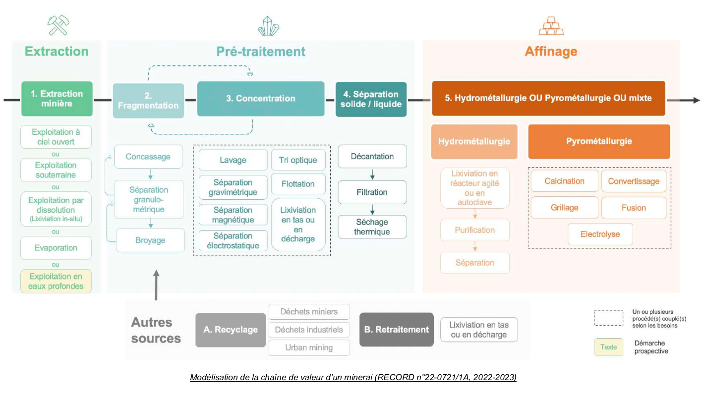
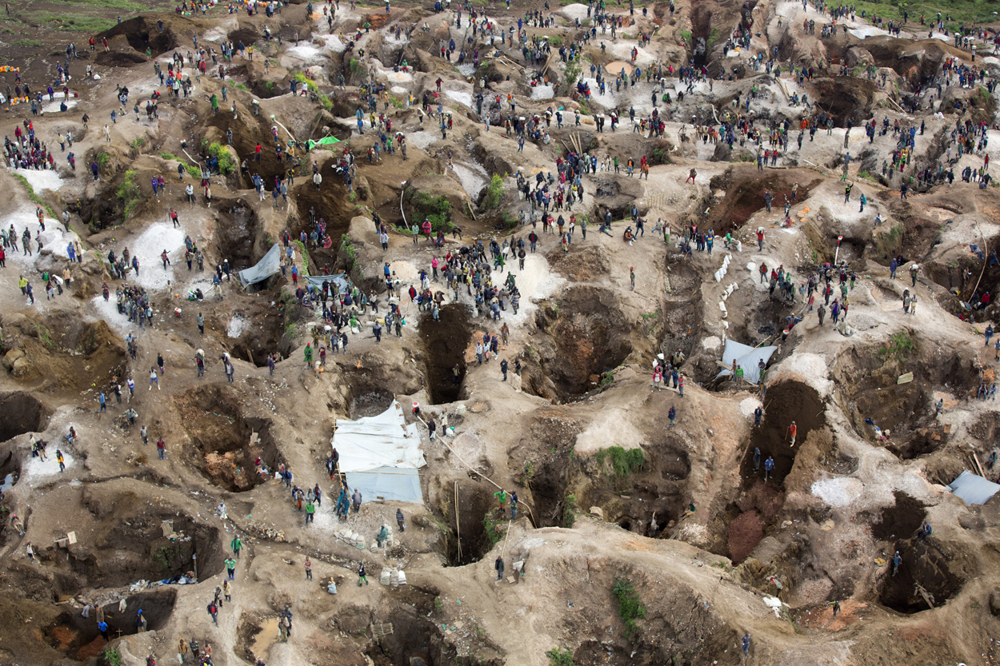
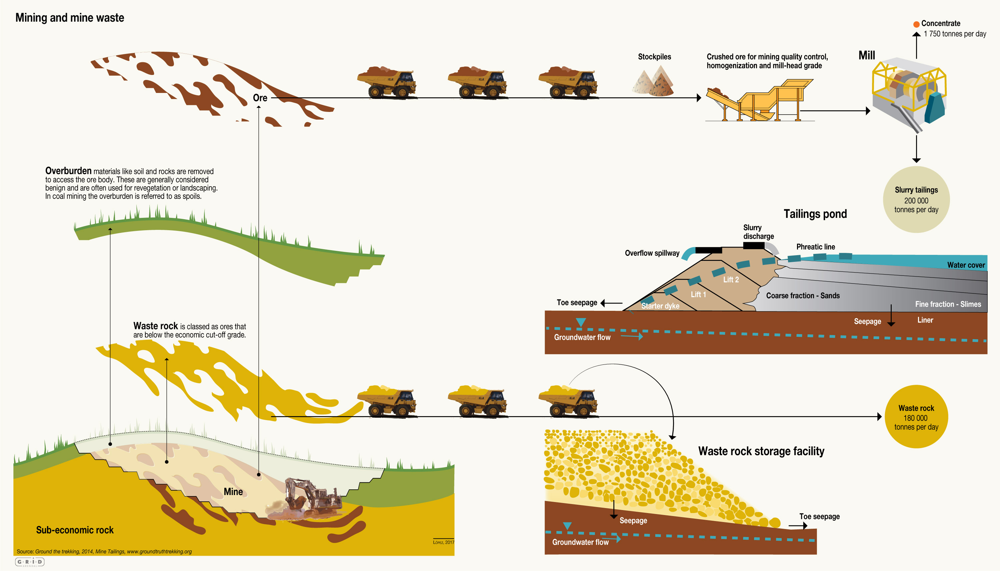
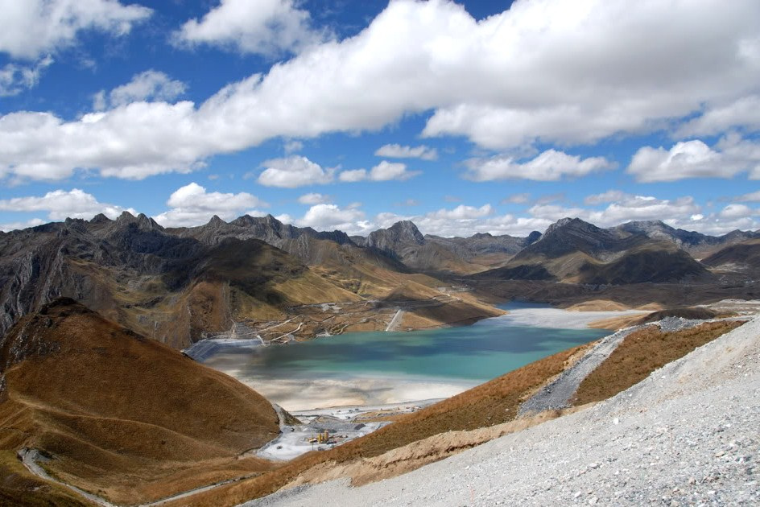
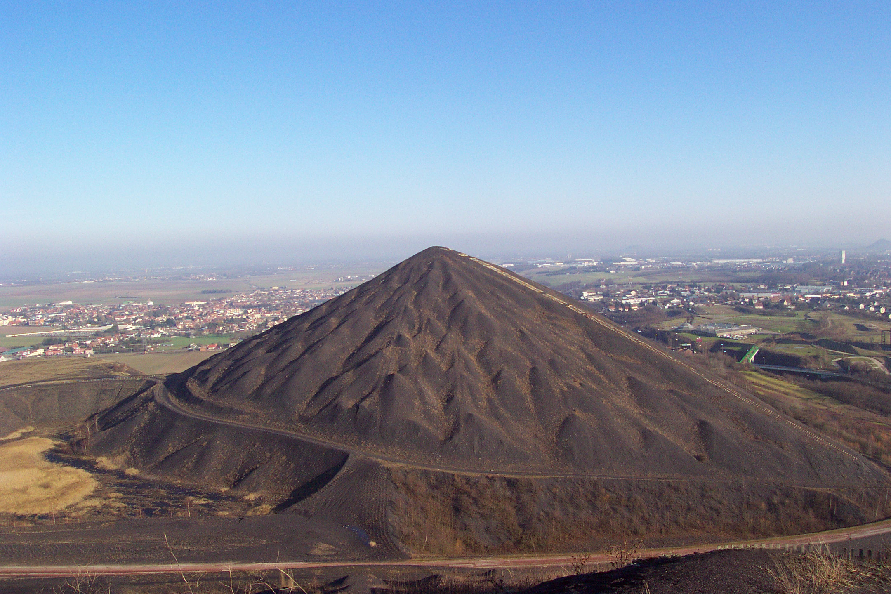

# 🚧 Le processus de production des métaux

!!! Warning
    Attention, cette fiche est en cours de rédaction

La production des métaux est un processus complexe et mondialisé, depuis les mines jusqu'aux usines de raffinage.

## Les grandes étapes de la production des métaux

On peut décomposer le processus de production des métaux en trois grandes étapes :

* l'**extraction du minerai** dans la mine
* le **pré-traitement**, ou **minéralurgie**, qui a souvent lieu à proximité de la mine
* l'**affinage**, ou **métallurgie**, qui peut avoir lieu loin de la mine 

Nous allons détailler ces étapes dans la suite.
<figure markdown="span">
    
</figure>

## I - L'extraction minière

### Qu'est-ce qu'une mine ?

En France, le **code minier** définit la distinction entre mines et carrières. On parle de mine lorsque le matériau extrait est considéré comme stratégique, et sinon, de carrière.

!!! Source "Précisions et source"

    > _Les "mines" sont les exploitations, sous-terre ou à ciel ouvert, de gisements définis par une liste figurant dans le code minier (sel, minerais métalliques, gaz et énergies fossiles...). Tout autre activité terrestre d'extraction de minéraux est une "carrière". \[...\] D’une manière générale, les substances de mines se distinguent par une relative rareté à l’échelle nationale et une importance économique accrue, voire stratégique, qui justifie que leur gestion soit confiée à l’État et non laissée à la libre disposition du propriétaire du sol. Toutes les autres substances relèvent de la classe des carrières et sont laissées à la libre disposition du propriétaire du sol._

    Source : [Les mines en France. Mineral info](https://www.mineralinfo.fr/fr/ressources-minerales-france-gestion/mines-france)

Même s'il existe de nombreuses mines **souterraines**, la majorité des mines actuelles sont exploitées à **ciel ouvert** (57% des mines du monde et 88% de la production).

!!! Source "Source"
    > _L'exploitation minière à ciel ouvert est la méthode la plus couramment utilisée dans le monde pour l'extraction des minéraux : 57% des mines du monde sont exploitées à ciel ouvert en nombre, et 88% en production._

    Page 48 du rapport [Étude des risques environnementaux, socio-sociétaux et juridiques des approvisionnements en minerais stratégiques pour les transitions énergétique et numérique. Record. Septembre 2023](https://record-net.org/media/etudes/253/public/rapport/rapport-record22-0721-1a.pdf)

Les mines se présentent ainsi sous des apparences très variées 

!!! Source "Précisions et source"
    Cette photo montre la mine de cuivre de Roșia Poieni en Roumanie.  
    Source : [page wikipedia de "Mine de Roșia Poieni"](https://fr.wikipedia.org/wiki/Mine_de_Ro%C8%99ia_Poieni)

!!! Source "Précisions et source"
    Cette photo montre une mine de coltan près de Rubaya dans le Nord-Kivu en République Démocratique du Congo.  
    Source : [page wikipedia de "Coltan"](https://fr.wikipedia.org/wiki/Coltan)

!!! Tip ""
    [36] Mine de lithium, États-Unis

!!! Source "Précisions et source"
    Cette photo montre la mine de lithium de Silver Peak dans le Nevada aux États-Unis.  
    Source : [Mine de lithium de pic d’argent. Référence de la photo :1392927082 @simonkr. istockphoto](https://www.istockphoto.com/fr/photo/mine-de-lithium-de-pic-dargent-gm1392927082-449013842)

### Fonctionnement d'une mine

<figure markdown="span">

</figure>

Source :  https://www.grida.no/resources/11415

### Stériles, minerai, résidus

* minerai = notion économique

Un **minerai** est une roche qu’on extrait pour obtenir, après plusieurs étapes de traitement, des métaux ou d’autres minéraux utiles. Il peut parfois se présenter sous forme de solution, comme dans le cas des mines de lithium.

On appelle **stériles miniers** les roches qu’il faut extraire pour accéder au minerai. On appelle **résidus miniers** les déchets (solides ou liquides) produits lors du traitement du minerai.

<figure markdown="span">

</figure>

Un **terril** est une colline artificielle formée par l'accumulation de stériles ou de résidus issus de l’exploitation d'une mine.

Pour stocker les résidus miniers, on crée des lacs artificiels en construisant des barrages ou des digues.

!!! Source "Précisions et source"

    Cette photo montre le lac de résidus miniers de la mine de cuivre et zinc d'Antamina au Pérou.  
    Source : [page wikipedia de "Barrage d'Antamina"](https://fr.wikipedia.org/wiki/Barrage_d%27Antamina)

* Grande diversité des conditions d'extraction (et donc des impacts environnementaux associés)

## II - Le pré-traitement minéralurgique

Une fois le minerai extrait, il est concassé, broyé et trié pour isoler les minéraux recherchés. C'est une étape qui consomme beaucoup d'énergie et d'eau, et qui génère des résidus.

> _Lors du processus de fragmentation d’importantes quantités de poussières sont produites par le concassage et le broyage des minerais. \[...\] Les poussières peuvent se déplacer par voie éolienne, et l’envol de poussières, à partir d’un dépôt de résidus minier ou du minerai mis à nu dans une mine à ciel ouvert peut être à l’origine de la contamination des sols après dépôt et accumulation des poussières._

Page 82 du même [rapport](https://record-net.org/media/etudes/253/public/rapport/rapport-record22-0721-1a.pdf)
Une fois le minerai extrait, il est concassé, broyé et trié pour isoler les minéraux recherchés. C'est une étape qui consomme beaucoup d'énergie et d'eau, et qui génère des résidus.

Cette phase de traitement a souvent lieu à proximité du site d'extraction, mais ça n'est pas toujours le cas, cf la bauxite.

!!! Tip ""
    [10] Les résidus miniers contiennent des produits chimiques dangereux utilisés pendant le traitement du minerai. On utilise par exemple du cyanure pour le traitement de l'or.

!!! Source "Précisions et sources"

    La lixiviation est une des méthodes classiques de concentration de minerai.

    >  *La lixiviation est un processus simple d’extraction par dissolution basé sur le fait que tous les minerais ont des coefficients de dissolution différents et peuvent donc se retrouver séparés par la circulation d’un solvant. Ce principe est mondialement utilisé pour extraire l’or (le solvant étant majoritairement le cyanure), mais d’autres métaux comme le cuivre et l’uranium peuvent être extraits ainsi.*  

    Source : rapport de MineralInfo [Exploitation minière et traitement des minerais](https://www.mineralinfo.fr/sites/default/files/documents/2021-01/tome_06_exploitation_miniere_et_traitement_des_minerais_final24032017_1.pdf) publié en février 2017
    

### Fragmentation
* concassage
* séparation granulométrique
* broyage = minerai réduit en poudre

L'extraction et les premières étapes de traitement du minerai (concassage et broyage) génèrent des poussières, sources de pollutions majeures des eaux et des sols.

Broyeur à boulet
https://www.youtube.com/watch?v=vSi75VTnBoA

### Concentration
Une fois réduit en poudre, le minerai subit différents traitements chimiques et physiques pour éliminer les impuretés jusqu'à obtenir le métal recherché.

* Flottation
* Lixiviation

Les résidus miniers contiennent des produits chimiques dangereux utilisés pendant le traitement du minerai. On utilise par exemple du cyanure pour le traitement de l'or.

!!! Focus "Focus sur la lixiviation"

    La **lixiviation** est une des méthodes classiques de concentration de minerai. 
    
    > _La lixiviation est un processus simple d’extraction par dissolution basé sur le fait que tous les minerais ont des coefficients de dissolution différents et peuvent donc se retrouver séparés par la circulation d’un solvant. Ce principe est mondialement utilisé pour extraire l’or (le solvant étant majoritairement le cyanure), mais d’autres métaux comme le cuivre et l’uranium peuvent être extraits ainsi._

    Source : rapport de MineralInfo [Exploitation minière et traitement des minerais](https://www.mineralinfo.fr/sites/default/files/documents/2021-01/tome_06_exploitation_miniere_et_traitement_des_minerais_final24032017_1.pdf) publié en février 2017

    https://wikimemoires.net/2019/12/la-lixiviation-techniques-de-separation-et-types/
    https://thierryregards.eu/2019/06/banro-lixiviation-cyanure-mines-extraction-or-gold-kivu-twangiza-namoya/

### Séparation solide / liquide
* Décantation
* Filtration
* Séchage thermique

## III - L'affinage métallurgique
Production d'aluminium : 4 tonnes de bauxite pour 1 tonne d'aluminium
https://www.youtube.com/watch?v=eGdXxFjqFsg
NB : Parfois le minerai lui-même a un nom (pas seulement "minerai de fer"), cf bauxite = minerai qu'on extrait pour produire l'aluminium et le gallium, coltan = minerai pour le tantale

"La <b>bauxite</b> est le principal minerai qui permet de produire l’<b>aluminium</b> et le <b>gallium</b>.\n\nLes trois plus gros pays producteurs sont l'<b>Australie</b>, la <b>Chine</b> et la <b>Guinée</b>.",Pour info,"empty",59
"Le <b>coltan</b> est un minerai qui permet de produire le tantale.\n\nLa <b>République Démocratique du Congo</b>, premier producteur de coltan, est sujet à des conflits armés.",Pour info,"empty",60

Une fois réduit en poudre, le minerai subit différents traitements chimiques et physiques pour éliminer les impuretés jusqu'à obtenir le métal recherché.

## Sources de référence

* Le rapport RECORD
* Rock-to-Metal Ratio: A Foundational Metric for Understanding Mine Wastes
* Mineralinfo
* Le rapport de l'UNEP

