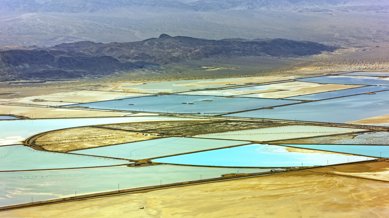
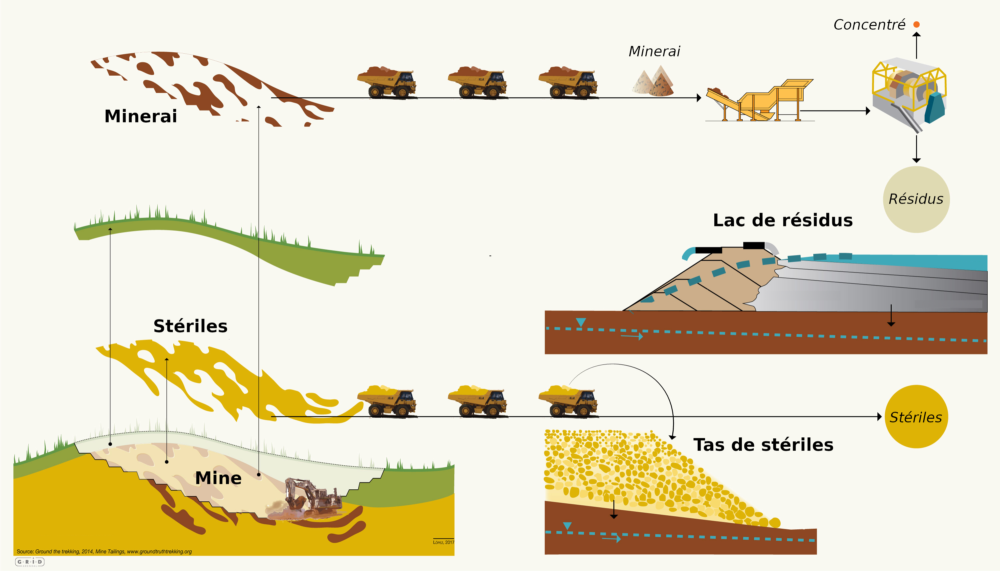

# 🚧 Le processus de production des métaux

!!! Warning
    Attention, cette fiche est en cours de rédaction

La production des métaux est un processus complexe et mondialisé, depuis les mines jusqu'aux usines de raffinage. Dans la suite, nous allons détailler les principales étapes de ce processus.
## I - Qu'est-ce qu'une mine ?

En France, c'est le **code minier** qui définit la distinction entre mines et carrières. On parle de mine lorsque les substances extraites "*se distinguent par une relative rareté à l’échelle nationale et une importance économique accrue, voire stratégique, qui justifie que leur gestion soit confiée à l’État et non laissée à la libre disposition du propriétaire du sol*." [^3]

Même s'il existe de nombreuses mines **souterraines**, la majorité des mines actuelles sont exploitées à **ciel ouvert** (57% des mines du monde et 88% de la production)[^1]. Les mines se présentent ainsi sous des apparences très variées, comme on peut le voir sur les photos ci-dessous.

!!! Source ""
	<figure  markdown="span"> 
	*Cette photo montre la mine de cuivre de Roșia Poieni en Roumanie, qui est une mine à ciel ouvert.  
    Source : [page wikipedia de "Mine de Roșia Poieni"](https://fr.wikipedia.org/wiki/Mine_de_Ro%C8%99ia_Poieni)*
    </figure>

!!! Source ""
	<figure  markdown="span"> 
	*Cette photo montre une mine de coltan près de Rubaya dans le Nord-Kivu en République Démocratique du Congo.
	Il s'agit d'une mine souterraine. Source : [page wikipedia de "Coltan"](https://fr.wikipedia.org/wiki/Coltan)*
	</figure>

!!! Tip ""
	<figure  markdown="span"> 
    Cette photo montre la mine de lithium de Silver Peak dans le Nevada aux États-Unis.  
    Source : [Mine de lithium de pic d’argent. Référence de la photo :1392927082 @simonkr. istockphoto](https://www.istockphoto.com/fr/photo/mine-de-lithium-de-pic-dargent-gm1392927082-449013842)

## II - Comment fonctionne une mine ?

L'infographie ci-dessous, que nous allons détailler par la suite, illustre le processus global de fonctionnement d'une mine à ciel ouvert.

!!! Source ""
	<figure  markdown="span"> 
	*Le principe de fonctionnement d'une mine à ciel ouvert, depuis l'extraction jusqu'au stockage des déchets miniers. 
	La partie gauche de l'infographie montre la distinction entre minerai et stériles.  
	La partie en bas à droite montre un terril, et la partie en haut à droite décrit le pré-traitement minéralurgique du minerai. 
    Source : https://www.grida.no/resources/11415*
    </figure>
    
### Extraction du minerai

La première étape du processus vise à récupérer ce qu'on appelle le **minerai**, c'est-à-dire la roche[^2] qu’on va ensuite traiter en vue d'obtenir des métaux ou d’autres minéraux utiles. La distinction entre minerai, qu'on va traiter, et roche **stérile**, qu'on ne cherchera pas à exploiter, se fait sur la base de critères économiques : en deçà d'une certaine concentration en métal de la roche, il n'est plus rentable de la traiter. Les stériles sont extraits uniquement pour accéder au minerai, puis stockés, souvent sous forme de collines artificielles appelées **terrils**.

!!! Source ""
	<figure  markdown="span"> 
	*Un terril est une colline artificielle formée par l'accumulation de stériles issus de l’exploitation d'une mine  
    Source : https://fr.wikipedia.org/wiki/Terril#/media/Fichier:Terril_Loos-en-Gohelle_2006-01-14.jpg*
    </figure>

### Minéralurgie

Une fois le minerai extrait, il est concassé, broyé et trié pour isoler les minéraux recherchés. 
Ainsi réduit en poudre, le minerai subit différents traitements chimiques et physiques pour éliminer les impuretés jusqu'à obtenir un **concentré** riche en métal.

!!! Focus "Focus sur la lixiviation"

    La **lixiviation** est une des méthodes classiques de concentration de minerai. 
    
    > _La lixiviation est un processus simple d’extraction par dissolution basé sur le fait que tous les minerais ont des coefficients de dissolution différents et peuvent donc se retrouver séparés par la circulation d’un solvant. Ce principe est mondialement utilisé pour extraire l’or (le solvant étant majoritairement le cyanure), mais d’autres métaux comme le cuivre et l’uranium peuvent être extraits ainsi._

    Source : rapport de MineralInfo [Exploitation minière et traitement des minerais](https://www.mineralinfo.fr/sites/default/files/documents/2021-01/tome_06_exploitation_miniere_et_traitement_des_minerais_final24032017_1.pdf) publié en février 2017

On appelle **résidus miniers** les déchets (solides ou liquides) produits lors du traitement du minerai. Pour stocker les résidus miniers liquides, on crée des lacs artificiels en construisant des barrages ou des digues. 

!!! Source ""
	<figure markdown="span">
	 
	*Cette photo montre le lac de résidus miniers de la mine de cuivre et zinc d'Antamina au Pérou.  
	La mine d’Antamina, située à 4 300 m d’altitude est exploitée, à ciel ouvert, depuis 2001.  
    Source : [page wikipedia de "Barrage d'Antamina"](https://fr.wikipedia.org/wiki/Barrage_d%27Antamina)*
	</figure>

## III - L'affinage métallurgique
La phase de pré-traitement minéralurgique a lieu à proximité du site d'extraction. 

## Schéma récapitulatif

Le schéma ci-dessous récapitule les différentes étapes de la production d'un métal, depuis l'extraction minière jusqu'au raffinage.
	
!!! Source ""
	<figure markdown="span">
    
	</figure>

!!! Source "Sources de référence"
	* Le rapport RECORD
	* Rock-to-Metal Ratio: A Foundational Metric for Understanding Mine Wastes
	* Mineralinfo
	* Le rapport de l'UNEP

[^1]: Source : page 48 du rapport [Étude des risques environnementaux, socio-sociétaux et juridiques des approvisionnements en minerais stratégiques pour les transitions énergétique et numérique. Record. Septembre 2023](https://record-net.org/media/etudes/253/public/rapport/rapport-record22-0721-1a.pdf)

[^2]: À noter que le minerai peut parfois se présenter sous forme de solution et non de roche, comme dans le cas de certaines mines de lithium.

[^3]: Source : [Les mines en France. Mineral info](https://www.mineralinfo.fr/fr/ressources-minerales-france-gestion/mines-france)
