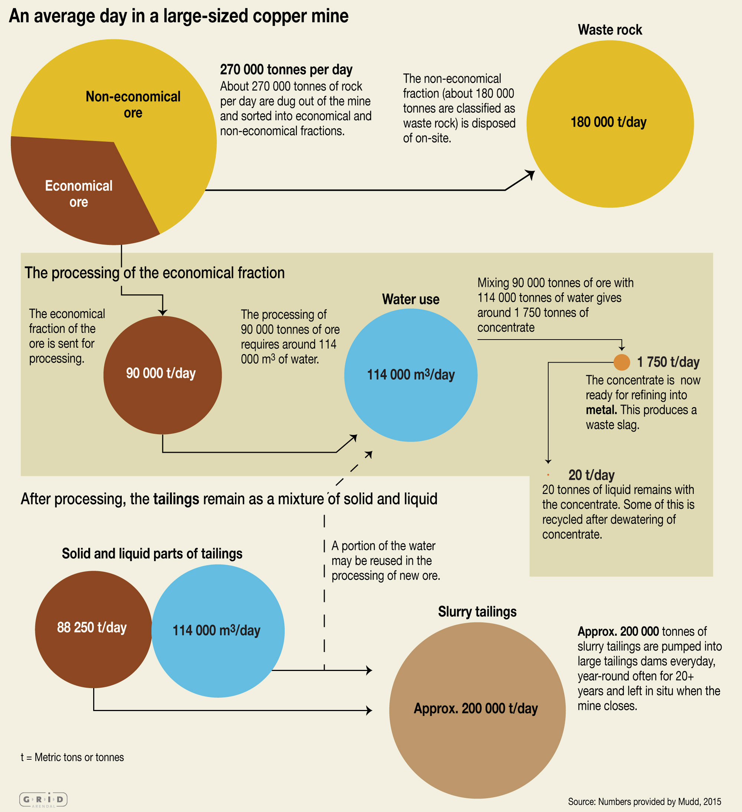
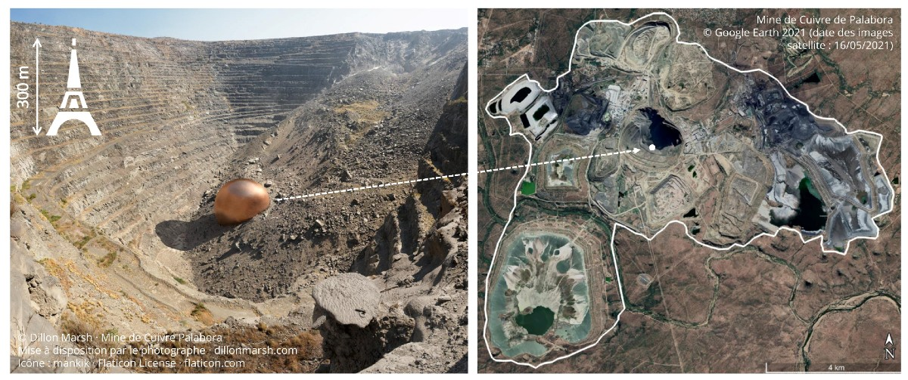
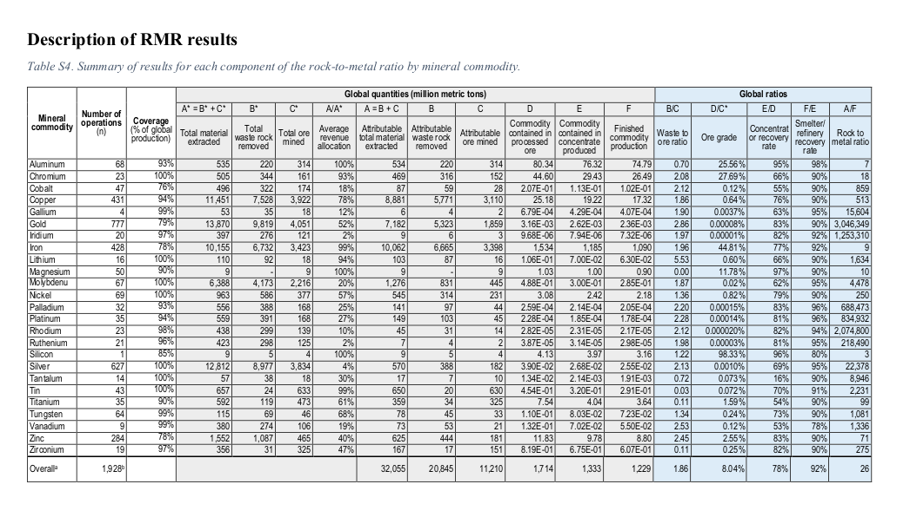

# 🚧 Précisions sur l'extraction minière

!!! Warning
    Attention, cette fiche est en cours de rédaction

## Quelques ordres de grandeur pour une mine de cuivre

Une grande mine de cuivre produit en moyenne 1.750 tonnes de concentré de cuivre en une journée, d'une teneur de 20 à 30% en cuivre, pour environ 200.000 tonnes de résidus miniers comprenant 114.000 m³ d'eau. D'où la nécessité de créer des lacs artificiels pour stocker ces résidus. 

<figure markdown="span">

</figure>

Source : Figure 5 du rapport de l'UNEP [_Mine tailings storage: Safety is no accident_](https://www.grida.no/publications/383)

<figure markdown="span">

</figure>

 
## Toutes les mines ne se ressemblent pas
La **teneur** en métal d’un minerai est la proportion de métal contenue dans ce minerai. Par exemple, la teneur en cuivre d'un minerai est en moyenne autour de 0,6% (6g de cuivre pour 1kg de minerai).

La teneur moyenne varie beaucoup entre les différents métaux : environ 45% pour le fer (45g de fer pour 100g de minerai) mais seulement 0,00008% pour l'or (8g d'or pour 10 tonnes de minerai) !

On lit par exemple dans la table S1 des _Supplementary materials_ du même papier que 2% de la production de cuivre est obtenue dans des mines qui exploitent principalement du zinc, et 4% de la production de zinc dans des mines qui exploitent principalement du cuivre.

Source : [L'élémentarium (Société chimique de France, Education nationale)](https://lelementarium.fr/element-fiche/cuivre/)

Il faut extraire en moyenne 3 tonnes de roche pour produire 1 g d'or.

Source du ratio _"rock-to-metal"_ de l'or

La quantité moyenne de roche à extraire pour produire un gramme de métal s'appelle en anglais le _"rock to metal ratio"_. Ce ratio est indiqué à la table S4 (colonne "_Rock to metal_") du papier "Rock-to-Metal Ratio: A Foundational Metric for Understanding Mine Wastes" [1](http://localhost:8000/serious-game/smartphone/Ressources/Sources/Sources_events.html#fn:rock). Le ratio pour l'or (_gold_) est en moyenne de 1 gramme d'or produit pour 3.046.349 grammes, soit 3,6 tonnes, de roche extraite.

Source de la teneur moyenne en cuivre

La teneur en métal des différents minerais est indiquée à la table S4 (colonne "_Ore grade_") du papier "Rock-to-Metal Ratio: A Foundational Metric for Understanding Mine Wastes" [1](http://localhost:8000/serious-game/smartphone/Ressources/Sources/Sources_malus.html#fn:rock). La teneur en cuivre (_copper_) d'un minerai est en moyenne de 0,64%.

!!! Source "Précisions et source"
    
    La teneur en métal des différents minerais est indiquée à la table S4 (colonne "_Ore grade_") du papier [*Rock-to-Metal Ratio: A Foundational Metric for Understanding Mine Wastes*, NT Nassar, 2022](https://pubs.acs.org/doi/10.1021/acs.est.1c07875). La teneur en fer (_iron_) d'un minerai est en moyenne de 44,81%, celle en or (_gold_) est de 0,00008%.
    

## Co-produits, sous-produits

On exploite souvent plusieurs métaux dans une mine. Il existe par exemple de nombreuses mines produisant à la fois du cuivre et du zinc.
>  * *La mine d’Antamina, située à 4 300 m d’altitude est exploitée, à ciel ouvert, depuis 2001. En 2023, la production a été de 421 926 t de cuivre, 464 000 t de zinc, 360,5 t d’argent et, en 2022, 3 260 t de plomb, 3 130 t de molybdène.* 

Précisions et source

La Figure 2 du papier [_Article By-product metals are technologically essential but have problematic supply_](http://localhost:8000/serious-game/smartphone/Ressources/Sources/10.1126/sciadv.1400180), reproduite pour le malus \[TODO\], montre un certain nombre d'associations de métaux qui sont produits conjointement, les uns étant des sous-produits des autres.

> _Le gallium ne forme pas de gisements économiquement exploitables à l’état naturel, et provient en grande majorité de la filière de production d’aluminium (sous-produit du raffinage de la bauxite en alumine)._

Source : [Gallium (Ga). Mineral info](https://www.mineralinfo.fr/fr/substance/gallium-ga)

Dans le cas général, on trouve une liste des métaux du système périodique qui sont principalement obtenus comme des sous-produits dans la Figure 1 du papier [_Article By-product metals are technologically essential but have problematic supply_, NT Nassar, 2015](https://www.science.org/doi/10.1126/sciadv.1400180). Parmi ces métaux on trouve un grand nombre de métaux présents dans les smartphones, comme le cobalt, le germanium, le zirconium, l'indium, les terres rares…

Précisions
* De nombreux métaux du numérique sont des **sous-produits**, c'est-à-dire qu'ils sont récupérés lors du traitement d'autres métaux. Par exemple, le gallium est un sous-produit de l'aluminium.

Les déchets miniers (stériles et résidus) contiennent souvent des métaux lourds naturellement présents dans la mine et qui sont dangereux pour la santé et l'environnement : plomb, mercure, arsenic...

 : Une fois le minerai extrait, il est concassé, broyé et trié pour isoler les minéraux recherchés. Il subit ensuite, différents traitements chimiques et physiques pour éliminer les impuretés jusqu'à obtenir le métal recherché
Certains métaux lourds sont souvent naturellement associés à d'autres métaux (voir les malus [37] et [49] pour des exemples). Si ces métaux lourds ne sont pas eux-mêmes exploités, alors ils se retrouvent dans les déchets miniers.    

!!! Tip ""
    [37] Les mines d’or contiennent souvent naturellement du mercure et de l’arsenic, dangereux pour la santé et l'environnement.

!!! Source "Précisions et sources"
  
    > *Du mercure est souvent présent dans les gisements de zinc, plomb, cuivre, argent et or.* 

    Source : [L'élémentarium (Société chimique de France, Education nationale)](https://lelementarium.fr/element-fiche/mercure/)

    > *On distingue l’or libre, inclus ou non dans d’autres minéraux, de l’or associé à des sulfures de fer [...], de l’or associé à des sulfures d’arsenic [...] ou d’antimoine [...].* 

    Source : [L'élémentarium (Société chimique de France, Education nationale)](https://lelementarium.fr/element-fiche/or/)

    Le mercure et l'arsenic font partie des métaux lourds, cf malus [9].

    > *Toxiques pour tous les êtres vivants sous leur forme oxydée, ils n’ont aucun rôle bénéfique et s’accumulent dans les chaînes alimentaires (bioaccumulation).* 

     Source : [Métaux lourds : cadmium, mercure et plomb. Commissariat général au développement durable. Juillet 2019](https://www.notre-environnement.gouv.fr/themes/sante/les-produits-chimiques-ressources/article/metaux-lourds-cadmium-mercure-et-plomb)
   
    Pour les dangers que représentent le mercure et l'arsenic pour la santé, voir les fiches détaillées de l'OMS :
    
    * [Fiche sur le mercure](https://www.who.int/fr/news-room/fact-sheets/detail/mercury-and-health)
    * [Fiche sur l'arsenic](https://www.who.int/fr/news-room/fact-sheets/detail/arsenic)

!!! Tip ""
    [49] Les mines de zinc contiennent souvent naturellement du mercure, de l’arsenic et du plomb, dangereux pour la santé et l'environnement.

!!! Source "Précisions et sources"

    > *Du mercure est souvent présent dans les gisements de zinc, plomb, cuivre, argent et or.* 
    
     Source : [L'élémentarium (Société chimique de France, Education nationale)](https://lelementarium.fr/element-fiche/mercure/)

    > *Dans les minerais, le zinc est très souvent associé à Pb [plomb] et Cd [cadmium] ainsi qu’à Fe [fer], Cu [cuivre], Bi [bismuth], Sb [antimoine], As [arsenic], Ge [germanium], In [indium], Ag [argent], Au [or]...*
    
     Source : [L'élémentarium (Société chimique de France, Education nationale)](https://lelementarium.fr/element-fiche/zinc/)

!!! Tip ""
    [48] On exploite souvent plusieurs métaux dans une mine. Il existe par exemple de nombreuses mines produisant à la fois du cuivre et du zinc.

!!! Source "Précisions et source"

    La Figure 2 du papier [*Article By-product metals are technologically essential but have problematic supply*](10.1126/sciadv.1400180), reproduite pour le malus [TODO], montre un certain nombre d'associations de métaux qui sont produits conjointement, les uns étant des sous-produits des autres. 
    
    On lit par exemple dans la table S1 des *Supplementary materials* du même papier que 2% de la production de cuivre est obtenue dans des mines qui exploitent principalement du zinc, et 4% de la production de zinc dans des mines qui exploitent principalement du cuivre.
    
    Par ailleurs, parmi les principales mines de cuivre et de zinc mentionnées sur le site web [l'Élémentarium](https://lelementarium.fr), on en trouve plusieurs qui produisent à la fois du cuivre et du zinc :
    
    >  * *La mine d’Antamina, située à 4 300 m d’altitude est exploitée, à ciel ouvert, depuis 2001. En 2023, la production a été de 421 926 t de cuivre, 464 000 t de zinc, 360,5 t d’argent et, en 2022, 3 260 t de plomb, 3 130 t de molybdène.* 
    > * *La mine souterraine de Neves Corvo, au Portugal, a commencé à être exploitée en 1990 pour le cuivre et 2006 pour le zinc. La production, en 2023, a été de 33 823 t de cuivre, 108 212 t de zinc, et, en 2021, 4 890 t de plomb et 29,9 t d’argent.* 
    >  * *[First Quantum exploite en Turquie] la mine de Çayeli, avec 11 036 t de cuivre et 3 597 t de zinc.* 
    
    On y lit également :
     >  *La production de cuivre [de l'entreprise Glencore] a donné, en 2023, une co-production de 156 600 t de zinc, 38 800 t de cobalt, 292 t d’argent et 4,29 t d’or. Par ailleurs, la production de zinc a donné une coproduction de 106 500 t de cuivre.* 

    Source : [L'élémentarium (Société chimique de France, Education nationale)](https://lelementarium.fr/element-fiche/cuivre/)

Les mines d’or contiennent souvent naturellement du mercure et de l’arsenic, dangereux pour la santé et l'environnement.

> _Du mercure est souvent présent dans les gisements de zinc, plomb, cuivre, argent et or._

Source : [L'élémentarium (Société chimique de France, Education nationale)](https://lelementarium.fr/element-fiche/mercure/)

> _On distingue l’or libre, inclus ou non dans d’autres minéraux, de l’or associé à des sulfures de fer \[...\], de l’or associé à des sulfures d’arsenic \[...\] ou d’antimoine \[...\]._

Source : [L'élémentarium (Société chimique de France, Education nationale)](https://lelementarium.fr/element-fiche/or/)

Les mines de zinc contiennent souvent naturellement du mercure, de l’arsenic et du plomb, dangereux pour la santé et l'environnement.

> _Dans les minerais, le zinc est très souvent associé à Pb \[plomb\] et Cd \[cadmium\] ainsi qu’à Fe \[fer\], Cu \[cuivre\], Bi \[bismuth\], Sb \[antimoine\], As \[arsenic\], Ge \[germanium\], In \[indium\], Ag \[argent\], Au \[or\]..._

Source : [L'élémentarium (Société chimique de France, Education nationale)](https://lelementarium.fr/element-fiche/zinc/)

"On exploite souvent plusieurs métaux dans une mine (ex. cuivre et zinc). Si tous ont une valeur économique similaire, on parle de <b>co-produits</b>.",Définition,"empty"

## Grande diversité des conditions d'extraction

* consommation d'eau à cause du pompage pour maintenir les galeries à sec (et donc problème pour évacuer cette eau)

!!! Source "Précisions et sources"
    Pour plus de précisions, voir la figure 5 du rapport de l'UNEP [*Mine tailings storage: Safety is no accident*](    https://www.grida.no/publications/383)

> _Une mine à ciel ouvert générera de grandes quantités de poussière contenant des métaux lourds. Tout d’abord, lors du forage et du dynamitage, se forment des nuages de poussière contenant des gaz et particules en suspensions et pouvant affecter la santé des populations locales. Ensuite, l'exploitation à ciel ouvert nécessite de nombreux transports quotidiens des minerais, la plupart du temps par camions, pour acheminer le minerai vers des zones de transformation. Les trajets génèrent des poussières \[...\]._

Pages 71-72 du rapport [Étude des risques environnementaux, socio-sociétaux et juridiques des approvisionnements en minerais stratégiques pour les transitions énergétique et numérique](https://record-net.org/media/etudes/253/public/rapport/rapport-record22-0721-1a.pdf) publié en septembre 2023.

## Sources de référence

* Le rapport RECORD
* Rock-to-Metal Ratio: A Foundational Metric for Understanding Mine Wastes
* Mineralinfo
* Le rapport de l'UNEP

