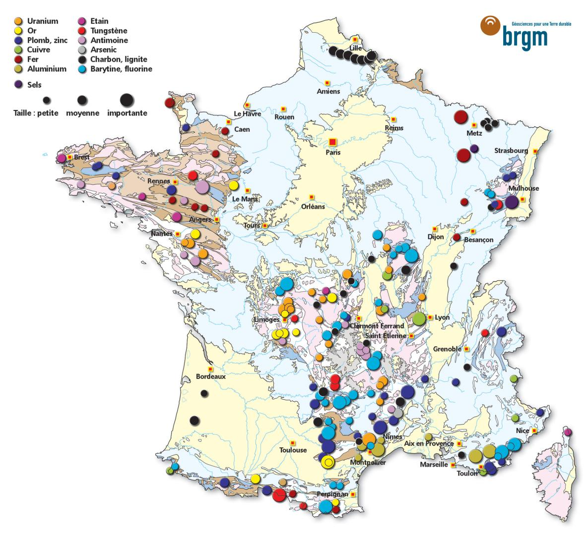
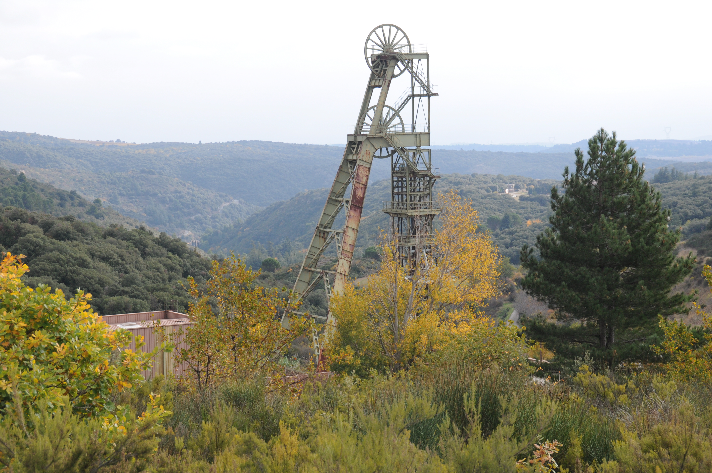
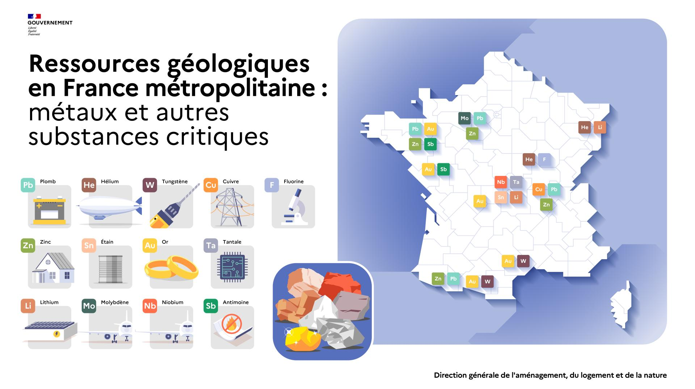

!!! Warning ""
    Dernière mise à jour : 14 janvier 2026

# Focus sur la France

## I - Des mines encore en activité
Il y a encore des **mines en activité** en France[^1] : on exploite de l'or en Guyane, du nickel en Nouvelle-Calédonie (6% de la production mondiale en 2023[^2]) et de la bauxite (le minerai qui sert à produire l'aluminium et le gallium) vers Montpellier.

## II - Un riche passé minier et des pollutions de long terme

La France a par ailleurs un riche **passé minier**, ayant occupé "*une place significative dans la production mondiale de tungstène (3e producteur européen jusqu’en 1986, avec les mines de Salau et du district d’Échassières), l’antimoine (1er producteur mondial au début du XXe siècle avec les mines de La Lucette et du district de Brioude-Massiac), et l’or (avec un gisement de classe mondiale, celui de Salsigne).[^3]*" 

!!! Source ""
	<figure markdown="span">
	
	*Carte des anciennes principales mines ayant été exploitées en France* 
	*Source : [Mineralinfo, le portail français des ressources minérales non énergétiques](https://www.mineralinfo.fr/fr/ressources-minerales-france-gestion/exploitation-miniere-france)*
	</figure>

Aujourd'hui, la très grande majorité des sites miniers ne sont plus exploités. En 2020, un rapport d'une commission d'enquête du sénat sur les pollutions des sols qui ont accueilli des activités industrielles ou minières[^4] notait ainsi : "*La France compte aujourd'hui 1 850 sites miniers, parmi lesquels seulement 225 font toujours l'objet d'un titre d'exploitation valide*". Or la plupart des anciens sites n'ont pas été dépollués lors de leur fermeture[^5]. 

Certains causent aujourd'hui encore des pollutions majeures, comme à Salsigne, près de Carcassonne. Le site de cette ancienne mine d'or et d'arsenic était considéré en 2003 comme l’un des plus pollués de France par le ministère de l’écologie et du développement durable[^6]. Les niveaux de pollution des sols et des rivières sont tels qu'il a entre autres été interdit de vendre des légumes produits dans la région[^7].

!!! Source ""
	<figure markdown="span">
	 
	*Chevalement du puits Castan sur le site de l'ancienne mine de Salsigne* 
	*Par Raoul RIVES — Travail personnel, CC BY-SA 4.0, https://commons.wikimedia.org/w/index.php?curid=36996453*
	</figure>

Dépolluer des anciens sites miniers est extrêmement long, difficile et coûteux, voire impossible. À propos de l'ancienne mine de Salsigne, un rapport du ministère de l'aménagement du territoire et de l'environnement indique ainsi en 1998 :

> *Compte tenu de la quantité de déchets à traiter, de la surface du site et s'agissant de la pollution laissée par trois quarts de siècles d'activité industrielle, il n'est pas réaliste d'envisager de traiter tous les déchets comme on le ferait pour les déchets produits au jour le jour par une industrie actuellement en activité. [...] Actuellement il ne nous paraît pas possible de supprimer toute pollution des sols.*[^8]

## III - Un potentiel minier source de controverses

Dans un contexte d'explosion de la demande pour le développement des énergies renouvelables, le Bureau de recherches géologiques et minières (BRGM), qui est le service géologique national français, a effectué entre 2013 et 2015 des travaux de réévaluation du **potentiel français en ressources minérales**. 

!!! Source ""
	<figure markdown="span">
	 
	*https://www.mineralinfo.fr/fr/ressources-minerales-france-gestion/potentiel-du-sous-sol-francais-exploration*
	</figure>

L'ouverture d'une mine de lithium est ainsi prévue dans les années à venir dans le Massif central (à Beauvoir dans l'Allier)[^9], qui sera l'une des plus grandes d'Europe. Un projet qui "*divise et inquiète une partie de la population qui craint des effets sur la pollution des sols et sur l’accès en eau potable, déjà en tension ces dernières années sous l’effet du dérèglement climatique et des sécheresses.*"[^10]

Plusieurs projets d'exploration minière sont actuellement en cours ou en attente d'autorisation en France, pour exploiter or, lithium, étain[^11]...

!!! Source "Sources de référence"
	* USGS
	* Mineralinfo
	* https://www.world-mining-data.info/?World_Mining_Data___PDF-Files

[^1]: On trouve la liste des mines exploitées en France aujourd'hui sur le site de [Mineralinfo, le portail français des ressources minérales non énergétiques](https://www.mineralinfo.fr/fr/ressources-minerales-france-gestion/mines-france). 

[^2]: Le chiffre de 6% est calculé à partir des données de la page 123 du rapport [Mineral commodity summaries 2024](https://www.usgs.gov/publications/mineral-commodity-summaries-2024) de l'USGS (U.S. Geological Survey).

[^3]: Source : https://www.mineralinfo.fr/fr/ressources-minerales-france-gestion/exploitation-miniere-france

[^4]: Rapport de commission d'enquête du sénat ["Pollutions industrielles et minières des sols : assumer ses responsabilités, réparer les erreurs du passé et penser durablement l'avenir Tome I"](https://www.senat.fr/rap/r19-700-1/r19-700-114.html#toc638). Septembre 2020

[^5]: "*Si le code minier a progressivement soumis les exploitations à des obligations de remise en état et de surveillance au moment de la cessation d'activité, les nombreux anciens sites miniers, désormais orphelins, n'ont pour la plupart pas fait l'objet d'une telle réhabilitation.*"  *Ibid.*

[^6]: "*L’extraction de l’or produisant des déchets à forte composante en arsenic, le site est aujourd’hui, selon le ministère de l’écologie et du développement durable, l’un des plus pollués de France.* " Extrait d'un [rapport de la cour des Comptes de 2003](https://www.ccomptes.fr/sites/default/files/EzPublish/Salsigne.pdf)  (page 361). On trouve également des informations très détaillées dans une présentation de l'association France Nature Environnement sur la situation en 2021. Source : [La gestion du passif minier - Tirer les leçons des erreurs du passé. Association France Nature Environnement. Janvier 2021](https://fne-ocmed.fr/wp-content/uploads/2021/02/presentation_Oge_salsigne.pdf)  

[^7]: *"Le niveau de 50 mg d'arsenic par litre est largement dépassé dans le Grésillou à son confluent avec l'Orbiel à Lastours et ce même niveau est souvent dépassé à Conques, ce niveau est dépassé dans un puits communal à Conques. Il a été constaté que certains légumes cultivés sur des sols inondables en bordure de l'Orbiel ou arrosés avec de l'eau venant de l'Orbiel, ou de puits proches de l'Orbiel et de ses affluent qui coulent près du site de Salsigne, contenaient des teneurs anormales en métaux et arsenic. Un arrêté interministériel du 30 mai 1997 a interdit la mise sur le marché des légumes feuilles (salades, etc.) concernés pour une durée de un an."* 
	
	Source : [Le Site de Salsigne (Aude) : rapport à Mme la ministre de l'aménagement du territoire et de l'environnement et à M. le secrétaire d'Etat à l'industrie](https://www.vie-publique.fr/rapport/26411-le-site-de-salsigne-aude-rapport-mme-la-ministre-de-lamenagement). Janvier 1998 
	
[^8]: *Ibid.*

[^9]: Voir par exemple l'article "L'une des plus grandes mines européennes de lithium va ouvrir en France d'ici 2027".  Source : [L'une des plus grandes mines européennes de lithium va ouvrir en France d'ici 2027. France Inter. Octobre 2022](https://www.radiofrance.fr/franceinter/l-une-des-plus-grandes-mines-europeennes-de-lithium-va-ouvrir-en-france-d-ici-2027-3063449)

[^11]: "*Deux permis d'exploration sont en cours de validité dans le Massif central :*         
	 - *« PER Bonneval » : pour la recherche d'or, d'argent, d'antimoine et de substances connexes dans le Limousin et détenu par la société Cordier Mines ;*  
	- *« PER Beauvoir » : pour la recherche d'étain, de niobium de tantale, de tungstène, de béryllium et de lithium et détenu par la société Imerys Ceramics France*
	
	*Plusieurs demandes de permis d'exploration sont en cours d'instruction.*"	
	Source : [Le potentiel du sous-sol français. Mineral info](https://www.mineralinfo.fr/fr/ressources-minerales-france-gestion/potentiel-du-sous-sol-francais)

[^10]: Source Le Monde https://www.lemonde.fr/economie/article/2024/03/18/dans-l-allier-la-future-mine-de-lithium-enflamme-le-debat_6222650_3234.html 
