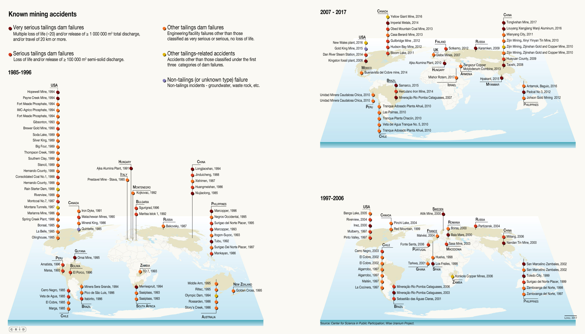

# 🚧 Les conséquences environnementales et sociales de l'industrie minière

!!! Warning
    Attention, cette fiche est en cours de rédaction
    
Pollutions, catastrophes, tensions voire conflits… L'extraction minière est  source de nombreux impacts environnementaux et sociaux négatifs.
    
## L'extraction minière, une activité à risque

Certains métaux lourds sont souvent naturellement associés à d'autres métaux : plomb, mercure, arsenic... Si ces métaux lourds ne sont pas eux-mêmes exploités, alors ils se retrouvent dans les déchets miniers.    

!!! Source "Précisions et sources"
  
    > *Du mercure est souvent présent dans les gisements de zinc, plomb, cuivre, argent et or.* 

    Source : [L'élémentarium (Société chimique de France, Education nationale)](https://lelementarium.fr/element-fiche/mercure/)

    > *On distingue l’or libre, inclus ou non dans d’autres minéraux, de l’or associé à des sulfures de fer [...], de l’or associé à des sulfures d’arsenic [...] ou d’antimoine [...].* 

    Source : [L'élémentarium (Société chimique de France, Education nationale)](https://lelementarium.fr/element-fiche/or/)

    Le mercure et l'arsenic font partie des métaux lourds, cf malus [9].

    > *Toxiques pour tous les êtres vivants sous leur forme oxydée, ils n’ont aucun rôle bénéfique et s’accumulent dans les chaînes alimentaires (bioaccumulation).* 

     Source : [Métaux lourds : cadmium, mercure et plomb. Commissariat général au développement durable. Juillet 2019](https://www.notre-environnement.gouv.fr/themes/sante/les-produits-chimiques-ressources/article/metaux-lourds-cadmium-mercure-et-plomb)
   
      > *Dans les minerais, le zinc est très souvent associé à Pb [plomb] et Cd [cadmium] ainsi qu’à Fe [fer], Cu [cuivre], Bi [bismuth], Sb [antimoine], As [arsenic], Ge [germanium], In [indium], Ag [argent], Au [or]...*
    
     Source : [L'élémentarium (Société chimique de France, Education nationale)](https://lelementarium.fr/element-fiche/zinc/)

D'autre part, des produits chimiques dangereux sont fréquemment utilisés pendant le traitement du minerai. On utilise par exemple du cyanure pour le traitement de l'or.

!!! Source "Précisions et sources"

    La lixiviation est une des méthodes classiques de concentration de minerai.

    >  *La lixiviation est un processus simple d’extraction par dissolution basé sur le fait que tous les minerais ont des coefficients de dissolution différents et peuvent donc se retrouver séparés par la circulation d’un solvant. Ce principe est mondialement utilisé pour extraire l’or (le solvant étant majoritairement le cyanure), mais d’autres métaux comme le cuivre et l’uranium peuvent être extraits ainsi.*  

    Source : rapport de MineralInfo [Exploitation minière et traitement des minerais](https://www.mineralinfo.fr/sites/default/files/documents/2021-01/tome_06_exploitation_miniere_et_traitement_des_minerais_final24032017_1.pdf) publié en février 2017

Les terres rares, à ne pas confondre avec les métaux rares, ne le sont pas tant du fait de leur rareté mais parce qu’elles sont difficiles à extraire. Leur extraction génère des déchets radioactifs.

## L'extraction minière, une activité gourmande en ressources

Eau, énergie et emprise au sol

On estime qu’environ 10 % de l’énergie primaire mondiale est consacrée à extraire, transporter et raffiner les ressources métalliques (tous secteurs confondus).

Les conflits d'usage

## Pollutions

Pollutions de l'air (particules fines, pluies acides...), de l'eau, des sols, avec des conséquences sur l'environnement et la santé des populations.

### Poussières 

!!! Tip ""
    [11] L'extraction et les premières étapes de traitement du minerai (concassage et broyage) génèrent des poussières, sources de pollutions majeures des eaux et des sols.

!!! Source "Précisions et sources"

    > *Une mine à ciel ouvert générera de grandes quantités de poussière contenant des métaux lourds. Tout d’abord, lors du forage et du dynamitage, se forment des nuages de poussière contenant des gaz et particules en suspensions et pouvant affecter la santé des populations locales. Ensuite, l'exploitation à ciel ouvert nécessite de nombreux transports quotidiens des minerais, la plupart du temps par camions, pour acheminer le minerai vers des zones de transformation. Les trajets génèrent des poussières [...].*

    Pages 71-72 du rapport [Étude des risques environnementaux, socio-sociétaux et juridiques des approvisionnements en minerais stratégiques pour les transitions énergétique et numérique](https://record-net.org/media/etudes/253/public/rapport/rapport-record22-0721-1a.pdf) publié en septembre 2023.
    
    > *Lors du processus de fragmentation d’importantes quantités de poussières sont produites par le concassage et le broyage des minerais. [...] Les poussières peuvent se déplacer par voie éolienne, et l’envol de poussières, à partir d’un dépôt de résidus minier ou du minerai mis à nu dans une mine à ciel ouvert peut être à l’origine de la contamination des sols après dépôt et accumulation des poussières.*
    
    Page 82 du même [rapport](https://record-net.org/media/etudes/253/public/rapport/rapport-record22-0721-1a.pdf)

Il est intéressant de noter la difficulté à réduire les poussières tout en maîtrisant la consommation d'eau des sites miniers, comme illustré par le discours commercial de cette entreprise spécialisée dans la fabrication de polymères hydrosolubles :

> _L’eau est nécessaire pour la suppression des poussières sur les routes de transport et les équipements de concassage et de transport. De grandes quantités d’eau sont utilisées quotidiennement, ce qui représente une perte nette puisque cette eau s’évapore. Les résidus sont une source majeure d’émissions de poussières, qui pourraient avoir un impact sur la santé des communautés voisines en raison de l’impact de poussières non contrôlées dans l’environnement._

Source : [Lutte Contre la Poussière. SNF](https://www.snf.com/l-industrie/mines/depoussierage/?lang=fr)

* Aznalcollar / Espagne / 1998

Terres rares : extraction polluante

https://infoterre.brgm.fr/rapports/RR-39503-FR.pdf

https://www.notre-environnement.gouv.fr/themes/sante/les-produits-chimiques-ressources/article/metaux-lourds-cadmium-mercure-et-plomb#Des-metaux-toxiques-aux-usages-multiples

* biodiversité
* fuite de lacs de résidus miniers

    > *« Trois phases principales sont sujettes aux émissions de poussières lors de l’exploitation et du traitement du minerai : foration et abattage du minerai [...] ; comminution (concassage et broyage) ; stockage de stériles et de résidus de traitement de minerai. »*
    
    https://www.mineralinfo.fr/sites/default/files/documents/2021-01/tome_06_exploitation_miniere_et_traitement_des_minerais_final24032017_1.pdf 
    
    Il est précisé dans le rapport que de nombreuses solutions d'abattage existent.
 
Emprise au sol : https://www.nature.com/articles/s43247-023-00805-6
Global mining footprint mapped from high-resolution satellite imagery
 https://felt.com/map/Global-mining-footprint-FhngephpTdWu9ChFO4rwIQA?loc=0.13,138.66,3.29z

https://www.pa.gov/agencies/dep/programs-and-services/mining/abandoned-mine-reclamation/operation-scarlift-and-mine-reclamation-in-pennsylvania.html

https://www.snf.com/l-industrie/mines/depoussierage/?lang=fr

https://www.lemonde.fr/planete/article/2022/06/10/a-espinar-au-perou-la-mine-de-cuivre-suscite-colere-et-amertume_6129696_3244.html

https://en.wikipedia.org/wiki/Collahuasi_mine
Cerro Colorado mine Chile
https://fr.wikipedia.org/wiki/Mine_d%27Escondida

https://www.bbc.com/future/article/20150402-the-worst-place-on-earth

https://roulezelectrique.com/impacts-de-lextraction-et-du-raffinage-du-lithium-sur-lenvironnement-1-les-methodes-traditionnelles/

### Le drainage minier acide

Les déchets miniers (stériles et résidus) contiennent souvent du soufre, qui réagit chimiquement à l’air et à l’eau. La solution acide produite draine en s'écoulant d'autres polluants (plomb, arsenic...) présents dans les résidus, causant de graves pollutions des eaux.

Ce phénomène s'appelle le drainage minier acide (DMA).

> *En France, la majorité des exploitations de métaux de base (Cu, Pb, Zn), d'antimoine et d'or sont associées à des paragenèses sulfurées et des minéraux du groupe des sulfo-arséniures (arsénopyrite) et sulfo-antimoniures. [...] L'oxydation naturelle des minéraux sulfurés tels que la pyrite, la pyrrhotite, etc., exposés à l'air et à l'eau peut entraîner la production d'effluents suffisamment acidifiés et chargés d'ions métalliques pour poser de sérieux problèmes dans un milieu aquatique récepteur. Ce phénomène est plus souvent appelé **Drainage Minier Acide** (DMA), et constitue le problème environnemental le plus important pour les mines exploitant ce type de minerais.* 
    
    Pages 45-46 du rapport [Les résidus miniers français : typologie et principaux impacts environnementaux potentiels](http://infoterre.brgm.fr/rapports/RR-39503-FR.pdf) publié en juin 1997.
 
    > *Le Drainage Minier Acide ou DMA (AMD en anglais) est un des défis environnementaux majeurs de l’industrie minière. [...] Les réactions chimiques principales qui donnent lieu à un DMA sont l'oxydation du fer, du soufre et surtout de la pyrite, le minéral sulfuré le plus commun. Sous l’action de l’eau et de l’oxygène, les sulfures peuvent alors se transformer en acide sulfurique et attaquer les roches, diminuant drastiquement le pH (pH < 3,5 comparé à un pH neutre égal à 7) et faisant passer en solution des éléments traces métalliques (métaux lourds notamment). La particularité de cette réaction est d’être auto-catalysée, ce qui permet au phénomène de production de DMA de se propager de façon similaire à un incendie [...]. L’écoulement de ce DMA vers le réseau superficiel ou souterrain est une cause fréquente de pollution dans les anciennes zones minières.* 

    Pages 45-46 du rapport [Exploitation minière et traitement des minerais](https://www.mineralinfo.fr/sites/default/files/documents/2021-01/tome_06_exploitation_miniere_et_traitement_des_minerais_final24032017_1.pdf) publié en février 2017.
  
Acid Mine Drainage (AMD): causes, treatment and case studies
https://www.sciencedirect.com/science/article/abs/pii/S0959652605000600?via=ihub

## Catastrophes minières

Les <b>ruptures de digues</b> sont une des causes de catastrophes environnementales liées aux mines.

La figure ci-dessous liste les accidents miniers connus depuis 1985 causés par des ruptures de digues ou de barrages miniers.

Figure 7 du rapport de l'UNEP [*Mine tailings storage: Safety is no accident*](https://www.grida.no/publications/383)

Le contenu de ces cartes vient principalement des deux sources suivantes :

* La base de données ARIA (Analyse, Recherche et Information sur les Accidents) du Bureau d’Analyse des Risques et Pollutions Industriels (BARPI) qui est chargé, au sein du ministère de la Transition écologique / Direction générale de la prévention des risques de rassembler, d’analyser et de diffuser les informations et le retour d’expérience en matière d’accidents industriels et technologiques.
    
    Source : [https://www.aria.developpement-durable.gouv.fr](https://www.aria.developpement-durable.gouv.fr)

* Le rapport du Programme des Nations Unies pour l'Environnement (UNEP) intitulé [*Mine tailings storage: safety is no accident*](https://www.grida.no/publications/383) publié en 2017.

<b>Brésil, 2015</b> : Rupture d'un barrage de résidus d'une mine de fer près du village de Bento Rodrigues à proximité de la ville de Mariana au Brésil, le 5 novembre 2015, qualifiée par le gouvernement de <i>plus grande catastrophe environnementale de ce pays</i> ». La pollution s'étend durablement jusqu'à l'océan Atlantique à 650 km.

!!! Source "Précisions et sources"
    Il s'agit de la rupture du barrage de résidus miniers 
       
       > *Le gouvernement, qui qualifie cet événement de plus grande catastrophe environnementale de ce pays », suspend l’autorisation d’exploitation.* 
      
      Source : [Rupture de 2 barrages de stériles miniers. ARIA. Novembre 2015](https://www.aria.developpement-durable.gouv.fr/accident/47369/)  
       
       > *Downstream and close to the river mouth, when the river level rises after the rainy season, turbidity increases and metal levels in the water column return to the same level as in November 2015.*  
       
      Source : [Pages 17-19 du rapport *Safety is no accident* de l'UNEP. Novembre 2017](https://www.grida.no/publications/383)

!!! Compléments "Complément"
    Il existe un documentaire sur cette catastrophe disponible que le site du Guardian : [The Safest Place in the World review – the true cost of a lethal Brazilian dam collapse](https://www.theguardian.com/film/2023/dec/04/the-safest-place-in-the-world-review-the-true-cost-of-a-lethal-brazilian-dam-collapse)

!!! Tip ""
    [15] <b>Roumanie, 2000</b>. Rupture de digue près d'une usine de traitement des stériles. Les polluants (dont 115 tonnes de cyanure) détruisent la quasi-totalité de la faune et de la flore d'une rivière sur près de 600 km.

!!! Source "Précisions et source"
    Il s'agit de la rupture d'une digue près d'une usine de traitement des stériles à Baia Mare en Roumanie, le 30 janvier 2000.
    
    > *Si les causes exactes de mortalité piscicole ne sont pas clairement établies (cyanure ou javel ?), il est toutefois avéré que les polluants ont détruit la quasi-totalité de la faune et de la flore de la TISZA sur près de [^1]600 km en impactant toute la chaîne alimentaire.*
    
     Source : [Pollution au cyanure en Europe de l’Est. ARIA. Janvier 2000](https://www.aria.developpement-durable.gouv.fr/fiche_detaillee/17265/)  

!!! Tip ""
    [16] <b>Canada, 2014</b>. Rupture de barrage près d'une mine de cuivre et d'or. Des résidus miniers, contenant entre autres des centaines de tonnes de plomb, se déversent dans deux lacs en aval.

!!! Source "Précisions et source"
    Il s'agit de la rupture d'un barrage près de la mine de cuivre et d'or de Mount Polley au Canada, le 4 août 2014.
       
       > *Une digue d’un bassin de stockage d’effluents miniers d’une mine de cuivre et d’or se rompt. Le contenu (10 millions de mètres cubes d’eau, 13,8 de résidus miniers et 0,6 d’éléments composant la structure du bassin) se déverse dans le ruisseau Hazeltine et les lacs Polley et Quesnel en aval. Le bassin contient du cuivre, du nickel, de l’arsenic, du plomb, du sélénium et du cadmium.[...] En 2013, le bassin en cause avait reçu 326 t de nickel, 177 t de plomb et 18 400 t de cuivre et ses composés.* 

     Source : [Effondrement d’un bassin d’effluents miniers. ARIA. Aout 2014](https://www.aria.developpement-durable.gouv.fr/accident/45566/)  

!!! Compléments "Complément"
    On trouve des informations supplémentaires dans le [rapport *Safety is no accident* de l'UNEP (pages 22-23)](https://www.grida.no/publications/383).  

!!! Tip ""
     [39] <b>Brésil, 2019</b>. Rupture d'un barrage de résidus d’une mine de fer, causant 243 morts, 27 disparus et des centaines de blessés. L'exploitant versera près de 6 milliards d’euros de dommages.

!!! Source "Précisions et source"
    Il s'agit de la rupture d'un barrage de résidus d’une mine de fer près de Brumadinho au Brésil, le 25 janvier 2019.

       > *Selon les bilans de mai 2019, il est déploré 243 morts, 27 disparus et des centaines de blessés. [...] En février 2021, l’exploitant annonce un accord avec les autorités régionales brésiliennes sur le versement de près de 6 milliards d’euros de dommages “sociaux et environnementaux”.*  

     Source : [Rupture d’un barrage minier. ARIA. Janvier 2019](https://www.aria.developpement-durable.gouv.fr/accident/53027/)  
           
!!! Compléments "Compléments"
    Des images de la rupture du barrage existent. – [Rupture d’un barrage minier. ARIA. Janvier 2019](https://www.aria.developpement-durable.gouv.fr/accident/53027/)

!!! Tip ""
    [40] <b>Hongrie, 2010</b>. Rupture de digue près d'une usine d'aluminium. Une boue rouge inonde plusieurs villages, causant 10 morts et 286 blessés. Il s'agit de la pire catastrophe industrielle qu’ait connue la Hongrie.

!!! Source "Précisions et sources"
    Il s'agit de la rupture d'une digue près d'une usine d'aluminium à proximité de la ville d'Ajka en Hongrie, le 4 octobre 2010.
    
       > *10 personnes sont tuées et 286 blessées (brûlures chimiques et irritations oculaires) dont 121 hospitalisées.*   
        Source : [Rupture d’un bassin de boue rouge d’aluminium. ARIA. Octobre 2010](https://www.aria.developpement-durable.gouv.fr/fiche_detaillee/39047/)
           
       > *Cet accident est la plus grave catastrophe industrielle qu’ait connue la Hongrie.*  
        Source : [Rejet massif de boue rouge d'aluminium après rupture d'un bassin de stockage. ARIA. Octobre 2010](https://www.aria.developpement-durable.gouv.fr/wp-content/files_mf/A39047_ips39047_003.pdf)
           

!!! Compléments "Complément"
    Un reportage de France 2 sur la catastrophe est visible sur le site de la base ARIA : [Rupture d’un barrage minier. Janvier 2019](https://www.aria.developpement-durable.gouv.fr/accident/53027/)

Les **ruptures de digues** sont une des causes de catastrophes environnementales liées aux mines.

* Mine de plomb et zinc à Băile Borșa / Roumanie / 2000 / Rupture de digue / Pollution au zinc, plomb et cuivre /

NB : compléments catastrophes : http://www.csp2.org/tsf-failures-from-1915

!!! Tip ""
    [6] Rupture de digue, Brésil 2019

!!! Source "Précisions et source"
    Cette photo a été prise suite à la rupture du barrage de Brumadinho au Brésil le 25 janvier 2019, voir malus [40].  
    Source : [page wikipedia de "Rupture du barrage de Brumadinho"](https://fr.wikipedia.org/wiki/Rupture_du_barrage_de_Brumadinho)

https://www.grida.no/resources/11421

Rupture du barrage de Brumadinho : le danger est venu après l’arrêt de l’exploitation
https://www.myscience.ch/fr/news/2024/dammbruch_von_brumadinho_die_gefahr_kam_nach_der_stilllegung-2024-ethz

https://www.theguardian.com/world/2024/oct/13/bhp-to-face-620000-claimants-in-mariana-dam-collapse-trial-in-london
BHP to face 620,000 claimants in Mariana dam collapse trial in London
Claimants seeking damages from Anglo-Australian mining company over 2015 environmental disaster in Brazil

https://www.theguardian.com/business/2024/oct/25/victims-of-brazils-worst-environmental-disaster-to-pursue-claim-in-uk-despite-settlement

## L'après mine

!!! Tip ""
    [13] Dépolluer des anciens sites miniers est extrêmement long, difficile et coûteux, voire impossible.

!!! Source "Précisions et sources"

    À propos de l'ancienne mine d'or et d'arsenic de Salsigne, près de Carcassonne, un rapport du Ministère de l'Aménagement du territoire et de l'Environnement indique en 1998 :  
    > *Compte tenu de la quantité de déchets à traiter, de la surface du site et s'agissant de la pollution laissée par trois quarts de siècles d'activité industrielle, il n'est pas réaliste d'envisager de traiter tous les déchets comme on le ferait pour les déchets produits au jour le jour par une industrie actuellement en activité. [...] Actuellement il ne nous paraît pas possible de supprimer toute pollution des sols.* 
    
    Source : [Le Site de Salsigne (Aude) : rapport à Mme la ministre de l'aménagement du territoire et de l'environnement et à M. le secrétaire d'Etat à l'industrie. Remis le 1er janvier 1998](https://www.vie-publique.fr/rapport/26411-le-site-de-salsigne-aude-rapport-mme-la-ministre-de-lamenagement)

!!! Compléments "Complément"

    Le rapport [Exploitation minière et traitement des minerais](https://www.mineralinfo.fr/sites/default/files/documents/2021-01/tome_06_exploitation_miniere_et_traitement_des_minerais_final24032017_1.pdf) détaille page 57 plusieurs méthodes de neutralisation des DMA issues de stériles ou de résidus miniers :
    
     > 1. *noyer les stocks de stériles et de résidus miniers sous une lame d’eau ou les déverser dans des lacs anoxiques et fermés (l’oxygène pénètre très difficilement dans l’eau).*
     > 2. *traiter passivement le site en :*  
           - *drainant et dérivant les eaux de ruissellement et en recouvrant les stocks de stériles et de résidus miniers d'une couverture imperméable naturelle, permettant une revégétalisation et donc une protection contre l'érosion : couches superposées d'argile et de terre, dépôts de tourbière (riches en matière organique et réducteurs) ;*  
           - *aménageant des zones humides artificielles. Elles utilisent les microbes aériens et aquatiques associés aux végétaux des zones humides pour éliminer les métaux dissous du drainage rocheux. [...] Il s'agit là d'une méthode de traitement relativement nouvelle dotée de nombreux mécanismes spécifiques et d'exigences d'entretien qui ne sont pas encore pleinement compris.*  
           - *créant un canal de calcaire ouvert ou un drain calcaire anoxique.* 

!!! Tip ""
    [24] Des centaines d'anciennes mines n'ont pas été dépolluées lors de leur fermeture. Certaines causent aujourd'hui encore des pollutions majeures.

!!! Source "Précisions et sources"

    > *Si le code minier a progressivement soumis les exploitations à des obligations de remise en état et de surveillance au moment de la cessation d'activité, les nombreux anciens sites miniers, désormais orphelins, n'ont pour la plupart pas fait l'objet d'une telle réhabilitation. La France compte aujourd'hui 1 850 sites miniers, parmi lesquels seulement 225 font toujours l'objet d'un titre d'exploitation valide.* 

    Source : Rapport de commission d'enquête du sénat ["Pollutions industrielles et minières des sols : assumer ses responsabilités, réparer les erreurs du passé et penser durablement l'avenir Tome I"](https://www.senat.fr/rap/r19-700-1/r19-700-114.html#toc638). Septembre 2020

    En ce qui concerne les pollutions majeures, voir le cas de l'ancienne mine de Salsigne, malus [45]. 
    

!!! Tip ""
    [44] Une ancienne mine d'or vers Carcassonne cause d'importants problèmes de pollution à l'arsenic. Il a entre autres été interdit de vendre des légumes produits dans la région.

!!! Source "Précisions et sources"
    À propos de l'ancienne mine d'or et d'arsenic de Salsigne, près de Carcassonne, un rapport du Ministère de l'Aménagement du territoire et de l'Environnement indique en 1998 :   
    
    > *Le niveau de 50 mg d'arsenic par litre est largement dépassé dans le Grésillou à son confluent avec l'Orbiel à Lastours et ce même niveau est souvent dépassé à Conques, ce niveau est dépassé dans un puits communal à Conques. Il a été constaté que certains légumes cultivés sur des sols inondables en bordure de l'Orbiel ou arrosés avec de l'eau venant de l'Orbiel, ou de puits proches de l'Orbiel et de ses affluent qui coulent près du site de Salsigne, contenaient des teneurs anormales en métaux et arsenic. Un arrêté interministériel du 30 mai 1997 a interdit la mise sur le marché des légumes feuilles (salades, etc.) concernés pour une durée de un an.* 
    
    Source : [Le Site de Salsigne (Aude) : rapport à Mme la ministre de l'aménagement du territoire et de l'environnement et à M. le secrétaire d'Etat à l'industrie](https://www.vie-publique.fr/rapport/26411-le-site-de-salsigne-aude-rapport-mme-la-ministre-de-lamenagement). Janvier 1998 

!!! Compléments "Complément"

    * Pour des précisions sur les recommandations sanitaires de l'Agence Régionale de Santé Occitanie en 2019, voir : [Recommandations sanitaires vallée de l’Orbiel- Mars 2019. A l’attention des communes de : VILLARDONNEL, SALSIGNE, VILLANIERE, LASTOURS, CONQUES/ORBIEL, VILLALIER et TREBES pour les parcelles ayant été inondées par l’Orbiel ou ses affluents. Agence régionale de santé occitanie](https://www.occitanie.ars.sante.fr/system/files/2019-06/2019_Recommandations%20sanitaires%20%C3%A0%20la%20population.pdf). 

    * Pour plus d'informations sur les conséquences sanitaires sur la population de la mine, voir : [Salsigne. Quand la mine dort, la pollution veille. La dépêche. Janvier 2025](https://www.ladepeche.fr/article/2013/03/21/1587889-salsigne-quand-la-mine-dort-la-pollution-veille.html)  
        On y lit entre autres :
        
        > *Chaque année la montagne rejette dans la rivière Orbiel 3 650 kg d'arsenic. [...] Mille ans seront nécessaires pour faire table rase des scories.*
    
    * On trouve également des informations très détaillées dans une présentation de l'association France Nature Environnement sur la situation en 2021 
    
        Source : [La gestion du passif minier - Tirer les leçons des erreurs du passé. Association France Nature Environnement. Janvier 2021](https://fne-ocmed.fr/wp-content/uploads/2021/02/presentation_Oge_salsigne.pdf)  
        
        On y trouve entre autres cette citation d'un [rapport de la cour des Comptes de 2003](https://www.ccomptes.fr/sites/default/files/EzPublish/Salsigne.pdf)  (page 361):
        > *L’extraction de l’or produisant des déchets à forte composante en arsenic, le site est aujourd’hui, selon le ministère de l’écologie et du développement durable, l’un des plus pollués de France.*  

Gestion de l’après-mine par l’Union européenne et la France
BRGM/RP-52607-FR 3
Synthèse
l est généralement considéré, par la plupart des pays en Europe, qu’avant 1985, les
conséquences de la fermeture d’une mine sur son environnement n’étaient pas
vraiment prises en compte. Avec l’abandon des sites miniers par les exploitants, qui
n’a fait que s’accélérer depuis cette date pour des raisons économiques, les
dommages aux équipements et les impacts sur l’environnement, accompagnés par
une prise de conscience forte des populations touchées, se sont développés parfois de
façon spectaculaire. Devant la dimension des enjeux financiers et les problèmes de
responsabilité, les états ont été amenés à réagir rapidement, en adaptant à cette
nouvelle situation leur législation minière et environnementale.

http://infoterre.brgm.fr/rapports/RP-52607-FR.pdf

!!! Compléments "Complément"
    Pour aller plus loin, voir le dossier sur l'après-mine de Systext : https://www.systext.org/apres-mine

Environnement et restauration des sites miniers (Nouvelle-Calédonie)
https://hal.science/hal-03582006/document
La politique française de prévention des risques liés à l’après-mine
https://www.annales.org/edit/ri/2007/ri-novembre-2007/didier.pdf_

« L’extraction de l’or produisant des déchets à forte composante en arsenic, le site est
aujourd’hui, selon le ministère de l’écologie et du développement durable,
l’un des plus pollués de France. »

_Complément : L’Etat face aux enjeux industriels et environnementaux : l’exemple des mines d’or de Salsigne
https://www.ccomptes.fr/sites/default/files/EzPublish/Salsigne.pdf_

    https://www.lemonde.fr/planete/article/2024/05/11/dans-les-cevennes-l-heritage-empoisonne-de-l-apres-mine_6232556_3244.html

## Conséquences sur la santé des populations 

Le mercure, l'arsenic et le plomb font partie des métaux lourds.

> _Toxiques pour tous les êtres vivants sous leur forme oxydée, ils n’ont aucun rôle bénéfique et s’accumulent dans les chaînes alimentaires (bioaccumulation)._

Source : [Métaux lourds : cadmium, mercure et plomb. Commissariat général au développement durable. Juillet 2019](https://www.notre-environnement.gouv.fr/themes/sante/les-produits-chimiques-ressources/article/metaux-lourds-cadmium-mercure-et-plomb)

Pour les dangers que représentent le mercure, l'arsenic et le plomb pour la santé, voir les fiches détaillées de l'OMS :

* [Fiche sur le mercure](https://www.who.int/fr/news-room/fact-sheets/detail/mercury-and-health)
* [Fiche sur l'arsenic](https://www.who.int/fr/news-room/fact-sheets/detail/arsenic)
* [Fiche sur l'intoxication au plomb](https://www.who.int/fr/news-room/fact-sheets/detail/lead-poisoning-and-health)

## Conflits miniers

Des journaux de référence tels que le Guardian et le Monde publient régulièrement des enquêtes approfondies sur les conflits liés à l'industrie minière.

Il existe par ailleurs des bases de données qui recensent les conflits environnementaux liés aux mines, par exemple :  

* [Carte interactive *Mineral ore exploration and building materials extraction*. EJAtlas](https://ejatlas.org/category/mineral-ores-and-building-materials-extraction)   
* [Carte interactive *Conflictos Mineros en América Latina*. Observatorio de Conflictos Mineros de América Latina](https://mapa.conflictosmineros.net/) (pour l'Amérique latine)

!!! Tip ""
    [18] Étain, tantale, or et tungstène sont appelés <b>minerais de conflits</b>, ou <b>minerais de sang</b>, car leur exploitation est au coeur de conflits armés, comme en République Démocratique du Congo.

!!! Source "Précisions et source"
    > *Au sein des zones politiquement instables, le commerce de minerais tels que [l’étain, du tantale, du tungstène et de l’or] peut servir à financer des groupes armés, engendrer le travail forcé et d’autres atteintes aux droits de l’homme, et favoriser la corruption et le blanchiment d’argent. [...] Ces minerais du conflit sont ensuite utilisés pour la fabrication d’objets du quotidien, comme les téléphones portables, les voitures ou les bijoux.* 

    Source : [Règlement *Commerce responsable des minerais provenant de zones de conflit ou à haut risque*. site de l'Union européenne](https://eur-lex.europa.eu/FR/legal-content/summary/responsible-trade-in-minerals-from-high-risk-or-conflict-areas.html)

!!! Compléments "Complément"
    Un document du Service de recherche du Parlement européen rédigé en 2015 fournit des informations supplémentaires sur la proposition de règlement européen (qui a finalement été adoptée en 2017).  
    
    Source : [Briefing *Les minéraux des conflits-La proposition de règlement européen*. Parlement européen. Février 2015](https://www.europarl.europa.eu/RegData/etudes/BRIE/2015/548985/EPRS_BRI(2015)548985_REV1_FR.pdf)

!!! Tip ""
    [19] <b>Guatemala, depuis 2014</b>. Les populations locales luttent contre la réouverture d'une mine de nickel qu'ils accusent de pollutions et d'accaparement du territoire sur lequel elles vivent.
 
!!! Source "Précisions et source"
     La mine de nickel Fenix près d'El Estor, au Guatelama, a rouvert en 2014.  
     
     > *As the quarries expand, hundreds of families in the surrounding Mayan villages fear eviction, and the loss of the environment that sustains them.*
     
     > *Solway [the European-owned business that bought the mine in 2011]’s licence extends over a particularly sensitive region: 247 sq km of densely forested hills that are home to 20 settlements belonging to the Q’eqchi’ people. Some own their land, some are considered squatters. A number sit on, or near, rich nickel deposits. When the settlers of El Paraíso moved here, the mine, which dates to the 1970s, lay dormant. They struck a deal with the government’s land bank, Fondo de Tierras, put up their huts and planted corn. But their crops are now failing. First the plants were stunted; now Choc says they die as seedlings. Choc blames the dust.*
     
     Source : [The Guatemalans who pay the price for the west’s need for nickel. The Guardian. Juin 2019](https://www.theguardian.com/environment/2019/jun/19/guatemalans-pay-price-west-need-nickel)
     
     > *A El Estor, dans le sud-est du pays, Fenix, l’un des plus gros gisements de nickel d’Amérique centrale, est accusé de polluer les terres et les eaux alentour.* 
     
     > *Les habitants, en majorité des Mayas de langue kekchie, entretiennent un rapport sacré à cette terre et à cette immense étendue d’eau, aujourd’hui menacée par les rejets résultant de l’activité minière à ciel ouvert. D’aussi loin que remonte la mémoire collective, ils ont subi l’expansion brutale des multinationales minières.* 
     
     Source : [Mining Secrets » : nouvelles révélations sur les pratiques controversées d’un géant de l’industrie minière au Guatemala. Le Monde. 2022](https://www.lemonde.fr/international/article/2022/03/06/mining-secrets-nouvelles-revelations-sur-les-pratiques-controversees-d-un-geant-de-l-industrie-miniere-au-guatemala_6116375_3210.html)

!!! Compléments "Complément"
    On trouve des informations détaillées concernant le conflit autour de la mine Fenix sur le site web du collectif international de journalistes *Forbidden Stories* qui est à l'origine des articles de presse cités ci-dessus.  

    Source : [Scandales environnementaux : quand l'union fait la force. Mining Secrets](https://forbiddenstories.org/fr/projects_posts/fr-mining-secrets/)

!!! Tip ""
    [20] <b>Papouasie Nouvelle-Guinée, 1989</b>. Le conflit environnemental et social autour d'une mine de cuivre et d'or se transforme en une guerre civile qui fera environ 20.000 morts en 10 ans.
 
!!! Source "Précisions et source"
    La mine de cuivre et d'or de Panguna, en Papouasie Nouvelle-Guinée, a été au coeur d'un conflit environnemental qui s'est transformé en guerre civile. Entre 1989 et 2001, environ 20.000 personnes sont tuées.
    
    > *Panguna was once one of the world’s largest and most profitable copper and goldmines and still contains an estimated 5.3m tons of copper and 19.3m ounces of gold, which would make the reserves worth about $60bn at today’s prices. [...] In 1989, amid rising community anger at the environmental damage and the inequitable division of the mine’s profits, locals forced the mine closed, blowing up Panguna’s power lines and sabotaging operations. The PNG government sent in troops against its own citizens to restart the foreign-owned mine, sparking a bloody, decade-long civil war. [...] The civil war claimed the lives of about 20,000 people and amplified calls for Bougainvillean independence.*
    
    Source : [Panguna mine at centre of bloody Bougainville conflict set to reopen after 30 years. The guardian. Février 2022](https://www.theguardian.com/world/2022/feb/11/panguna-mine-at-centre-of-bloody-bougainville-conflict-set-to-reopen-after-30-years)

!!! Tip ""
    [21] Au Chili, au Pérou et en Argentine, les <b>besoins en eau</b> pour la production de cuivre ou de lithium entrent en conflit avec les besoins des populations locales. 

!!! Source "Précisions et source"
    
    Le site web hispanophone [Conflictos Mineros en América Latina](https://mapa.conflictosmineros.net/ocmal_db-v2/) liste 38 conflits miniers liés à l'eau au Chili, 24 au Pérou et 18 en Argentine.

!!! Compléments "Compléments"

    Le rapport de Mining Watch "[Mapping community resistance to the impacts and discourses of mining for the energy transition in the Americas](https://miningwatch.ca/node/10804)" publié en mars 2022 documente 25 exemples (listés pages 18-22), dont 2 au Pérou, 5 au Chili et 7 en Argentine, tous liés à l'extraction du cuivre ou du lithium. 
    
    On y lit par exemple :
    
    > *Lithium mining, especially in brine, requires an intensive extraction of water, which contains the sought-after minerals. Many consider this **water mining**. Studies carried out at the Atacama salt flat report that, “In order to produce a ton of lithium, 2 million liters of water are evaporated from the wells. That’s 2,000 tons of water that cannot be recirculated” and that, at this rate of extraction, the water will be difficult to recover. It is estimated that over 226 million liters of water are pumped daily in the whole of the water basin. By extracting brine, fresh water from the peripheral groundwater is displaced to fill up what was extracted. It then mixes with the salt water and becomes saline for good, damaging the freshwater sources of the water basin.*
    
       Pages 26-27 du rapport
    
    > *La Escondida mine in Chile is a landmark case. BHP Billiton owns the project and has provoked “continuous, permanent, cumulative and irreparable” damage to the underground aquifer of the Punta Negra Salt Flat. After 27 years extracting water from the salt flat for its copper mine (until 2017), “the levels of the salt flat aquifer diminished to such a point that the wetlands and all the vegetation surrounding it dried up. A large proportion of the fauna that inhabited it disappeared as it lost its habitat.*
    
    Page 31 du rapport

!!! Tip ""
    [38] L’industrie minière est la première cause dans le monde de <b>conflits environnementaux</b>. En 2019, 50 défenseurs de l'environnement ont été assassinés dans des conflits liés à l'industrie minière.

!!! Source "Précisions et source"  

    Voir la figure 1 du papier *Environmental conflicts and defenders: A global overview*, qui s'appuie sur [EJAtlas](https://ejatlas.org/), l'atlas global de la justice environnementale.  
   
       Source : [Arnim Scheidel, Daniela Del Bene, Juan Liu, Grettel Navas, Sara Mingorría, Federico Demaria, Sofía Avila, Brototi Roy, Irmak Ertör, Leah Temper, Joan Martínez-Alier. *Environmental conflicts and defenders: A global overview*. Global Environmental Change, Volume 63, 2020, 102104, ISSN 0959-3780.](https://doi.org/10.1016/j.gloenvcha.2020.102104)  
       
       > *Mining was still the most culpable industry – connected with the murders of 50 defenders in 2019.*  
       
       Source : Page 6 du [rapport 2020 de l'ONG Global Witness: Defending Tomorrow ](https://www.globalwitness.org/en/campaigns/environmental-activists/defending-tomorrow/)

- enjeu biodiversité, conflit, montagne d'or
- nickel sulfures vs latérites
- extraction illégale
- conditions de travail

!!! Tip ""
    [50] Une grande partie des exploitations minières se situent dans des pays en situation de <b>stress hydrique</b>, où les besoins en eau douce dépassent les ressources disponibles.

!!! Source "Précisions et source"
    > *Ainsi, d’après le Columbia Center on Sustainable Investment, environ 70 % des exploitations minières des six principales compagnies minières dans le monde sont localisées dans des pays où il existe un stress hydrique.*  

    Source : section 1.3.2 du rapport de France Stratégie publié en juin 2020 : [La consommation de métaux du numérique : un secteur loin d’être dématérialisé](https://www.strategie.gouv.fr/publications/consommation-de-metaux-numerique-un-secteur-loin-detre-dematerialise)  
     
    Notons que la référence originale pour ce chiffre n'est plus disponible en ligne. 
    
    Andrew Metcalf, “Water scarcity to raise capex and operating costs, heighten operation risks,” Report number 149714, Moody's Investor Service, Special Comment (February 2013).

The Impact of Metal Mining on Global Water Stress and Regional Carrying Capacities—A GIS-Based Water Impact Assessment
https://www.mdpi.com/2079-9276/10/12/120

- [18] [Peuple Ogoni (wikipedia)](https://fr.wikipedia.org/wiki/Ogoni_(peuple))

- [21] [“Afrique. Minerais de sang et néocolonialisme en République Démocratique du Congo (RDC). Le conflit au Kivu, zone grise en proie à de cruciales rivalités géoéconomiques” Par Melvil BOSSE. 2020. diploweb.com](https://www.diploweb.com/Afrique-Minerais-de-sang-et-neocolonialisme-en-Republique-Democratique-du-Congo-RDC.html)

- [23] [Espagne : réouverture d'une mine 16 ans après une grave pollution. Sciences et avenir. 2014](https://www.sciencesetavenir.fr/nature-environnement/espagne-reouverture-d-une-mine-16-ans-apres-une-grave-pollution_13486)

Conflits sur l'eau, territoire, pollution, richesses

Ogoni : sur le pétrole

* néocolonialisme / impérialisme

- 70% de l'eau au Chili sert à l'extraction

Mines et environnement dans les Amériques : les paradoxes de l’exploitation minière
https://journals.openedition.org/ideas/1639#tocto2n5

https://en.wikipedia.org/wiki/Collahuasi_mine
https://www.cdhal.org/une-methodologie-pour-solidifier-les-capacites-territoriales-contre-lextraction-miniere/

https://www.ocmal.org/ocmal/

https://researchblog.duke.edu/2023/10/02/lithium-riches-beneath-bolivias-salar-de-uyuni/
    
https://www.lesechos.fr/2012/07/argentine-catamarca-la-mine-de-la-colere-1094181

https://www.lemonde.fr/planete/article/2024/05/09/extraire-des-metaux-sans-detruire-la-planete-l-autre-immense-defi-de-la-lutte-contre-le-rechauffement-climatique_6232303_3244.html

EXHAUSTED:HOW WE CAN STOP LITHIUM MINING FROM DEPLETING
WATER RESOURCES, DRAINING WETLANDS, AND HARMING COMMUNITIES IN SOUTH AMERICA https://www.nrdc.org/sites/default/files/exhausted-lithium-mining-south-america-report.pdf

A GLOBAL MOVEMENT FOR ENVIRONMENTAL JUSTICE: The EJAtlas
https://cordis.europa.eu/project/id/695446
http://www.envjustice.org/project/

https://ejatlas.org/conflict/desecamiento-de-quillagua-por-chuquicamata-y-sqm-chile?translate=es

Pour approfondir la question, voir les articles suivants : 
    
    https://www.nationalgeographic.fr/environnement/2022/12/defenseurs-de-lenvironnement-vocation-a-haut-risque
    
    The supply chain of violence https://www.nature.com/articles/s41893-019-0349-4

https://www.theguardian.com/world/2025/jan/13/south-africa-launches-operation-at-gold-mine-amid-fears-many-dead

https://www.ocmal.org/wp-content/uploads/2019/05/informe-final.pdf

 L'encadré 4.4 intitulé "L’industrie minière au cœur de conflits liés à l’eau en Amérique latine" du [Rapport mondial des Nations Unies sur la mise en valeur des ressources en eau 2024: l'eau pour la prospérité et la paix](https://unesdoc.unesco.org/ark:/48223/pf0000388949) fournit quelques exemples :
          
    > *« Au Chili, de violentes manifestations ont éclaté, en 2011, en relation avec la distribution de l’eau, causant la mort de trois personnes et mettant un terme au projet d’exploitation du cuivre Tía María, d’un budget d’un milliard de dollars EU. »* 
    
    > *« Au Pérou, le projet de mine à ciel ouvert Minas Conga (consistant à agrandir la grande mine d’or Minera Yanacocha) allait avoir des répercussions sur les habitants de Cajamarca, qui dépendent de l’accès aux eaux souterraines des lacs alpins pour leurs activités agricoles. Sans compter que la pollution de l’eau découlant de la mine Minera Yanacocha suscitait déjà de vives inquiétudes. Après que le Gouvernement péruvien a approuvé l’évaluation d’impact environnemental de Minas Conga, la communauté s’est mobilisée sans relâche pour protester contre l’aggravation des atteintes à l’environnement, obligeant le Gouvernement a décrété l’état d’urgence. En 2012, une manifestation s’est soldée par vingt blessés et trois morts en raison de l’utilisation de gaz lacrymogènes et de tirs de balles. Le projet fut finalement abandonné en 2016 du fait des tensions et des troubles incessants qu’il suscitait. »*
    
    Notons que le projet de mine de Conga visait à produire non seulement de l'or mais aussi du cuivre.

    > *« Le barrage de résidus miniers d’El Mauro, au Chili, [issus de la mine de Los Pelambres, la cinquième plus grande mine de cuivre du Chili] est le plus grand d’Amérique latine. Au nom de la protection de l’environnement, la communauté autochtone locale des Caimanes a organisé des actions en justice, une longue grève de la faim et des barrages routiers jusqu’à ce que la justice prononce la démolition du barrage. Dans un premier temps, les négociations entre la compagnie minière et la communauté n’ont guère eu de résultats mais, après plus de dix ans de tractations, un accord a pu être conclu en 2016. Celui-ci prévoyait la construction d’une usine de dessalement afin de préserver la qualité de l’eau ainsi que le versement de compensations financières pour les personnes déplacées et la conclusion d’accords de baux fonciers. »*

Le Chili et le Pérou représentent environ 37% de la production mondiale de cuivre et 34% des réserves. Le Chili et l'Argentine représentent par ailleurs 29% de la production mondiale de lithium, et 47% des réserves. 

https://www.mineralinfo.fr/fr/substance/lithium-li
https://www.mineralinfo.fr/fr/substance/cuivre-cu
  
https://www.researchgate.net/publication/355196017_Analyse_de_la_criticite_de_la_ressource_en_eau_dans_le_secteur_minier_extraction_du_cuivre_de_la_region_du_Triangle_du_Lithium_Approches_prospective_et_geopolitique_de_la_transition_energetique

Les principales réserves de Cu se situent dans les Andes centrales (Chili, Pérou, Argentine et Bolivie) et représentent environ 40 % de la production mondiale11 . Pour les 3 pays frontaliers que sont le Chili, la Bolivie et l’Argentine (triangle andin), une compétition s’exerce sur l’exploitation des ressources (Lithium, Cuivre, …). Cependant, ces principales zones d’extraction sont situées dans les régions centrales andines soumises à un climat aride à semi-désertique. Couplée aux changements climatiques, la pression croissante exercée par les différents secteurs consommateurs en eau (agriculture, industrie, usages domestiques, …) accentue la raréfaction de cette ressource universelle. Parmi eux, l’industrie minière du Cuivre nécessite une quantité importante en eau, indispensable dans l’intégralité de la chaîne de production. 

Le triangle du Lithium se situe dans la partie centrale de la Cordillère andine. Il s’étend sur 3 pays limitrophes, le Chili, la Bolivie et l’Argentine et représente environ 45% de la production mondiale en Li (USGS, 2020).

en
Bolivie, l’industrie du Cu est beaucoup plus marginale 

Les conséquences du dérèglement climatique tendent à renforcer le stress hydrique
de la région (excepté pour la Bolivie)95 , faisant de l’eau continentale, une ressource convoitée
de plus en plus rare à l’horizon 2050. 
Signalons que les modèles de stress hydrique pour 2040 sont des modèles globaux. Pour le cas de la Bolivie, il semble qu’elle ne soit pas
soumise à un stress important dans les prochaines décennies. Une étude régionale est nécessaire afin de comprendre les liens entre géographie
et les effets localisés du dérèglement climatique. Certaines régions du sud pourraient être plus impactées que celles du nord.

         issus de l'article [Conflicts between mining companies and communities](https://doi.org/10.1111/beer.12522)
         
       > *"Peru's government [cancelled in 2011] a vast copper mining project after clashes between police and protesters left three people dead earlier this week. [...] Local residents had been protesting against the proposed mine, saying it could contaminate water supplies."*

    https://www.bbc.com/news/world-latin-america-13025971

UNESCO

Au Chili, BHP Billiton
et Rio Tinto ont investi 3 milliards de dollars EU dans une usine de dessalement afin de
s’assurer une distribution durable et constante en eau pour l’exploitation minière dans
le désert d’Atacama et réduire leur dépendance à l’égard des aquifères locaux (Water
Technology, 2013).

BHP to supply water for Escondida mine from desalination plant only

BHP’s (ASX, LON, NYSE: BHP) Escondida copper mine in Chile, the world’s largest, won’t continue to draw fresh water from the Atacama salt flat, using instead desalinated water brought from its coastal plants. The miner’s decision comes as the country is stepping up protections for a natural resource that has been depleted after decades of mining activity in and around the Atacama desert, the driest place on Earth.
The Atacama region, which hosts some of the planet’s largest copper and lithium mines, is occasionally hit by heavy rains and floods. According to Chile’s water authority DGA, however, the area has become drier over the last decade, adding an extra layer of difficulty to mining companies with projects and operations nearby, at times when the industry’s demand for water is expected to soar as ore grades decline.
https://www.mining.com/bhp-to-supply-water-for-escondida-mine-from-desalination-plant-only/

https://www.courrierinternational.com/revue-de-presse/perou-le-projet-minier-tres-controverse-de-tia-maria-un-feuilleton-qui-dure

https://www.courrierinternational.com/article/perou-la-population-tres-opposee-au-projet-de-mine-de-cuivre-de-tia-maria

Contested water- and miningscapes – Explaining the high intensity of water and mining conflicts in a meta-study
https://www.sciencedirect.com/science/article/pii/S0305750X2200078X?ref=pdf_download&fr=RR-2&rr=8fb3fab2891ae1f5

Conflicts between mining companies and communities: Institutional environments and conflict resolution approaches
https://doi.org/10.1111/beer.12522

https://www.lemonde.fr/planete/article/2024/03/22/perou-a-lima-le-defi-de-l-acces-au-reseau-d-eau-potable-face-au-changement-climatique-et-a-la-croissance-urbaine_6223413_3244.html

Les gouvernements successifs depuis 2016 ont donné leur feu vert au projet minier de cuivre et de zinc Ariana, situé dans la région de Junin, au cœur du réseau de lacs où le Rimac prend sa source. _« C’est insensé. Cela revient à mettre en danger la source d’eau de dix millions de personnes ! »_,  s’indigne M. Maquet,  qui cite les études démontrant le risque d’infiltrations de déchets toxiques dans les lacs.

_« L’eau, c’est ce qu’il y a de plus important. Et on le sait d’autant plus quand on n’en a pas ! »_

https://shs.cairn.info/revue-geoeconomie-2009-2-page-95?lang=fr#re2no2
Chili et Jordanie ont en effet pour particularité commune de manquer d’eau sur tout ou partie de leur territoire. Ils ont également en commun de devoir gérer la demande – croissante pour le Chili, naissante pour la Jordanie – d’une industrie minière traditionnellement très consommatrice en eau.

https://www.sciencedirect.com/science/article/abs/pii/S0962629821000421
https://www.npr.org/2024/05/28/nx-s1-4959776/how-the-extraction-of-lithium-in-chile-is-tearing-communities-apart
https://www.courrierinternational.com/article/enquete-les-immenses-reserves-de-lithium-damerique-latine-ravivent-les-nationalismes

https://chinalaborwatch.org/forged-in-silence-the-untold-stories-of-chinese-workers-at-indonesias-nickel-plants/

## Une grande diversité de situations
Grande diversité des conditions d'extraction (et donc des impacts environnementaux associés)
= certains modes d'extraction sont plus polluants et moins respectueux des droits humains que d'autres.
 Pour illustrer ces différences, on peut noter que la majorité des catastrophes minières détaillées dans les cartes Malus sont dues à une mauvaise gestion des infrastructures de retenue des résidus miniers, comme mis en avant dans le rapport de l'UNEP [Mine tailings storage: Safety is no accident](https://www.grida.no/publications/383) publié en 2017.

## Pour aller plus loin

### Sources de référence
Le rapport de l'UNEP
Le rapport RECORD
La presse
La base de données ARIA

### Autres sources

## Refs
Life Cycle Assessment of Metals: A Scientific Synthesis
https://journals.plos.org/plosone/article?id=10.1371/journal.pone.0101298

Life cycle assessment of gold production in China
https://www.sciencedirect.com/science/article/abs/pii/S0959652618301331?fr=RR-2&ref=pdf_download&rr=8ae70ab41fc216dd

Exploitation minière et la pollution de l’eau
https://open-ressources.fr/documents/?item=MJ3IQMJK

The exposure of global base metal resources to water criticality, scarcity and climate change
https://open-ressources.fr/documents/?item=446ZP8SP
