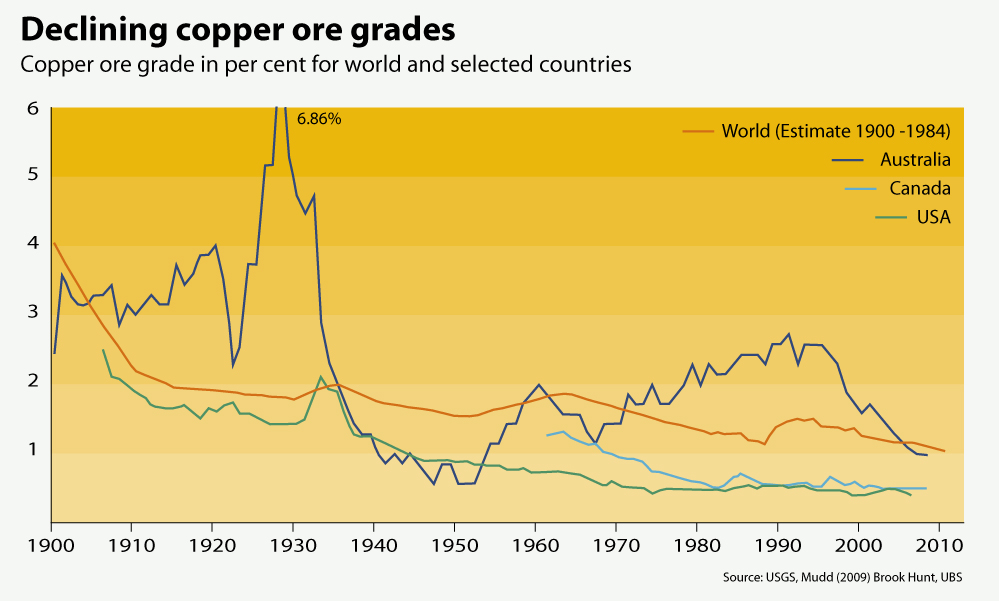
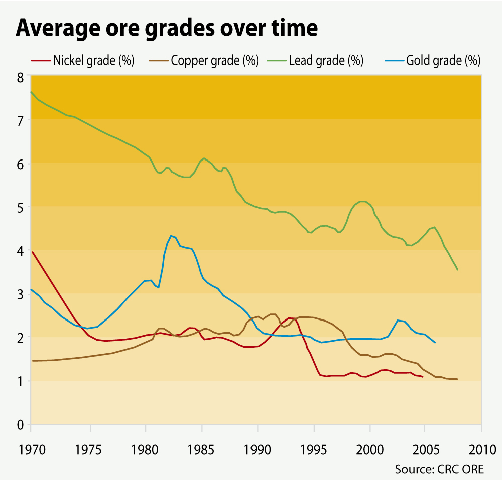

!!! Warning
    Attention, cette fiche est en cours de rédaction

# 🚧 Enjeux globaux liés aux métaux

Au-delà de la réalité matérielle et humaine de l'extraction minière et de ses conséquences, il est parfois difficile de s'y retrouver dans les ordres de grandeur. Nous tentons ici de fournir quelques repères sur l'industrie minière à l'échelle mondiale, et sur les tendances actuelles. 

## Évolution de la teneur des minerais

Pour satisfaire la demande en métaux on extrait des minerais avec des teneurs de plus en plus faibles. Il faut donc extraire beaucoup plus de matière pour produire la même quantité de métal.

Le graphique suivant montre par exemple que la teneur moyenne en cuivre des minerais extraits (*"copper ore grade"*) est passée de 4% à 1% entre 1900 et 2010. La teneur actuelle du minerai de cuivre est de 0,6% en moyenne.
    
 
    
Le graphique suivant montre par ailleurs l'évolution depuis 1970 de la teneur moyenne de différents minerais : nickel, cuivre (*copper*), plomb (*lead*), or (*gold*).
    
<figure markdown="span">
        
    </figure>

https://f2m.cnrs.fr/wp-content/uploads/2024/03/RFM2023-Vidal.pdf

!!! Sources
    [Declining copper ore grades. Grid Arendal](https://www.grida.no/resources/6291)
    
    [Average ore grades over time. Grid Arendal](https://www.grida.no/resources/6292)

L'ÉPUISEMENT DES MÉTAUX ET MINÉRAUX : FAUT-IL S'INQUIÉTER ?
https://www.researchgate.net/publication/323119968

https://ecoinfo.cnrs.fr/2018/04/30/ressources-minerales-demande-production-reserves-depletion-criticalite-et-consoeurs/

- évolution de la demande pour la transition énergétique

- Quelque chose sur les échelles de temps (prospection, plan d'exploitation, ouverture d'une mine, pollution éternelle...)

accaparement des métaux par quelques fabricants.
   
Decreasing Ore Grades in Global Metallic Mining:
A Theoretical Issue or a Global Reality?
Resources 2016, 5, 36; doi:10.3390/resources5040036

## Changement climatique
Climate change and its effect on the stability and lifespan of a tailings dam](https://www.grida.no/resources/11425)
https://www.grida.no/resources/11425

https://www.cdp.net/en/research/global-reports/high-and-dry-how-water-issues-are-stranding-assets
HIGH AND DRY
HOW WATER ISSUES ARE STRANDING ASSETS
A report commissioned by the Swiss Federal Office for the Environment (FOEN)
https://cdn.cdp.net/cdp-production/cms/reports/documents/000/006/321/original/High_and_Dry_Report_Final.pdf?1651652748

https://peer.tube/w/81pZ8xeQ5b5hp5LhRnBh27
Destruction des conditions locales + Exposition accrue au changement climatique
## Dépendances économiques et néo-colonialisme

Traitement parfois fait à l'autre bout du monde

Mines de bauxite en Guinée : La Guinée n'a pas d'usine d'aluminium
Bauxite: Guinea's mineral wealth
https://www.youtube.com/watch?v=K_WkvtBWIx0

La répartition de l’origine minière du gallium est difficile à établir puisque la Chine, principal producteur métallurgique, récupère le gallium dans ses raffineries qui traitent des bauxites importées de divers pays (Australie, Malaisie, Inde, Indonésie, etc.).
        
https://deskeco.com/2024/11/18/rdc-kico-la-mine-de-zinc-plus-haute-teneur-au-monde-reprend-ses-activites

https://peer.tube/w/81pZ8xeQ5b5hp5LhRnBh27
Dépendance économique

!!! Tip ""
    [17] La Chine est le premier producteur mondial de terres rares et d'autres métaux comme le gallium ou le magnésium. Cela représente un enjeu géopolitique majeur.

!!! Source "Précisions et sources"
    
       * Pour la liste des métaux dont la Chine est le principal producteur, voir la table 5 (colonne _Percentage of world total_) du rapport _"Mineral Commidity Summaries 2024"_ de l'Institut d'études géologiques des États-Unis (USGS)  
       Source : [Mineral commodity summaries 2024. USGS Janvier 2024.](https://www.usgs.gov/publications/mineral-commodity-summaries-2024)

    * Pour l'enjeu géopolitique, voir par exemple : [Terres rares : notre ultra-dépendance à la Chine (et comment en sortir).  Olivier Soria, Juliette Grau. The conversation. Octobre 2019](https://theconversation.com/terres-rares-notre-ultra-dependance-a-la-chine-et-comment-en-sortir-125855)

## Enjeux géopolitiques

Cf le rapport ADEME pp 22-23

https://www.lemonde.fr/economie/article/2024/05/30/les-minerais-critiques-attisent-les-rivalites-entre-grandes-puissances_6236298_3234.html

https://www.nytimes.com/2024/10/26/business/china-critical-minerals-semiconductors.html

Essentiellement produites en Chine, les terres rares sont également sur la liste des matières premières critiques pour l'économie européenne. Leur taux de recyclage est inférieur à 1%.

Cependant, avec le développement des nouvelles technologies, l'utilisation de ces métaux [de spécialité] a explosé. Ils sont aujourd'hui sur la liste des matières premières critiques pour l'économie européenne, lancée en 2008 et mise à jour tous les trois ans par la Commission européenne. Ces matières premières  essentielles pour l'économie, présentent un risque élevé de pénurie d'approvisionnement dans les 10 prochaines années. Ce risque peut-être lié à des enjeux économiques, géostratégiques, sociaux, sanitaires, énergétiques ou environnementaux.

Un point de vue vraiment intéressant
Entretien : qui détient le cobalt de RDC ? Albert Yuma, président de la GECAMINES face à Alain Foka
https://www.youtube.com/watch?v=nvHfHYRzBl4

https://fr.euronews.com/green/2022/02/04/les-champs-de-lithium-d-amerique-du-sud-loin-d-etre-anodins

La Chine est le premier producteur mondial de terres rares et d'autres métaux comme le gallium ou le magnésium. Cela représente un enjeu géopolitique majeur.

https://www.science.org/doi/10.1126/sciadv.1400180
By-product metals are technologically essential but have problematic supply

Problème des sous- et coproduits : trop de chocs

Précisions et sources

* Pour la liste des métaux dont la Chine est le principal producteur, voir la table 5 (colonne _Percentage of world total_) du rapport _"Mineral Commidity Summaries 2024"_ de l'Institut d'études géologiques des États-Unis (USGS)  
    Source : [Mineral commodity summaries 2024. USGS Janvier 2024.](https://www.usgs.gov/publications/mineral-commodity-summaries-2024)

Pour l'enjeu géopolitique, voir par exemple : [Terres rares : notre ultra-dépendance à la Chine (et comment en sortir). Olivier Soria, Juliette Grau. The conversation. Octobre 2019](https://theconversation.com/terres-rares-notre-ultra-dependance-a-la-chine-et-comment-en-sortir-125855)

Une grande partie des exploitations minières se situent dans des pays en situation de **stress hydrique**, où les besoins en eau douce dépassent les ressources disponibles.

Précisions et source

> _Ainsi, d’après le Columbia Center on Sustainable Investment, environ 70 % des exploitations minières des six principales compagnies minières dans le monde sont localisées dans des pays où il existe un stress hydrique._

Source : section 1.3.2 du rapport de France Stratégie publié en juin 2020 : [La consommation de métaux du numérique : un secteur loin d’être dématérialisé](https://www.strategie.gouv.fr/publications/consommation-de-metaux-numerique-un-secteur-loin-detre-dematerialise)  
  
Notons que la référence originale pour ce chiffre n'est plus disponible en ligne.

Andrew Metcalf, “Water scarcity to raise capex and operating costs, heighten operation risks,” Report number 149714, Moody's Investor Service, Special Comment (February 2013).

L’industrie minière est la première cause dans le monde de **conflits environnementaux**. En 2019, 50 défenseurs de l'environnement ont été assassinés dans des conflits liés à l'industrie minière.

Précisions et source

Voir la figure 1 du papier _Environmental conflicts and defenders: A global overview_, qui s'appuie sur [EJAtlas](https://ejatlas.org/), l'atlas global de la justice environnementale.

Source : [Arnim Scheidel, Daniela Del Bene, Juan Liu, Grettel Navas, Sara Mingorría, Federico Demaria, Sofía Avila, Brototi Roy, Irmak Ertör, Leah Temper, Joan Martínez-Alier. _Environmental conflicts and defenders: A global overview_. Global Environmental Change, Volume 63, 2020, 102104, ISSN 0959-3780.](https://doi.org/10.1016/j.gloenvcha.2020.102104)

> _Mining was still the most culpable industry – connected with the murders of 50 defenders in 2019._

Source : Page 6 du [rapport 2020 de l'ONG Global Witness: Defending Tomorrow](https://www.globalwitness.org/en/campaigns/environmental-activists/defending-tomorrow/)

## Pour aller plus loin

### Sources de référence
USGS
Mineralinfo
https://www.world-mining-data.info/?World_Mining_Data___PDF-Files

### Autres sources

## En vrac

Mineral Resources Online Spatial Data
https://mrdata.usgs.gov/general/map-global.html

Reviews of the Geology and Nonfuel Mineral Deposits of the World
https://pubs.usgs.gov/of/2005/1294/

Mineral Resources Data System (MRDS)
https://mrdata.usgs.gov/mrds/

Atelier prospective avec Gauthier
