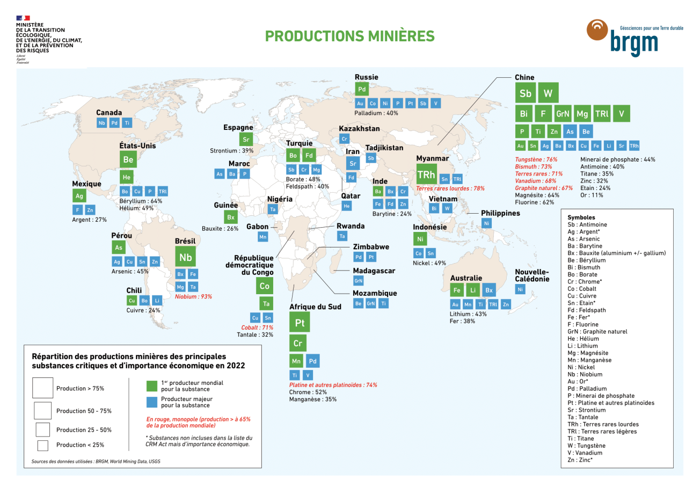
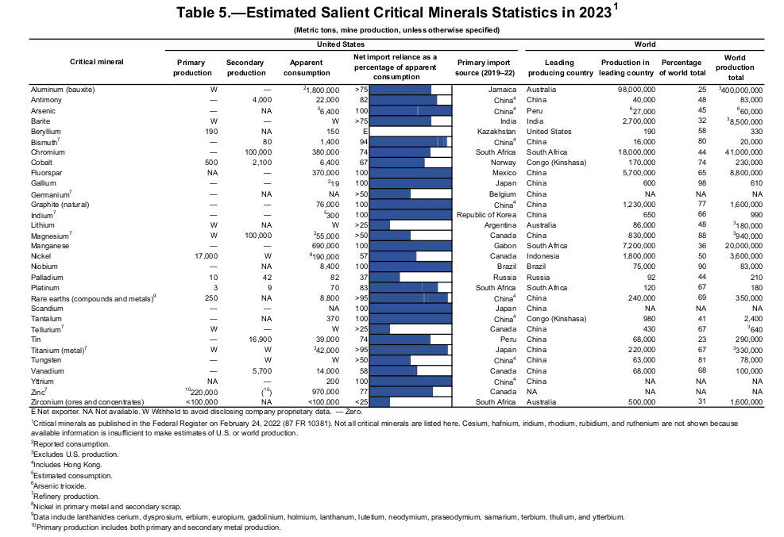
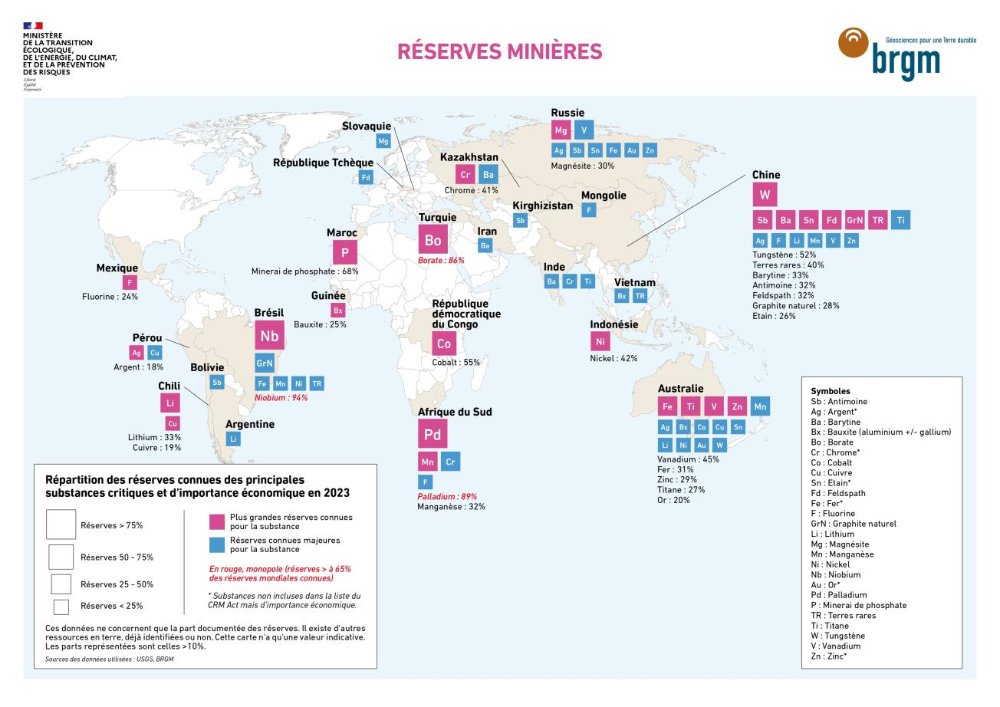
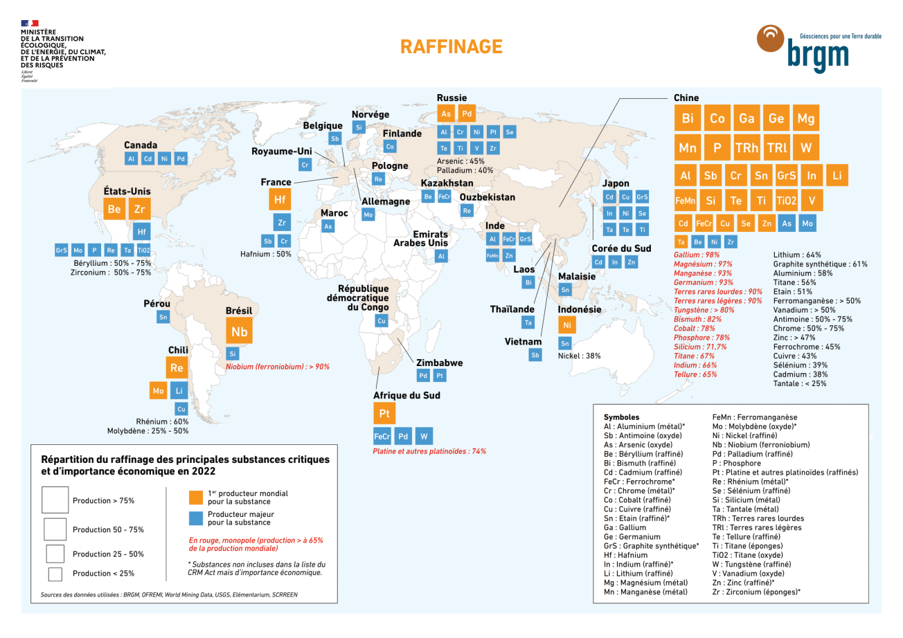
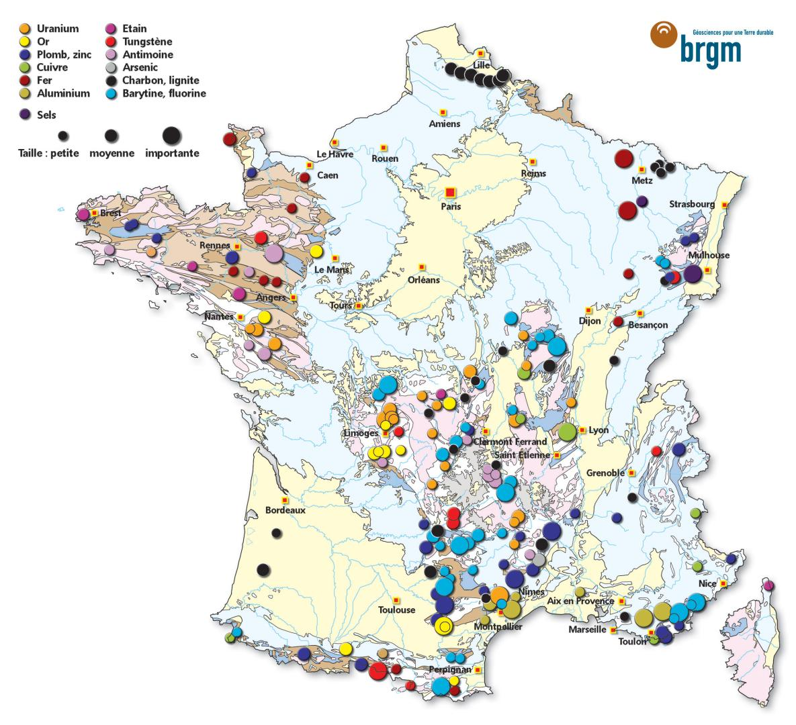
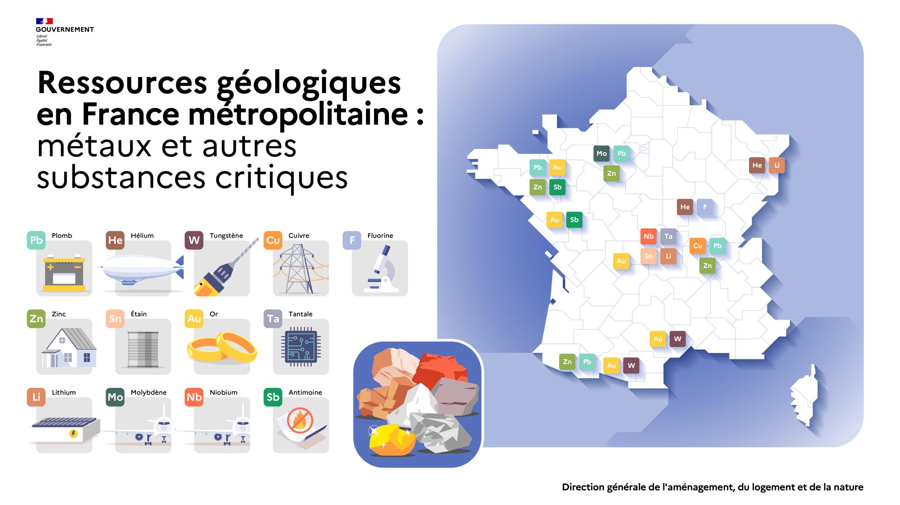
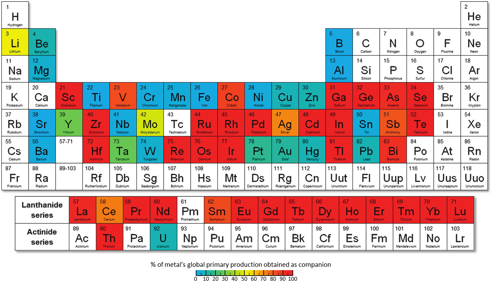
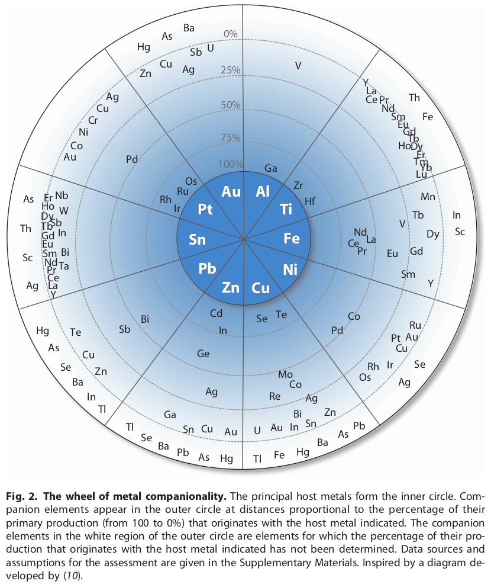
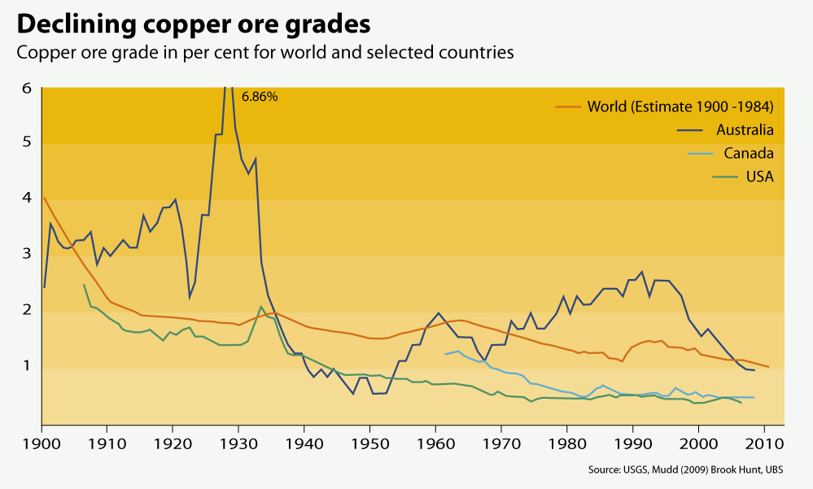
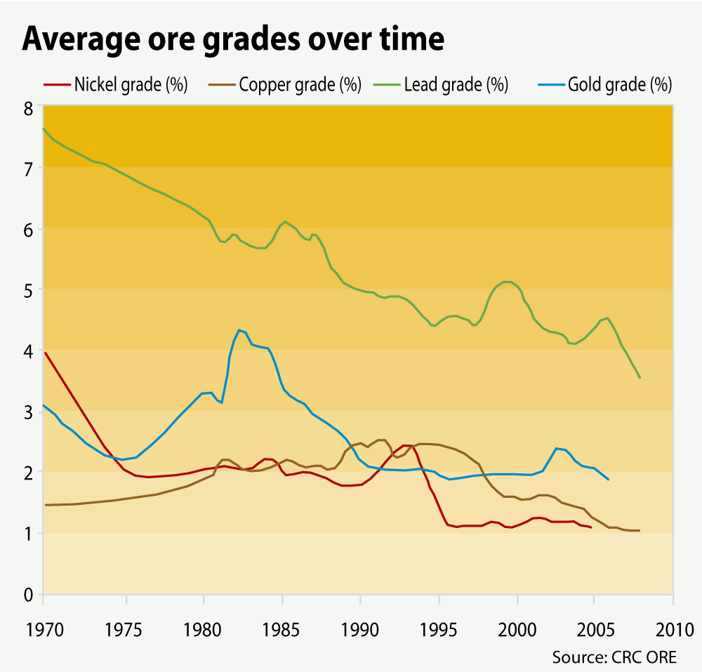

!!! Warning
    Attention, cette fiche est en cours de rédaction

# 🚧 Quelques repères sur l'industrie minière

Au-delà de la réalité matérielle et humaine de l'extraction minière et de ses conséquences, il est parfois difficile de s'y retrouver dans les ordres de grandeur. Nous tentons ici de fournir quelques repères sur l'industrie minière à l'échelle mondiale, et sur les tendances actuelles. 
    
## Répartition de la production et des réserves minérales

Il existe de grandes disparités géographiques dans la production minière, comme illustré par l'infographie ci-dessous. 

**Carte de répartition des productions minières**

On notera en particulier que :

* La <b>République Démocratique du Congo</b> est le premier producteur mondial de <b>cobalt</b> (74% de la production en 2023).
* L'<b>Indonésie</b> est le premier producteur mondial de <b>nickel</b> (50% de la production en 2023).
* La <b>Russie</b> est le premier producteur mondial de <b>palladium</b> (44% de la production en 2023). 
* L'<b>Australie</b> est le premier producteur mondial de <b>lithium</b> (48% de la production en 2023). 
* La <b>Chine</b> est le premier producteur mondial de <b>terres rares</b> (69% de la production mondiale en 2023, contre 98% en 2010), et de <b>gallium</b> (98% de la production en 2023). 
* La <b>République Démocratique du Congo</b> est le premier producteur mondial de <b>tantale</b> (41% de la production en 2023). On trouve du tantale dans la carte mère des smartphones.
* L'<b>Afrique du Sud</b> est le premier producteur mondial de <b>platine</b> (67% de la production en 2023). On trouve du platine dans la carte mère des smartphones.

!!! Source "Source"

    Les chiffres concernant la production des différents métaux viennent de la table 5 (colonne *Percentage of world total*) du rapport *"Mineral Commidity Summaries 2024"* de l'Institut d'études géologiques des États-Unis (USGS).  

    Source : [Mineral commodity summaries 2024. U.S. Geological Survey](https://www.usgs.gov/publications/mineral-commodity-summaries-2024)

    

    La part de la Chine dans la production mondiale de terres rares est indiquée dans le [rapport 2011 de l'USGS (page 129)  Mineral commodity](https://d9-wret.s3.us-west-2.amazonaws.com/assets/palladium/production/mineral-pubs/mcs/mcs2011.pdf)
    
Notons que de nombreux facteurs entrent en compte pour expliquer cette répartition des productions minières : abondance du minerai dans le sous-sol du pays, facilité d'accès aux gisements, réglementations environnementales plus ou moins contraignantes, coût de la main d'œuvre... On appelle ainsi **ressources** (mondiales ou nationales) d'un métal la quantité estimée de ce métal présente dans la croûte terrestre, et **réserves** la quantité de ressources qui sont actuellement exploitables d'un point technique et économique. Les réserves sont très inégalement réparties dans le monde et la production des différents pays ne reflète pas nécessairement les réserves de ces derniers, comme on peut le constater en comparant l'infographie ci-dessous avec la précédente.

**Carte de répartition des réserves minières**

La République Démocratique du Congo abrite ainsi plus de 50% des réserves mondiales de cobalt. On entend fréquemment l'expression "scandale géologique" pour décrire la richesse extrême du sous-sol de la RDC. De même, [TODO : triangle du lithium] alors que c'est l'Australie qui est aujourd'hui le principal producteur de lithium (48% de la production en 2023).

Enfin, les métaux ne sont pas toujours raffinés dans le pays dont le minerai est extrait. 

**Carte de répartition du raffinage**

On notera en particulier la situation de quasi-monopole de la Chine sur l'affinage d'un grand nombre de métaux, et le faible poids de l'Afrique dans ce secteur malgré la richesse de son sous-sol. Par exemple, la Guinée représente 26% de la production de bauxite (le minerai dont on extrait l'aluminium et le gallium) mais ne dispose d'aucune raffinerie sur son territoire, la production de l'aluminium et du gallium étant majoritairement réalisée en Chine.

!!! Source "Source"

    Les infographies ci-dessus proviennent du site de MineralInfo : https://www.mineralinfo.fr/fr/actualite/actualite/cartes-de-geopolitique-des-ressources-minieres-production-reserves-mondiales

## Focus sur la France

Il y a encore des **mines en activité** en France : on exploite de l'or en Guyane, du nickel en Nouvelle-Calédonie (6% de la production mondiale en 2023) et de la bauxite (le minerai qui sert à produire l'aluminium et le gallium) vers Montpellier.

!!! Source "Sources"

    On trouve la liste des mines exploitées en France aujourd'hui sur le site de [Mineralinfo, le portail français des ressources minérales non énergétiques](https://www.mineralinfo.fr/fr/ressources-minerales-france-gestion/mines-france).
       
    Le chiffre de 6% est calculé à partir des données de la page 123 du rapport [Mineral commodity summaries 2024](https://www.usgs.gov/publications/mineral-commodity-summaries-2024) de l'USGS (U.S. Geological Survey).

La France a par ailleurs un riche **passé minier**, ayant occupé "*une place significative dans la production mondiale de tungstène (3e producteur européen jusqu’en 1986, avec les mines de Salau et du district d’Échassières), l’antimoine (1er producteur mondial au début du XXe siècle avec les mines de La Lucette et du district de Brioude-Massiac), et l’or (avec un gisement de classe mondiale, celui de Salsigne).*" 

**Carte des anciennes principales mines ayant été exploitées en France**

!!! Source "Source"

    La carte et la citation ci-dessus proviennent du site de [Mineralinfo, le portail français des ressources minérales non énergétiques](https://www.mineralinfo.fr/fr/ressources-minerales-france-gestion/exploitation-miniere-france).

Enfin, le Bureau de recherches géologiques et minières (BRGM), qui est le service géologique national français, a effectué entre 2013 et 2015 des travaux de réévaluation du **potentiel français en ressources minérales**. L'ouverture d'une mine de lithium est ainsi prévue d'ici 2027 dans le Massif central. Ce sera l'une des plus grandes d'Europe. Plusieurs projets d'exploration minière sont actuellement en cours ou en attente d'autorisation en France, pour exploiter or, lithium, étain...

!!! Source "Sources"

    https://www.mineralinfo.fr/fr/ressources-minerales-france-gestion/potentiel-du-sous-sol-francais-exploration

    Il s'agit d'une mine située à Beauvoir dans l'Allier. 
    
    Voir par exemple l'article "L'une des plus grandes mines européennes de lithium va ouvrir en France d'ici 2027".  

    Source : [L'une des plus grandes mines européennes de lithium va ouvrir en France d'ici 2027. France Inter. Octobre 2022](https://www.radiofrance.fr/franceinter/l-une-des-plus-grandes-mines-europeennes-de-lithium-va-ouvrir-en-france-d-ici-2027-3063449)

       > *Deux permis d'exploration sont en cours de validité dans le Massif central :         
            - PER Bonneval » : pour la recherche d'or, d'argent, d'antimoine et de substances connexes dans le Limousin et détenu par la société Cordier Mines ;  
            - PER Beauvoir » : pour la recherche d'étain, de niobium de tantale, de tungstène, de béryllium et de lithium et détenu par la société Imerys Ceramics France.*

      > *Plusieurs demandes de permis d'exploration sont en cours d'instruction.*  
      
      Source : [Le potentiel du sous-sol français. Mineral info](https://www.mineralinfo.fr/fr/ressources-minerales-france-gestion/potentiel-du-sous-sol-francais)

## Teneur moyenne des minerais et volumes de production 

Au-delà de la grande diversité géographique de la répartition de la production et des réserves de différents métaux, il existe également de grandes différences entre les métaux.

La **teneur** en métal d’un minerai est la proportion de métal contenue dans ce minerai. Par exemple, la teneur en cuivre d'un minerai est en moyenne autour de 0,6% (6g de cuivre pour 1kg de minerai). La teneur moyenne varie beaucoup entre les différents métaux : environ 45% pour le fer (45g de fer pour 100g de minerai) mais seulement 0,00008% pour l'or (8g d'or pour 10 tonnes de minerai) !

Si l'on s'intéresse à la quantité de roche qu'il faut extraire pour obtenir un gramme de métal (ce qu'on appelle en anglais le *rock-to-metal ratio*), il faut prendre en compte non seulement la teneur du minerai, mais également les stériles, c'est-à-dire les roches qu’il faut extraire pour accéder au minerai. Il y a souvent 2 à 3 fois plus de stériles que de minerai extrait. 

D'autre part, la **production mondiale** varie beaucoup entre les métaux : de quelques dizaines de tonnes par an pour des métaux précieux comme le rhodium et le rhuténium jusqu'à des dizaines de millions de tonnes pour certains métaux communs comme l'aluminium, et encore plus pour le fer (1 milliard de tonnes produites par an) !

Au final, si l'on veut estimer la quantité de roche extraite pour répondre à la demande mondiale concernant un métal donné, on se rend compte que la teneur moyenne du minerai joue un rôle très important. Par exemple, la production mondiale d'or ne représente que quelques milliers de tonnes par an, et pourtant c'est le métal qui induit la troisième plus grande quantité de roche extraite (14 milliards de tonnes en 2018), juste derrière le fer et le cuivre. 

!!! Source "Source"

    La teneur en métal des différents minerais est indiquée à la table S4 (colonne "_Ore grade_") du papier [*Rock-to-Metal Ratio: A Foundational Metric for Understanding Mine Wastes*, NT Nassar, 2022](https://pubs.acs.org/doi/10.1021/acs.est.1c07875). La teneur en fer (_iron_) d'un minerai est en moyenne de 44,81%, celle en cuivre (_copper_) de 0,64%, et celle en or (_gold_) est de 0,00008%.
    

## Co-produits, sous-produits

Pour bien comprendre les enjeux de la production des métaux, et en particulier des métaux du numérique, il est important de rappeler que les mines permettent souvent l'extraction de plusieurs métaux. De nombreux métaux du numérique sont ainsi des <b>sous</b>-<b>produits</b>  d'autres métaux, c'est-à-dire qu'ils sont récupérés lors du traitement de ces autres métaux. Par exemple, le gallium est un sous-produit de l'aluminium. En d'autres termes, ces métaux n'influencent que très peu les décisions d'ouverture ou de fermeture des mines.

!!! Source "Précisions et source"
    
    > *Le gallium ne forme pas de gisements économiquement exploitables à l’état naturel, et provient en grande majorité de la filière de production d’aluminium (sous-produit du raffinage de la bauxite en alumine).* 
    
    Source : [Gallium (Ga). Mineral info](https://www.mineralinfo.fr/fr/substance/gallium-ga)
       
       Dans le cas général, on trouve une liste des métaux du système périodique qui sont principalement obtenus comme des sous-produits dans la Figure 1 du papier [*Article By-product metals are technologically essential but have problematic supply*, NT Nassar, 2015](https://www.science.org/doi/10.1126/sciadv.1400180). Parmi ces métaux on trouve un grand nombre de métaux présents dans les smartphones, comme le cobalt, le germanium, le zirconium, l'indium, les terres rares...
       
      <figure markdown="span">
           
        </figure>

    La figure 2 du même papier décrit plus précisément les relations de dépendance entre métaux, et en particulier quel métal est un sous-produit de quel autre.

    <figure markdown="span">
           
        </figure>

## Évolution de la teneur des minerais

Pour satisfaire la demande en métaux on extrait des minerais avec des teneurs de plus en plus faibles. Il faut donc extraire beaucoup plus de matière pour produire la même quantité de métal.

Le graphique suivant montre par exemple que la teneur moyenne en cuivre des minerais extraits (*"copper ore grade"*) est passée de 4% à 1% entre 1900 et 2010. La teneur actuelle du minerai de cuivre est de 0,6% en moyenne.
    
 
    
Le graphique suivant montre par ailleurs l'évolution depuis 1970 de la teneur moyenne de différents minerais : nickel, cuivre (*copper*), plomb (*lead*), or (*gold*).
    
<figure markdown="span">
        
    </figure>

https://f2m.cnrs.fr/wp-content/uploads/2024/03/RFM2023-Vidal.pdf

!!! Sources
    [Declining copper ore grades. Grid Arendal](https://www.grida.no/resources/6291)
    
    [Average ore grades over time. Grid Arendal](https://www.grida.no/resources/6292)

L'ÉPUISEMENT DES MÉTAUX ET MINÉRAUX : FAUT-IL S'INQUIÉTER ?
https://www.researchgate.net/publication/323119968

https://ecoinfo.cnrs.fr/2018/04/30/ressources-minerales-demande-production-reserves-depletion-criticalite-et-consoeurs/

- évolution de la demande pour la transition énergétique

- Quelque chose sur les échelles de temps (prospection, plan d'exploitation, ouverture d'une mine, pollution éternelle...)

accaparement des métaux par quelques fabricants.
   
Decreasing Ore Grades in Global Metallic Mining:
A Theoretical Issue or a Global Reality?
Resources 2016, 5, 36; doi:10.3390/resources5040036

## Changement climatique
Climate change and its effect on the stability and lifespan of a tailings dam](https://www.grida.no/resources/11425)
https://www.grida.no/resources/11425

https://www.cdp.net/en/research/global-reports/high-and-dry-how-water-issues-are-stranding-assets
HIGH AND DRY
HOW WATER ISSUES ARE STRANDING ASSETS
A report commissioned by the Swiss Federal Office for the Environment (FOEN)
https://cdn.cdp.net/cdp-production/cms/reports/documents/000/006/321/original/High_and_Dry_Report_Final.pdf?1651652748

## Dépendances économiques et néo-colonialisme

Traitement parfois fait à l'autre bout du monde

Mines de bauxite en Guinée : La Guinée n'a pas d'usine d'aluminium
Bauxite: Guinea's mineral wealth
https://www.youtube.com/watch?v=K_WkvtBWIx0

La répartition de l’origine minière du gallium est difficile à établir puisque la Chine, principal producteur métallurgique, récupère le gallium dans ses raffineries qui traitent des bauxites importées de divers pays (Australie, Malaisie, Inde, Indonésie, etc.).
        
https://deskeco.com/2024/11/18/rdc-kico-la-mine-de-zinc-plus-haute-teneur-au-monde-reprend-ses-activites

!!! Tip ""
    [17] La Chine est le premier producteur mondial de terres rares et d'autres métaux comme le gallium ou le magnésium. Cela représente un enjeu géopolitique majeur.

!!! Source "Précisions et sources"
    
       * Pour la liste des métaux dont la Chine est le principal producteur, voir la table 5 (colonne _Percentage of world total_) du rapport _"Mineral Commidity Summaries 2024"_ de l'Institut d'études géologiques des États-Unis (USGS)  
       Source : [Mineral commodity summaries 2024. USGS Janvier 2024.](https://www.usgs.gov/publications/mineral-commodity-summaries-2024)

    * Pour l'enjeu géopolitique, voir par exemple : [Terres rares : notre ultra-dépendance à la Chine (et comment en sortir).  Olivier Soria, Juliette Grau. The conversation. Octobre 2019](https://theconversation.com/terres-rares-notre-ultra-dependance-a-la-chine-et-comment-en-sortir-125855)

## Enjeux géopolitiques

https://www.lemonde.fr/economie/article/2024/05/30/les-minerais-critiques-attisent-les-rivalites-entre-grandes-puissances_6236298_3234.html

https://www.nytimes.com/2024/10/26/business/china-critical-minerals-semiconductors.html

Essentiellement produites en Chine, les terres rares sont également sur la liste des matières premières critiques pour l'économie européenne. Leur taux de recyclage est inférieur à 1%.

Cependant, avec le développement des nouvelles technologies, l'utilisation de ces métaux [de spécialité] a explosé. Ils sont aujourd'hui sur la liste des matières premières critiques pour l'économie européenne, lancée en 2008 et mise à jour tous les trois ans par la Commission européenne. Ces matières premières  essentielles pour l'économie, présentent un risque élevé de pénurie d'approvisionnement dans les 10 prochaines années. Ce risque peut-être lié à des enjeux économiques, géostratégiques, sociaux, sanitaires, énergétiques ou environnementaux.

Un point de vue vraiment intéressant
Entretien : qui détient le cobalt de RDC ? Albert Yuma, président de la GECAMINES face à Alain Foka
https://www.youtube.com/watch?v=nvHfHYRzBl4

https://fr.euronews.com/green/2022/02/04/les-champs-de-lithium-d-amerique-du-sud-loin-d-etre-anodins

La Chine est le premier producteur mondial de terres rares et d'autres métaux comme le gallium ou le magnésium. Cela représente un enjeu géopolitique majeur.

https://www.science.org/doi/10.1126/sciadv.1400180
By-product metals are technologically essential but have problematic supply

Problème des sous- et coproduits : trop de chocs

Précisions et sources

* Pour la liste des métaux dont la Chine est le principal producteur, voir la table 5 (colonne _Percentage of world total_) du rapport _"Mineral Commidity Summaries 2024"_ de l'Institut d'études géologiques des États-Unis (USGS)  
    Source : [Mineral commodity summaries 2024. USGS Janvier 2024.](https://www.usgs.gov/publications/mineral-commodity-summaries-2024)

Pour l'enjeu géopolitique, voir par exemple : [Terres rares : notre ultra-dépendance à la Chine (et comment en sortir). Olivier Soria, Juliette Grau. The conversation. Octobre 2019](https://theconversation.com/terres-rares-notre-ultra-dependance-a-la-chine-et-comment-en-sortir-125855)

Une grande partie des exploitations minières se situent dans des pays en situation de **stress hydrique**, où les besoins en eau douce dépassent les ressources disponibles.

Précisions et source

> _Ainsi, d’après le Columbia Center on Sustainable Investment, environ 70 % des exploitations minières des six principales compagnies minières dans le monde sont localisées dans des pays où il existe un stress hydrique._

Source : section 1.3.2 du rapport de France Stratégie publié en juin 2020 : [La consommation de métaux du numérique : un secteur loin d’être dématérialisé](https://www.strategie.gouv.fr/publications/consommation-de-metaux-numerique-un-secteur-loin-detre-dematerialise)  
  
Notons que la référence originale pour ce chiffre n'est plus disponible en ligne.

Andrew Metcalf, “Water scarcity to raise capex and operating costs, heighten operation risks,” Report number 149714, Moody's Investor Service, Special Comment (February 2013).

L’industrie minière est la première cause dans le monde de **conflits environnementaux**. En 2019, 50 défenseurs de l'environnement ont été assassinés dans des conflits liés à l'industrie minière.

Précisions et source

Voir la figure 1 du papier _Environmental conflicts and defenders: A global overview_, qui s'appuie sur [EJAtlas](https://ejatlas.org/), l'atlas global de la justice environnementale.

Source : [Arnim Scheidel, Daniela Del Bene, Juan Liu, Grettel Navas, Sara Mingorría, Federico Demaria, Sofía Avila, Brototi Roy, Irmak Ertör, Leah Temper, Joan Martínez-Alier. _Environmental conflicts and defenders: A global overview_. Global Environmental Change, Volume 63, 2020, 102104, ISSN 0959-3780.](https://doi.org/10.1016/j.gloenvcha.2020.102104)

> _Mining was still the most culpable industry – connected with the murders of 50 defenders in 2019._

Source : Page 6 du [rapport 2020 de l'ONG Global Witness: Defending Tomorrow](https://www.globalwitness.org/en/campaigns/environmental-activists/defending-tomorrow/)

## Pour aller plus loin

### Sources de référence
USGS
Mineralinfo
https://www.world-mining-data.info/?World_Mining_Data___PDF-Files

### Autres sources

## En vrac

Mineral Resources Online Spatial Data
https://mrdata.usgs.gov/general/map-global.html

Reviews of the Geology and Nonfuel Mineral Deposits of the World
https://pubs.usgs.gov/of/2005/1294/

Mineral Resources Data System (MRDS)
https://mrdata.usgs.gov/mrds/

Atelier prospective avec Gauthier
