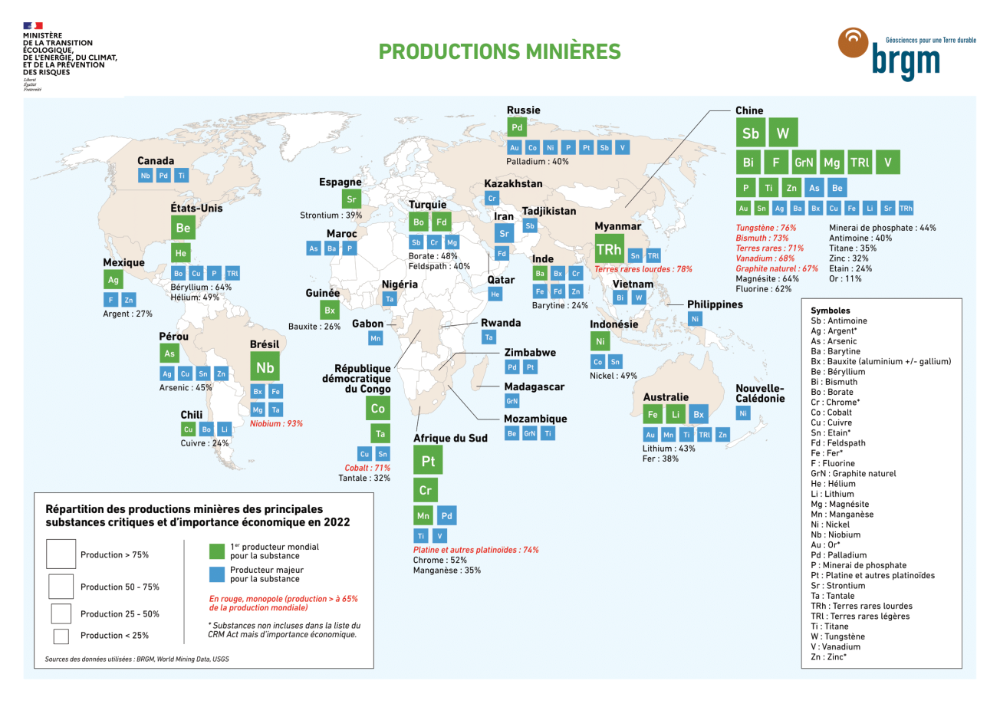
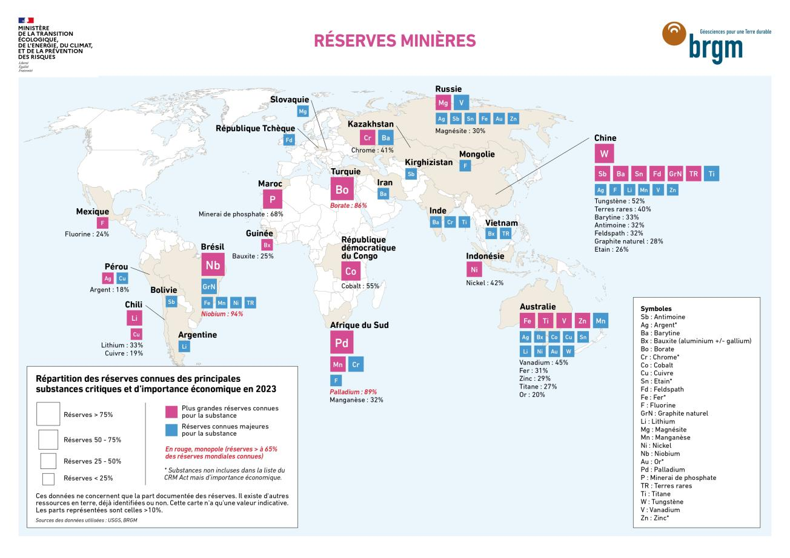
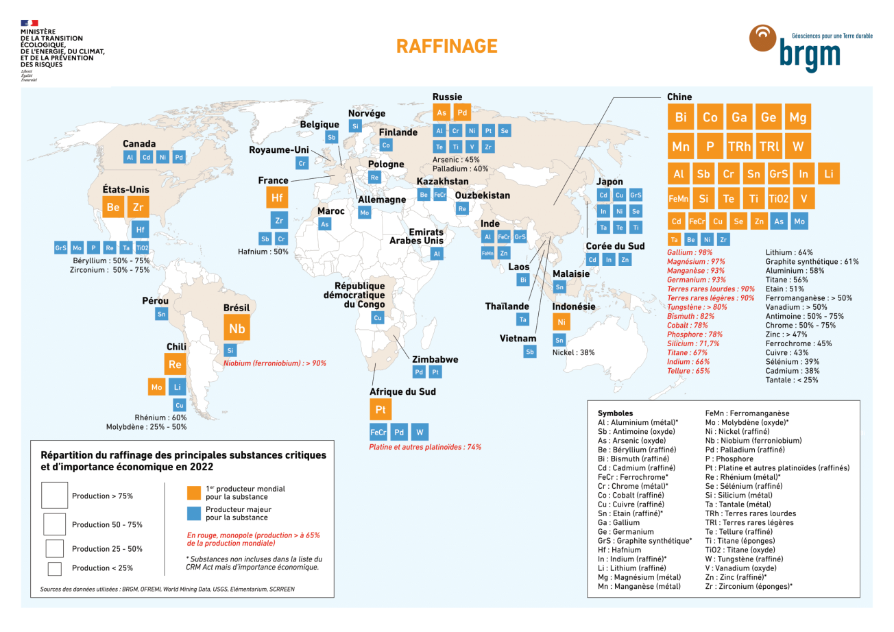
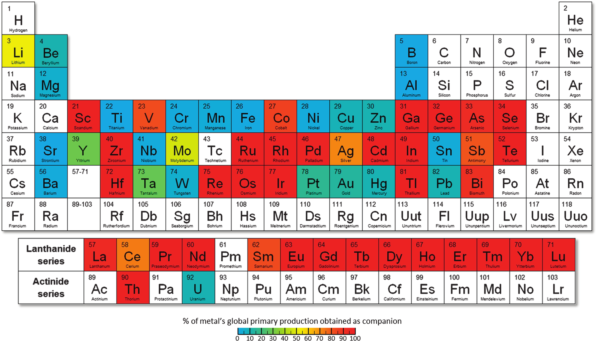
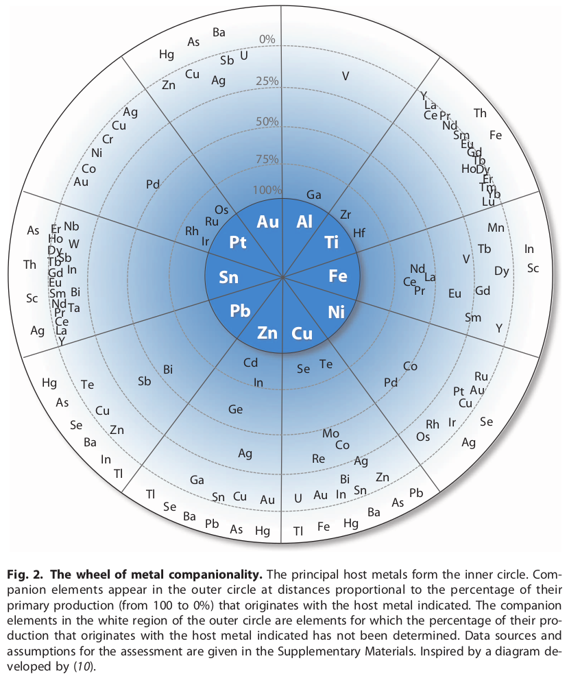

!!! Warning
    Attention, cette fiche est en cours de rédaction

# 🚧 Quelques repères sur la production minière

Au-delà de la réalité matérielle et humaine de l'extraction minière et de ses conséquences, il est parfois difficile de s'y retrouver dans les ordres de grandeur. Nous tentons ici de fournir quelques repères sur l'industrie minière à l'échelle mondiale, et sur les tendances actuelles. 
    
## I - Une production et des réserves inégalement réparties

Il existe de grandes disparités géographiques dans la production minière, comme illustré par l'infographie ci-dessous. On y remarque par exemple que la Chine est le principal producteur d'un grand nombre de minerais.

Notons que de nombreux facteurs entrent en compte pour expliquer cette répartition des productions minières : abondance du minerai dans le sous-sol du pays, facilité d'accès aux gisements, réglementations environnementales plus ou moins contraignantes, coût de la main d'œuvre, stabilité géopolitique du pays... 

!!! Source ""
	<figure markdown=span>
	*Carte de répartition des productions minières* 	
	*Source : [Mineralinfo, le portail français des ressources minérales non énergétiques](https://www.mineralinfo.fr/fr/actualite/actualite/cartes-de-geopolitique-des-ressources-minieres-production-reserves-mondiales)*
	</figure>
!!! Tip ""
	Attention : Les infographies présentées ici sont basées sur les chiffres de l'USGS de 2022 alors que les chiffres utilisés dans PhoneImpact sont ceux de 2023 (rapport 2024).

On appelle par ailleurs **ressources** (mondiales ou nationales) d'un métal la quantité estimée de ce métal présente dans la croûte terrestre, et **réserves** la quantité de ressources qui sont *actuellement* exploitables d'un point technique et économique. Les réserves (et les ressources) sont elles aussi très inégalement réparties dans le monde. 

La République Démocratique du Congo abrite ainsi plus de 50% des réserves mondiales de cobalt. On entend fréquemment l'expression "scandale géologique" pour décrire la richesse extrême du sous-sol de la RDC. 

!!! Source ""
	<figure markdown=span>
	*Carte de répartition des réserves minières* 
	*Source : [Mineralinfo, le portail français des ressources minérales non énergétiques](https://www.mineralinfo.fr/fr/actualite/actualite/cartes-de-geopolitique-des-ressources-minieres-production-reserves-mondiales)*
	</figure>
On notera que la production des différents pays ne reflète pas nécessairement les réserves de ces derniers, comme on peut le constater en comparant les deux infographies ci-dessus. Par exemple c'est l'Australie qui est aujourd'hui le principal producteur de lithium (48% de la production en 2023 alors qu'elle possède 22% des réserves, contre 34% pour le Chili (et environ la moitié pour la zone appelée Triangle du lithium, à la frontière entre Chili, Argentine et Bolivie).

Enfin, les métaux ne sont pas toujours raffinés dans le pays dont le minerai est extrait. 

!!! Source ""
	<figure markdown=span>
	*Carte de répartition du raffinage* 
	*Source : [Mineralinfo, le portail français des ressources minérales non énergétiques](https://www.mineralinfo.fr/fr/actualite/actualite/cartes-de-geopolitique-des-ressources-minieres-production-reserves-mondiales)*
	</figure>
	

On notera en particulier la situation de quasi-monopole de la Chine sur l'affinage d'un grand nombre de métaux, et le faible poids de l'Afrique dans ce secteur malgré la richesse de son sous-sol. Par exemple, la Guinée représente 26% de la production de bauxite (le minerai dont on extrait l'aluminium et le gallium) mais ne dispose d'aucune raffinerie sur son territoire, la production de l'aluminium et du gallium étant majoritairement réalisée en Chine.

## II - Des teneurs et des volumes de production très différents 

Au-delà de la grande diversité géographique de la répartition de la production et des réserves de différents métaux, il existe également de grandes différences entre les métaux.

La **teneur** en métal d’un minerai est la proportion de métal contenue dans ce minerai. Par exemple, la teneur en cuivre d'un minerai est en moyenne autour de 0,6% (6g de cuivre pour 1kg de minerai). La teneur moyenne varie beaucoup entre les différents métaux : environ 45% pour le fer (45g de fer pour 100g de minerai) mais seulement 0,00008% pour l'or (8g d'or pour 10 tonnes de minerai) !

!!! Source ""
	<figure markdown=span>
	*Teneur en métal des différents minerais est indiquée à la table S4 (colonne "_Ore grade_")  
	*Source : [*Rock-to-Metal Ratio: A Foundational Metric for Understanding Mine Wastes*, NT Nassar, 2022](https://pubs.acs.org/doi/10.1021/acs.est.1c07875).*
	</figure>

Si l'on s'intéresse à la quantité de roche qu'il faut extraire pour obtenir un gramme de métal (ce qu'on appelle en anglais le *rock-to-metal ratio*), il faut prendre en compte non seulement la teneur du minerai, mais également les stériles, c'est-à-dire les roches qu’il faut extraire pour accéder au minerai. Il y a souvent 2 à 3 fois plus de stériles que de minerai extrait. 

D'autre part, la **production mondiale** varie beaucoup entre les métaux : de quelques dizaines de tonnes par an pour des métaux précieux comme le rhodium et le rhuténium jusqu'à des dizaines de millions de tonnes pour certains métaux communs comme l'aluminium, et encore plus pour le fer (1 milliard de tonnes produites par an) !

Au final, si l'on veut estimer la quantité de roche extraite pour répondre à la demande mondiale concernant un métal donné, on se rend compte que la teneur moyenne du minerai joue un rôle très important. Par exemple, la production mondiale d'or ne représente que quelques milliers de tonnes par an, et pourtant c'est le métal qui induit la troisième plus grande quantité de roche extraite (14 milliards de tonnes en 2018), juste derrière le fer et le cuivre. 

## III - Des dépendances entre métaux

Pour bien comprendre les enjeux de la production des métaux, et en particulier des métaux du numérique, il est important de rappeler que les mines permettent souvent l'extraction de plusieurs métaux. De nombreux métaux du numérique sont ainsi des <b>sous</b>-<b>produits</b>  d'autres métaux, c'est-à-dire qu'ils sont récupérés lors du traitement de ces autres métaux. Par exemple, le gallium est un sous-produit de l'aluminium. En d'autres termes, ces métaux n'influencent que très peu les décisions d'ouverture ou de fermeture des mines.

!!! Source ""
    
    > *Le gallium ne forme pas de gisements économiquement exploitables à l’état naturel, et provient en grande majorité de la filière de production d’aluminium (sous-produit du raffinage de la bauxite en alumine).* 
    
    Source : [Gallium (Ga). Mineral info](https://www.mineralinfo.fr/fr/substance/gallium-ga)
       
       Dans le cas général, on trouve une liste des métaux du système périodique qui sont principalement obtenus comme des sous-produits dans la Figure 1 du papier [*Article By-product metals are technologically essential but have problematic supply*, NT Nassar, 2015](https://www.science.org/doi/10.1126/sciadv.1400180). Parmi ces métaux on trouve un grand nombre de métaux présents dans les smartphones, comme le cobalt, le germanium, le zirconium, l'indium, les terres rares...
       
      <figure markdown="span">
           
        </figure>

    La figure 2 du même papier décrit plus précisément les relations de dépendance entre métaux, et en particulier quel métal est un sous-produit de quel autre.

    <figure markdown="span">
           
        </figure>
## Sources de référence
USGS
Mineralinfo
https://www.world-mining-data.info/?World_Mining_Data___PDF-Files

