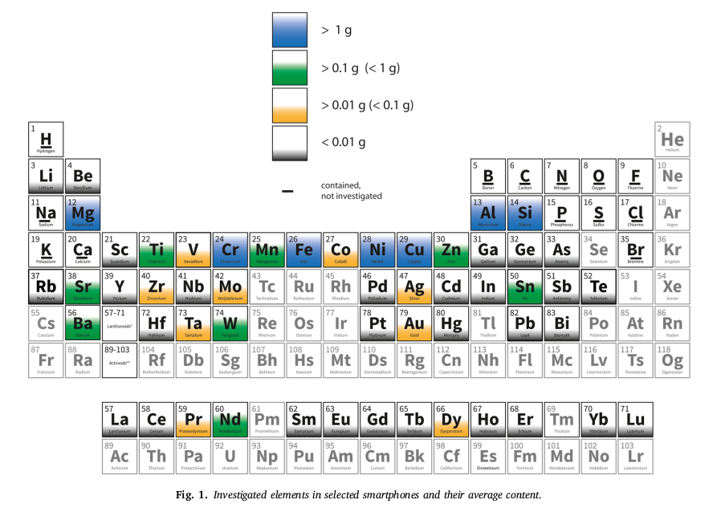
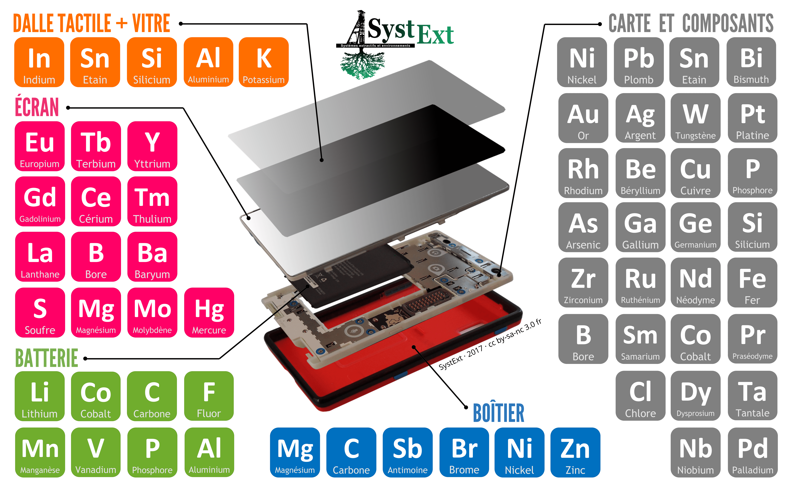

# 🚧 Les métaux dans les smartphones

!!! Warning
    Attention, cette fiche est en cours de rédaction

Un smartphone est principalement constitué de métaux, de verre et de matières plastiques. 

Source : https://doi.org/10.1016/j.resourpol.2020.101750

!!! Tip ""
    TODO : Expliquer viteuf les usages.
    Q : C'est quoi exactement la céramique ? Et les PCB c'est en plastique ?

En 1950, on dénombrait une douzaine de métaux dans nos bons vieux téléphones fixes. Le smartphone d'aujourd'hui, beaucoup plus petit et fin, contient plus de 50 métaux : une condition pour avoir toutes les fonctionnalités de nos équipements !

!!! Tip ""
    TODO : Ajouter la figure avec l'évolution du nombre de métaux dans les smartphones.

## Généralités
Commençons par quelques généralités. 

### Qu'est-ce qu'un métal ?
Élément du système périodique versus notion physique

Notions géologiques et physiques
* minéral
* métal
* élément

"Un <b>métal</b> est soit l’un des éléments du système périodique, soit un alliage de plusieurs éléments. Par contre, tous les éléments chimiques ne sont pas des métaux (ex. l'oxygène).",Définition,"empty"

"Un <b>minéral</b> est une substance inorganique (contrairement par exemple à un végétal) caractérisée par sa composition chimique et une structure cristalline.",Définition,"empty"

"On exploite souvent plusieurs métaux dans une mine (ex. cuivre et zinc). Si tous ont une valeur économique similaire, on parle de <b>co-produits</b>.",Définition,"empty"

## Quels métaux dans les smartphones ?

!!! Tip ""
    TODO : Ajouter la figure avec l'évolution du nombre de métaux dans les smartphones.

* Les informations concernant l'utilisation des métaux dans les smartphones sont issues de l'outil interactif développé par ISF SystExt (Ingénieurs sans frontières Systèmes extractifs et environnements).  
    Source : [Inforgraphie Des métaux dans mon smartphone ?. Systext. Avril 2017](https://www.systext.org/sites/all/animationreveal/mtxsmp/#/)
    
     Attention, ces informations sont à prendre avec précaution car la composition précise des smartphones n'est que rarement et partiellement connue, sachant qu'elle varie en fonction des smartphones et évolue rapidement avec l'évolution des technologies. Voir la fiche détaillée sur les métaux dans les smartphones pour plus d  
     
La composition précise des smartphones n'est que rarement et partiellement connue, et les sources utilisées dans les deux études ne sont donc pas comparables. L'information importante à retenir est la grande diversité des métaux présents dans un smartphone, et la grande variété de leurs usages.

Systext a fourni en 2017 une [infographie détaillée](https://www.systext.org/node/1724) des éléments chimiques généralement présents dans un smarphone.

Une [étude de l'ADEME d'octobre 2024](https://librairie.ademe.fr/economie-circulaire-et-dechets/7713-etude-numerique-et-metaux.html) considère une liste de 25 métaux critiques nécessaires à l'industrie du numérique et fournit un état de l'art sur les impacts environnementaux et besoins associés. Les métaux indiqués présents dans un smartphone (pages 186-188 du fichier Recueil-fiches-Equipement.pdf) diffèrent en partie de ceux de l'étude Systext sans qu'il soit aisé d'expliquer ces différences. 

## Classifications des métaux

Il existe plusieurs manières de classifier les métaux, selon que l'on considère leur usage industriel, leurs propriétés physico-chimiques ou encore leurs spécificités géologiques. Notons que ces classifications ne sont complètement indépendantes les unes des autres : par exemple les métaux précieux (classification industrielle) ont des propriétés physico-chimiques similaires. Par contre, la correspondance n'est pas parfaite. Ainsi, certains métaux de base dans l'industrie (qu'on appelle métaux communs dans le jeu) sont des métaux rares du point géologique.

Nous précisons dans la suite différentes classifications des métaux qui sont fréquemment utilisées, en distinguant la nature des propriétés sur lesquelles elles se basent : industrielle, physico-chimique, géologique.

### Une classification industrielle : métaux de base, métaux précieux…

L'ADEME distingue quatre grandes familles industrielles de métaux :

* Les **métaux de base** : fer (Fe), aluminium (Al), titane (Ti), magnésium (Mg), manganèse (Mn), chrome (Cr), zinc (Zn), cuivre (Cu), nickel (Ni) et étain (Sn)
* Les **métaux précieux** : or (Au), argent (Ag), platine (Pt), palladium (Pd), iridium (Ir), osmium (Os), rhodium (Rh) et rhuténium (Ru)
* Les **métaux de l’énergie nucléaire** : uranium (U), thorium (Th) et plutonium (Pu)
* Les **métaux de spécialité** : tous les autres

> Source : [Fiche technique de ADEME : _l'épuisement des métaux et minéraux : faut il s'en inquiéter ?_](https://www.mineralinfo.fr/sites/default/files/documents/2021-01/ademe_epuisement-metaux-mineraux-201706-fiche-techniquev2.pdf), juin 2017

La notion de préciosité n'est pas une notion chimique, c'est une notion stratégique qui a vocation à évoluer au cours du temps. Il ne faut pas confondre préciosité et rareté, qui est une propriété géologique (voir plus bas). La rareté d’un métal peut impliquer sa préciosité, mais c'est surtout son prix, et donc la demande et les stocks disponibles, qui détermine sa préciosité.

La notion de métal précieux a varié au cours de l'histoire, essentiellement en fonction de l'offre et de la demande. Certains métaux précieux sont aujourd'hui essentiels au fonctionnement des smartphones, mais sont présents en très petite quantité : environ 0,5 % (en poids) de la totalité des métaux.

### Des familles d'éléments métalliques : terres rares, platinoïdes

Une autre façon de classifier les métaux consiste à s'intéresser à leurs propriétés physico-chimiques liées à leur position dans le système périodique des éléments. C'est ce qui permet de définir les terres rares et les platinoïdes.

**Terres rares**

> _Les terres rares représentent le groupe des lanthanides (éléments de numéros atomiques compris entre 57 et 71, du lanthane au lutécium) auquel on ajoute, du fait de propriétés chimiques voisines (même colonne de la classification périodique), l’yttrium (Y) et le scandium (Sc)._

Source : [L'élémentarium (Société chimique de France, Education nationale)](https://lelementarium.fr/product/terres-rares/), 2024

Ces 17 métaux forment ainsi un ensemble aux propriété voisines : scandium (Sc), yttrium (Y), lanthane (La), cérium (Ce), praséodyme (Pr), néodyme (Nd), prométhium (Pm), samarium (Sm), europium (Eu), gadolinium (Gd), terbium (Tb), dysprosium (Dy), holmium (Ho), erbium (Er), thulium (Tm), ytterbium (Yb), lutécium (Lu).

Notons que malgré leur nom, les terres rares sont en fait assez abondantes dans la croûte terrestre, mais difficiles à extraire. 

**Platinoïdes**

On appelle platinoïdes six métaux voisins dans le tableau de Mendeleïev : le ruthénium (Ru), le rhodium (Rh), le palladium (Pd), l'osmium (Os), l'iridium (Ir) et le platine (Pt). 

Source : [Rapport _Platinoïdes : le BRGM publie un nouveau panorama sur les métaux du groupe du platine_](https://www.mineralinfo.fr/fr/actualite/actualite/platinoides-brgm-publie-un-nouveau-panorama-sur-metaux-du-groupe-du-platine), février 2014

Notons que l'ensemble des platinoïdes sont considérés comme des métaux précieux, avec l'or et l'argent.

**Métaux lourds**

!!! Source "Précisions et sources"
    
    > *Les métaux lourds sont des éléments métalliques présentant un poids atomique élevé, tels que le mercure, le chrome, le cadmium, l'arsenic et le plomb. Ils peuvent nuire aux organismes vivants à faibles concentrations et ont tendance à s'accumuler dans la chaîne alimentaire.*  
 
     Source : [Définition de "Métal lourd" sur le glossaire du site ec.europa.eu](https://ec.europa.eu/health/scientific_committees/opinions_layman/amalgams-alternatives/fr/glossaire/mno/metal-lourd.htm)

### Propriétés géologiques : métaux rares

Attention, ce qu'on appelle métaux communs dans le jeu ne correspond pas à cette notion de rareté !

Attention, les terres rares ne sont pas rares !

## Quels usages de ces métaux ?

Votre smartphone à fabriquer est représenté par un Plateau Smartphone constitué de 4 composants : Coque, Carte mère, Batterie et Écran tactile.

Par souci de simplification, le composant Carte mère désigne l'ensemble des composants électroniques associés : processeur, mémoire vive, etc. mais aussi haut-parleurs, caméras, antenne…

**Métaux communs** (ex. aluminium, cuivre, fer) : aussi appelés "métaux de base", ils sont utilisés communément dans l'industrie. Les métaux communs représentent la majeure partie du poids des métaux dans un smartphone.

---

**Métaux précieux** (ex. argent, or, palladium, platine) : rares (très peu abondants dans la croûte terrestre) mais surtout de grande valeur économique. Dans les smartphones, ils sont utilisés principalement pour leur conductivité et leur résistance à la corrosion.

---

**Terres rares** (ex. néodyme, yttrium) : malgré leur nom, les terres rares sont en fait assez abondantes dans la croûte terrestre, mais en faible teneur et difficiles à extraire. Elles servent entre autres à fabriquer les aimants pour les vibreurs des smartphones et à colorer les LED des écrans.

---

**Autres métaux** (ex. cobalt, lithium, tantale) : un smartphone contient également de nombreux autres métaux qui ne sont ni communs, ni précieux ni des terres rares. On compte une cinquantaine de métaux et métalloïdes dans un smartphone, qui permettent smartphone contient également de nombreux autres métaux qui ne sont ni communs, ni précieux ni des terres rares. On compte une cinquantaine de métaux et métalloïdes dans un smartphone, qui permettent l'implémentation de fonctionnalités spécifiques.

---

**Autres matières** (ex. céramique, plastique, matières synthétiques, verre) : en plus des métaux, les smartphones contiennent d'autres matières comme du verre et du plastique pour l'écran, la coque, les circuits imprimés contenus dans la carte mère...
  
  NB : usages dispersifs

### Des métaux communs

Les métaux communs composent la majorité des métaux d'un smartphone.

Parmi les métaux considérés dans la préparation de ce jeu, voici la liste des métaux communs pris en compte :

- Fer (Fe)
- Aluminium (Al ) 

    Métal léger et durable, offrant une protection efficace aux composants internes des appareils, même en cas de chocs. Sa capacité à contrôler la chaleur est essentielle pour maintenir les appareils électroniques au frais lors d'une utilisation prolongée. 

- Cuivre (Cu) 

    Le cuivre est le second meilleur conducteur électrique après l'argent. Il est utilisé dans la production de circuits électriques à haut rendement énergétique. Également résistant à la corrosion, ductile et malléable, il trouve sa principale application dans tous les types de câblage 

- Etain (Sn) 

    L’étain étant trop malléable à l’état pur, il est souvent utilisé sous forme d’alliage. La moitié de l’étain raffiné est utilisé dans les alliages de brasures, à destination à 80% des composants électroniques. La deuxième application principale de l’étain est l’industrie de la chimie, notamment comme catalyseurs pour la production de polyuréthane et de silicone.  L’étain est également présent dans les batteries au plomb utilisées dans la production automobile, les moteurs, et les équipements fixes pour les télécommunications. 

- Magnesium (Mg)

    Le magnésium est utilisé majoritairement dans le secteur de l’automobile car il permet de réduire le poids total des véhicules. De nombreuses grandes entreprises automobiles ont déjà remplacé l'acier et l'aluminium par du magnésium dans diverses parties de leurs produits (boîte de vitesses, colonne de direction, boîtiers des airbags du conducteur, etc.) 

- Manganèse (Mn)

    Le manganèse est principalement utilisé dans les processus métallurgiques, comme additif désoxydant et désulfurant et comme constituant d'alliage. Dans le secteur du bâtiment et de la construction, le manganèse est principalement utilisé pour la production d'acier. Il s'agit d'un élément d’alliage qui confère résistance, dureté et formabilité aux aciers à haute résistance et aux aciers spéciaux. Il est également utilisé dans la production de batteries, dans la fabrication de produits chimiques, dans la fabrication de verre, dans les industries du cuir et du textile, et comme engrais.

- Nickel (Ni) 

    Le nickel est souvent allié à d’autres métaux, dont le chrome, pour composer des aciers spéciaux tels que l’acier inoxydable. En 2022, celui-ci représente le premier secteur de consommation du nickel avec 2/3 de la consommation totale. Le nickel est également utilisé à 15% dans les batteries rechargeables à destination notamment des véhicules électriques. Il est très apprécié dans la fabrication des équipements numériques, notamment pour sa résistance à la corrosion et l’usure, son point de fusion élevé, sa ductilité, sa malléabilité et pour ses propriétés magnétiques.

- Zinc (Zn) 

    Le zinc est apprécié dans le secteur de l’électronique pour sa résistance à la corrosion et à l’usure. On le retrouve dans les réseaux de transmission et de stockage de données.

### Des métaux précieux

Parmi les métaux considérés dans la préparation de ce jeu, voici la liste des métaux précieux pris en compte :

- Or (Au) 
    Dans le monde de l’électronique, l’or est utilisé principalement pour les propriétés anti-oxydantes (ne rouille pas), de conductibilité de l’électricité sur les cartes électroniques et parce qu’il est très facile à travailler (on dit qu’il est ductile). 

    L’or est apprécié dans le secteur du numérique pour sa conductivité et sa résistance à la corrosion qui en font un matériau de choix pour de nombreux composants de haute spécification et de haute qualité. 

- Argent (Ag) 

    L’argent est le le métal possédant les meilleures conductivités thermique et électrique. Il est également apprécié dans le secteur du numérique pour sa résistance à la corrosion et à l’usure. 

- Palladium (Pd) 
    Le palladium protège les circuits électroniques contre la corrosion.
    Le palladium est apprécié dans le secteur de l’électronique pour son point de fusion élevé, sa résistance à l’oxydation dans l’air et à la corrosion chimique et ses propriétés catalytiques exceptionnelles.

- Platine (Pt) 

    Le platine est apprécié dans le secteur de l’électronique pour sa résistance à la corrosion et son point de fusion élevé.

- Ruthenium (Ru)

    Le ruthénium est apprécié dans le secteur de l’électronique pour son point de fusion élevé, sa résistance à l’oxydation à l’air et à la corrosion chimique et ses propriétés catalytiques exceptionnelles.

A noter que l'IFPEN liste également dans cette catégorie :

- Iridium (Ir)
- Osmium (Os)
- Rhodium (Rh)

### Des terres rares

Ce sont des métaux chimiquement assez réactifs et disposant de propriétés électromagnétiques, électroniques, magnétiques, optiques ou encore catalytiques les rendant indispensables pour des fabrications de haute technologie. Ils servent à fabriquer des aimants, nécessaires à la production de la vibration de nos smartphone; à donner des couleurs plus belles et plus variées aux LED de nos écrans. Moins de 0,1 % (en poids) des métaux constituant mon smartphone sont des terres rares.

Parmi les métaux considérés dans la préparation de ce jeu, voici la liste des terres rares prises en compte :

- Dysprosium (Dy)

    Les propriétés magnétiques du dysprosium sont recherchées dans la fabrication des aimants permanents Nd-Fe-B car son ajout augmente la résistance à la démagnétisation aux hautes températures (températures d’utilisation passant de 80°C à 200°C). Cette application constitue 98% des usages du dysprosium.

- Néodyme (Nd) 

    Une grande majorité du néodyme est utilisée dans la fabrication d’aimants permanents. Il est également apprécié pour ses propriétés chimiques et optiques dans d'autres applications telles que les alliages métallurgiques, les céramiques ou comme dopant laser.

- Yttrium (Y)

    L'yttrium est fréquemment utilisé dans les luminophores , notamment dans les écrans à cristaux liquides (LCD) et les lampes à LED. Les éléments utilisés dans le luminophore affectent directement la lumière émise par celui-ci. En raison de l'émission rouge stable, étroite et efficace de l'yttrium, le Y2O3 (oxyde d’yttrium) est utilisé dans les luminophores pour les télévisions couleur, les écrans d'ordinateur, les diodes électroluminescentes (LED) et les écrans intensifiés aux rayons X.

- Praséodyme (Pr) 

    Le praséodyme est utilisé pour créer des alliages avec le néodyme pour former des aimants NdFeB, qui sont parmi les plus puissants aimants permanents disponibles. Ces aimants sont utilisés dans de nombreux dispositifs, y compris les moteurs électriques, les générateurs d'éoliennes et les disques durs d'ordinateurs.  Le praséodyme est apprécié dans le secteur numérique pour ses propriétés optiques, magnétiques, électriques et chimiques. C'est un métal ductile et malléable qui, en raison de sa réactivité, développe une couche d'oxyde verte lorsqu'il est exposé à l'air. On le retrouve dans les composants électroniques et les dispositifs de stockage de données.

### Le cas du silicium
A noter que le Silicium se retrouve dans cette catégorie bien qu'il soit très abondant dans la croûte terrestre, sachant qu'il n'est de toute façon pas extrait en mine. 

### D'autres métaux

Ce sont des métaux spéciaux dont les propriétés physico-chimiques permettent l'implémentation de nombreuses fonctionnalités d’un smartphone. Le tantale, par exemple est extrêmement résistant et permet la miniaturisation. On les retrouve en seconde position dans la composition du smartphone (autour de 16% en poids des métaux).

Parmi les métaux considérés dans la préparation de ce jeu, voici la liste des métaux de spécialité pris en compte :

- Antimoine (Sb) 

    C’est la forme trioxyde de l’antimoine (ATO) qui est la plus utilisée dans le numérique. En effet, elle améliore et fiabilise les propriétés ignifugeantes des composés halogénés retardateurs de flamme en entrant dans la composition des cartes de circuits imprimés (PCB) notamment dans les serveurs, les réseaux de transmission de données. Cette propriété de l’antimoine induit également son utilisation dans les plastiques d’équipements électroniques (par exemple les boitiers), et dans les gaines de câbles électriques et optiques. De plus, le trioxyde d’antimoine est de plus en plus employé dans les semi-conducteurs comme dopant dans les plaquettes de silicium de type n.

- Cobalt (Co) 

    Le cobalt est apprécié dans la fabrication des équipements numériques pour son point de fusion élevé (1495°C) et ses propriétés magnétiques se conservant jusqu’à des températures élevées. 

- Lithium (Li) 

    Le lithium est très apprécié dans la fabrication des batteries des équipements numériques car de tous les métaux, c’est celui qui possède le potentiel électrochimique le plus élevé et qui est le moins dense à l’état solide.

- Tantale (Ta) 

    Le tantale est apprécié dans le secteur du numérique pour son point de fusion élevé, sa résistance à la corrosion et sa grande permittivité. Le tantale peut être utilisé dans les condensateurs de certains équipements électroniques tels que les smartphones ou disques durs. Une partie du tantale est également utilisée dans les cibles de pulvérisation  pour la production de supports de stockage, de circuits électroniques et d’écrans plats 

- Tungstène (W) 

    Le tungstène est apprécié dans la fabrication des équipements numériques pour sa robustesse et son point de fusion qui est le plus élevé de tous les éléments. C’est le seul matériau utilisé pour les émetteurs d’électrons car il est un bon conducteur d’électricité mais surtout car il possède une pression de vapeur très faible même à haute température. Cette propriété est très importante pour les matériaux de contact électrique, il est ainsi également utilisé dans les circuits intégrés et les dissipateurs thermiques tungstène-cuivre pour évacuer la chaleur des appareils microélectroniques. Le tungstène est aussi utilisé dans le vibreur des smartphones.

- Gallium (Ga) 

    Le gallium utilisé dans la fabrication des équipements numériques se présente notamment sous la forme d’arséniure de gallium (GaAs), apprécié pour sa vitesse de circulation des électrons élevée, et sous forme de nitrure de gallium (GaN). Le gallium est un semi-conducteur. 

- Germanium (Ge) 

    Le germanium est apprécié dans les équipements numériques pour ses propriétés semi-conductrices et optiques. 

- Indium (In)

    La principale application de l'indium est la production de films minces d’oxyde d’indium-étain (ITO). Lorsqu'il est déposé sous forme de film mince sur du verre ou du plastique transparent, il fonctionne comme une électrode transparente. Doté d’un point de fusion bas, il est utilisé dans les soudures, en tant que matériau d’interface thermique ou encore dans des alliages. 

- Silicium (Si) 

    Le silicium métal utilisé dans les équipements numériques est du polysilicium affiné à un niveau de pureté extrême de 10N à 13N . Il est apprécié dans la microélectronique pour ses propriétés semi-conductrices utiles au fonctionnement des circuits intégrés, au stockage et à la transmission d’information.

## Pour aller plus loin

### Sources de référence
* L'élémentarium pour tout ce qui relève des propriétés physiques des métaux

### Autres sources

## En vrac
- [ADEME Etude numérique et métaux : Impacts environnementaux du numérique et besoins en métaux](https://librairie.ademe.fr/economie-circulaire-et-dechets/7713-etude-numerique-et-metaux.html)
- [Ifp énergies nouvelles : métaux transition énergétique](https://www.ifpenergiesnouvelles.fr/enjeux-et-prospective/decryptages/climat-environnement-et-economie-circulaire/les-metaux-transition-energetique#Les%20m%C3%A9taux%20:%20quelques%20d%C3%A9finitions)
- [Fiche concept 2.2.1, chapitre "La production des métaux"](https://learninglab.gitlabpages.inria.fr/mooc-impacts-num/mooc-impacts-num-ressources/Partie2/FichesConcept/FC2.2.1-EmpreinteEnvironnementaleTerminal-MoocImpactNum.html?lang=fr#la-production-des-metaux)
- [Fiche concept 2.3.1 Quels métaux dans les smartphones ?](https://learninglab.gitlabpages.inria.fr/mooc-impacts-num/mooc-impacts-num-ressources/Partie2/FichesConcept/FC2.3.1-QuelsMinerauxPourUnSmartphone-MoocImpactNum.html?lang=fr)
- [Activité Mooc mesurer](https://learninglab.gitlabpages.inria.fr/mooc-impacts-num/mooc-impacts-num-ressources/Partie2/FichesActivite/Capsule_Partie2_3_Mesurer.pdf)
- [Wikipedia matières premières critiques](https://fr.wikipedia.org/wiki/Mati%C3%A8res_premi%C3%A8res_critiques)
- [UNEP : recycling rates of metal](https://www.unep.org/resources/report/recycling-rates-metals-status-report)
- [Géoscience](https://www.calameo.com/read/005719121e125db2b66cb)
- [Le grand continent : métaux stratégiques](https://legrandcontinent.eu/fr/2023/03/21/10-points-sur-les-metaux-strategiques/)

[IFPEN]: https://www.ifpenergiesnouvelles.fr/enjeux-et-prospective/decryptages/climat-environnement-et-economie-circulaire/les-metaux-transition-energetique#Les%20m%C3%A9taux%20:%20quelques%20d%C3%A9finitions
[terres_rares]: https://www.ifpenergiesnouvelles.fr/article/les-terres-rares-transition-energetique-quelles-menaces-les-vitamines-lere-moderne

## Usages des métaux mais pas que
* Antimoine → dopant pour les IC
* Argent → conducteur électrique
* Arsenic → LED, dopant pour les IC
* Bore → dopant pour les IC
* Cobalt  → batteries lithium-ion, conducteur électrique (à la place du cuivre)
* Cuivre → conducteur électrique
* Epoxy → circuits imprimés 
* Étain → écrans tactiles
* Gallium (extrait du minerai d'aluminium) → LED, dopant pour les IC, wafer
* Hafnium → isolation des transistors
* Indium → écrans tactiles, dopant pour les IC
* Lithium → batteries lithium-ion
* Néodyme, praséodyme, terbium et dysprosium → production des vibrations dans les aimants
* Or → conducteur électrique
* Palladium → conducteur électrique
* Phosphore → LED, dopant pour les IC
* Ruthénium → conducteur électrique (à la place du cuivre)
* Silicium → wafer
* Tantale → condensateurs
* Titane → connexion entre transistors
* Tungstène → amplification des vibration dans les aimants, connexion entre transistors
* Yttrium, cérium, europium ou terbium, mais aussi lanthane et gadolinium → LED
* Germanium → wafer

- La grande diversité de métaux dans un smartphone Refs : EuChems, Orange dans le rapport du Sénat, aller chercher du côté du Fraunhofer https://www.youtube.com/watch?v=9-2b-Xrmzgc&list=PLWMNQf5APHgKSwbX6RYvqHpKRzn2T3LvU&index=16
	* Question subsidiaire : usage diffus ou pas ? 

## Notes métaux smartphones
https://www.researchnester.com/fr/reports/silver-nanowires-market/4934

https://www.pcmobitech.com/what-is-ltpo-technology-how-does-it-compare-to-amoled/#LTPO-vs-AMOLED-Key-Differences
https://silverinstitute.opt-wp.cloud.bosslogics.com/wp-content/uploads/2021/05/SilverElectronics_MmktTR2021v.pdf
https://www.androidauthority.com/how-do-folding-screens-actually-work-3164822/
https://www.silverinstitute.org/wp-content/uploads/2021/05/SilverElectronics_MmktTR2021v.pdf
https://www.pcbaaa.com/battery-pcb/
https://www.luckylight.cn/en/products/led-display/led-backlight/
https://www.oeko.de/fileadmin/oekodoc/Resource_Efficiency_ICT_LV.pdf
https://www.journaldugeek.com/2020/09/28/ecrans-amoled-ou-lcd-quels-sont-les-avantages-les-inconvenients-et-que-choisir-pour-votre-smartphone/
https://www.numerama.com/tech/701693-nitrure-de-gallium-tout-comprendre-a-ce-materiau-qui-veut-revolutionner-la-recharge.html
https://www.samsung.com/fr/guide-achat-mobile/caracteristiques/ecran-amoled-smartphone-galaxy/
https://www.servicesmobiles.fr/nouveau-materiau-conducteur-et-transparent-pour-nos-ecrans-78189
https://fr.wikipedia.org/wiki/Accumulateur_nickel-hydrure_m%C3%A9tallique
https://www.cadaoz.com/fr/blog/comprendre-la-batterie-de-votre-smartphone/

Ceramics in cellphones https://www.azom.com/article.aspx?ArticleID=15780
https://miao.ensad.fr/2018/08/21/les-ceramiques-et-les-verres/

## Composants électroniques Nexus 4
* RFIC Qualcomm PM8921 : https://www.ansys.com/blog/what-is-rfic 
* DRAM Samsung