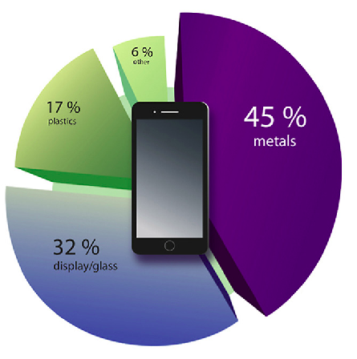
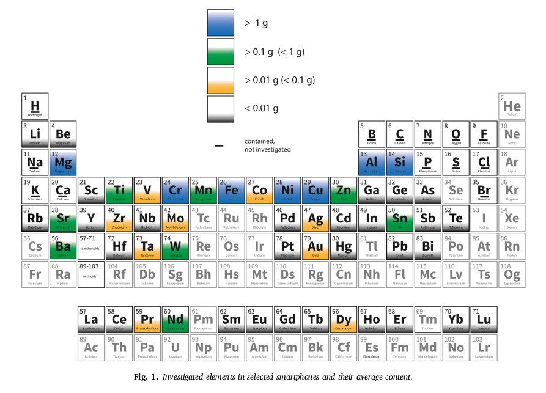
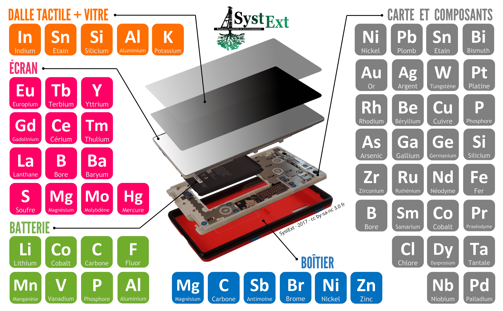

# 🚧 Quels métaux dans les smartphones

!!! Warning
    Attention, cette fiche est en cours de rédaction

Un smartphone est principalement constitué de métaux, de verre et de matières plastiques. 

Source : https://doi.org/10.1016/j.resourpol.2020.101750

## I - Quels métaux dans les smartphones ?

La composition des smartphones n'est que très rarement connue, sachant qu'elle varie en fonction des modèles et évolue rapidement au fil des technologies. On peut néanmoins mettre en avant trois caractéristiques principales :

* la grande diversité des métaux présents dans un smartphone (plus d'une cinquantaine alors qu'en 1950, on dénombrait une douzaine de métaux dans nos bons vieux téléphones fixes) ; 
* la présence en très faible quantité (moins de 0,01 g) d'un grand nombre de ces métaux --- on parle d'usage dispersif --- ce qui cause des difficultés pour le recyclage ;
* la grande variété de leurs usages, comme détaillé plus bas.

	
## II - Quels usages de ces métaux ?

Nous présentons un aperçu des usages des différents métaux dans un smartphone en adoptant la classification industrielle de ces métaux. 

**Métaux de base**

Les métaux de base représentent la majeure partie du poids des métaux dans un smartphone.

- Aluminium (Al ) 

    Métal léger et durable, offrant une protection efficace aux composants internes des appareils, même en cas de chocs. Sa capacité à contrôler la chaleur est essentielle pour maintenir les appareils électroniques au frais lors d'une utilisation prolongée. 

- Cuivre (Cu) 

    Le cuivre est le second meilleur conducteur électrique après l'argent. Il est utilisé dans la production de circuits électriques à haut rendement énergétique. Également résistant à la corrosion, ductile et malléable, il trouve sa principale application dans tous les types de câblage 

- Nickel (Ni) 

    Le nickel est souvent allié à d’autres métaux, dont le chrome, pour composer des aciers spéciaux tels que l’acier inoxydable. Il est très apprécié dans la fabrication des équipements numériques, notamment pour sa résistance à la corrosion et l’usure, son point de fusion élevé, sa ductilité, sa malléabilité et pour ses propriétés magnétiques.

**Métaux précieux**

   Les métaux précieux (ex. argent, or, palladium, platine) représentent environ 0,5 % (en poids) de la totalité des métaux. Ils sont utilisés principalement pour leur conductivité et leur résistance à la corrosion.

**Métaux de spécialité**

La présence d'un grand nombre de ces métaux, parfois en très petite quantité, illustre la grande diversité des fonctionnalités spécifiques qu'ils permettent d'implémenter.

* Les terres rares (ex. néodyme, yttrium) représentent moins de 0,1% (en poids) des métaux dans un smartphone. Ce sont des métaux chimiquement assez réactifs et disposant de propriétés électromagnétiques, électroniques, magnétiques, optiques ou encore catalytiques les rendant indispensables pour des fabrications de haute technologie. Elles servent entre autres à fabriquer les aimants pour les vibreurs des smartphones et à colorer les LED des écrans. 
* Le silicium

- Antimoine (Sb) 

    C’est la forme trioxyde de l’antimoine (ATO) qui est la plus utilisée dans le numérique. En effet, elle améliore et fiabilise les propriétés ignifugeantes des composés halogénés retardateurs de flamme en entrant dans la composition des cartes de circuits imprimés (PCB) notamment dans les serveurs, les réseaux de transmission de données. Cette propriété de l’antimoine induit également son utilisation dans les plastiques d’équipements électroniques (par exemple les boitiers), et dans les gaines de câbles électriques et optiques. De plus, le trioxyde d’antimoine est de plus en plus employé dans les semi-conducteurs comme dopant dans les plaquettes de silicium de type n.

- Cobalt (Co) 

    Le cobalt est apprécié dans la fabrication des équipements numériques pour son point de fusion élevé (1495°C) et ses propriétés magnétiques se conservant jusqu’à des températures élevées. 

- Lithium (Li) 

    Le lithium est très apprécié dans la fabrication des batteries des équipements numériques car de tous les métaux, c’est celui qui possède le potentiel électrochimique le plus élevé et qui est le moins dense à l’état solide.

- Tantale (Ta) 

    Le tantale est apprécié dans le secteur du numérique pour son point de fusion élevé, sa résistance à la corrosion et sa grande permittivité. Le tantale peut être utilisé dans les condensateurs de certains équipements électroniques tels que les smartphones ou disques durs. Une partie du tantale est également utilisée dans les cibles de pulvérisation  pour la production de supports de stockage, de circuits électroniques et d’écrans plats 

- Tungstène (W) 

    Le tungstène est apprécié dans la fabrication des équipements numériques pour sa robustesse et son point de fusion qui est le plus élevé de tous les éléments. C’est le seul matériau utilisé pour les émetteurs d’électrons car il est un bon conducteur d’électricité mais surtout car il possède une pression de vapeur très faible même à haute température. Cette propriété est très importante pour les matériaux de contact électrique, il est ainsi également utilisé dans les circuits intégrés et les dissipateurs thermiques tungstène-cuivre pour évacuer la chaleur des appareils microélectroniques. Le tungstène est aussi utilisé dans le vibreur des smartphones.

- Gallium (Ga) 

    Le gallium utilisé dans la fabrication des équipements numériques se présente notamment sous la forme d’arséniure de gallium (GaAs), apprécié pour sa vitesse de circulation des électrons élevée, et sous forme de nitrure de gallium (GaN). Le gallium est un semi-conducteur. 

- Germanium (Ge) 

    Le germanium est apprécié dans les équipements numériques pour ses propriétés semi-conductrices et optiques. 

- Indium (In)

    La principale application de l'indium est la production de films minces d’oxyde d’indium-étain (ITO). Lorsqu'il est déposé sous forme de film mince sur du verre ou du plastique transparent, il fonctionne comme une électrode transparente. Doté d’un point de fusion bas, il est utilisé dans les soudures, en tant que matériau d’interface thermique ou encore dans des alliages. 

- Silicium (Si) 

    Le silicium métal utilisé dans les équipements numériques est du polysilicium affiné à un niveau de pureté extrême de 10N à 13N . Il est apprécié dans la microélectronique pour ses propriétés semi-conductrices utiles au fonctionnement des circuits intégrés, au stockage et à la transmission d’information.

Pour savoir o
sources utilisées dans les deux études ne sont donc pas comparables.

- une [infographie détaillée](https://www.systext.org/node/1724) des éléments chimiques généralement présents dans un smarphone fournie par Systext en 2017
    
- une récente [étude de l'ADEME](https://librairie.ademe.fr/economie-circulaire-et-dechets/7713-etude-numerique-et-metaux.html) (publiée en novembre 2024) sur les besoins en métaux dans le secteur numérique et les impacts environnementaux associés

Systext a fourni en 2017 une [infographie détaillée](https://www.systext.org/node/1724) des éléments chimiques généralement présents dans un smarphone.

* Les informations concernant l'utilisation des métaux dans les smartphones sont issues de l'outil interactif développé par ISF SystExt (Ingénieurs sans frontières Systèmes extractifs et environnements).  
    Source : [Infographie Des métaux dans mon smartphone ?. Systext. Avril 2017](https://www.systext.org/sites/all/animationreveal/mtxsmp/#/)

Une [étude de l'ADEME d'octobre 2024](https://librairie.ademe.fr/economie-circulaire-et-dechets/7713-etude-numerique-et-metaux.html) considère une liste de 25 métaux critiques nécessaires à l'industrie du numérique et fournit un état de l'art sur les impacts environnementaux et besoins associés. Les métaux indiqués présents dans un smartphone (pages 186-188 du fichier Recueil-fiches-Equipement.pdf) diffèrent en partie de ceux de l'étude Systext sans qu'il soit aisé d'expliquer ces différences. 

## Sources de référence
* L'élémentarium pour tout ce qui relève des propriétés physiques des métaux
* Bookhagen
* Systext
* ADEME sur numérique et métaux critiques
* ADEME pour la terminologie des grandes familles de métaux

 sources utilisées dans les deux études ne sont donc pas comparables. 

- une [infographie détaillée](https://www.systext.org/node/1724) des éléments chimiques généralement présents dans un smarphone fournie par Systext en 2017
    
- une récente [étude de l'ADEME](https://librairie.ademe.fr/economie-circulaire-et-dechets/7713-etude-numerique-et-metaux.html) (publiée en novembre 2024) sur les besoins en métaux dans le secteur numérique et les impacts environnementaux associés