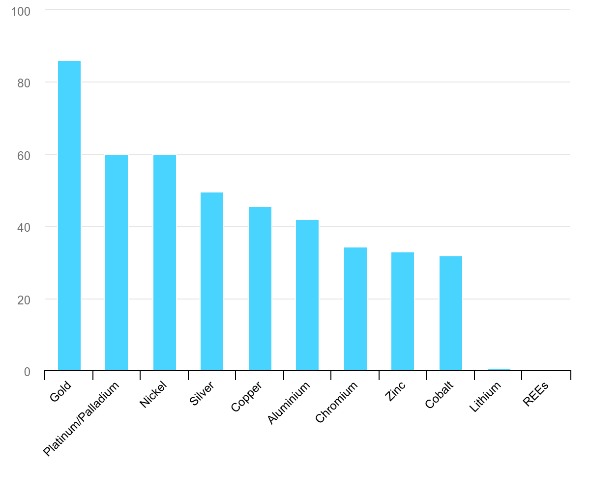
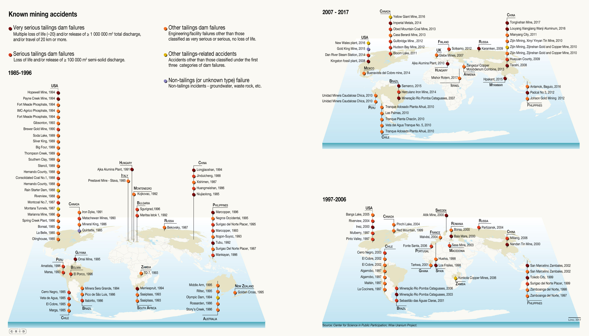
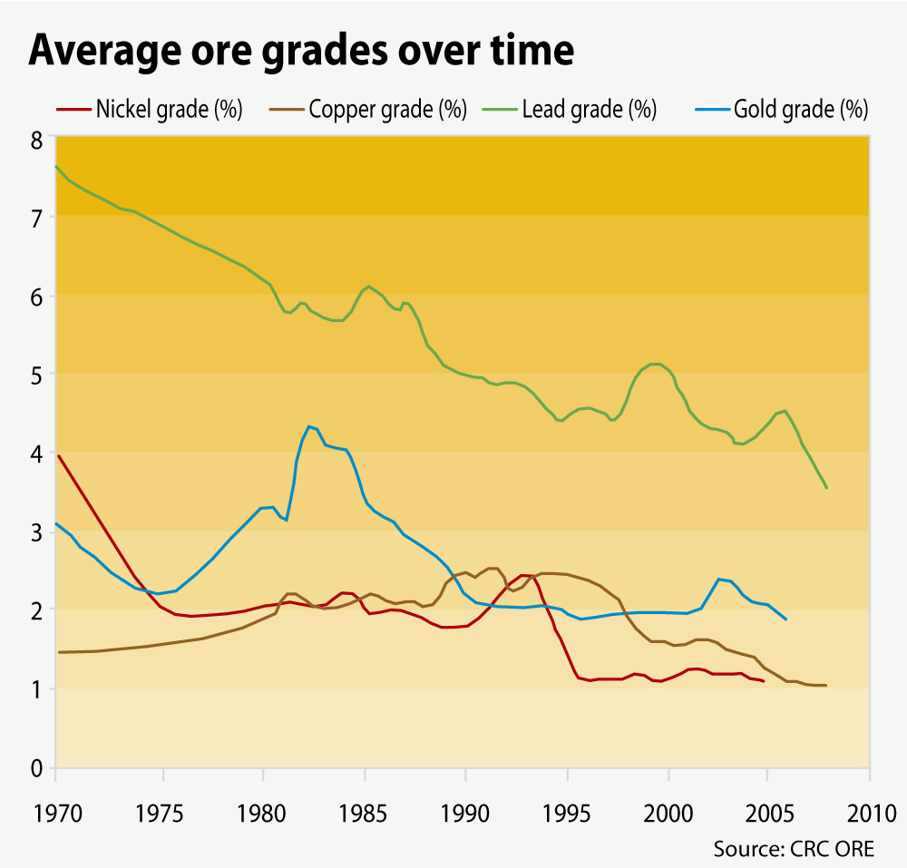
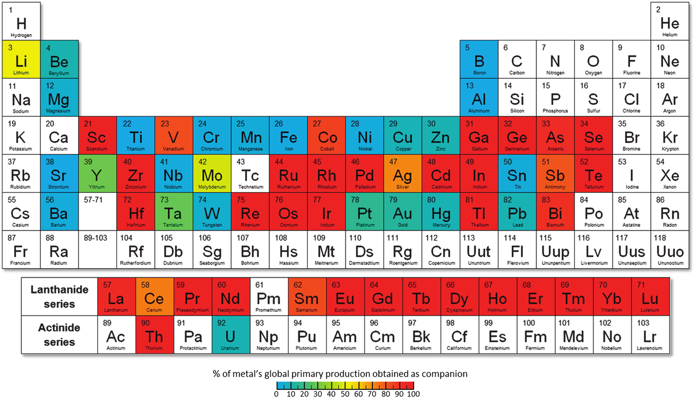

# Sources des cartes Malus

!!! Warning "Page en cours de finalisation"
    Cette page est encore susceptible d'évoluer. La dernière mise à jour date du 6 janvier 2025. 

Les cartes Malus matérialisent les impacts environnementaux et sociaux qui accompagnent la production des ressources nécessaires à la fabrication des composants d'un smartphone. Elles se concentrent sur les impacts environnementaux et sociaux de la production des métaux contenus dans les smartphones. Il est cependant important de ne pas oublier que ces métaux ont bien d'autres usages que la fabrication de smartphones, mais aussi que les impacts environnementaux et sociaux des smartphones ne se limitent pas à la production des métaux qui les composent.

!!! Tip ""
    Par la suite, les encarts comme celui-ci contiennent les textes des malus auxquels les précisions et les sources qui suivent font référence.
    
Les sources utilisées pour les cartes malus sont de natures diverses : rapports d'institutions internationales, articles provenant de journaux de références, publications scientifiques etc. 

Les métaux cités dans les malus sont les suivants : aluminium, cuivre, cobalt, étain, fer, gallium, lithium, magnesium, nickel, or, palladium, platine, plomb, tantale, terres rares, tungstène, zinc. Tous ces métaux sont utilisés dans la fabrication des smartphones.

Les pays cités dans les malus sont les suivants : Afrique du Sud, Australie, Belgique, Brésil, Canada, Chili, Chine, États-Unis, France, Guatemala, Hongrie, Indonésie, Papouasie Nouvelle-Guinée, Pérou, République Démocratique du Congo, Russie, Roumanie. Tous ces pays sont producteurs de métaux utilisés dans la fabrication des smartphones.

## Malus Définition
Ces définitions sont extraites du glossaire.

!!! Tip ""
    [1] Un **minerai** est une roche qu’on extrait pour obtenir, après plusieurs étapes de traitement, des métaux ou d’autres minéraux utiles.

!!! Tip ""
    [2] On appelle **stériles miniers** les roches qu’il faut extraire pour accéder au minerai.

!!! Tip ""
    [3] On appelle **résidus miniers** les déchets (solides ou liquides) produits lors du traitement du minerai.

!!! Tip ""
    [30] La **teneur** en métal d’un minerai est la proportion de métal contenue dans ce minerai. Par exemple, la teneur en cuivre d'un minerai est en moyenne autour de 0,6% (6g de cuivre pour 1kg de minerai).  

!!! Source "Source de la teneur moyenne en cuivre"
    La teneur en métal des différents minerais est indiquée à la table S4 (colonne "*Ore grade*") du papier "Rock-to-Metal Ratio: A Foundational Metric for Understanding Mine Wastes" [^rock]. La teneur en cuivre (*copper*) d'un minerai est en moyenne de 0,64%.
[^rock]: *Rock-to-Metal Ratio: A Foundational Metric for Understanding Mine Wastes*. Nedal T. Nassar, Graham W. Lederer, Jamie L. Brainard, Abraham J. Padilla, and Joseph D. Lessard
Environmental Science & Technology 2022 56 (10), 6710-6721. DOI: 10.1021/acs.est.1c07875. Disponible sur [ACS Publication](https://pubs.acs.org/doi/10.1021/acs.est.1c07875#).

!!! Tip ""
    [55] Un **terril** est une colline artificielle formée par l'accumulation de stériles ou de résidus issus de l’exploitation d'une mine.
    

!!! Tip ""
    [56] On appelle **réserves** mondiales d'un métal (par ex. de cuivre) la quantité actuellement exploitable de ce métal dans la croûte terrestre. Les réserves sont très inégalement réparties dans le monde.

## Malus Traitement

Pour avoir des précisions sur le traitement minéralurgique et métallurgique du minerai après son extraction, voir la fiche détaillée sur la production des métaux.

!!! Tip ""
    [7] Une fois le minerai extrait, il est concassé, broyé et trié pour isoler les minéraux recherchés. C'est une étape qui consomme beaucoup d'énergie et d'eau, et qui génère des résidus.

!!! Tip ""
    [8] Une fois réduit en poudre, le minerai subit différents traitements chimiques et physiques pour éliminer les impuretés jusqu'à obtenir le métal recherché.

## Malus Recyclage

!!! Tip ""
    [27] Le recyclage des cartes électroniques nécessite des technologies de pointe et des infrastructures très coûteuses.

!!! Source "Précisions et sources"

    > *Pour répondre efficacement [aux contraintes techniques posées par la présence d'un grand nombre de métaux en quantités très faibles, le plus souvent utilisés sous la forme d’alliages complexes], les industriels du recyclage doivent réaliser des investissements élevés dans des technologies de pointe. Florian Fizaine cite ainsi l’exemple de la société Umicore : Un milliard de dollars a été investi dans l'usine de recyclage et de raffinage d'Umicore exploitant des DEEE en Belgique (Hagelüken et Corti, 2010). Cette usine extrait 30 tonnes d'or, 37 tonnes de métaux du groupe du platine, 1 000 tonnes d'argent et 68 500 tonnes d'autres métaux par an à partir de déchets. Cela en fait la troisième mine d'or du monde. » Florian Fizaine précise que, par comparaison, une usine de recyclage de papier ne requiert que 30 à 50 millions de dollars d’investissement.*
         
    Page 41 du rapport de France Strategie "[La consommation de métaux du numérique : un secteur loin d’être dématérialisé](https://www.strategie.gouv.fr/publications/consommation-de-metaux-numerique-un-secteur-loin-detre-dematerialise)" publié en juin 2020, la citation provenant de l'article "The economics of recycling rate: New insights from waste electrical and electronic equipment" [^theeconomics]

[^theeconomics]: Florian Fizaine. The economics of recycling rate: New insights from waste electrical and electronic equipment. Resources Policy, 2020, 67, pp.101675. ⟨[10.1016/j.resourpol.2020.101675](https://dx.doi.org/10.1016/j.resourpol.2020.101675)⟩. ⟨[hal-02880890](https://hal.science/hal-02880890)⟩

!!! Tip ""
    [28] Les métaux communs (cuivre, plomb, fer, aluminium...) et les métaux précieux (or, argent, platine...) sont recyclés à plus de 50%.

!!! Source "Précisions et sources"
       La figure 4 du rapport [Recycling rates of metals: A status report](https://www.unep.org/resources/report/recycling-rates-metals-status-report) de l'UNEP publié en mai 2011 indique les taux de recyclage en fin de vie d'une soixantaine de métaux :
   
       

    Le taux de recyclage en fin de vie (EoL RR) mesure l'efficacité avec laquelle les métaux contenus dans des produits en fin de vie sont collectés, pré-traités et enfin recyclés. Voir le rapport de Eurometaux [Recycling Rates of Metals](https://www.eurometaux.eu/media/1510/electroniversionrecyclingratesdec2012_eurometauxeurofer.pdf) publié en 2012 pour plus de précisions.
    
       L'IEA fournit par ailleurs des données plus récentes sur le taux de recyclage en fin de vie de certains métaux. 
        <figure markdown="span">
        
        [End-of-life recycling rates for selected metals](https://www.iea.org/data-and-statistics/charts/end-of-life-recycling-rates-for-selected-metals)
        </figure>
    
!!! Compléments "Complément" 
    Les chiffres avancés ci-dessus concernent l'ensemble des usages des métaux et pas uniquement les usages liés au numérique. Le Global e-waste monitor, dans son [rapport annuel 2024 concernant les DEEE](https://www.itu.int/en/ITU-D/Environment/Pages/Publications/The-Global-E-waste-Monitor-2024.aspx) (Déchets d'Équipements Électriques et Électroniques), qui incluent mais ne se limitent pas aux déchets d'appareils numériques, fournit des chiffres un peu différents. Pour plus de précisions, voir la fiche détaillée sur le recyclage.
    

!!! Tip ""
    [29] De nombreux métaux, dont les terres rares, ne sont quasiment pas recyclés.

!!! Source "Précisions et sources"
    Voir précisions et sources du malus [28].

!!! Tip ""
    [41] Il existe très peu d'usines capables de recycler une grande diversité des métaux contenus dans une carte électronique, et aucune en France.

!!! Source "Précisions et sources"

    > *La France se caractérise par une R&D très active en [matière d'extraction des métaux des cartes électroniques], mais elle ne compte aucun acteur industriel de taille significative. De ce fait, elle ne peut récupérer qu’une part infime des métaux contenus dans ses propres déchets, mais aucun d’eux ne sont des métaux stratégiques.*
    
    Source : [*Le recyclage des cartes électroniques en France*. Christian THOMAS. Juillet 2020](https://www.annales.org/edit/re/2020/re99/2020-07-6.pdf)

    Par contraste, l'usine de recyclage de métaux d'Umicore située à Hoboken en Belgique recycle 28 métaux.

    Source : [*How we recycle metals at Umicore*. Juillet 2019](https://eom.umicore.com/en/news-stories/how-we-recycle-metals-at-umicore/)

!!! Compléments "Complément" 
    Pour plus d'informations sur l'usine d'Umicore, voir les malus [27] et [43].

!!! Tip ""
    [42] Les principales difficultés techniques liées au recyclage des métaux contenus dans les smartphones sont : 1) d'identifier ces métaux 2) de les séparer des autres métaux.

!!! Source "Précisions et sources"

    > *Les industriels du recyclage sont confrontés à deux principales contraintes techniques :*  
    
    > * *l’identification des différents métaux utilisés dans chaque composant des équipements numériques, qui nécessite d’analyser finement chaque alliage ;*
     > * *la séparation technique des métaux présents dans ces alliages en vue de leur réutilisation.* 
     
     Page 41 du rapport [La consommation de métaux du numérique : un secteur loin d’être dématérialisé](https://www.strategie.gouv.fr/publications/consommation-de-metaux-numerique-un-secteur-loin-detre-dematerialise), publié en juin 2020

!!! Tip ""
    [43] <b>Belgique, 2020</b>. À cause des poussières émises par une usine de recyclage de métaux, les enfants de ce quartier présentent des taux de plomb dans le sang considérés comme dangereux.

!!! Source "Précisions et sources"

    Il s'agit de l'usine de recyclage de métaux de l'entreprise Umicore, à Hoboken en Belgique.
    > *Une usine de recyclage de métaux répand du plomb sous forme de particules fines et de poussières près des maisons de cette ville belge. [...] Lors des derniers tests, effectués en juin [2020] par l’institut d’hygiène de la province d’Anvers, près de la moitié des enfants examinés se situaient au-dessus du seuil de dangerosité de 5 microgrammes de plomb par décilitre de sang. [...] Luc Gellens, vice-président d’Umicore, le reconnaissait dans une interview accordée en juillet au quotidien flamand _De Standaard_ : « Il serait préférable qu’il n’y ait pas de familles avec de jeunes enfants vivant dans la région, disait-il. Ou bien à distance suffisante, et je parle de plus d’un kilomètre. » [...] Une des solutions proposées par l’entreprise est le rachat des maisons les plus proches de l’usine, afin de créer une zone tampon.* 
    
    [Belgique : du plomb dans le sang des enfants d’Hoboken. Le Monde, 2020](https://www.lemonde.fr/planete/article/2020/09/24/belgique-du-plomb-dans-le-sang-des-enfants-d-hoboken_6053489_3244.html)

!!! Compléments "Complément" 
    Umicore communique régulièrement sur ces problèmes de pollution, voir par exemple [Managing impact in Hoboken](https://www.umicore.com/en/newsroom/managing-impact-in-hoboken/#tabpanel-french) publié en mars 2021.

## Malus Risques

!!! Tip ""
    [5] Pour stocker les résidus miniers, on crée des lacs artificiels en construisant des barrages ou des digues. Les <b>ruptures de digues</b> sont une des causes de catastrophes environnementales liées aux mines.

!!! Source "Précisions et sources"

       * Une grande mine de cuivre produit en moyenne 1.750 tonnes de concentré de cuivre en une journée, d'une teneur de 20 à 30% en cuivre, pour environ 200.000 tonnes de résidus miniers comprenant 114.000 m³ d'eau. D'où la nécessité de créer des lacs artificiels pour stocker ces résidus. 

          Pour plus de précisions, voir la figure 5 du rapport de l'UNEP [*Mine tailings storage: Safety is no accident*](    https://www.grida.no/publications/383)
         
      * La figure ci-dessous liste les accidents miniers connus depuis 1985 causés par des ruptures de digues ou de barrages miniers.

        

        Figure 7 du rapport de l'UNEP [*Mine tailings storage: Safety is no accident*](https://www.grida.no/publications/383)

!!! Tip ""
    [9] Les déchets miniers (stériles et résidus) contiennent souvent des métaux lourds naturellement présents dans la mine et qui sont dangereux pour la santé et l'environnement : plomb, mercure, arsenic...

!!! Source "Précisions et sources"
    
    > *Les métaux lourds sont des éléments métalliques présentant un poids atomique élevé, tels que le mercure, le chrome, le cadmium, l'arsenic et le plomb. Ils peuvent nuire aux organismes vivants à faibles concentrations et ont tendance à s'accumuler dans la chaîne alimentaire.*  
 
     Source : [Définition de "Métal lourd" sur le glossaire du site ec.europa.eu](https://ec.europa.eu/health/scientific_committees/opinions_layman/amalgams-alternatives/fr/glossaire/mno/metal-lourd.htm)
   
    Certains métaux lourds sont souvent naturellement associés à d'autres métaux (voir les malus [37] et [49] pour des exemples). Si ces métaux lourds ne sont pas eux-mêmes exploités, alors ils se retrouvent dans les déchets miniers.    

!!! Tip ""
    [10] Les résidus miniers contiennent des produits chimiques dangereux utilisés pendant le traitement du minerai. On utilise par exemple du cyanure pour le traitement de l'or.

!!! Source "Précisions et sources"

    La lixiviation est une des méthodes classiques de concentration de minerai.

    >  *La lixiviation est un processus simple d’extraction par dissolution basé sur le fait que tous les minerais ont des coefficients de dissolution différents et peuvent donc se retrouver séparés par la circulation d’un solvant. Ce principe est mondialement utilisé pour extraire l’or (le solvant étant majoritairement le cyanure), mais d’autres métaux comme le cuivre et l’uranium peuvent être extraits ainsi.*  

    Source : rapport de MineralInfo [Exploitation minière et traitement des minerais](https://www.mineralinfo.fr/sites/default/files/documents/2021-01/tome_06_exploitation_miniere_et_traitement_des_minerais_final24032017_1.pdf) publié en février 2017
    

!!! Tip ""
    [37] Les mines d’or contiennent souvent naturellement du mercure et de l’arsenic, dangereux pour la santé et l'environnement.

!!! Source "Précisions et sources"
  
    > *Du mercure est souvent présent dans les gisements de zinc, plomb, cuivre, argent et or.* 

    Source : [L'élémentarium (Société chimique de France, Education nationale)](https://lelementarium.fr/element-fiche/mercure/)

    > *On distingue l’or libre, inclus ou non dans d’autres minéraux, de l’or associé à des sulfures de fer [...], de l’or associé à des sulfures d’arsenic [...] ou d’antimoine [...].* 

    Source : [L'élémentarium (Société chimique de France, Education nationale)](https://lelementarium.fr/element-fiche/or/)

    Le mercure et l'arsenic font partie des métaux lourds, cf malus [9].

    > *Toxiques pour tous les êtres vivants sous leur forme oxydée, ils n’ont aucun rôle bénéfique et s’accumulent dans les chaînes alimentaires (bioaccumulation).* 

     Source : [Métaux lourds : cadmium, mercure et plomb. Commissariat général au développement durable. Juillet 2019](https://www.notre-environnement.gouv.fr/themes/sante/les-produits-chimiques-ressources/article/metaux-lourds-cadmium-mercure-et-plomb)
   
    Pour les dangers que représentent le mercure et l'arsenic pour la santé, voir les fiches détaillées de l'OMS :
    
    * [Fiche sur le mercure](https://www.who.int/fr/news-room/fact-sheets/detail/mercury-and-health)
    * [Fiche sur l'arsenic](https://www.who.int/fr/news-room/fact-sheets/detail/arsenic)

!!! Tip ""
    [49] Les mines de zinc contiennent souvent naturellement du mercure, de l’arsenic et du plomb, dangereux pour la santé et l'environnement.

!!! Source "Précisions et sources"

    > *Du mercure est souvent présent dans les gisements de zinc, plomb, cuivre, argent et or.* 
    
     Source : [L'élémentarium (Société chimique de France, Education nationale)](https://lelementarium.fr/element-fiche/mercure/)

    > *Dans les minerais, le zinc est très souvent associé à Pb [plomb] et Cd [cadmium] ainsi qu’à Fe [fer], Cu [cuivre], Bi [bismuth], Sb [antimoine], As [arsenic], Ge [germanium], In [indium], Ag [argent], Au [or]...*
    
     Source : [L'élémentarium (Société chimique de France, Education nationale)](https://lelementarium.fr/element-fiche/zinc/)

  
    Le mercure, l'arsenic et le plomb font partie des métaux lourds, cf malus [9].

    > *Toxiques pour tous les êtres vivants sous leur forme oxydée, ils n’ont aucun rôle bénéfique et s’accumulent dans les chaînes alimentaires (bioaccumulation).* 

     Source : [Métaux lourds : cadmium, mercure et plomb. Commissariat général au développement durable. Juillet 2019](https://www.notre-environnement.gouv.fr/themes/sante/les-produits-chimiques-ressources/article/metaux-lourds-cadmium-mercure-et-plomb)
 
    Pour les dangers que représentent le mercrure, l'arsenic et le plomb pour la santé, voir les fiches détaillées de l'OMS :
    
    * [Fiche sur le mercure](https://www.who.int/fr/news-room/fact-sheets/detail/mercury-and-health)
    * [Fiche sur l'arsenic](https://www.who.int/fr/news-room/fact-sheets/detail/arsenic)
    * [Fiche sur l'intoxication au plomb](https://www.who.int/fr/news-room/fact-sheets/detail/lead-poisoning-and-health)
  

## Malus Pollutions

!!! Tip ""
    [11] L'extraction et les premières étapes de traitement du minerai (concassage et broyage) génèrent des poussières, sources de pollutions majeures des eaux et des sols.

!!! Source "Précisions et sources"

    > *Une mine à ciel ouvert générera de grandes quantités de poussière contenant des métaux lourds. Tout d’abord, lors du forage et du dynamitage, se forment des nuages de poussière contenant des gaz et particules en suspensions et pouvant affecter la santé des populations locales. Ensuite, l'exploitation à ciel ouvert nécessite de nombreux transports quotidiens des minerais, la plupart du temps par camions, pour acheminer le minerai vers des zones de transformation. Les trajets génèrent des poussières [...].*

    Pages 71-72 du rapport [Étude des risques environnementaux, socio-sociétaux et juridiques des approvisionnements en minerais stratégiques pour les transitions énergétique et numérique](https://record-net.org/media/etudes/253/public/rapport/rapport-record22-0721-1a.pdf) publié en septembre 2023.
    
    > *Lors du processus de fragmentation d’importantes quantités de poussières sont produites par le concassage et le broyage des minerais. [...] Les poussières peuvent se déplacer par voie éolienne, et l’envol de poussières, à partir d’un dépôt de résidus minier ou du minerai mis à nu dans une mine à ciel ouvert peut être à l’origine de la contamination des sols après dépôt et accumulation des poussières.*
    
    Page 82 du même [rapport](https://record-net.org/media/etudes/253/public/rapport/rapport-record22-0721-1a.pdf)

!!! Compléments "Complément"

    Il est intéressant de noter la difficulté à réduire les poussières tout en maîtrisant la consommation d'eau des sites miniers, comme illustré par le discours commercial de cette entreprise spécialisée dans la fabrication de polymères hydrosolubles :
    
    > *L’eau est nécessaire pour la suppression des poussières sur les routes de transport et les équipements de concassage et de transport. De grandes quantités d’eau sont utilisées quotidiennement, ce qui représente une perte nette puisque cette eau s’évapore. Les résidus sont une source majeure d’émissions de poussières, qui pourraient avoir un impact sur la santé des communautés voisines en raison de l’impact de poussières non contrôlées dans l’environnement.*

    Source : [Lutte Contre la Poussière. SNF](https://www.snf.com/l-industrie/mines/depoussierage/?lang=fr)

!!! Tip ""
    [12] Les déchets miniers (stériles et résidus) contiennent souvent du soufre, qui réagit chimiquement à l'air et à l'eau, puis avec d'autres polluants (plomb, arsenic...), causant de graves pollutions des eaux.

!!! Source "Précisions et sources"

    Ce phénomène s'appelle le drainage minier acide (DMA).

    > *En France, la majorité des exploitations de métaux de base (Cu, Pb, Zn), d'antimoine et d'or sont associées à des paragenèses sulfurées et des minéraux du groupe des sulfo-arséniures (arsénopyrite) et sulfo-antimoniures. [...] L'oxydation naturelle des minéraux sulfurés tels que la pyrite, la pyrrhotite, etc., exposés à l'air et à l'eau peut entraîner la production d'effluents suffisamment acidifiés et chargés d'ions métalliques pour poser de sérieux problèmes dans un milieu aquatique récepteur. Ce phénomène est plus souvent appelé **Drainage Minier Acide** (DMA), et constitue le problème environnemental le plus important pour les mines exploitant ce type de minerais.* 
    
    Pages 45-46 du rapport [Les résidus miniers français : typologie et principaux impacts environnementaux potentiels](http://infoterre.brgm.fr/rapports/RR-39503-FR.pdf) publié en juin 1997.
 
    > *Le Drainage Minier Acide ou DMA (AMD en anglais) est un des défis environnementaux majeurs de l’industrie minière. [...] Les réactions chimiques principales qui donnent lieu à un DMA sont l'oxydation du fer, du soufre et surtout de la pyrite, le minéral sulfuré le plus commun. Sous l’action de l’eau et de l’oxygène, les sulfures peuvent alors se transformer en acide sulfurique et attaquer les roches, diminuant drastiquement le pH (pH < 3,5 comparé à un pH neutre égal à 7) et faisant passer en solution des éléments traces métalliques (métaux lourds notamment). La particularité de cette réaction est d’être auto-catalysée, ce qui permet au phénomène de production de DMA de se propager de façon similaire à un incendie [...]. L’écoulement de ce DMA vers le réseau superficiel ou souterrain est une cause fréquente de pollution dans les anciennes zones minières.* 

    Pages 45-46 du rapport [Exploitation minière et traitement des minerais](https://www.mineralinfo.fr/sites/default/files/documents/2021-01/tome_06_exploitation_miniere_et_traitement_des_minerais_final24032017_1.pdf) publié en février 2017.
        

!!! Tip ""
    [13] Dépolluer des anciens sites miniers est extrêmement long, difficile et coûteux, voire impossible.

!!! Source "Précisions et sources"

    À propos de l'ancienne mine d'or et d'arsenic de Salsigne, près de Carcassonne, un rapport du Ministère de l'Aménagement du territoire et de l'Environnement indique en 1998 :  
    > *Compte tenu de la quantité de déchets à traiter, de la surface du site et s'agissant de la pollution laissée par trois quarts de siècles d'activité industrielle, il n'est pas réaliste d'envisager de traiter tous les déchets comme on le ferait pour les déchets produits au jour le jour par une industrie actuellement en activité. [...] Actuellement il ne nous paraît pas possible de supprimer toute pollution des sols.* 
    
    Source : [Le Site de Salsigne (Aude) : rapport à Mme la ministre de l'aménagement du territoire et de l'environnement et à M. le secrétaire d'Etat à l'industrie. Remis le 1er janvier 1998](https://www.vie-publique.fr/rapport/26411-le-site-de-salsigne-aude-rapport-mme-la-ministre-de-lamenagement)

!!! Compléments "Complément"

    Le rapport [Exploitation minière et traitement des minerais](https://www.mineralinfo.fr/sites/default/files/documents/2021-01/tome_06_exploitation_miniere_et_traitement_des_minerais_final24032017_1.pdf) détaille page 57 plusieurs méthodes de neutralisation des DMA issues de stériles ou de résidus miniers :
    
     > 1. *noyer les stocks de stériles et de résidus miniers sous une lame d’eau ou les déverser dans des lacs anoxiques et fermés (l’oxygène pénètre très difficilement dans l’eau).*
     > 2. *traiter passivement le site en :*  
           - *drainant et dérivant les eaux de ruissellement et en recouvrant les stocks de stériles et de résidus miniers d'une couverture imperméable naturelle, permettant une revégétalisation et donc une protection contre l'érosion : couches superposées d'argile et de terre, dépôts de tourbière (riches en matière organique et réducteurs) ;*  
           - *aménageant des zones humides artificielles. Elles utilisent les microbes aériens et aquatiques associés aux végétaux des zones humides pour éliminer les métaux dissous du drainage rocheux. [...] Il s'agit là d'une méthode de traitement relativement nouvelle dotée de nombreux mécanismes spécifiques et d'exigences d'entretien qui ne sont pas encore pleinement compris.*  
           - *créant un canal de calcaire ouvert ou un drain calcaire anoxique.* 

## Malus Catastrophe
Le contenu de ces cartes vient principalement des deux sources suivantes :

* La base de données ARIA (Analyse, Recherche et Information sur les Accidents) du Bureau d’Analyse des Risques et Pollutions Industriels (BARPI) qui est chargé, au sein du ministère de la Transition écologique / Direction générale de la prévention des risques de rassembler, d’analyser et de diffuser les informations et le retour d’expérience en matière d’accidents industriels et technologiques.
    
    Source : [https://www.aria.developpement-durable.gouv.fr](https://www.aria.developpement-durable.gouv.fr)

* Le rapport du Programme des Nations Unies pour l'Environnement (UNEP) intitulé [*Mine tailings storage: safety is no accident*](https://www.grida.no/publications/383) publié en 2017.

!!! Tip ""
    [14] <b>Brésil, 2015</b>. Rupture d'un barrage de résidus près d’une mine de fer, qualifiée par le gouvernement de <i>plus grande catastrophe environnementale de ce pays</i> ». La pollution s'étend durablement jusqu'à l'océan Atlantique à 650 km.

!!! Source "Précisions et sources"
    Il s'agit de la rupture du barrage de résidus miniers d'une mine de fer près du village de Bento Rodrigues à proximité de la ville de Mariana au Brésil, le 5 novembre 2015.  
       
       > *Le gouvernement, qui qualifie cet événement de plus grande catastrophe environnementale de ce pays », suspend l’autorisation d’exploitation.* 
      
      Source : [Rupture de 2 barrages de stériles miniers. ARIA. Novembre 2015](https://www.aria.developpement-durable.gouv.fr/accident/47369/)  
       
       > *Downstream and close to the river mouth, when the river level rises after the rainy season, turbidity increases and metal levels in the water column return to the same level as in November 2015.*  
       
      Source : [Pages 17-19 du rapport *Safety is no accident* de l'UNEP. Novembre 2017](https://www.grida.no/publications/383)

!!! Compléments "Complément"
    Il existe un documentaire sur cette catastrophe disponible que le site du Guardian : [The Safest Place in the World review – the true cost of a lethal Brazilian dam collapse](https://www.theguardian.com/film/2023/dec/04/the-safest-place-in-the-world-review-the-true-cost-of-a-lethal-brazilian-dam-collapse)

!!! Tip ""
    [15] <b>Roumanie, 2000</b>. Rupture de digue près d'une usine de traitement des stériles. Les polluants (dont 115 tonnes de cyanure) détruisent la quasi-totalité de la faune et de la flore d'une rivière sur près de 600 km.

!!! Source "Précisions et source"
    Il s'agit de la rupture d'une digue près d'une usine de traitement des stériles à Baia Mare en Roumanie, le 30 janvier 2000.
    
    > *Si les causes exactes de mortalité piscicole ne sont pas clairement établies (cyanure ou javel ?), il est toutefois avéré que les polluants ont détruit la quasi-totalité de la faune et de la flore de la TISZA sur près de [^1]600 km en impactant toute la chaîne alimentaire.*
    
     Source : [Pollution au cyanure en Europe de l’Est. ARIA. Janvier 2000](https://www.aria.developpement-durable.gouv.fr/fiche_detaillee/17265/)  

!!! Tip ""
    [16] <b>Canada, 2014</b>. Rupture de barrage près d'une mine de cuivre et d'or. Des résidus miniers, contenant entre autres des centaines de tonnes de plomb, se déversent dans deux lacs en aval.

!!! Source "Précisions et source"
    Il s'agit de la rupture d'un barrage près de la mine de cuivre et d'or de Mount Polley au Canada, le 4 août 2014.
       
       > *Une digue d’un bassin de stockage d’effluents miniers d’une mine de cuivre et d’or se rompt. Le contenu (10 millions de mètres cubes d’eau, 13,8 de résidus miniers et 0,6 d’éléments composant la structure du bassin) se déverse dans le ruisseau Hazeltine et les lacs Polley et Quesnel en aval. Le bassin contient du cuivre, du nickel, de l’arsenic, du plomb, du sélénium et du cadmium.[...] En 2013, le bassin en cause avait reçu 326 t de nickel, 177 t de plomb et 18 400 t de cuivre et ses composés.* 

     Source : [Effondrement d’un bassin d’effluents miniers. ARIA. Aout 2014](https://www.aria.developpement-durable.gouv.fr/accident/45566/)  

!!! Compléments "Complément"
    On trouve des informations supplémentaires dans le [rapport *Safety is no accident* de l'UNEP (pages 22-23)](https://www.grida.no/publications/383).  

!!! Tip ""
     [39] <b>Brésil, 2019</b>. Rupture d'un barrage de résidus d’une mine de fer, causant 243 morts, 27 disparus et des centaines de blessés. L'exploitant versera près de 6 milliards d’euros de dommages.

!!! Source "Précisions et source"
    Il s'agit de la rupture d'un barrage de résidus d’une mine de fer près de Brumadinho au Brésil, le 25 janvier 2019.

       > *Selon les bilans de mai 2019, il est déploré 243 morts, 27 disparus et des centaines de blessés. [...] En février 2021, l’exploitant annonce un accord avec les autorités régionales brésiliennes sur le versement de près de 6 milliards d’euros de dommages “sociaux et environnementaux”.*  

     Source : [Rupture d’un barrage minier. ARIA. Janvier 2019](https://www.aria.developpement-durable.gouv.fr/accident/53027/)  
           
!!! Compléments "Compléments"
    Des images de la rupture du barrage existent. – [Rupture d’un barrage minier. ARIA. Janvier 2019](https://www.aria.developpement-durable.gouv.fr/accident/53027/)

!!! Tip ""
    [40] <b>Hongrie, 2010</b>. Rupture de digue près d'une usine d'aluminium. Une boue rouge inonde plusieurs villages, causant 10 morts et 286 blessés. Il s'agit de la pire catastrophe industrielle qu’ait connue la Hongrie.

!!! Source "Précisions et sources"
    Il s'agit de la rupture d'une digue près d'une usine d'aluminium à proximité de la ville d'Ajka en Hongrie, le 4 octobre 2010.
    
       > *10 personnes sont tuées et 286 blessées (brûlures chimiques et irritations oculaires) dont 121 hospitalisées.*   
        Source : [Rupture d’un bassin de boue rouge d’aluminium. ARIA. Octobre 2010](https://www.aria.developpement-durable.gouv.fr/fiche_detaillee/39047/)
           
       > *Cet accident est la plus grave catastrophe industrielle qu’ait connue la Hongrie.*  
        Source : [Rejet massif de boue rouge d'aluminium après rupture d'un bassin de stockage. ARIA. Octobre 2010](https://www.aria.developpement-durable.gouv.fr/wp-content/files_mf/A39047_ips39047_003.pdf)
           

!!! Compléments "Complément"
    Un reportage de France 2 sur la catastrophe est visible sur le site de la base ARIA : [Rupture d’un barrage minier. Janvier 2019](https://www.aria.developpement-durable.gouv.fr/accident/53027/)

## Malus Tensions

!!! Tip ""
    [17] La Chine est le premier producteur mondial de terres rares et d'autres métaux comme le gallium ou le magnésium. Cela représente un enjeu géopolitique majeur.

!!! Source "Précisions et sources"
    
       * Pour la liste des métaux dont la Chine est le principal producteur, voir la table 5 (colonne _Percentage of world total_) du rapport _"Mineral Commidity Summaries 2024"_ de l'Institut d'études géologiques des États-Unis (USGS)  
       Source : [Mineral commodity summaries 2024. USGS Janvier 2024.](https://www.usgs.gov/publications/mineral-commodity-summaries-2024)

    * Pour l'enjeu géopolitique, voir par exemple : [Terres rares : notre ultra-dépendance à la Chine (et comment en sortir).  Olivier Soria, Juliette Grau. The conversation. Octobre 2019](https://theconversation.com/terres-rares-notre-ultra-dependance-a-la-chine-et-comment-en-sortir-125855)

!!! Tip ""
    [50] Une grande partie des exploitations minières se situent dans des pays en situation de <b>stress hydrique</b>, où les besoins en eau douce dépassent les ressources disponibles.

!!! Source "Précisions et source"
    > *Ainsi, d’après le Columbia Center on Sustainable Investment, environ 70 % des exploitations minières des six principales compagnies minières dans le monde sont localisées dans des pays où il existe un stress hydrique.*  

    Source : section 1.3.2 du rapport de France Stratégie publié en juin 2020 : [La consommation de métaux du numérique : un secteur loin d’être dématérialisé](https://www.strategie.gouv.fr/publications/consommation-de-metaux-numerique-un-secteur-loin-detre-dematerialise)  
     
    Notons que la référence originale pour ce chiffre n'est plus disponible en ligne. 
    
    Andrew Metcalf, “Water scarcity to raise capex and operating costs, heighten operation risks,” Report number 149714, Moody's Investor Service, Special Comment (February 2013).

## Malus Conflits

Des journaux de référence tels que le Guardian et le Monde publient régulièrement des enquêtes approfondies sur les conflits liés à l'industrie minière.

Il existe par ailleurs des bases de données qui recensent les conflits environnementaux liés aux mines, par exemple :  

* [Carte interactive *Mineral ore exploration and building materials extraction*. EJAtlas](https://ejatlas.org/category/mineral-ores-and-building-materials-extraction)   
* [Carte interactive *Conflictos Mineros en América Latina*. Observatorio de Conflictos Mineros de América Latina](https://mapa.conflictosmineros.net/) (pour l'Amérique latine)

!!! Tip ""
    [18] Étain, tantale, or et tungstène sont appelés <b>minerais de conflits</b>, ou <b>minerais de sang</b>, car leur exploitation est au coeur de conflits armés, comme en République Démocratique du Congo.

!!! Source "Précisions et source"
    > *Au sein des zones politiquement instables, le commerce de minerais tels que [l’étain, du tantale, du tungstène et de l’or] peut servir à financer des groupes armés, engendrer le travail forcé et d’autres atteintes aux droits de l’homme, et favoriser la corruption et le blanchiment d’argent. [...] Ces minerais du conflit sont ensuite utilisés pour la fabrication d’objets du quotidien, comme les téléphones portables, les voitures ou les bijoux.* 

    Source : [Règlement *Commerce responsable des minerais provenant de zones de conflit ou à haut risque*. site de l'Union européenne](https://eur-lex.europa.eu/FR/legal-content/summary/responsible-trade-in-minerals-from-high-risk-or-conflict-areas.html)

!!! Compléments "Complément"
    Un document du Service de recherche du Parlement européen rédigé en 2015 fournit des informations supplémentaires sur la proposition de règlement européen (qui a finalement été adoptée en 2017).  
    
    Source : [Briefing *Les minéraux des conflits-La proposition de règlement européen*. Parlement européen. Février 2015](https://www.europarl.europa.eu/RegData/etudes/BRIE/2015/548985/EPRS_BRI(2015)548985_REV1_FR.pdf)

!!! Tip ""
    [19] <b>Guatemala, depuis 2014</b>. Les populations locales luttent contre la réouverture d'une mine de nickel qu'ils accusent de pollutions et d'accaparement du territoire sur lequel elles vivent.
 
!!! Source "Précisions et source"
     La mine de nickel Fenix près d'El Estor, au Guatelama, a rouvert en 2014.  
     
     > *As the quarries expand, hundreds of families in the surrounding Mayan villages fear eviction, and the loss of the environment that sustains them.*
     
     > *Solway [the European-owned business that bought the mine in 2011]’s licence extends over a particularly sensitive region: 247 sq km of densely forested hills that are home to 20 settlements belonging to the Q’eqchi’ people. Some own their land, some are considered squatters. A number sit on, or near, rich nickel deposits. When the settlers of El Paraíso moved here, the mine, which dates to the 1970s, lay dormant. They struck a deal with the government’s land bank, Fondo de Tierras, put up their huts and planted corn. But their crops are now failing. First the plants were stunted; now Choc says they die as seedlings. Choc blames the dust.*
     
     Source : [The Guatemalans who pay the price for the west’s need for nickel. The Guardian. Juin 2019](https://www.theguardian.com/environment/2019/jun/19/guatemalans-pay-price-west-need-nickel)
     
     > *A El Estor, dans le sud-est du pays, Fenix, l’un des plus gros gisements de nickel d’Amérique centrale, est accusé de polluer les terres et les eaux alentour.* 
     
     > *Les habitants, en majorité des Mayas de langue kekchie, entretiennent un rapport sacré à cette terre et à cette immense étendue d’eau, aujourd’hui menacée par les rejets résultant de l’activité minière à ciel ouvert. D’aussi loin que remonte la mémoire collective, ils ont subi l’expansion brutale des multinationales minières.* 
     
     Source : [Mining Secrets » : nouvelles révélations sur les pratiques controversées d’un géant de l’industrie minière au Guatemala. Le Monde. 2022](https://www.lemonde.fr/international/article/2022/03/06/mining-secrets-nouvelles-revelations-sur-les-pratiques-controversees-d-un-geant-de-l-industrie-miniere-au-guatemala_6116375_3210.html)

!!! Compléments "Complément"
    On trouve des informations détaillées concernant le conflit autour de la mine Fenix sur le site web du collectif international de journalistes *Forbidden Stories* qui est à l'origine des articles de presse cités ci-dessus.  

    Source : [Scandales environnementaux : quand l'union fait la force. Mining Secrets](https://forbiddenstories.org/fr/projects_posts/fr-mining-secrets/)

!!! Tip ""
    [20] <b>Papouasie Nouvelle-Guinée, 1989</b>. Le conflit environnemental et social autour d'une mine de cuivre et d'or se transforme en une guerre civile qui fera environ 20.000 morts en 10 ans.
 
!!! Source "Précisions et source"
    La mine de cuivre et d'or de Panguna, en Papouasie Nouvelle-Guinée, a été au coeur d'un conflit environnemental qui s'est transformé en guerre civile. Entre 1989 et 2001, environ 20.000 personnes sont tuées.
    
    > *Panguna was once one of the world’s largest and most profitable copper and goldmines and still contains an estimated 5.3m tons of copper and 19.3m ounces of gold, which would make the reserves worth about $60bn at today’s prices. [...] In 1989, amid rising community anger at the environmental damage and the inequitable division of the mine’s profits, locals forced the mine closed, blowing up Panguna’s power lines and sabotaging operations. The PNG government sent in troops against its own citizens to restart the foreign-owned mine, sparking a bloody, decade-long civil war. [...] The civil war claimed the lives of about 20,000 people and amplified calls for Bougainvillean independence.*
    
    Source : [Panguna mine at centre of bloody Bougainville conflict set to reopen after 30 years. The guardian. Février 2022](https://www.theguardian.com/world/2022/feb/11/panguna-mine-at-centre-of-bloody-bougainville-conflict-set-to-reopen-after-30-years)

!!! Tip ""
    [21] Au Chili, au Pérou et en Argentine, les <b>besoins en eau</b> pour la production de cuivre ou de lithium entrent en conflit avec les besoins des populations locales. 

!!! Source "Précisions et source"
    
    Le site web hispanophone [Conflictos Mineros en América Latina](https://mapa.conflictosmineros.net/ocmal_db-v2/) liste 38 conflits miniers liés à l'eau au Chili, 24 au Pérou et 18 en Argentine.

!!! Compléments "Compléments"

    Le rapport de Mining Watch "[Mapping community resistance to the impacts and discourses of mining for the energy transition in the Americas](https://miningwatch.ca/node/10804)" publié en mars 2022 documente 25 exemples (listés pages 18-22), dont 2 au Pérou, 5 au Chili et 7 en Argentine, tous liés à l'extraction du cuivre ou du lithium. 
    
    On y lit par exemple :
    
    > *Lithium mining, especially in brine, requires an intensive extraction of water, which contains the sought-after minerals. Many consider this **water mining**. Studies carried out at the Atacama salt flat report that, “In order to produce a ton of lithium, 2 million liters of water are evaporated from the wells. That’s 2,000 tons of water that cannot be recirculated” and that, at this rate of extraction, the water will be difficult to recover. It is estimated that over 226 million liters of water are pumped daily in the whole of the water basin. By extracting brine, fresh water from the peripheral groundwater is displaced to fill up what was extracted. It then mixes with the salt water and becomes saline for good, damaging the freshwater sources of the water basin.*
    
       Pages 26-27 du rapport
    
    > *La Escondida mine in Chile is a landmark case. BHP Billiton owns the project and has provoked “continuous, permanent, cumulative and irreparable” damage to the underground aquifer of the Punta Negra Salt Flat. After 27 years extracting water from the salt flat for its copper mine (until 2017), “the levels of the salt flat aquifer diminished to such a point that the wetlands and all the vegetation surrounding it dried up. A large proportion of the fauna that inhabited it disappeared as it lost its habitat.*
    
    Page 31 du rapport

!!! Tip ""
    [38] L’industrie minière est la première cause dans le monde de <b>conflits environnementaux</b>. En 2019, 50 défenseurs de l'environnement ont été assassinés dans des conflits liés à l'industrie minière.

!!! Source "Précisions et source"  

    Voir la figure 1 du papier *Environmental conflicts and defenders: A global overview*, qui s'appuie sur [EJAtlas](https://ejatlas.org/), l'atlas global de la justice environnementale.  
   
       Source : [Arnim Scheidel, Daniela Del Bene, Juan Liu, Grettel Navas, Sara Mingorría, Federico Demaria, Sofía Avila, Brototi Roy, Irmak Ertör, Leah Temper, Joan Martínez-Alier. *Environmental conflicts and defenders: A global overview*. Global Environmental Change, Volume 63, 2020, 102104, ISSN 0959-3780.](https://doi.org/10.1016/j.gloenvcha.2020.102104)  
       
       > *Mining was still the most culpable industry – connected with the murders of 50 defenders in 2019.*  
       
       Source : Page 6 du [rapport 2020 de l'ONG Global Witness: Defending Tomorrow ](https://www.globalwitness.org/en/campaigns/environmental-activists/defending-tomorrow/)

## Malus En France

!!! Tip ""
    [22] Il y a encore des mines en activité en France : on exploite de l'or en Guyane, du nickel en Nouvelle-Calédonie (6% de la production mondiale en 2023) et de la bauxite vers Montpellier.

!!! Source "Sources"

    On trouve la liste des mines exploitées en France aujourd'hui sur le site de Mineralinfo, le portail français des ressources minérales non énergétiques.  
    Source : [Les mines en France. Mineral info](https://www.mineralinfo.fr/fr/ressources-minerales-france-gestion/mines-france)
       
    Le chiffre de 6% est calculé à partir des données de la page 123 du rapport 2024 de l'USGS.   
     Source : [Mineral commodity summaries 2024. U.S. Geological Survey](https://www.usgs.gov/publications/mineral-commodity-summaries-2024)

!!! Tip ""
    [23] L'ouverture d'une mine de lithium est prévue d'ici 2027 dans le Massif central. Ce sera l'une des plus grandes d'Europe.

!!! Source "Source"

    Il s'agit d'une mine située à Beauvoir dans l'Allier. 
    
    Voir par exemple l'article "L'une des plus grandes mines européennes de lithium va ouvrir en France d'ici 2027".  

    Source : [L'une des plus grandes mines européennes de lithium va ouvrir en France d'ici 2027. France Inter. Octobre 2022](https://www.radiofrance.fr/franceinter/l-une-des-plus-grandes-mines-europeennes-de-lithium-va-ouvrir-en-france-d-ici-2027-3063449)

!!! Tip ""
    [24] Des centaines d'anciennes mines n'ont pas été dépolluées lors de leur fermeture. Certaines causent aujourd'hui encore des pollutions majeures.

!!! Source "Précisions et sources"

    > *Si le code minier a progressivement soumis les exploitations à des obligations de remise en état et de surveillance au moment de la cessation d'activité, les nombreux anciens sites miniers, désormais orphelins, n'ont pour la plupart pas fait l'objet d'une telle réhabilitation. La France compte aujourd'hui 1 850 sites miniers, parmi lesquels seulement 225 font toujours l'objet d'un titre d'exploitation valide.* 

    Source : Rapport de commission d'enquête du sénat ["Pollutions industrielles et minières des sols : assumer ses responsabilités, réparer les erreurs du passé et penser durablement l'avenir Tome I"](https://www.senat.fr/rap/r19-700-1/r19-700-114.html#toc638). Septembre 2020

    En ce qui concerne les pollutions majeures, voir le cas de l'ancienne mine de Salsigne, malus [45]. 
    

!!! Tip ""
    [44] Une ancienne mine d'or vers Carcassonne cause d'importants problèmes de pollution à l'arsenic. Il a entre autres été interdit de vendre des légumes produits dans la région.

!!! Source "Précisions et sources"
    À propos de l'ancienne mine d'or et d'arsenic de Salsigne, près de Carcassonne, un rapport du Ministère de l'Aménagement du territoire et de l'Environnement indique en 1998 :   
    
    > *Le niveau de 50 mg d'arsenic par litre est largement dépassé dans le Grésillou à son confluent avec l'Orbiel à Lastours et ce même niveau est souvent dépassé à Conques, ce niveau est dépassé dans un puits communal à Conques. Il a été constaté que certains légumes cultivés sur des sols inondables en bordure de l'Orbiel ou arrosés avec de l'eau venant de l'Orbiel, ou de puits proches de l'Orbiel et de ses affluent qui coulent près du site de Salsigne, contenaient des teneurs anormales en métaux et arsenic. Un arrêté interministériel du 30 mai 1997 a interdit la mise sur le marché des légumes feuilles (salades, etc.) concernés pour une durée de un an.* 
    
    Source : [Le Site de Salsigne (Aude) : rapport à Mme la ministre de l'aménagement du territoire et de l'environnement et à M. le secrétaire d'Etat à l'industrie](https://www.vie-publique.fr/rapport/26411-le-site-de-salsigne-aude-rapport-mme-la-ministre-de-lamenagement). Janvier 1998 

!!! Compléments "Complément"

    * Pour des précisions sur les recommandations sanitaires de l'Agence Régionale de Santé Occitanie en 2019, voir : [Recommandations sanitaires vallée de l’Orbiel- Mars 2019. A l’attention des communes de : VILLARDONNEL, SALSIGNE, VILLANIERE, LASTOURS, CONQUES/ORBIEL, VILLALIER et TREBES pour les parcelles ayant été inondées par l’Orbiel ou ses affluents. Agence régionale de santé occitanie](https://www.occitanie.ars.sante.fr/system/files/2019-06/2019_Recommandations%20sanitaires%20%C3%A0%20la%20population.pdf). 

    * Pour plus d'informations sur les conséquences sanitaires sur la population de la mine, voir : [Salsigne. Quand la mine dort, la pollution veille. La dépêche. Janvier 2025](https://www.ladepeche.fr/article/2013/03/21/1587889-salsigne-quand-la-mine-dort-la-pollution-veille.html)  
        On y lit entre autres :
        
        > *Chaque année la montagne rejette dans la rivière Orbiel 3 650 kg d'arsenic. [...] Mille ans seront nécessaires pour faire table rase des scories.*
    
    * On trouve également des informations très détaillées dans une présentation de l'association France Nature Environnement sur la situation en 2021 
    
        Source : [La gestion du passif minier - Tirer les leçons des erreurs du passé. Association France Nature Environnement. Janvier 2021](https://fne-ocmed.fr/wp-content/uploads/2021/02/presentation_Oge_salsigne.pdf)  
        
        On y trouve entre autres cette citation d'un [rapport de la cour des Comptes de 2003](https://www.ccomptes.fr/sites/default/files/EzPublish/Salsigne.pdf)  (page 361):
        > *L’extraction de l’or produisant des déchets à forte composante en arsenic, le site est aujourd’hui, selon le ministère de l’écologie et du développement durable, l’un des plus pollués de France.*  

!!! Tip ""
    [45] Plusieurs projets d'exploration minière sont actuellement en cours ou en attente d'autorisation en France, pour exploiter or, lithium, étain...

!!! Source "Précisions et source"

       > *Deux permis d'exploration sont en cours de validité dans le Massif central :         
            - PER Bonneval » : pour la recherche d'or, d'argent, d'antimoine et de substances connexes dans le Limousin et détenu par la société Cordier Mines ;  
            - PER Beauvoir » : pour la recherche d'étain, de niobium de tantale, de tungstène, de béryllium et de lithium et détenu par la société Imerys Ceramics France.*

      > *Plusieurs demandes de permis d'exploration sont en cours d'instruction.*  
      
      Source : [Le potentiel du sous-sol français. Mineral info](https://www.mineralinfo.fr/fr/ressources-minerales-france-gestion/potentiel-du-sous-sol-francais)

## Malus Géographie 

Pour toutes ces cartes :

* Les chiffres concernant la production des différents métaux viennent de la table 5 (colonne *Percentage of world total*) du rapport *"Mineral Commidity Summaries 2024"* de l'Institut d'études géologiques des États-Unis (USGS).  
  Source : [Mineral commodity summaries 2024. U.S. Geological Survey](https://www.usgs.gov/publications/mineral-commodity-summaries-2024)

* Les informations concernant l'utilisation des métaux dans les smartphones sont issues de l'outil interactif développé par ISF SystExt (Ingénieurs sans frontières Systèmes extractifs et environnements).  
    Source : [Inforgraphie Des métaux dans mon smartphone ?. Systext. Avril 2017](https://www.systext.org/sites/all/animationreveal/mtxsmp/#/)
    
     Attention, ces informations sont à prendre avec précaution car la composition précise des smartphones n'est que rarement et partiellement connue, sachant qu'elle varie en fonction des smartphones et évolue rapidement avec l'évolution des technologies. Voir la fiche détaillée sur les métaux dans les smartphones pour plus d'informations. 

!!! Tip ""
    [25] La <b>République Démocratique du Congo</b> est le premier producteur mondial de <b>cobalt</b> (74% de la production en 2023). On trouve du cobalt dans la carte mère et la batterie des smartphones.

!!! Tip ""
    [26] L'<b>Indonésie</b> est le premier producteur mondial de <b>nickel</b> (50% de la production en 2023). On trouve du nickel dans la carte mère et la coque des smartphones.

!!! Tip ""
    [46] La <b>Russie</b> est le premier producteur mondial de <b>palladium</b> (44% de la production en 2023). On trouve du palladium dans la carte mère des smartphones.

!!! Tip ""
    [47] L'<b>Australie</b> est le premier producteur mondial de <b>lithium</b> (48% de la production en 2023). On trouve du lithium dans la batterie des smartphones.

!!! Tip ""
    [51] La <b>Chine</b> est le premier producteur mondial de <b>terres rares</b> (69% de la production mondiale en 2023, contre 98% en 2010). On trouve des terres rares dans la carte mère et l'écran des smartphones.

!!! Source "Source pour la production en 2010"
    La part de la Chine dans la production mondiale de terres rares est indiquée dans le [rapport 2011 de l'USGS (page 129)  Mineral commodity](https://d9-wret.s3.us-west-2.amazonaws.com/assets/palladium/production/mineral-pubs/mcs/mcs2011.pdf)

!!! Tip ""
    [52] La <b>République Démocratique du Congo</b> est le premier producteur mondial de <b>tantale</b> (41% de la production en 2023). On trouve du tantale dans la carte mère des smartphones.

!!! Tip ""
    [53] La <b>Chine</b> est le premier producteur mondial de <b>gallium</b> (98% de la production en 2023). On trouve du gallium dans la carte mère des smartphones.

!!! Tip ""
    [54] L'<b>Afrique du Sud</b> est le premier producteur mondial de <b>platine</b> (67% de la production en 2023). On trouve du platine dans la carte mère des smartphones.

## Malus Pour info

!!! Tip ""
    [31] Pour satisfaire la demande en métaux on extrait des minerais avec des teneurs de plus en plus faibles. Il faut donc extraire beaucoup plus de matière pour produire la même quantité de métal.

!!! Source "Précisions et sources"

    * Le graphique suivant montre que la teneur moyenne en cuivre des minerais extraits (*"copper ore grade"*) est passée de 4% à 1% entre 1900 et 2010. Comme indiqué dans le malus [30], la teneur actuelle du minerai de cuivre est de 0,6% en moyenne.
    
    
    
    Source : [Declining copper ore grades. Grid Arendal](https://www.grida.no/resources/6291)

    * Le graphique suivant montre l'évolution depuis 1970 de la teneur moyenne de différents minerais : nickel, cuivre (*copper*), plomb (*lead*), or (*gold*).
    
    <figure markdown="span">
        
    </figure>
    
    Source : [Average ore grades over time. Grid Arendal](https://www.grida.no/resources/6292)

!!! Tip ""
    [32] Les <b>terres rares</b> (à ne pas confondre avec les métaux rares !) sont des métaux assez abondants dans la croûte terrestre mais avec une teneur très faible.

!!! Source "Source"
    Voir le [glossaire](../Glossaire.md).
        

!!! Tip ""
    [33] Même s'il existe de nombreuses mines <b>souterraines</b>, la majorité des mines actuelles sont exploitées à <b>ciel ouvert</b>.

!!! Source "Précisions et source"

    > *L'exploitation minière à ciel ouvert est la méthode la plus couramment utilisée dans le monde pour l'extraction des minéraux : 57% des mines du monde sont exploitées à ciel ouvert en nombre, et 88% en production.* 

    Page 48 du rapport [Étude des risques environnementaux, socio-sociétaux et juridiques des approvisionnements en minerais stratégiques pour les transitions énergétique et numérique. Record. Septembre 2023](https://record-net.org/media/etudes/253/public/rapport/rapport-record22-0721-1a.pdf)
    

!!! Tip ""
    [48] On exploite souvent plusieurs métaux dans une mine. Il existe par exemple de nombreuses mines produisant à la fois du cuivre et du zinc.

!!! Source "Précisions et source"

    La Figure 2 du papier [*Article By-product metals are technologically essential but have problematic supply*](10.1126/sciadv.1400180), reproduite pour le malus [TODO], montre un certain nombre d'associations de métaux qui sont produits conjointement, les uns étant des sous-produits des autres. 
    
    On lit par exemple dans la table S1 des *Supplementary materials* du même papier que 2% de la production de cuivre est obtenue dans des mines qui exploitent principalement du zinc, et 4% de la production de zinc dans des mines qui exploitent principalement du cuivre.
    
    Par ailleurs, parmi les principales mines de cuivre et de zinc mentionnées sur le site web [l'Élémentarium](https://lelementarium.fr), on en trouve plusieurs qui produisent à la fois du cuivre et du zinc :
    
    >  * *La mine d’Antamina, située à 4 300 m d’altitude est exploitée, à ciel ouvert, depuis 2001. En 2023, la production a été de 421 926 t de cuivre, 464 000 t de zinc, 360,5 t d’argent et, en 2022, 3 260 t de plomb, 3 130 t de molybdène.* 
    > * *La mine souterraine de Neves Corvo, au Portugal, a commencé à être exploitée en 1990 pour le cuivre et 2006 pour le zinc. La production, en 2023, a été de 33 823 t de cuivre, 108 212 t de zinc, et, en 2021, 4 890 t de plomb et 29,9 t d’argent.* 
    >  * *[First Quantum exploite en Turquie] la mine de Çayeli, avec 11 036 t de cuivre et 3 597 t de zinc.* 
    
    On y lit également :
     >  *La production de cuivre [de l'entreprise Glencore] a donné, en 2023, une co-production de 156 600 t de zinc, 38 800 t de cobalt, 292 t d’argent et 4,29 t d’or. Par ailleurs, la production de zinc a donné une coproduction de 106 500 t de cuivre.* 

    Source : [L'élémentarium (Société chimique de France, Education nationale)](https://lelementarium.fr/element-fiche/cuivre/)

!!! Tip ""
    [57] En France, le <b>code minier</b> définit la distinction entre mines et carrières. On parle de mine lorsque le matériau extrait est considéré comme stratégique, et sinon, de carrière.

!!! Source "Précisions et source"
    
    > *Les "mines" sont les exploitations, sous-terre ou à ciel ouvert, de gisements définis par une liste figurant dans le code minier (sel, minerais métalliques, gaz et énergies fossiles...). Tout autre activité terrestre d'extraction de minéraux est une "carrière". [...] D’une manière générale, les substances de mines se distinguent par une relative rareté à l’échelle nationale et une importance économique accrue, voire stratégique, qui justifie que leur gestion soit confiée à l’État et non laissée à la libre disposition du propriétaire du sol. Toutes les autres substances relèvent de la classe des carrières et sont laissées à la libre disposition du propriétaire du sol.* 
    
    Source : [Les mines en France. Mineral info](https://www.mineralinfo.fr/fr/ressources-minerales-france-gestion/mines-france)

!!! Tip ""
    [58] De nombreux métaux du numérique sont des <b>sous</b>-<b>produits</b>, c'est-à-dire qu'ils sont récupérés lors du traitement d'autres métaux. Par exemple, le gallium est un sous-produit de l'aluminium.

!!! Source "Précisions et source"
    
    > *Le gallium ne forme pas de gisements économiquement exploitables à l’état naturel, et provient en grande majorité de la filière de production d’aluminium (sous-produit du raffinage de la bauxite en alumine).* 
    
    Source : [Gallium (Ga). Mineral info](https://www.mineralinfo.fr/fr/substance/gallium-ga)
       
       Dans le cas général, on trouve une liste des métaux du système périodique qui sont principalement obtenus comme des sous-produits dans la Figure 1 du papier [*Article By-product metals are technologically essential but have problematic supply*, NT Nassar, 2015](https://www.science.org/doi/10.1126/sciadv.1400180). Parmi ces métaux on trouve un grand nombre de métaux présents dans les smartphones, comme le cobalt, le germanium, le zirconium, l'indium, les terres rares...
       
      <figure markdown="span">
           
        </figure>

!!! Compléments "Complément"
    La figure 2 du même papier, reproduite pour le malus [TODO], décrit plus précisément les relations de dépendance entre métaux, et en particulier quel métal est un sous-produit de quel autre.

!!! Tip ""
    [59] La teneur moyenne varie beaucoup entre les différents métaux : environ 45% pour le fer (45g de fer pour 100g de minerai) mais seulement 0,00008% pour l'or (8g d'or pour 10 tonnes de minerai) !

!!! Source "Précisions et source"
    
    La teneur en métal des différents minerais est indiquée à la table S4 (colonne "_Ore grade_") du papier [*Rock-to-Metal Ratio: A Foundational Metric for Understanding Mine Wastes*, NT Nassar, 2022](https://pubs.acs.org/doi/10.1021/acs.est.1c07875). La teneur en fer (_iron_) d'un minerai est en moyenne de 44,81%, celle en or (_gold_) est de 0,00008%.
    

!!! Tip ""
    [60] La production mondiale varie beaucoup entre les métaux : quelques centaines de tonnes par an pour certains métaux précieux mais 100.000 fois plus pour certains métaux communs !

!!! Source "Précisions et source"
    Voir la table 5 (colonne *World production total*) du rapport *"Mineral Commidity Summaries 2024"* de l'Institut d'études géologiques des États-Unis (USGS) reproduite dans la partie sur les malus Géographie.  
    
    On voit entre autres que la production mondiale de platine en 2023 était d'environ 180 tonnes, alors que celle d'aluminium était estimée à 400 millions de tonnes.

## Malus En image

!!! Tip ""
    [4] Lac de résidus miniers, Pérou  

!!! Source "Précisions et source"
    Cette photo montre le lac de résidus miniers de la mine de cuivre et zinc d'Antamina au Pérou.  
    Source : [page wikipedia de "Barrage d'Antamina"](https://fr.wikipedia.org/wiki/Barrage_d%27Antamina)

!!! Tip ""
    [6] Rupture de digue, Brésil 2019

!!! Source "Précisions et source"
    Cette photo a été prise suite à la rupture du barrage de Brumadinho au Brésil le 25 janvier 2019, voir malus [40].  
    Source : [page wikipedia de "Rupture du barrage de Brumadinho"](https://fr.wikipedia.org/wiki/Rupture_du_barrage_de_Brumadinho)

!!! Tip ""
    [34] Mine de cuivre, Roumanie

!!! Source "Précisions et source"
    Cette photo montre la mine de cuivre de Roșia Poieni en Roumanie.  
    Source : [page wikipedia de "Mine de Roșia Poieni"](https://fr.wikipedia.org/wiki/Mine_de_Ro%C8%99ia_Poieni)

!!! Tip ""
    [35] Mine de coltan, République Démocratique du Congo

!!! Source "Précisions et source"
    Cette photo montre une mine de coltan près de Rubaya dans le Nord-Kivu en République Démocratique du Congo.  
    Source : [page wikipedia de "Coltan"](https://fr.wikipedia.org/wiki/Coltan)

!!! Tip ""
    [36] Mine de lithium, États-Unis

!!! Source "Précisions et source"
    Cette photo montre la mine de lithium de Silver Peak dans le Nevada aux États-Unis.  
    Source : [Mine de lithium de pic d’argent. Référence de la photo :1392927082 @simonkr. istockphoto](https://www.istockphoto.com/fr/photo/mine-de-lithium-de-pic-dargent-gm1392927082-449013842)

