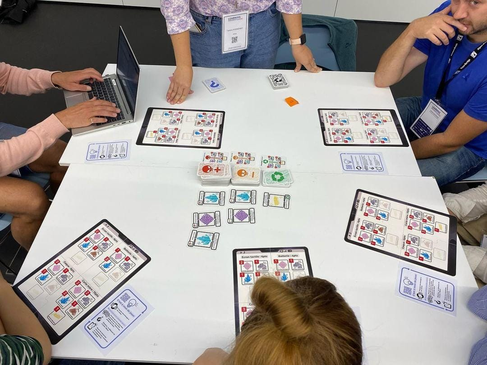

# Présentation du jeu PhoneImpact

## Informations générales

!!! info "En bref"

    - **But du jeu :** démontrer qu’un smartphone pollue à cause des matières premières et de la fabrication des principaux composants
    - **Joueurs :** 3 à 5
    - **Âge :** Dès 12 ans
    - **Durée :** 40 min

{ width="300" }

**Intérêt pédagogique :** Acquérir une compréhension globale de l'impact environnemental des composants d'un smartphone.

**Objectifs pédagogiques :**

- Calculer l'indice de réparabilité de son smartphone
- Identifier les différents types de ressources nécessaires à la fabrication d’un smartphone
- Identifier qu’il existe des filières de minage plus ou moins polluantes
- Reconnaître qu'utiliser des métaux issus du recyclage est moins polluant mais pas toujours possible
- Prendre conscience que les réserves minières sont limitées
- S'interroger sur le fait que la pollution passée a des répercussions sur le présent
- Déduire qu'il est possible de modifier le comportement d'un constructeur en ajoutant des pénalités s'il pollue
- Prendre conscience que la pollution pour le recyclage n’est pas nulle (à mentionner dans le débrief)
- Prendre conscience que la pollution des autres nous impacte aussi

**Expérience de jeu :**

Émotions : l’apprenant sera amené à être étonné/surpris, voire scandalisé

Se mettre à la place d'un fabricant de smartphones, tiraillé par l'envie de dégager du profit tout en polluant le moins possible (green washing ! ou véritable conscience écologique)

**Ce jeu s'inscrit dans un parcours pédagogique :**

- [Mooc "Impacts environnementaux du numérique"](https://www.fun-mooc.fr/fr/cours/impacts-environnementaux-du-numerique/)
- [ePoc "Smartphone et planète"](https://epoc.inria.fr/epocs/E007MM/)

Validation scientifique par des experts, garant de l’aspect “sérieux” du jeu. Ils ont testé le jeu à des moments différents et ont permis de faire évoluer certaines règles. Ils nous ont accompagnés pour le contenu du kakemono présenté lors du brief du jeu.

## Instructions pour l'animateur (matériel, règles, brief/debrief...)

[Instructions pour animer le jeu](./InstructionsAnimateur.md)

## License
Le jeu PhoneImpact est sous license [CC BY-NC-SA 4.0](https://creativecommons.org/licenses/by-nc-sa/4.0/deed.fr) : Attribution - Pas d’Utilisation Commerciale - Partage dans les Mêmes Conditions 4.0 International

## Print and play

[Print an Play](./PrintAndPlay.md)

## Sources
Un feuillet présent dans la boite de jeu permet de retrouver toutes les sources du jeux ([lien](Sources.md))
